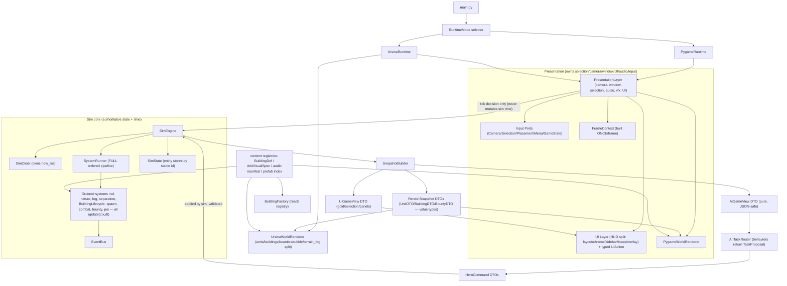

# Kingdom Sim — Codebase Improvements Recommendations

**v2 — deep multi-agent slop audit revision**
**Original:** GPT-5.5 read-only audit synthesis (2026-05-28)
**This revision:** Claude Opus 4.8 (1M) — 47-agent parallel audit + adversarial verification (2026-05-28)
**Scope:** End-to-end architecture & code-quality audit of every production subsystem (game/, ai/, config), with cross-cutting analysis and a completeness pass that also names the surface still un-audited.
**Goal:** Find "slop" (over-complicated, redundant, poorly-designed code; oversized files that should be modules) and turn it into an executable refactor plan — specific files, concrete module-split blueprints, before/after sketches, and a dependency-ordered roadmap — without derailing gameplay.

---

## How this revision was produced (and how confident to be in it)

The original v1 (GPT-5.5) was a strong single-pass read. This v2 replaces it with a **fan-out audit**: 19 subsystem agents each read their area in full, then three cross-cutting agents built the architecture map / de-duplication map / boundary-leak map, then **24 of the highest-severity findings were handed to independent adversarial reviewers**, and finally a completeness critic looked for what the audit itself missed.

- **187 findings** total: **1 critical, 60 high, 83 medium, 43 low**.
- By category: redundant 47 · oversized_file 22 · boundary_leak 21 · poor_design 19 · dead_code 18 · over_complex 16 · perf 15 · stringly_typed 14 · parallel_registry 6 · error_handling 6 · naming 2.
- **All 24 adversarially-verified findings were confirmed real** (`is_real = true`), though the reviewers *down-graded 18 of 24 from high→medium* — almost always because the issue is a **maintainability/structure hazard, not a live runtime or determinism bug.** Treat that as the headline calibration: this codebase is not broken, it is *overgrown*. The reviewers also corrected several specifics (e.g. "byte-for-byte duplicate" → "drifted duplicate"; a grep count of 35 → 39; a claim that `observe_sync` kept dead code alive → false). Those corrections are folded in below.

**Confidence guide for the reader:** findings tagged **[VERIFIED]** below were independently re-read and confirmed. Everything else is single-agent evidence with concrete `file:line` citations you can check in seconds. Severity here means *priority of attention*, not *severity of a bug* — most of this is "clean this up before it rots," not "fix this now."

**Raw evidence:** the full per-finding inventory (all 187, each with `file:line` + a one-line recommendation, grouped by area) is the companion file `.cursor/plans/codebase_audit_2026-05-28_finding_inventory.md`. This document is the synthesized plan; that file is the underlying dataset.

---

## What v1 recommended that is now DONE (do not re-recommend)

Sprints WK62/WK63/WK64 already shipped a large slice of v1. The audit confirmed these are landed; this revision **builds on them** rather than repeating them:

| v1 item | Status | Where it landed |
|---|---|---|
| #1 Sim time single-owner | ✅ Done | `SimEngine` owns `_sim_now_ms`; `GameEngine._sim_now_ms` is now a delegating property (`engine.py:631`). The double-advance bug is gone. |
| #2 Destroyed-building cleanup de-dup (partial) | ◑ Partial | `SimEngine._cleanup_destroyed_buildings` is the authoritative path; `CleanupManager` is now a secondary on-demand-demolish path. **Still open:** extract one `BuildingLifecycleSystem` and retire the parallel path (see §Boundaries / Move 7). |
| #3 Deterministic pathfinding budget | ✅ Done | `navigation.compute_path_worldpoints` returns `None` (DEFERRED) on budget exhaustion instead of `[]`; callers keep their path; path-less heroes direct-steer (WK64 Phase A). |
| #4 Delete dead `GameEngine` sim helpers | ◑ Mostly | `_update_ai_and_heroes/_process_combat/_process_bounties/_update_buildings/_apply_entity_separation` are gone. **Newly found still-dead:** `GameEngine._maybe_apply_early_pacing_nudge`, `_nearest_lair_to`, `_build_system_context` (see [VERIFIED] list). |
| #5 Split `GameCommands` into narrow ports | ✅ Done | 5 Protocols (Camera/Selection/Placement/Menu/GameState) implemented by `EngineCommandHub`. **Residual:** the hub still exposes ~14 engine-private fields as `Any` (Move toward typed ports). |
| #7 Selection state → presentation | ✅ Done | `game/presentation/selection_state.py` stores stable IDs; `SimEngine.selected_*` stubs are now dead (delete them — see sim-engine area). |
| #15 AI task/target registry | ✅ Done | `ai/contracts.py` (`TargetType`, `HeroTask`, `to_dict`/`from_dict`/`coerce_task`/`assign_hero_task`). |
| #17 Extract arrival handling | ✅ Done | `ai/arrival_handlers.py` registry; `bounty_pursuit.handle_moving` shrank 585→363. |
| #22 Widen `SystemContext` + runner | ◑ Partial | `SystemContext` widened to 13 fields; a `SystemRunner` exists but holds **only** buff+wave_event and `update()` still calls them at non-adjacent points — **the runner is currently dead** (see sim-engine). Growing it into the real ordered pipeline is Move 9. |

Everything below is **net-new depth** or **the still-open remainder** of the above.

---

## Executive summary

Kingdom Sim is in good shape structurally: the *seams* the v1 audit asked for mostly exist now (a real `SimEngine`, Protocol command ports, `SelectionState` with stable IDs, `SystemContext`, typed `HeroTask`). The problem this audit surfaces is sharper and more consistent than v1's:

1. **The seams exist, but live mutable sim state still flows across them.** `SimStateSnapshot` is `@frozen` at the tuple level but every element is a *live* entity / the live `World`; `get_game_state()` ships the live `world`, `economy`, `bounty_system`, and even `self` (the whole `GameEngine`) into AI and UI; renderers *write back* onto sim entities during the render pass; 36 sites key render maps on `id(obj)` despite stable IDs now existing. The boundaries are nominal, not real. **(21 boundary_leak findings.)**

2. **Files are too large.** **32 files** carry explicit module-split blueprints below. The worst: `hud.py` (2477) → 8 modules, `ursina_renderer.py` (1985) → 8, `ursina_terrain_fog_collab.py` (1783) → 9, `engine.py` (1735) → 6, `sim_engine.py` (1331) → 7, `hero.py` (1152) → 5. Every blueprint preserves the public API behind thin shims so the split is mechanical and low-risk.

3. **The same concept is defined in many places.** Building static data lives in **6+ parallel string-keyed maps with measured drift** (enum=30 keys, costs=42, sizes=47, colors=47, occupants=42, factory=27; lairs present in some, absent in others; ~17 dead "WK34 REMOVED" zombie keys). Unit visual scales, hero-class colors, the audio event contract, the path-replan block, the hero-intent taxonomy, "route to a building," and "engage an enemy" each have 3–8 copies. **(47 redundant + 6 parallel_registry findings.)**

4. **Dead and over-built code accumulates.** A whole legacy LLM prompt path (`build_summary` 95 LOC + `SYSTEM_PROMPT`/`build_decision_prompt`) is unreachable; the Ursina underground render subsystem (~250 LOC) sits behind an unconditional early return; `_unit_anim_surface` (72 LOC) is a dead second animation engine; `get_ranged_spec` is a probe no building implements. **(18 dead_code findings.)**

5. **No observability, lots of silent failure.** Repo-wide there are **423+ broad `except` clauses** and **62 `print()` calls** but the codebase imports the `logging` module **zero** times. Refactors will introduce bugs; right now they would fail silently.

The good news for sequencing: a large fraction of the highest-value work is **deletion** (dead code) and **mechanical extraction behind compat shims** (god-file splits, registry consolidation) — low-risk, high-clarity, and exactly the kind of work that makes the next feature wave safe.

### What "slop" means here (unchanged from v1, with this audit's category tags)

- **oversized_file** — a file doing many jobs because it was the convenient place to add the next feature.
- **redundant / parallel_registry** — one concept defined in several places, updated by memory, already drifting.
- **dead_code** — abstractions or branches that exist and are callable but never run.
- **boundary_leak** — render/UI/AI/tools reading or mutating live sim internals through `Any`/dicts/`getattr`/`id()`.
- **over_complex / poor_design** — a simpler, more elegant solution clearly exists.
- **stringly_typed** — important behavior depends on magic strings or dict shapes with no central contract.
- **perf** — per-frame allocation/recompute that should be cached or precomputed.
- **error_handling** — bare excepts and `print` debugging instead of typed handling + logging.

---

## Current architecture (real code as of WK64)

This reflects the actual code, with the boundary leaks annotated as dashed edges.

```mermaid
flowchart TD
  Main["main.py (create_ai factory, --renderer)"]
  Main --> UA["UrsinaApp — ursina_app.py (1525)\napp+camera+input bridge+HUD upload+capture"]
  Main --> GErun["GameEngine.run() (pygame)"]

  UA -->|"owns .engine"| GE
  GErun --> GE["GameEngine — engine.py (1735)\nPRESENTATION shell"]

  subgraph PRES["Presentation layer"]
    GE --> SEL["SelectionState — presentation/selection_state.py (IDs)"]
    GE --> HUB["EngineCommandHub + 5 Protocols — game_commands.py (512)"]
    GE --> IH["InputHandler (772)"]
    GE --> HUD["HUD + ~15 UI panels — ui/hud.py (2477)"]
    GE --> RC["EngineRenderCoordinator + FrameContext.build()"]
    GE --> CAM["EngineCameraDisplay"]
    GE --> AUD["AudioSystem"]
    GE --> VFX["VFXSystem"]
    GE --> CM["CleanupManager"]
  end

  IH -->|"5 aliases all point to ONE hub object (nominal split)"| HUB
  HUB -.->|"LEAK L5: ~25 Any props + _borderless_drag/_command_mode engine-private passthrough"| GE
  GE ==>|"~40 @property forwards: world/heroes/enemies/economy/buff_system/_sim_now_ms…"| SE

  subgraph SIM["Simulation core"]
    SE["SimEngine — sim_engine.py (1331)\nOWNS _sim_now_ms (single owner ✓)"]
    SE --> WORLD["World (523) — tiles+gen+fog+render fallback"]
    SE --> ENT["Entities: Hero(1152)/Enemy(668)/Guard/Peasant/Building/POI"]
    SE --> SYS["Systems: combat/economy/spawner/lairs/waves/bounty/nature/poi/neutral"]
    SE --> SR["SystemRunner (holds buff+wave ONLY — currently dead)"]
    SE -.->|"god-file L8: ALSO owns fog, separation, building cleanup, trees/logs, POI discovery, snapshot build, pacing nudge"| SEX["(inlined services)"]
    SE --> AIC["BasicAI — basic_ai.py (551)"]
  end

  AIC --> BEH["ai/behaviors/* (bounty_pursuit, hunger, shopping, journey, defense, exploration, stuck)"]
  AIC --> ARR["ai/arrival_handlers.py ✓ + ai/contracts.py HeroTask ✓"]
  AIC --> LLM["LLMBrain + providers + context_builder(443)"]
  SYS --> EB["EventBus"]
  EB --> AUD
  EB --> VFX

  SE -->|"build_snapshot()"| SNAP["SimStateSnapshot — @frozen but tuples hold LIVE entities (L1)"]
  SE -->|"get_game_state(**presentation kwargs)"| GS["get_game_state dict"]
  GE -->|"injects camera/selection/screen/paused INTO sim DTOs (L6)"| SNAP
  GE -->|"injects selection + engine ref (L3)"| GS

  SNAP --> UR["UrsinaRenderer (1985) + terrain_fog_collab (1783)"]
  SNAP --> PR["PygameRenderer + renderers/*"]
  GS --> HUD
  GS -->|"carries LIVE world/economy/sim/engine"| AIC

  UR -.->|"LEAK L2: setattr(entity,'_ursina_anim_trigger',None) writes back to sim entity"| ENT
  BEH -.->|"LEAK L3b: mutate hero/world/economy via game_state['sim'],['world']"| SIM

  CFG["config.py (774)"] -.->|"DUP registry L7: BUILDING_COSTS/SIZES/COLORS/MAX_OCCUPANTS"| BF["BuildingFactory.BUILDING_REGISTRY"]
  PFB["assets/prefabs/*.json (building_type, footprint)"] -.->|"3rd copy"| BF
```



### The real leaks (each a located, concrete problem)

| # | Leak | Where (evidence) |
|---|------|------------------|
| **L1** | `SimStateSnapshot` is `@frozen` but every list field is a `tuple` of **live mutable entities** / the live `World` | `game/sim/snapshot.py:14-33` (docstring admits "individual entities are still mutable"); `build_snapshot` passes `tuple(self.buildings)`, `world=self.world` (`sim_engine.py:466-501`) |
| **L2** | Renderer **mutates** sim entities/world during render | `ursina_renderer.py:1103` (`b.is_discovered=True`), `:1114-1115` (`world.visibility[..]=1`), `:560/570/645` + `renderers/hero_renderer.py:68` (`setattr(entity,"_render_anim_trigger",None)`) |
| **L3** | `get_game_state()` ships **live `world`/`economy`/`sim`/`engine`** into AI/UI | `sim_engine.py:432-435` (`"sim": self`), `engine.py:1574` (`gs["engine"]=self`), `hud.py:475` reads `engine` |
| **L3b** | AI **mutates** sim through the dict | `ai/behaviors/shopping.py:97` (`economy.hero_purchase(...)`), `poi_awareness.py:334` (`sim=game_state.get("sim")`), 14 sites read `game_state.get("world")` |
| **L4** | `GameEngine` ~40 `@property` forwards to `self.sim.*` | `engine.py:439-684` |
| **L5** | `EngineCommandHub` exposes engine-private fields as `Any` | `game_commands.py:413-497` (`_borderless_drag_*`, `_command_mode`, `_command_buffer`) |
| **L6** | Presentation state injected **into** sim DTOs | `sim_engine.get_game_state(screen_w, camera…, micro_view_*, ui_cursor_pos)` `:375-391`; `build_snapshot(camera_x, paused, selected_hero…)` `:445-462` |
| **L7** | Building data defined in **3+ places** | `config.py:309/362/421/498` + `building_factory.py:45` + `assets/prefabs/*.json` |
| **L8** | `SimEngine` is a second god-file | fog `:1183`, separation `:1004`, building cleanup `:864`, trees/logs `:506-621`, POI discovery `:823`, snapshot `:445`, pacing nudge `:1122` |
| **L9** | `game/graphics` imports `tools.*` at **runtime** (packaged build would need the dev `tools/` tree) | `ursina_app.py:39-40,249`, `ursina_environment.py:238,254`, `ursina_prefabs.py:225-226` |
| **L10** | Sim object `game/world.py` owns pygame rendering + `Surface`s | `world.py:4` (`import pygame`), `:74-76` (fog Surfaces), `:361/474` (`render`/`render_fog`) |

---

## Target architecture



**Target invariants:** sim owns state + time; presentation owns selection/camera/window/UI/audio/input; renderers consume **value-type DTOs** and never touch sim entities; AI consumes a pure `AiGameView` and **proposes `HeroCommand`s** the sim applies; content (buildings/visuals/audio/prefabs) is defined **once** in registries.

---

## The 12 highest-leverage structural moves (dependency-ordered)

This is the spine of the roadmap. Each move builds on the prior; the WK62-64 items are done and these extend them. (Sprint groupings are in §Roadmap.)

1. **Stop renderers/engine mutating sim entities (kill L2).** Move `_ursina_anim_trigger` / `_render_anim_trigger` off the entity onto a presentation-owned, **id-keyed** record. *Files:* `ursina_renderer.py:560/570/645`, `engine.py:_update_render_animations` (1309-1335), `graphics/renderers/registry.py`. *Smallest blast radius; unblocks treating the snapshot as read-only.*
2. **Add guard tests:** "snapshot does not mutate entities" + "`AiGameView` is JSON-serializable." *Files:* extend `tests/test_renderer_snapshot_contract.py`, new `tests/test_ai_view_pure.py`. *Locks the boundary before the DTO work.*
3. **Render DTOs for units & buildings (begin dismantling L1).** Add `game/sim/render_dto.py` (`UnitDTO`/`BuildingDTO`/`BountyDTO` value types); populate in `build_snapshot` (`sim_engine.py:445-501`); migrate `graphics/renderers/hero_renderer.py`+`enemy_renderer.py`+Ursina units first. Keep live-object tuples temporarily for unmigrated consumers.
4. **Split frame DTOs by audience (finish L1/L6).** Separate `SimStateSnapshot` into `RenderSnapshot` (entities/world/fog), `PresentationFrameState` (camera/screen/paused — built by `GameEngine`), `UiGameView` (gold/selection/panels). Remove presentation kwargs from `get_game_state`/`build_snapshot`. *Files:* `sim/snapshot.py`, `sim_engine.py:375-501`, `engine.py:1540-1608`, `presentation/frame_context.py`.
5. **Pure `AiGameView`; stop shipping `sim`/`world`/`economy`/`engine` in the dict (kill L3/L3b read side).** New `ai/game_view.py`; `BasicAI.update` consumes it. Remove `"sim": self` (`sim_engine.py:433`) and `gs["engine"]=self` (`engine.py:1574`). *Files:* `sim_engine.py`, `engine.py`, `ai/basic_ai.py`, `ai/behaviors/poi_awareness.py:334`, the 14 `game_state.get("world")` sites.
6. **`HeroCommand` DTOs so AI proposes and sim applies (close L3b write side).** Behaviors return commands; `SimEngine` applies them in one place (model it on `game/sim/direct_prompt_exec.py`). *Files:* new `ai/commands.py`, `ai/basic_ai.py`, `ai/behaviors/*`, `sim_engine.py`. *Depends on 5.*
7. **Extract `BuildingLifecycleSystem` (finish v1 #2).** One sim-owned service for destruction + reference cleanup + rubble + events; presentation only listens and clears selection by id. *Files:* new `game/systems/building_lifecycle.py`; remove `SimEngine._cleanup_destroyed_buildings` (`:864-957`), the `CleanupManager` path, `engine.py:1403-1405`. *First SimEngine extraction.*
8. **Extract `FogService`/`EntitySeparation`/`NatureBridge`/`PoiDiscovery`/`SnapshotBuilder` from SimEngine (kill L8).** Move inlined services to `game/sim/{fog,separation,lumber,poi_discovery,snapshot_builder}.py`; `SimEngine.update` calls them. Keep thin delegating wrappers (tests call `sim._apply_entity_separation`/`_update_fog_of_war`). *Depends on 7.*
9. **Grow `SystemRunner` to the real ordered pipeline (fix the dead WK64 seed).** Fold lifecycle/fog/separation/spawn/nature/poi into the runner in fixed order; document combat's event-routing post-step. *Files:* `sim/system_runner.py`, `sim_engine.py:623-820`, `systems/protocol.py`. *Depends on 7+8.*
10. **`BuildingDef` registry; derive the duplicates (kill L7).** New `game/content/buildings.py` single source; generate `BUILDING_COSTS/SIZES/COLORS/MAX_OCCUPANTS` as views; `BuildingFactory` reads it; add `assets/prefabs/buildings/index.json`. *Independent of the DTO chain — can run in parallel after 2.*
11. **`UnitVisualSpec` registry + split `hud.py` & `ursina_renderer.py`.** Finish `graphics/visual_specs.py` adoption (both renderers + `ursina_pick.py` + `instanced_unit_renderer.py`); split the two god-files per §Blueprints. *Depends on 3 so split modules consume DTOs.*
12. **Replace `BasicAI.update_hero` priority ladder with a `TaskRouter` of `TaskProposal`s.** Behaviors expose `propose(hero, view) -> TaskProposal | None`; router picks max priority. *Files:* new `ai/task_router.py`, `ai/basic_ai.py`, `ai/behaviors/*`. *Last — depends on 5+6.*

**Sequencing:** 1-2 are prerequisites for the DTO chain (3→4→5→6). 7 unlocks 8→9. 10 and the HUD split in 11 can run in parallel after 2-3. 12 lands last.

---

## Oversized-file module-split blueprints (32 files)

The audit produced a concrete module breakdown for every oversized file. **Universal rule for all of these:** the split is a *mechanical move* — keep the original file path as a thin facade / re-export and keep every public symbol (and every externally-poked attribute) as a delegating shim, so callers, tools, and tests need **zero** changes initially. Each split must land behind characterization tests + `determinism_guard` + `qa_smoke` (and screenshots for UI/render). Sizes are current LOC.

### UI (pygame)

- **`game/ui/hud.py` (2477) → `game/ui/hud/` package, 8 modules** — the single largest file; the #1 split.
  - `hud.py` (~280) thin coordinator (wires sub-renderers, fixed paint order, forwards input); keeps the exact external API + property shims for poked fields (`_watch_card_expanded`, `_chat_visible`, `_pin_slot`, `watch_card_map_world_*`).
  - `left_column.py` (~230) game-state-dependent left-column allocation + resize-drag handles.
  - `watch_card.py` (~330) pinned-hero card (peek/expand, map slot, vitals/XP, chat band) + `MiniMapProjection`.
  - `radar_minimap.py` (~230) cached terrain underlay + entity/POI dot overlay.
  - `toasts.py` (~300) **one** `ToastManager` (one `Toast` dataclass + one fade/pill/stack renderer) replacing the **three** duplicated toast implementations.
  - `messages.py` (~40) bottom-left message ticker (the `add_message` log sink engine calls ~40×).
  - `selection_panels.py` (~430) peasant/building/right-panel/help panels + chrome helpers (stateless given surface+rect+entity).
  - `input_router.py` (~320) all hit-testing → returns a **typed `HudAction`** (replaces magic strings/dicts).
- **`game/ui/hero_panel.py` (1056) → 4 modules** — `hero_panel.py` (~300) orchestrator; `hero_sheet_view.py` (~180) typed `HeroSheetView.from_sources(hero, profile)` (kills the 110-line getattr wall at 416-529); `_panel_column.py` (~90) scrolling-layout helper (replaces 47 inline `TextLabel.render` + 12 magic `y+=14`); `hero_minor_renderers.py` (~180) tax-collector + guard panels.
- **`game/ui/pause_menu.py` (811) → `game/ui/pause/` package, 8 modules** — thin `PauseMenu` router + one module per page (main/graphics/audio/controls/difficulty) + `page.py` Protocol + `keybinds_data.py`. Each page gets one `_layout()` used by **both** draw and hit-test, eliminating the duplicate-rect bug class.

### Graphics (Ursina/Panda3D + pygame renderers)

- **`game/graphics/ursina_renderer.py` (1985) → 8 modules** — but **delete ~450 LOC of dead code first** (`_unit_anim_surface` 72L, the underground subsystem behind the early return ~250L, `_apply_poi_mystery_state` no-op, 5 duplicated scale constants). Then: slimmed `ursina_renderer.py` (~300) orchestrator; `ursina_unit_sync.py` (~420) per-entity-type render loops + `_gate_or_hide`; `ursina_building_sync.py` (~260); `ursina_building_ui.py` (~210) tax overlay + world-space labels; `ursina_anim.py` (~90); `ursina_frustum.py` (~190) culling math; `ursina_underground.py` (~150); `ursina_misc_props_sync.py` (~170) bounties + rubble.
- **`game/graphics/ursina_terrain_fog_collab.py` (1783) → `terrain/` package, 9 modules** — `state.py` `TerrainRenderState` dataclass (replaces ~70 `self._r._<field>` reach-ins); `fog_overlay.py` (~230); `visibility.py` (~210) prop fog/chunk gate; `chunk_cull.py` (~150); `static_batch.py` (~160); `instanced_trees.py` (~160); `builder.py` (~320) terrain/ground/grass; `dynamic_sync.py` (~260) tree/log per-frame sync; thin facade (~120).
- **`game/graphics/ursina_app.py` (1525) → 5 modules** — slimmed `ursina_app.py` (~300) bootstrap + ~25-line `update()`; `ursina_camera_controller.py` (~300) rig/transition/clamp/follow/zone-fog; `hud_texture_uploader.py` (~160) CRC early-out + dirty-row upload; `ursina_input_router.py` (~200); `ursina_debug_harness.py` (~320) debug/capture.
- **`game/graphics/instanced_nature_renderer.py` (1009) → `nature/` package, 5 modules** — `nature_shader.py` (~85); `tree_model_loader.py` (~200, the only Panda3D loader importer); `nature_diagnostics.py` (~110); `instanced_nature_renderer.py` (~340); `__init__.py` re-export. **Delete the triplicated dead GLB base-color extraction (236-302) — value never consumed.**
- **`game/graphics/interior_sprites.py` (855) → `interiors/` package, 10 modules** — `geometry.py` `InteriorGeometry(w,h)` (owns the `wall_h=h//3` math duplicated ~18×); `palette.py`; `base.py` shared NPC builder; one module each for inn/marketplace/warrior_guild/blacksmith/temple/fallback; `library.py` with a `{key: module}` `_REGISTRY` replacing three string if-chains.
- **`game/graphics/vfx.py` (434) → `vfx/` package, 5 modules** — `effects.py` dataclasses (cache scatter/direction at spawn, not per-frame); `events.py` typed `VFXEventType`; `spawn.py` seeded spawners; `draw.py` pygame draw; `system.py` facade. Delete the unreachable `size_px==1` branch.

### Engine / Sim

- **`game/engine.py` (1735) → 6 modules** — `engine.py` (~700) composition shell (sim property forwards, ID-selection properties, snapshot/game-state assembly, `run()` loop, 1-line wrappers); `engine_facades/selection.py` (~230) all `try_select_*` + one `_select_only(kind,entity)` helper; `engine_facades/lifecycle.py` (~250) `update`/`_prepare_sim_and_camera`/`tick_simulation`; `engine_facades/actions.py` (~240) `try_hire_hero`/`place_building`/`place_bounty`/de-stringified `apply_hud_pin_action`; `game/console.py` (~140) cheat-command registry replacing the 111-line `process_command`; `null_stub.py` (~15).
- **`game/sim_engine.py` (1331) → 7 modules** — slimmed `sim_engine.py` (~700) orchestrator; `sim/fog.py` (~170); `sim/lumber.py` (~150) tree↔tile + lumberjack economy; `sim/building_tick.py` (~120) data-driven per-building dispatch (kills the stringly-typed ladder); `sim/destruction.py` (~100); `sim/separation.py` (~80); `sim/early_pacing.py` (~70). Keep delegating wrappers for `_apply_entity_separation`/`_update_fog_of_war`/`chop_tree_at` (tests + builder peasants call them).
- **`game/sim/hero_profile.py` (549) → `hero_profile/` package, 4 modules** — `snapshots.py` (frozen dataclasses), `build.py`, `discovery.py`, `llm_select.py`.
- **`game/game_commands.py` (512) → 2 modules** — `game_commands.py` (~150) the 5 Protocols only (typed with real classes, not `Any`); `engine_command_hub.py` (~190) the concrete facade (shrinks once command-mode/window-drag/cursor state move to the input package; delete the `GameCommands`/`EngineBackedGameCommands` compat aliases + `_cleanup_destroyed_buildings` shim).
- **`game/input_handler.py` (772) → `game/input/` package, 7 modules** — `router.py` (~110) event-poll loop + SDL skip-frame guard; `keyboard.py` (~150); `mouse.py` (~230); `hud_actions.py` (~90) typed dispatch table (replaces 90-line stringly-typed ladder); `window_drag.py` (~70) (removes `_borderless_drag_*` from engine); `command_mode.py` (~45); `placement.py` (~55). **Note:** WK63 explicitly deferred this split — schedule it deliberately behind `tests/test_input_handler_gamecommands.py`.

### Entities

- **`game/entities/hero.py` (1152) → 5 modules via mixins (zero call-site change)** — `hero.py` (~360) core state/movement; `hero_rest.py` `HeroRestMixin` (~170); `hero_economy.py` `HeroEconomyMixin` (~150); `hero_profile_memory.py` `HeroMemoryMixin` (~140); `ai/intent.py` (~90) move intent derivation out of the entity. [VERIFIED safe: Hero is a plain class, all callers duck-type `hero.method()`, mixins keep MRO identical.]
- **`game/entities/enemy.py` (668) → 3 modules** — `enemy.py` (~280) base driven by an `ENEMY_STATS` table; `enemy_stats.py` (~90) `EnemyStats` dataclass + table (replaces 7 stat-only subclasses) + `make_enemy()` factory; `enemy_archer.py` (~90) the one real behavioral subclass.
- **`game/entities/buildings/base.py` (311) → 4 modules** — `ids.py` (id alloc), `research_state.py` (global tech-tree registry), `geometry.py` (`BuildingRect`), slimmed `base.py` (~200).
- **`game/entities/buildings/economic.py` (289) → 3 modules** — `researchable_mixin.py` (~45) shared timed-research lifecycle (kills 3× Marketplace/Blacksmith/Library duplication) + slimmed economic classes.

### AI

- **`ai/basic_ai.py` (551) → 5 modules** — slimmed coordinator (~300) + `ai/behaviors/{combat,recovery,deferred_tasks}.py` (move the inline state-machine bodies) + co-locate `_get_nearest_undepleted_poi` (dead — delete or revive) in `poi_awareness.py`.
- **`ai/providers/mock_provider.py` (519) → `mock/` package, 5 modules** — `dispatcher.py`, `direct_prompt.py`, `autonomous.py`, `conversation.py`, `legacy_decision.py` (audit for deadness).
- **`ai/context_builder.py` (443) → 3 modules** — orchestrator + small private builders (~200, `build_summary` DELETED as dead), nearby-entities collector (~70), `context_builder_places.py` (~90, removes the double `select_known_places_for_llm` call).
- **`ai/direct_prompt_validator.py` (434) → 3 modules** — entry+normalization+serializer (~150), `direct_prompt_intents.py` (~160) one pure handler per intent + table, `direct_prompt_places.py` (~90). [VERIFIED: preserve the deferred-combat early-return, critical-health redirect, and the **two** distinct obey/defy post-passes — do not collapse them.]
- **`ai/behaviors/bounty_pursuit.py` (363) → 3 modules** — `bounty_pursuit.py` (~200) bounty logic only; `ai/behaviors/movement.py` (~90) the generic MOVING-state dispatcher that `handle_moving` secretly is; `direct_prompt.py` (~40) explore-bearing seed.
- **`ai/behaviors/exploration.py` (350) → 3 modules** — slimmed `exploration.py` (~150); `idle_router.py` (~130) `handle_idle` as ordered predicate steps; `zones.py` (~50) patrol-zone assignment (consumed by stuck_recovery + bounty_pursuit too).

### Audio / World / Config

- **`game/audio/audio_system.py` (533) → 6 modules** — `contract.py` (SoT for `AUDIO_EVENT_MAP`/cooldowns/`INTERIOR_AMBIENT_MAP`), `sfx_cache.py` (shared loader), `visibility_gate.py`, `mixer_volume.py`, `ambient_player.py`, facade (~140).
- **`game/world.py` (523) → 4 modules** — slimmed `world.py` (~150) tile data + queries (no pygame); `worldgen.py` (~250) one-shot generation as pure functions; `fog.py` (~150) `FogOfWar` state machine (`_currently_visible` typed as a real `set`); **move `render`/`render_fog` into `graphics/pygame_renderer.py`** (kills L10). Keep delegating `visibility`/`fog_disabled` properties returning the live grids.
- **`config.py` (774) → `config/` package, 6 modules behind a back-compat `__init__.py`** — `env.py` (typed getenv helpers; kills 7 copy-pasted parse/clamp blocks), `gameplay.py` (deterministic sim tuning), `content_buildings.py` (the building registries → ideally one `BUILDING_DEFS`), `render.py` (`COLOR_*`/`URSINA_*`/`TERRAIN_*`), `runtime.py` (SIM/LLM/`DEV_MODE`). **Also delete the vestigial 13-dataclass layer** (`WindowConfig`..`RangerConfig`) whose instances exist only to produce the flat aliases 152 files import — keep the flat scalars, drop ~150 LOC of indirection (retain only `DifficultyConfig`/`WaveEventConfig`, which are consumed as objects).

### Tools (lower priority infra)

- **`tools/screenshot_scenarios.py` (1603) → `tools/screenshots/` package, 8 modules** — `scene_setup.py` (kills the 17× find/create-castle + 8× `center_of` duplication), `shot.py`, four scenario-family modules, `ursina_capture.py` (move the unrelated Ursina registry out), thin re-export facade.
- **`tools/observe_sync.py` (846) → `tools/observe/` package, 5 modules** — `world_setup.py`, `scenarios.py`, `metrics.py` (3 collector classes: `StuckMetrics`/`OccupancyChecker`/`BountyIntentQA`), `report.py`, ~130-line CLI. **Fix the dual-clock bug** (`now_ms_val = int(t*1000/60)` at `:582` vs `set_sim_now_ms` at `:537`) by reading `timebase.now_ms()`.

---

## De-duplication / single-source-of-truth map

The most pervasive slop class. Seven cross-cutting clusters, then a table of the strongest per-area duplications.

### Cluster 1 — Building static data fragmented across 6+ parallel string-keyed maps (most severe; this is L7)

No single source of truth for a building type. Adding/changing one building means editing, in lockstep: the `BuildingType` enum (`game/entities/buildings/types.py:8-38`), four parallel dicts in `config.py` (`BUILDING_COSTS:309`, `BUILDING_SIZES:362`, `BUILDING_COLORS:421`, `BUILDING_MAX_OCCUPANTS:498`), `BuildingFactory.BUILDING_REGISTRY` (`building_factory.py:45`), the placeable list + hotkeys in `build_catalog_panel.py` (and a **second** copy in `building_list_panel.py:16-27,64-69`), a hardcoded hotkey `elif` chain in `input_handler.py:298-320`, and prefab JSON `footprint_tiles`. `Building.__init__` (`base.py:76-93`) does three fallible `.get(type, default)` lookups, silently falling back to `(1,1)`/grey/cost-100/8-occupants.

**Measured drift (runtime):** enum=30 members, `BUILDING_SIZES`/`COLORS`=47 keys, `COSTS`/`MAX_OCCUPANTS`=42, factory=27. Lair types exist in SIZES/COLORS but **not** COSTS/OCCUPANTS. ~17 dead "WK34 REMOVED" keys (e.g. `gnome_hovel`, `ballista_tower`) still occupy all five maps with `cost=0` sentinels.

**Single-source design** (`game/content/buildings.py`):
```python
@dataclass(frozen=True)
class BuildingDef:
    type: str                 # "warrior_guild"
    size: tuple[int, int]
    color: tuple[int, int, int]
    cost: int
    max_occupants: int
    cls: type | None          # WarriorGuild, or None for POI/lair
    hotkey: str | None        # "1"
    placeable: bool           # shows in build catalog
    hero_class: str | None    # "warrior" — folds in guild->class (cluster 6)

BUILDINGS: dict[str, BuildingDef] = { ... }
# thin back-compat views (config.py already uses this pattern for WINDOW_WIDTH=WINDOW.width):
BUILDING_COSTS = {k: d.cost for k, d in BUILDINGS.items()}
BUILDING_SIZES = {k: d.size for k, d in BUILDINGS.items()}
# + an import-time assert that BUILDINGS covers BuildingType so they can't drift.
```
`BuildingFactory`, the build catalog, and input hotkey dispatch all read `BUILDINGS[t]`.

### Cluster 2 — Build-menu hotkeys defined 2–5×
`BUILDING_HOTKEYS` dict (`build_catalog_panel.py:21-32`) **and** a 12-branch `elif event.key=='1'` chain (`input_handler.py:298-320`) **and** a duplicate dict+list in `building_list_panel.py`. Already drifting: the `elif` uses lowercase `'t'/'u'`, the dicts use `'T'/'U'`; the command-bar tooltip advertises hotkeys the chain doesn't implement. → Fold into `BuildingDef.hotkey`; derive a `{hotkey: type}` reverse map; regenerate the tooltip from it.

### Cluster 3 — Unit visual scales re-derived in 3 places despite `visual_specs.py` being the intended SoT
WK62's `graphics/visual_specs.py:91-173` holds canonical scales, but `ursina_renderer.py:95-112` defines its own `UNIT_BILLBOARD_SCALE/ENEMY_SCALE/…` (and uses *those* at 1633-1735), and `instanced_unit_renderer.py:55-66` re-derives the identical `0.62/0.5/0.7` magic factors. → Both renderers import `unit_visual_spec(kind)`; delete the local constants. Low-risk (frozen dataclass).

### Cluster 4 — Hero-class → color duplicated 3–4× (values already disagree)
`hero_sprites.py:17-21` palette vs `ursina_renderer.py:1469-1481` 3D tint (uses generic `color.white/lime/magenta` — **disagrees** with pygame) vs `ursina_renderer.py:71` `COLOR_HERO` (4th copy). → `HERO_CLASS_COLORS` dict next to `HeroClass` in `game/types.py`; renderers look up by class key.

### Cluster 5 — Audio event contract in 3–4 hand-synced places
`AUDIO_EVENT_MAP`+`SOUND_COOLDOWNS_MS` (`audio_system.py:23-71`) vs the same tables restated in `EVENT_CONTRACT.md:14-143` vs `ENEMY_SOUND_MAP` (`enemy_sounds.py:26-69`) vs the event names being a 4th copy of `GameEventType` (`events.py:11-38`). → Code is SoT, keyed off `GameEventType.*.value`; generate the doc from it (or link).

### Cluster 6 — Guild→hero-class mapping + the class list repeated 5+×
Inline `class_by_guild` dict (`engine.py:1002-1009`), `allowed` guild frozenset (`engine.py:958`), `PLAYER_GUILD_TYPES` (`config.py:550`), and the `("warrior","ranger","rogue","wizard","cleric")` tuple respelled in `unit_atlas.py:79`, `hero_sprites.py`, `ursina_renderer.py`. → `BuildingDef.hero_class`; derive guild sets + the class list from `HeroClass`.

### Cluster 7 — POI footprints duplicated; orphaned enums
`POIDefinition.size` (`poi.py:65+`) is 100%-identical to the same keys in `config.BUILDING_SIZES` (verified at runtime) — `PointOfInterest` already inherits size via `super().__init__`, so `POIDefinition.size` is vestigial. `EnemyType` enum (`types.py:15-21`) is orphaned (live enemies store raw strings; only consumer is a no-op round-trip at `combat.py:73`). Spider/Bandit/boss stats are hardcoded inline (`enemy.py:592-660`) while Goblin/Wolf/Skeleton use config; enemy colors are triple-defined.

### More high-value duplication (by area)

| Concept | Copies | Single source |
|---|---|---|
| **Path replan + commit-window + follow/deferred-None block** | 5–7 copies: `enemy.py:289-320,562-589`, `guard.py:159-180`, `tax_collector.py:136-160,191-213` (+ kite branch) | `navigation.advance_along_path_to(entity, world, buildings, gx, gy, dt, ...)`; leave `hero.py` out (its crc32 stagger + fog guards differ) |
| **Hero intent taxonomy derivation** | `hero.py:1013-1086` + `basic_ai.py:144-175` (the latter is a dead fallback) | `ai/intent.py:derive_intent(hero)` |
| **"Route hero to a building" (best_adjacent_tile + center fallback)** | 11 sites across exploration/shopping/hunger/journey/bounty/basic_ai | `ai/behaviors/movement.py:route_to_building(...)` |
| **"Engage enemy" + commit-window guard + ms conversion** | ~8 copies in `defense.py` + `exploration.py` | `defense.engage(hero, enemy, now_ms)` + `_combat_commit_active()` + module `TARGET_COMMIT_MS` |
| **Difficulty HP/damage scaling on a fresh enemy** | `spawner.py:189-197`, `lairs.py:144-153`, `wave_events.py:254-259` | `DifficultySystem.apply_to_enemy(enemy)` |
| **Ranged-tower scan-and-fire loop + inline `sqrt`** | Guardhouse/Ballista/Wizard in `defensive.py` | `RangedAttackMixin` + `nearest_enemy_in_range()` + `Building.dist_to()` (Wizard is AoE — shares only the distance helper) |
| **Timed-research start/advance/progress** | Marketplace/Blacksmith/Library | `ResearchableMixin` (subclasses supply `available_research` + `_on_research_complete`) |
| **One-shot animation FSM** | pygame `hero/enemy/worker_renderer.py` (3×) + Ursina `_compute_anim_frame`/`instanced_unit_renderer` | `graphics/renderers/_anim_base.py:OneShotAnim` + `ursina_units_anim.resolve_anim_clip_frame` |
| **Health-bar draw + `to_screen` projection** | 5–7 renderer copies | `graphics/renderers/_overlays.py` |
| **Word-wrap text to pixel width** | `chat_panel.py` (imported cross-module by `pause_menu`), `dev_tools_panel.py` | `game/ui/text_wrap.py` |
| **Modal dim-backdrop + card + button shell** | memorial / demolish-confirm / interior overlays | `widgets.ModalOverlay` base |
| **OpenAI-compatible provider + `_init_client` scaffolding** | `openai_provider`, `grok_provider`, + 4 providers' import/try-except | `OpenAIProvider(base_url=...)` (Grok = 5-line subclass) + `BaseLLMProvider` helpers |
| **LLM JSON-object extraction + PROMPT_SENT/RESPONSE sequence** | `llm_brain.py` 2–3× each | `LLMBrain._extract_json_object()` + `_complete_with_events()` |
| **AI tool-action vocabulary + place-type groupings** | `prompt_templates`, `decision_moments`, `prompt_packs`, `direct_prompt_validator`, `arrival_handlers` | `ai/vocab.py` (`ToolAction`/`DirectIntent` enums + `SAFE_HAVEN/SHOP/PLAYER_HOME` frozensets) |
| **`move_towards`/`distance_to` reimplemented per entity** | hero/enemy/guard/peasant/tax_collector | `MovableEntity` mixin (or reuse `navigation.step_towards`) — unify the bool-vs-None return |
| **Scene preamble (find/create castle + clear + reveal)** | 17× in `screenshot_scenarios.py` | `tools/screenshots/scene_setup.py` |

---

## Boundary-leak map (sim ↔ render ↔ ui ↔ ai ↔ tools)

The seams exist; the data crossing them is still live. The leak inventory is L1–L10 in the architecture map above. The fixing seams:

1. **Render DTOs** — `UnitRenderDTO`/`BuildingRenderDTO` (frozen, scalar: `entity_id`, `x`, `y`, `hp`, `state_name`, `anim_trigger`, `kind`, `is_discovered`, `tile_visible`). Snapshot becomes `tuple[DTO, ...]`, which **simultaneously kills renderer write-back (L2) AND `id(obj)` keying** (key on the existing `entity_id`/`hero_id`). Start here (Move 3).
2. **`AiGameView` / `UiGameView`** — split `get_game_state()` into typed read-only views. AI needs query helpers (`nearest_enemy`, `is_walkable`, `shop_catalog_for(id)`) + immutable economy facts (`player_gold:int`, a purchase *request* channel), **never** the live `World`/`economy`/`sim`/`engine`. UI gets the same + selection, never `engine`. (`economy.hero_purchase` called from inside `shopping.py:97` is a write across the boundary — route through a command/event.)
3. **Render-state ownership** — animation one-shots owned by `RendererRegistry` keyed on `entity_id`, not stamped on `_render_anim_trigger` on the sim entity.
4. **Move `World.render`/`render_fog` out of `world.py`** into a `WorldTerrainRenderer` in `graphics/` (kills L10; the headless sim drags a `pygame` import for nothing). Note: `render`/`render_fog` have **two** callers (`pygame_renderer.py` + `render_coordinator.py` minimap), and `.visibility` is referenced across 25 files incl. AI — the delegating property must return the **live** grid (Ursina does `world.visibility[ty][tx]=1`).
5. **Invert `graphics → tools` imports (L9)** — move reusable runtime helpers (Kenney tint/scale, GLTF shading in `model_viewer_kenney._apply_gltf_color_and_shading`) into `game/graphics/kenney_material.py`; leave `tools/` as the dev-only caller. `tools → game` is the only allowed direction. **This makes `tools/model_viewer_kenney.py` (966) and `tools/kenney_pack_scale.py` (275) load-bearing runtime deps today** — a packaged build needs the dev tree.
6. **AI uses object identity instead of stable IDs** — `context_builder.py:125` (`enemy.target == hero`), raw `Bounty` objects handed toward LLM context (`:106`), `sim = game_state.get("sim")` in `poi_awareness.py:334` + `builder_peasant.py`. → Compare by `enemy.target_id == hero.hero_id`; pass `BountySimDTO` summaries; give the view the specific data instead of the whole `SimEngine`.
7. **`PygameWorldRenderContext` holds live `bounty_system`/`economy`** (`pygame_renderer.py:48-54`) — lower priority; carry render DTOs + `gold:int` instead.

---

## Cross-cutting slop themes

### Dead code (delete-first wins — ~1000+ LOC, near-zero risk)

Deleting unreachable code is the cheapest way to shrink the god-files before splitting them. Confirmed-dead (each grep-verified, no live caller):

- **Legacy LLM prompt path (~260 LOC):** `ContextBuilder.build_summary` (95 LOC, `context_builder.py:320-414`), `prompt_templates.SYSTEM_PROMPT`/`DECISION_PROMPT`/`build_decision_prompt`, and the non-autonomous branch of `llm_brain._process_request:162-201`. Only reachable when `wk50_autonomous` is absent, which never happens (`llm_bridge.py:73` always sets it). Collapse `_process_request` to always use the autonomous path with a `get_fallback_decision` safety net. [VERIFIED — and the v1 claim that `observe_sync` also kept this alive is **false**; it needs no changes.]
- **Ursina underground render subsystem (~250 LOC):** behind an unconditional early return in `ursina_renderer.py:1320-1441`. (The *sim-side* dungeon entry is live — only the render is gated; do not touch `poi_interaction._handle_dungeon`.)
- **`_unit_anim_surface` (72 LOC, `ursina_renderer.py:543-614):** a dead second animation engine; `_compute_anim_frame` is the live one.
- **`get_ranged_spec` probe (`defensive.py:156-160`):** no building implements it; always falls through to hardcoded `'bolt'` defaults. Replace with a `RANGED_SPEC` class attr. Also dead: `_last_ranged_events` (plural) list — engine only reads the singular `_last_ranged_event`.
- **`GameEngine._maybe_apply_early_pacing_nudge` + `_nearest_lair_to` + `_build_system_context`** (`engine.py:1103-1180,1285-1294`): forks of live `SimEngine` versions, zero callers; the stale `_build_system_context` returns only 6 of the 13 `SystemContext` fields. [VERIFIED — and `tests/test_engine.py:129` monkeypatches the **dead** copy, so the test isolates nothing; repoint it to `engine.sim`.]
- **Dead AI/tool one-offs:** `basic_ai._get_nearest_undepleted_poi` (no callers); `audio_system.emit_from_events` (dead); the GeoMipTerrain path (env-flag default-off, per MEMORY); `_spawn_underground_enemies` (`poi_interaction.py:445-491`, only the commented `:376` call site).
- **Vestigial config layer:** the 13 `*Config` dataclasses in `config.py` whose instances exist only to produce the flat aliases (keep `DifficultyConfig`/`WaveEventConfig`).

### Error-handling & observability sprawl (its own remediation track)

Repo-wide: **423+ broad `except` clauses** (worst: `ursina_terrain_fog_collab.py` 41, `instanced_nature_renderer.py` 39, `ursina_app.py` 37, `display_manager.py` 24, `hero_panel.py` 23), **62 `print()` calls** in `game/`+`ai/`, and the `logging` module is imported **zero** times. There is no logging facility — only prints and silent swallows. This both hides current bugs and will hide the bugs the refactors introduce. **Recommendation:** introduce a `game/logging.py` (or stdlib `logging` config) early; replace bare `except Exception: pass` around `vfx.update`/`render` (`pygame_renderer.py:117-121`, `engine.py:1380-1384`) and the building-panel `research()` arity cascade with logged/typed handling so wiring bugs surface.

### Performance (cache/precompute, all in render/UI — determinism-exempt)

- One `FrameContext` per frame: `get_game_state()` builds **every hero's** profile snapshot every call (`sim_engine.py:397-401`), and the Ursina path + pygame HUD each rebuild overlapping frame state. Build hero profiles on HUD demand, not per tick. (v1 item 23.)
- Per-frame allocation: VFX debris re-randomizes every frame; chat wrapping re-wraps every frame; pygame renderers call `transform.flip()` at render time; `follow_path` uses `pop(0)`; `ursina_terrain_fog_collab.py:532` re-allocates a `set()` each frame. (v1 items 24-28.)
- Panel dirty-caching for `building_panel`/`pause_menu`/`chat_panel` (esp. the Ursina HUD texture-upload path). (v1 item 24.)
- `instanced_nature` `set_visible_chunks` blanket-dirties every model each frame → skip the GPU re-upload when the visible set is unchanged.

### Stringly-typed state (close the typo class)

`hero.target["type"]` magic strings (WK64 added `TargetType` but behaviors still write bare `{"type":"..."}` literals — add `contracts.task_dict(TargetType.X, **payload)`); building `update()` dispatch by `building_type == "trading_post"` string (`sim_engine.py:970-995`); HUD actions as magic strings/dicts; VFX events as bare dicts; POI `interaction_type` strings (add a `POIInteraction(str, Enum)`).

---

## [VERIFIED] high-confidence findings (24, independently re-read)

These were handed to adversarial reviewers who confirmed all 24 are real. Severity = adjusted (most high→medium because they are structure/maintainability, not live bugs). Start here for "confirmed, do-able now."

| Area | Finding | Sev | Notes from the reviewer |
|---|---|---|---|
| engine | Dead `_maybe_apply_early_pacing_nudge`/`_nearest_lair_to` duplicates; test monkeypatches the dead copy | med | drifted (not byte-identical); repoint `test_engine.py:129` to `engine.sim` |
| engine | `engine.py` is a 1735-LOC god-object | med | safe **only** if 1-line delegating wrappers are kept (GameCommands/InputHandler/tests depend on the surface) |
| engine | 39× "set one selection, null the others" idiom | med | ~80% already solved by `SelectionState`; the manual nulls are now **dead no-ops** — finish wiring + delete, don't add a new helper |
| sim | `SimEngine.update(dt, game_state)` takes the UI dict only for `castle` + forwarding | med | also reads `micro_view_building` (LLM-only); build a sim-owned `EntityTickContext`, cache `_castle()` |
| sim | `sim_engine.py` is a 1331-LOC god-module (7 responsibilities) | **high** | extraction safe; iteration already deterministic; keep delegating wrappers (tests call `_apply_entity_separation`/`_update_fog_of_war`) |
| sim | `_update_fog_of_war` is 148 LOC doing 6 things | med | two building passes are over **disjoint** sets (neutral skip) — preserve one-radius-per-building |
| input | `input_handler.py` 772-LOC god-file | med | WK63 explicitly deferred this; cohesive concern, schedule deliberately behind regression tests |
| input | Selection mutual-exclusion implemented 3× | **high** | thin test net + a real WK61 regression history → keep high; pair the dedup with new enemy/empty-space deselect tests |
| input | Building hotkey registry triplicated (actually 5×) | med | display order ≠ hotkey order — registry must encode both |
| entities | 4 entities copy-paste the path-replan block (+2 more found) | **high** | scope the helper to enemy/guard/tax; **leave hero.py out** (crc32 stagger/fog logic); TaxCollector enrichment is a deliberate behavior change, gate it |
| entities | `hero.py` 1152-LOC, 7 responsibilities | **high** | mixin approach is safe (plain class, duck-typed callers); also de-dup the double `set_event_bus`/`_event_bus` init |
| entities | Two parallel hero-intent taxonomies (entity vs AI) | med | the `basic_ai` fallback is effectively dead; `HeroDecisionRecord` lives in `game/sim/contracts.py` (not `ai/contracts.py`) |
| buildings | Stringly-typed `update()` dispatch ladder, 6 signatures | **high** | 7th (Palace) handled engine-side with no `update()`; reuse the widened `SystemContext`; keep guard-spawn synchronous |
| buildings | 3 near-duplicate ranged-tower bodies; dead `get_ranged_spec`/`_last_ranged_events` | med | Wizard is AoE — don't force it onto the single-target mixin; keep singular `_last_ranged_event` (a test asserts it) |
| buildings | Timed-research duplicated across Marketplace/Blacksmith/Library | med | not byte-identical (cost defaults 200 vs 300; Library has a completion effect) — mixin must thread `game_state` |
| systems | Triplicated difficulty HP/damage scaling | med | guards are consistent; `apply_to_enemy(enemy)` fits all 3 control-flow shapes |
| systems | `poi_interaction.py` oversized + dead underground spawner | med | underground is **live** on mountain maps — only `_spawn_underground_enemies` is dead; the "always empty" claim is false |
| systems | POI cooldown keyed on `id()` not stable IDs | med | mock fixtures lack IDs — use `getattr(h,"hero_id",id(h))`; theoretical (no save system yet) |
| world | `World` God-class mixes tiles+gen+fog+**pygame** | **high** | real sim→render leak; delegating `.visibility` must return the live grid (25 files, incl. Ursina item-assignment) |
| world | `_currently_visible` is `list` in sim but `set` in renderer/tools (latent `.discard()` crash) | med | not used for sim correctness; fix the type + the `= []` sites |
| ai | Dead legacy prompt system (`build_summary` + `SYSTEM_PROMPT`) | med | the `observe_sync` dependency claim is false; safe to delete |
| ai | `validate_direct_prompt_output` is a 295-LOC function | med | preserve deferred-combat early-return, critical-HP redirect, and the **two** distinct obey/defy passes |
| ai | `ContextBuilder.build_hero_context` 227-LOC god-method | med | the `poi_awareness` import **must stay lazy** (circular import via `ai.behaviors.__init__` → `llm_bridge`) |
| ai | `BasicAI` mixes coordinator + ~250 LOC inline handlers | med | fold into the already-planned router (item 12) rather than spinning up parallel behavior files |

---

## Remaining audit surface (completeness critic — what THIS audit did not cover)

The audit's own critic flagged 12 gaps. These are real and should drive a follow-up pass; do not assume the codebase is fully mapped.

1. **`studio_gateway/` (1734 LOC, 15 files + web frontend) — zero coverage.** A standalone HTTP orchestration daemon (sprint state machine, gates, git_ops, queue, `daemon.py` 315 / `orchestrator.py` 314). Disconnected from the game, so silently dropped. Classify it: keep+audit or declare out-of-charter.
2. **`game/graphics → tools/` runtime import edge (L9) — confirmed but un-scoped.** 7 sites; `model_viewer_kenney.py` (966) + `kenney_pack_scale.py` (275) are load-bearing renderer deps. Invalidates the "tools is offline" scoping assumption.
3. **Error-handling/logging sprawl** (423 excepts / 62 prints / 0 logging) — see Cross-cutting themes; deserves its own track.
4. **~13 dead one-off `tools/` scripts** (codemods `patch_*.py`, PM-hub updaters `update_pm_hub_wk*.py`, capture patches) — archive/delete; `tools/archive/` already exists.
5. **~6000 LOC of asset/model/build tooling never audited** (`model_assembler_kenney.py` 1445, `model_viewer_kenney.py` 966, `generate_cc0_placeholders.py` 707, the `*_export_frames`/`*_texture_overrides` copy-paste families). Some are runtime deps (gap 2).
6. **`tests/` (12,504 LOC, 81 files) — zero coverage, prime slop habitat.** 32 WK-numbered one-shot regression files, a 1014-LOC `test_terrain_perf.py`, ~33 conftest fixtures. **This matters because the headline plan is "split god-files behind characterization tests" — the trustworthiness of that net is currently unassessed.**
7. **Duplicate-name parallel harness:** `tools/perf_stress_test.py` (298) vs `tests/perf_stress_test.py` (276) share ~no lines. Nobody owns "how we measure perf" — relevant to the open hero-render perf issue in MEMORY.
8. **`tools/ai_studio_orchestrator/` (TypeScript/Node subproject)** — vendored `node_modules`, `dist/` build artifacts, hundreds of run JSONs inside the Python repo. Repo-hygiene decision needed.
9. **~2700 LOC of mid-size `game/graphics` support modules outside all 5 gfx scopes:** `visual_specs.py` (200, high blast radius), `terrain_geomipterrain.py` (462, rejected-but-present), `ursina_unit_overlays.py`, `ursina_pick.py`, texture-bridge pairs, `underground_terrain.py` (likely dead).
10. **Seam modules dropped between areas:** `game/sim/direct_prompt_{exec,commit,targets}.py` (404 LOC, sim↔ai bridge — possible over-fragmentation/duplication of the validator); `game/display_manager.py` (314 LOC, 24 bare excepts).
11. **`main.py` bootstrap** (113 LOC, the real entry point) only partially covered.
12. **Repo bloat / hazard:** `docs/` 119MB, `.cursor/` 91MB (114 plan `.md` + churning agent-log JSON), checked-in perf baseline JSONs + `models_compressed/` mirror, and **a full second copy of the repo under `.claude/worktrees/quirky-roentgen-e15808/`** that doubles every grep/glob and can mask which copy is authoritative.

---

## Sequenced roadmap (proposed sprints)

Six rounds, ordered by risk and dependency. Rounds 0 and C are mostly parallelizable and low-risk; A and B are the structural core and need the test/screenshot net from Round 0. Map to WK65+.

### Round 0 — Delete-first, observability, and the characterization net (LOW risk, do immediately)
*The cheapest, highest-clarity work; it shrinks the god-files and builds the safety net the rest of the plan stands on.*
- Delete all confirmed dead code (Cross-cutting §Dead code): legacy prompt path (~260), Ursina underground render (~250), `_unit_anim_surface` (72), `get_ranged_spec`/`_last_ranged_events`, the 3 dead `GameEngine` methods (+ fix `test_engine.py:129`), `_spawn_underground_enemies`, `basic_ai._get_nearest_undepleted_poi`, `audio.emit_from_events`, the vestigial config dataclass layer.
- Introduce `logging`; replace the worst bare `except: pass` (VFX, building-panel research arity) with logged handling.
- Archive the ~13 dead `tools/` one-off scripts; resolve the `.claude/worktrees/` shadow copy so it stops polluting search.
- **Write characterization tests for every god-file slated for splitting** (snapshot no-mutation, `AiGameView` JSON-pure, HUD/renderer/sim-engine behavior pins). This is Move 2 and the precondition for Rounds A/B.
- *Gates:* `pytest` · `determinism_guard` · `qa_smoke --quick`. *Agents:* 03/05/06/11. *Screenshots:* none (no render change).

### Round A — Boundary correctness: the DTO chain (Moves 1-6) (MED-HIGH risk)
*Make the seams real so render/AI stop touching live sim state.* Strictly ordered: 1 (stop render mutation) → 3 (render DTOs) → 4 (split frame DTOs) → 5 (`AiGameView`, drop `sim`/`world`/`economy`/`engine` from the dict) → 6 (`HeroCommand`). Also fold in L9 (invert `graphics→tools`) and L10 (move `World.render` out).
- *Gates:* full suite + determinism + `qa_smoke`; **before/after screenshots** for every render path (units, buildings, fog, bounties, rubble) since DTOs touch rendering. *Agents:* 03 (DTOs/boundary), 06 (AI view/commands), 09 (renderer), 11 (regression + screenshots), 04 (determinism).

### Round B — God-file splits (Moves 7-9, 11 + blueprints) (MED risk, mechanical)
*Break up the 32 oversized files behind compat shims.* Sim side: Move 7 (`BuildingLifecycleSystem`) → Move 8 (extract `fog`/`separation`/`lumber`/`poi_discovery`/`snapshot_builder`) → Move 9 (grow `SystemRunner` to the real ordered pipeline). Presentation side (parallel): split `hud.py`, `ursina_renderer.py`, `ursina_terrain_fog_collab.py`, `ursina_app.py`, `engine.py`, `hero.py`, `input_handler.py`, plus `visual_specs` adoption (Move 11).
- *Gates:* full suite + determinism + `qa_smoke`; **broad screenshots** for every UI/render split (HUD panels, pause menu, build catalog, base overview, Ursina capture). *Agents:* 03/05 (engine/sim), 08 (HUD/UI), 09 (renderers), 10 (perf), 11 (visual regression).

### Round C — Registries / single-source-of-truth (Move 10 + dedup clusters) (LOW-MED risk, mostly headless)
*Define each concept once.* `BuildingDef` registry (clusters 1/2/6) with derived back-compat views + import-time drift assert; finish `visual_specs` adoption (cluster 3); `HERO_CLASS_COLORS` (cluster 4); audio `contract.py` (cluster 5); the per-area helper extractions (path-replan, route-to-building, engage, difficulty `apply_to_enemy`, ranged/research mixins, `text_wrap`, provider base). Purge the ~17 "WK34 REMOVED" zombie building keys.
- *Gates:* full suite + determinism + `qa_smoke` + `validate_assets`. *Agents:* 05 (building registry/systems), 09 (visual specs), 14 (audio), 06 (AI vocab/helpers), 11.

### Round D — AI router + AI file splits (Move 12) (MED risk, determinism-fragile)
*Make behavior competition explicit.* `TaskRouter` of `TaskProposal`s (Move 12); split `basic_ai`/`context_builder`/`direct_prompt_validator`/`bounty_pursuit`/`exploration`; add `ai/vocab.py`. **Requires the WK64 characterization-test discipline** (behavior pins + `determinism_guard`).
- *Gates:* full suite + determinism + `qa_smoke` + AI behavior suite. *Agents:* 06 (AI), 04 (determinism), 11.

### Round E — Follow-up audit of the un-covered surface (completeness gaps)
*Decide charter + de-slop the rest.* Classify `studio_gateway/` and `tools/ai_studio_orchestrator/`; audit the ~6000 LOC asset/model tooling (esp. the runtime deps from L9); audit `tests/` for slop/overlap before relying on it as the net; reconcile the duplicate perf harness; repo-hygiene pass (artifacts, worktree shadow, `docs/`/`.cursor/` size). *Agents:* 12 (tooling), 11 (tests), 01 (charter/hygiene decisions).

---

## What NOT to refactor yet / risk guidance

- **Keep delegating wrappers on every god-file split.** Tests + `GameCommands`/`InputHandler` + tools depend on the current method surface; a "pure move" that deletes symbols will break them. Verified repeatedly in the adversarial pass.
- **Sim-boundary code (`game/systems`, `game/entities`, `ai`) needs characterization tests + a green `determinism_guard` before any move** — iteration order, RNG call order, and `now_ms()` usage must be preserved exactly. Most findings here are *structure*, not bugs; don't "fix behavior" while refactoring (e.g. the TaxCollector replan enrichment is a deliberate, gated change, not free cleanup).
- **UI/render changes require broad screenshot verification** — every visual change path, checking alignment/layering before styling. Don't rubber-stamp one narrow scenario.
- **Don't reorder `SimEngine.update()` side effects** when growing the `SystemRunner` — preserve exact execution order (WK64 kept buff/wave un-collapsed for this reason).
- **Isolate the orchestrator/`studio_gateway` git-touching automation** — treat as its own sprint with mocked tests; never slip git-behavior changes into gameplay cleanup.
- **Don't remove compat aliases or "WK34 REMOVED" keys without a grep + test pass** — some tools/scenarios still import old names.
- **The shadow worktree under `.claude/worktrees/` is not the working copy** — verify which tree you're editing before trusting grep counts.

---

## Per-area top recommendations (quick index)

The single highest-leverage change per area (full findings in the audit dataset; blueprints above):

- **engine-core** — delete the 3 dead methods now; split `engine.py` into selection/lifecycle/actions facades + `console.py`; collapse the 39× selection idiom into `SelectionState`.
- **sim-engine** — split `sim_engine.py` into orchestrator + 6 services; `update(dt)` (drop the UI dict); **delete the dead `SystemRunner` wiring or actually route systems through it**; cache `_castle()`/`_unclaimed` per tick.
- **input-commands** — split into the `game/input/` package; collapse triple selection mutual-exclusion; unify the hotkey registry; typed `HudActionDispatcher`.
- **entities-units** — `navigation.advance_along_path_to` (kills 5+ copies); `hero.py` mixin split; `ai/intent.py`; `ENEMY_STATS` table replacing 7 subclasses.
- **buildings** — polymorphic `Building.update(ctx, dt)` (kill the stringly-typed ladder); `ResearchableMixin`; `RangedAttackMixin`; one `BUILDING_SPECS`.
- **systems** — `DifficultySystem.apply_to_enemy`; split `poi_interaction.py`; move `LayerPathfinder` out of `pathfinding.py`; one predicate-driven `_find_spot`.
- **world** — split into `world`/`worldgen`/`fog` + move `render` to the pygame renderer; fix `_currently_visible` type; collapse `get_zone`/`get_zone_blend`.
- **ai-core** — delete the legacy prompt path (~260 LOC); split the 3 god-files; `ai/vocab.py`; halve per-consult context rebuild.
- **ai-behaviors** — rename/split `bounty_pursuit.handle_moving` (it's the global MOVING dispatcher) into `movement.py`; one `route_to_building` + one `engage` helper; collapse providers; `task_dict(TargetType.X, ...)`.
- **ui-hud** — split `hud.py` into the 8-module package; one `ToastManager`; typed `HudAction`; stop reaching across boundaries (POI SFX via EventBus).
- **ui-panels** — `HeroSheetView.from_sources` + `_Column` helper (1056→~380); shared `build_catalog_model.py`; renderers return a `RenderResult` instead of mutating panel fields.
- **ui-other** — split `pause_menu.py` (one `_layout()` per page); `text_wrap.py`; `ModalOverlay` base; kill per-frame `SysFont` allocation.
- **gfx-ursina-renderer** — delete ~450 LOC dead first, then split into 8 modules; fix terrain/fog ownership inversion (state dataclass); `_gate_or_hide` helper; stable-ID keying.
- **gfx-ursina-terrain-app** — split the 1783-LOC collaborator into `terrain/` + extract `CameraController`/`HudTextureUploader`; `_create_tree_at`; delete dead cave-shader body.
- **gfx-instanced-sprites** — split nature renderer into `nature/` (delete triplicated dead GLB color extraction); split interiors into per-building modules + `InteriorGeometry`; shared `build_clips()`.
- **gfx-pygame-vfx** — fix the shared-guard-renderer bug; extract `_anim_base`/`_overlays`; migrate registry off `id()`; split `vfx.py`; type the VFX event contract.
- **audio** — split `audio_system.py` into the package; one listener-position for gating AND attenuation; reserve an ambient channel; key cooldowns on stable IDs.
- **config-content** — split into `config/` package behind a re-export `__init__`; one `BUILDING_DEFS`; delete the vestigial dataclass layer; `env.py` helpers.
- **tools-qa** — fix the two `determinism_guard.py` correctness bugs FIRST; fix `observe_sync` dual-clock; split `screenshot_scenarios.py`/`observe_sync.py`; add the (currently-zero) tool tests before the splits.

---

## Verification commands (default gates for all cleanup work)

```powershell
python -m pytest
python tools/determinism_guard.py
python tools/qa_smoke.py --quick
python tools/validate_assets.py --report
python tools/perf_benchmark.py
```

For UI / pygame visual changes (capture before AND after; view and compare):
```powershell
python tools/capture_screenshots.py --scenario ui_panels --seed 3 --out docs/screenshots/cleanup_ui_panels --size 1920x1080 --ticks 480
python tools/capture_screenshots.py --scenario ui_pause_menu --seed 3 --out docs/screenshots/cleanup_pause --size 1920x1080 --ticks 480
python tools/capture_screenshots.py --scenario ui_build_catalog --seed 3 --out docs/screenshots/cleanup_catalog --size 1920x1080 --ticks 480
python tools/capture_screenshots.py --scenario base_overview --seed 3 --out docs/screenshots/cleanup_base --size 1920x1080 --ticks 480
```

For Ursina visual changes:
```powershell
python tools/run_ursina_capture_once.py --scenario base_overview --ticks 480 --out docs/screenshots/cleanup_ursina --no-llm
```

---

## Final recommendation

The original v1 plan was right that "the biggest cleanup opportunity is to finish the boundaries already started." This audit confirms it with evidence and sharpens the order:

1. **Round 0 first, always.** Deleting ~1000+ LOC of dead code, adding logging, and writing the characterization net is low-risk, immediately shrinks the god-files, and is the precondition for everything else. Do it before the next feature wave.
2. **Then Round A (make the seams real)** — render/AI must stop touching live sim state. This is the structural keystone; the DTO/`AiGameView`/`HeroCommand` chain is what makes every later split safe and unblocks future replay/multiplayer.
3. **Round B and C in parallel** — god-file splits (mechanical, behind shims) and registries (define content once) don't conflict and can run as parallel tracks.
4. **Round D (AI router) last** among the code-cleanup rounds, and **Round E (audit the un-covered surface)** whenever there's slack — at minimum, classify `studio_gateway/` and assess the test suite before relying on it as the safety net.

The through-line: this codebase is *overgrown, not broken.* The work is disciplined deletion and behavior-preserving extraction behind tests and screenshots — exactly the pattern WK62-64 already proved out.
