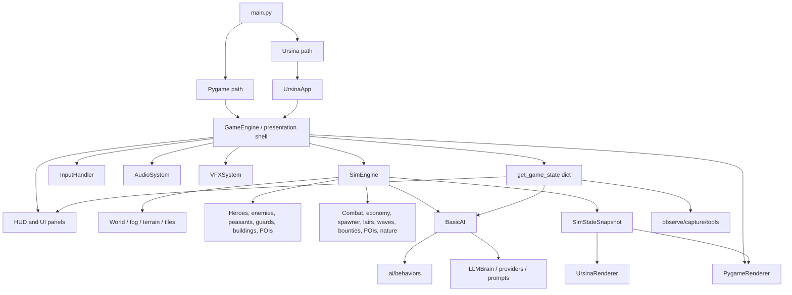
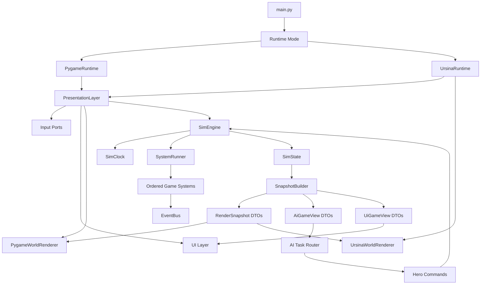

# GPT 5.5 Codebase Improvements Recommendations

**Created:** 2026-05-28  
**Author:** GPT-5.5 audit synthesis  
**Scope:** End-to-end read-only architecture and code-quality audit of Kingdom Sim  
**Goal:** Identify "slop code" patterns, rank cleanup opportunities, and propose practical refactors that make the game easier to ship without derailing gameplay work.

---

## Executive Summary

Kingdom Sim is not a hopeless mess. It has several good foundations: a `SimEngine` split exists, deterministic time/RNG tools exist, systems have a `SystemContext` protocol, renderers consume a snapshot, the AI has behavior modules, QA smoke gates exist, and agent ownership is documented.

The problem is that many refactors stopped at the halfway point. Large classes were split mechanically, but compatibility shims and old orchestration paths stayed behind. Feature agents then kept adding new behavior to whichever file was easiest to touch. The result is a codebase with several "almost clean" boundaries that are repeatedly punctured by live objects, `Any`, raw dicts, private fields, and duplicated feature logic.

The biggest cleanup opportunity is not a rewrite. It is to finish the boundaries already started:

1. **Make `SimEngine` the single owner of sim time, cleanup, and system updates.**
2. **Make render/UI/AI snapshots real data transfer objects, not shallow wrappers over live objects.**
3. **Split the largest coordinator files by responsibility, starting with `HUD`, `UrsinaRenderer`, `InputHandler`, `Hero`, and `SimEngine`.**
4. **Create canonical registries for building definitions, visual specs, audio events, prefabs, and AI task types.**
5. **Clean up tooling/docs sprawl so future agents can find the right patterns instead of copying old sprint code.**

The highest-risk actual bug found during the audit is that **sim time appears to have two owners**: `GameEngine._prepare_sim_and_camera()` and `SimEngine.update()` both advance `_sim_now_ms` in deterministic mode. That should be verified and fixed before large refactors.

---

## What "Slop Code" Means Here

This audit treats code as "slop" when it has one or more of these properties:

- **Responsibility pile-up:** a file or class handles unrelated jobs because it was the convenient place to add the next feature.
- **Half-finished refactor:** a new abstraction exists, but the old path is still present and callable.
- **Boundary leakage:** render/UI/AI/tooling mutates or reads live sim internals through `Any`, dicts, private fields, or `getattr`.
- **Parallel registries:** one concept is defined in several places and must be updated by memory.
- **Stringly typed state:** important behavior depends on magic strings or dict shapes with no central contract.
- **Compatibility barnacles:** legacy fields and fallback paths remain long after the branch has shipped.
- **Per-frame work hidden in UI/render code:** repeated surface/text/path/object allocation that should be cached or precomputed.
- **Sprint artifact accumulation:** one-off files and test names that preserve history but obscure current architecture.

---

## Current Architecture Map



### Boundary Problem

The diagram above looks reasonably clean, but the actual code still has these leaks:

- `GameEngine` forwards many sim fields through compatibility properties.
- `get_game_state()` passes live lists, `world`, `economy`, `sim`, and then `engine`.
- `SimStateSnapshot` is frozen only at the top level; it contains live mutable objects.
- `InputHandler` depends on `GameCommands`, but `GameCommands` exposes broad engine internals with `Any`.
- AI behaviors mutate heroes/buildings/bounties directly through a loose `game_state` dict.
- Renderers sometimes consume or mutate sim entity fields.
- Production graphics import `tools.*` helpers.

---

## Ranked Recommendations

### P0 - Fix Real Correctness Risks First

#### 1. Make sim time single-owner

**Files:** `game/engine.py`, `game/sim_engine.py`, `game/sim/timebase.py`, tests under `tests/test_engine.py`

`GameEngine._prepare_sim_and_camera()` advances `_sim_now_ms` in deterministic mode, and `SimEngine.update()` also advances `_sim_now_ms`. If both paths run in one update, deterministic timers can advance twice. This can affect cooldowns, early pacing, rubble expiry, hunger, path replans, bounties, and any future replay/multiplayer work.

**Recommendation:**

- Add a targeted test first:

```python
def test_game_engine_update_advances_sim_time_once():
    engine = GameEngine(headless=True)
    before = int(engine.sim._sim_now_ms)
    engine.update(0.05)
    after = int(engine.sim._sim_now_ms)
    assert after - before == 50
```

- Move all authoritative sim time advancement into `SimEngine.tick(dt)` or `SimEngine.update(dt, view)`.
- Let `GameEngine` decide **whether** to call the sim, but never mutate `sim._sim_now_ms`.
- Presentation time, camera time, and UI cooldown time should stay separate and explicitly non-authoritative.

Target shape:

```python
class GameEngine:
    def update(self, dt: float) -> None:
        if self._should_tick_sim():
            self.sim.update(dt, self._build_ai_view())
        self.presentation.update(dt)

class SimEngine:
    def update(self, dt: float, ai_view: AiGameView | None = None) -> None:
        self.clock.advance(dt)
        set_sim_now_ms(self.clock.now_ms)
        self.system_runner.update_all(dt)
```

#### 2. Remove duplicated destroyed-building cleanup

**Files:** `game/sim_engine.py`, `game/engine.py`, `game/cleanup_manager.py`, `game/entities/rubble.py`

Destroyed-building cleanup exists in both sim and presentation-era code. Comments indicate this was patched after a refactor moved update logic to `SimEngine`, but both paths still remain conceptually alive.

**Recommendation:**

- Create `game/systems/building_lifecycle.py`.
- Move destruction, reference cleanup, rubble creation, and event emission into one sim-owned service.
- Presentation should only listen for events and clear selected/panel state by ID if needed.
- Add tests asserting exactly one rubble record and one destruction event per destroyed building.

Target shape:

```python
@dataclass(frozen=True)
class BuildingDestroyed:
    building_id: str
    building_type: str
    center_x: float
    center_y: float
    rubble_id: int

class BuildingLifecycleSystem:
    def cleanup_destroyed(self, ctx: SystemContext) -> list[BuildingDestroyed]:
        ...
```

#### 3. Replace wall-clock pathfinding budget decisions

**Files:** `game/systems/navigation.py`, `game/systems/pathfinding.py`, `game/systems/perf_stats.py`

The sim can change behavior based on wall-clock pathfinding budget. Perf timing is useful, but it should not decide whether a unit gets a path in deterministic gameplay.

**Recommendation:**

- Use deterministic max-plans-per-tick limits for gameplay.
- Keep `perf_counter()` only for metrics.
- If budget is exhausted, return a deterministic "defer path request" result rather than an empty path that looks like failure.

Target shape:

```python
@dataclass
class PathBudget:
    max_plans_per_tick: int = 12
    used: int = 0

    def allow(self) -> bool:
        if self.used >= self.max_plans_per_tick:
            return False
        self.used += 1
        return True
```

---

### P1 - Finish The Core Architecture Boundaries

#### 4. Delete old sim helper methods from `GameEngine`

**Files:** `game/engine.py`, `game/sim_engine.py`

`GameEngine` still contains old sim methods such as `_update_ai_and_heroes`, `_apply_entity_separation`, `_process_combat`, `_process_bounties`, `_update_buildings`, and other helpers even though `GameEngine.update()` now calls `self.sim.update()`.

This is dangerous because future agents may patch the dead method instead of the live path.

**Recommendation:**

- Add characterization tests around `SimEngine.update()`.
- Search for references to old `GameEngine` helpers.
- Delete dead helpers once no tests or tools call them.
- If a helper is still needed by a profiler or legacy tool, move it to `SimEngine` or a system module and update the caller.

Acceptance:

```powershell
python -m pytest tests/test_engine.py tests/test_renderer_snapshot_contract.py
python tools/qa_smoke.py --quick
```

#### 5. Split `GameCommands` into narrow command ports

**Files:** `game/game_commands.py`, `game/input_handler.py`, `game/engine.py`

`GameCommands` removed a direct `GameEngine` reference from `InputHandler`, but it now mirrors too much of the engine with `Any` properties and private fields. That is nominal decoupling, not real decoupling.

**Recommendation:**

Replace the single giant protocol with smaller ports:

```python
class CameraCommands(Protocol):
    def zoom_by(self, factor: float) -> None: ...
    def center_on_castle(self, reset_zoom: bool = True) -> None: ...

class SelectionCommands(Protocol):
    def select_at_screen(self, pos: tuple[int, int]) -> SelectionResult: ...
    def clear_selection(self) -> None: ...

class PlacementCommands(Protocol):
    def select_building_for_placement(self, building_type: str) -> bool: ...
    def place_building_at_screen(self, pos: tuple[int, int]) -> PlacementResult: ...

class MenuCommands(Protocol):
    def apply_ui_action(self, action: UIAction) -> None: ...
```

Then make `InputHandler` a dispatcher that composes these ports rather than a policy object that knows every panel and selection rule.

#### 6. Split snapshot contracts into sim, presentation, and UI views

**Files:** `game/sim/snapshot.py`, `game/sim_engine.py`, `game/engine.py`, `game/graphics/**`, `game/ui/**`, `ai/**`

`SimStateSnapshot` currently carries live entity/world objects plus camera, screen, pause, UI, and VFX state. It is pragmatic, but the name overpromises immutability and sim purity.

**Recommendation:**

Create three view contracts over time:

```python
@dataclass(frozen=True, slots=True)
class SimSnapshot:
    tick_id: int
    units: tuple[UnitSimDTO, ...]
    buildings: tuple[BuildingSimDTO, ...]
    bounties: tuple[BountySimDTO, ...]
    rubble: tuple[RubbleDTO, ...]
    fog_revision: int

@dataclass(frozen=True, slots=True)
class PresentationFrameState:
    screen_w: int
    screen_h: int
    camera_x: float
    camera_y: float
    zoom: float
    paused: bool

@dataclass(frozen=True, slots=True)
class UiGameView:
    gold: int
    selected: SelectionView
    panels: PanelState
    alerts: tuple[ToastDTO, ...]
```

Do not convert everything in one sprint. Start with renderer DTOs for units and buildings, because renderer live-object mutation is one of the clearest coupling problems.

#### 7. Move selection state out of `SimEngine`

**Files:** `game/sim_engine.py`, `game/engine.py`, `game/input_handler.py`, render snapshots

`selected_hero`, `selected_building`, `selected_enemy`, and `selected_peasant` are player/presentation state, not authoritative sim state. Keeping them in `SimEngine` encourages UI and sim to stay coupled.

**Recommendation:**

- Add `game/presentation/selection_state.py`.
- Store selected IDs in presentation state.
- Snapshots can include selected IDs for highlight rendering.
- Sim should expose entity lookup by stable ID, not store the current UI selection.

---

### P1 - Break Up The Largest Files

#### 8. Split `game/ui/hud.py`

**Current size:** about 2,470 lines  
**Problem:** Layout, rendering, clicks, split handles, minimap, watch card, chat placement, overlays, toasts, command bar, speed bar, and selection panels all live in one class.

**Target modules:**

- `game/ui/layout.py`
  - `HUDLayout`
  - `LeftColumnLayout`
  - split handle geometry
  - chrome hit regions
- `game/ui/ui_actions.py`
  - typed `UIAction`
  - no string/dict action shapes leaking into input
- `game/ui/hud_chrome.py`
  - top bar, bottom bar, speed bar, command bar
- `game/ui/selection_sidebar.py`
  - hero/enemy/peasant/building panel composition
- `game/ui/watch_card_panel.py`
  - pinned hero card, minimap rectangle, chat band
- `game/ui/toast_layer.py`
  - HUD messages, POI toasts, wave toasts, dev labels
- `game/ui/overlay_layer.py`
  - memorial, demolish confirmation, building interior overlay

Example click flow:

```python
@dataclass(frozen=True)
class UIAction:
    kind: str
    payload: object | None = None

class HUD:
    def handle_click(self, pos: tuple[int, int], view: UiGameView) -> UIAction | None:
        return self.action_router.action_at(pos, view)

class InputHandler:
    def handle_mousedown(self, event) -> None:
        action = self.ui.click(event.pos)
        if action:
            self.commands.apply_ui_action(action)
            return
        self.world_selection.select_at_screen(event.pos)
```

#### 9. Split `game/graphics/ursina_renderer.py`

**Current size:** about 2,227 lines  
**Problem:** Orchestration, units, overlays, buildings, prefabs, bounty flags, rubble, projectiles, debug text, culling, animation, terrain/fog collaborator calls, and old/experimental instancing paths are all mixed.

**Target modules:**

- `game/graphics/ursina/renderer.py` - orchestration only
- `game/graphics/ursina/units.py` - hero/enemy/worker/guard/tax collector sync
- `game/graphics/ursina/unit_overlays.py` - HP/name/gold/rest labels
- `game/graphics/ursina/buildings.py` - prefab/mesh/billboard building sync
- `game/graphics/ursina/bounties.py` - 3D bounty flags
- `game/graphics/ursina/rubble.py` - rubble visuals
- `game/graphics/ursina/projectiles.py` - projectile visuals
- `game/graphics/ursina/terrain_fog.py` - terrain/fog orchestration

Start with unit overlays and shared visual specs because they remove duplication without touching terrain or prefab risk.

#### 10. Split `game/graphics/ursina_terrain_fog_collab.py`

**Problem:** This collaborator has become its own subsystem: terrain building, fog texture, chunk culling, static batching, tree entity fallback, instanced trees, grid overlay, and cave shader hooks.

**Target modules:**

- `game/graphics/ursina/terrain_mesh.py`
- `game/graphics/ursina/fog_texture.py`
- `game/graphics/ursina/terrain_props.py`
- `game/graphics/ursina/instanced_trees.py`
- `game/graphics/ursina/debug_grid.py`

#### 11. Split `game/graphics/ursina_app.py`

**Current size:** about 1,526 lines  
**Problem:** App setup, camera rig, input bridge, HUD texture upload, screenshot automation, debug layouts, perf probes, capture hooks, and zone/underground camera logic are mixed.

**Target modules:**

- `game/graphics/ursina/app.py` - app shell and run loop
- `game/graphics/ursina/camera_controller.py`
- `game/graphics/ursina/input_bridge.py`
- `game/graphics/ursina/hud_texture_upload.py`
- `game/graphics/ursina/debug_capture.py`
- `game/graphics/ursina/perf_probe.py`

#### 12. Split `game/sim_engine.py`

**Current size:** about 1,307 lines  
**Problem:** `SimEngine` now owns too many domains: initial state, trees/nature/logs, POIs, building cleanup, fog, system update order, separation, AI hooks, snapshots, and helper callbacks.

**Target modules:**

- `game/sim/initial_state.py`
- `game/sim/system_runner.py`
- `game/sim/fog_service.py`
- `game/sim/entity_separation.py`
- `game/sim/building_lifecycle.py` or `game/systems/building_lifecycle.py`
- `game/sim/nature_bridge.py`
- `game/sim/poi_discovery.py`
- `game/sim/snapshot_builder.py`

The important thing is to extract services with clear inputs, not to move code mechanically into more files while still passing the whole `SimEngine`.

---

### P1 - Create Canonical Registries

#### 13. Building definitions registry

**Files:** `config.py`, `game/building_factory.py`, `game/entities/buildings/**`, `assets/prefabs/**`, UI build menus

Building data is spread across:

- `BUILDING_COSTS`
- `BUILDING_SIZES`
- `BUILDING_COLORS`
- `BUILDING_MAX_OCCUPANTS`
- `BuildingType`
- `BuildingFactory.BUILDING_REGISTRY`
- prefab JSON `building_type` and `footprint_tiles`
- build catalog/menu data

This is exactly the kind of duplicated registry that causes agent drift.

**Recommendation:**

Create `game/content/buildings.py`:

```python
@dataclass(frozen=True, slots=True)
class BuildingDef:
    key: str
    cls: type
    cost: int
    size: tuple[int, int]
    color: tuple[int, int, int]
    max_occupants: int = 0
    placeable: bool = True
    tax_stash: bool = False
    prefab_key: str | None = None

BUILDINGS: dict[str, BuildingDef] = {
    "marketplace": BuildingDef(
        key="marketplace",
        cls=Marketplace,
        cost=250,
        size=(3, 3),
        color=(...),
        tax_stash=True,
        prefab_key="marketplace_v1",
    ),
}
```

Then generate compatibility aliases from the registry while migrating:

```python
BUILDING_COSTS = {k: d.cost for k, d in BUILDINGS.items()}
BUILDING_SIZES = {k: d.size for k, d in BUILDINGS.items()}
```

#### 14. Unit visual specs registry

**Files:** `game/graphics/ursina_renderer.py`, `game/graphics/instanced_unit_renderer.py`, `game/graphics/ursina_pick.py`, `game/graphics/renderers/**`, `game/graphics/unit_atlas.py`

Unit scales, labels, atlas keys, HP bar offsets, billboard sizes, and picking offsets are repeated.

**Recommendation:**

Create `game/graphics/visual_specs.py`:

```python
@dataclass(frozen=True, slots=True)
class UnitVisualSpec:
    kind: str
    atlas_key: str
    scale_xyz: tuple[float, float, float]
    hp_bar_y: float
    label_y: float
    pick_radius_px: float

def unit_visual_spec(entity: object) -> UnitVisualSpec:
    ...
```

Use this from:

- Ursina billboards
- instanced units
- pygame renderers
- unit atlas building
- picking/hit tests

#### 15. AI task/target registry

**Files:** `ai/basic_ai.py`, `ai/behaviors/bounty_pursuit.py`, `ai/behaviors/exploration.py`, `game/entities/hero.py`, `game/sim/direct_prompt_exec.py`

Hero task state is stringly typed and often stored as dicts on `hero.target`. New tasks require changes across arrival handlers, intent labels, commit windows, interruption policy, and UI.

**Recommendation:**

Create `ai/contracts.py`:

```python
class TargetType(StrEnum):
    BOUNTY = "bounty"
    SHOPPING = "shopping"
    REST_INN = "rest_inn"
    DIRECT_PROMPT = "direct_prompt"
    BUY_MEAL = "buy_meal"
    PATROL = "patrol"
    VISIT_POI = "visit_poi"
    JOURNEY_EXPLORE = "journey_explore"

@dataclass(slots=True)
class HeroTask:
    type: TargetType
    target_id: str | int | None = None
    target_ref: object | None = None
    started_ms: int = 0
    metadata: dict[str, object] = field(default_factory=dict)
```

Then create:

- `ai/task_router.py`
- `ai/arrival_handlers.py`
- `ai/task_policy.py`

#### 16. Audio and prefab manifests

**Files:** `game/audio/audio_system.py`, `game/audio/enemy_sounds.py`, `game/audio/EVENT_CONTRACT.md`, `tools/assets_manifest.json`, `game/graphics/ursina_prefabs.py`, `assets/prefabs/buildings/**`

Audio contracts are split across runtime maps, enemy sound maps, docs, and manifest entries. Prefab resolution is hardcoded in Python despite prefab JSON already containing building types.

**Recommendation:**

- Add `assets/audio/audio_manifest.json` with event mappings, cooldowns, optional flags, enemy aliases, and filenames.
- Add `assets/prefabs/buildings/index.json` for building/POI prefab resolution.
- Make validators read these manifests and fail on drift.
- Generate or load runtime maps from the same data source.

---

### P2 - Clean AI Architecture

#### 17. Extract arrival handling from `bounty_pursuit.py`

**Files:** `ai/behaviors/bounty_pursuit.py`

This file now handles much more than bounties: direct prompts, shopping arrival, rest, inn drinks, POIs, meals, combat chase gating, and stuck-adjacent continuation.

**Recommendation:**

Create `ai/arrival_handlers.py`:

```python
ARRIVAL_HANDLERS: dict[TargetType, Callable[[Hero, HeroTask, GameState], ArrivalResult]] = {
    TargetType.SHOPPING: handle_shopping_arrival,
    TargetType.REST_INN: handle_rest_arrival,
    TargetType.BUY_MEAL: handle_meal_arrival,
    TargetType.DIRECT_PROMPT: handle_direct_prompt_arrival,
    TargetType.BOUNTY: handle_bounty_arrival,
}
```

Keep `bounty_pursuit.py` focused on scoring and pursuing bounties.

#### 18. Replace `BasicAI.update_hero()` priority ladder with a router

**Files:** `ai/basic_ai.py`, `ai/behaviors/**`

Behavior extraction helped, but the actual decision ordering is still implicit in a long coordinator method.

**Recommendation:**

Create a router where modules return proposals:

```python
@dataclass(frozen=True)
class TaskProposal:
    priority: int
    source: str
    task: HeroTask
    reason: str

class TaskRouter:
    def choose(self, hero: Hero, view: AiGameView) -> TaskProposal | None:
        proposals = [
            defense.propose(hero, view),
            hunger.propose(hero, view),
            rest.propose(hero, view),
            bounty.propose(hero, view),
            journey.propose(hero, view),
        ]
        return max((p for p in proposals if p), key=lambda p: p.priority, default=None)
```

This makes behavior competition explicit and testable.

#### 19. Split LLM context into pure JSON slices

**Files:** `ai/context_builder.py`, `ai/profile_context_adapter.py`, `game/entities/hero.py`

`ContextBuilder` mixes live sim objects, JSON prompt shaping, UI-style stat blocks, POI awareness, known-place selection, and marketplace catalog logic. It also passes raw `available_bounties` objects alongside JSON-friendly summaries.

**Recommendation:**

- Create `ai/context/slices.py`.
- Create slice builders:
  - `HeroFactsSlice`
  - `TacticalSituationSlice`
  - `KnownPlacesSlice`
  - `BountySlice`
  - `ShopSlice`
  - `ConversationSlice`
- Assert prompt payloads are JSON-serializable and contain no raw entity objects.
- Remove or deprecate `Hero.get_context_for_llm()` after compatibility tests pass.

---

### P2 - Clean Gameplay Systems

#### 20. Split `Hero` into services

**Files:** `game/entities/hero.py`

`Hero` currently combines identity, stats, inventory, buffs, memory, rest, building occupancy, shopping/taxes, hunger, movement/pathfinding, intent snapshots, LLM context, and event hooks. It also initializes some fields twice.

**Recommendation:**

Keep `Hero` as the data shell during migration, but extract behavior:

- `game/entities/hero_inventory.py`
- `game/entities/hero_resting.py`
- `game/entities/hero_navigation.py`
- `game/entities/hero_intent.py`
- `game/entities/hero_memory_facade.py`

Do this by moving methods first, not changing data layout first.

#### 21. Centralize attacks and projectile events

**Files:** `game/systems/combat.py`, `game/entities/enemy.py`, `game/entities/guard.py`, `game/entities/buildings/defensive.py`

Combat is split: hero attacks are centralized, but enemy, guard, guardhouse, ballista, tower, and ranged projectile behaviors live in entity/building updates with `_last_ranged_event` side channels.

**Recommendation:**

Introduce attack profiles:

```python
@dataclass(frozen=True)
class AttackProfile:
    attacker_id: str
    team: Literal["hero", "enemy", "defense"]
    damage: int
    range_px: float
    cooldown_ms: int
    projectile: ProjectileSpec | None = None
```

Then `CombatSystem` processes all attacks and emits standard events:

- `DamageEvent`
- `ProjectileEvent`
- `UnitKilledEvent`
- `BuildingDestroyedEvent`

#### 22. Expand `SystemContext` and use one system update style

**Files:** `game/systems/protocol.py`, `game/sim_engine.py`, `game/systems/**`

`SystemContext` only includes heroes, enemies, buildings, world, economy, and event bus. Several systems need peasants, guards, POIs, castle, lairs, or rubble, so the engine calls custom `tick()` methods and bypasses the protocol.

**Recommendation:**

```python
@dataclass(slots=True)
class SystemContext:
    heroes: list
    enemies: list
    buildings: list
    peasants: list
    guards: list
    bounties: list
    pois: list
    rubble_records: list
    world: object
    economy: object
    event_bus: EventBus
```

Then `SimEngine` can use an ordered system runner:

```python
SYSTEM_ORDER = (
    nature_system,
    ai_system,
    movement_system,
    fog_system,
    spawn_system,
    combat_system,
    building_lifecycle_system,
    bounty_system,
    poi_system,
)
```

---

### P2 - Clean UI And Renderer Performance

#### 23. Build one frame context per frame

**Files:** `game/engine.py`, `game/engine_facades/render_coordinator.py`, `game/graphics/ursina_app.py`, `game/sim_engine.py`

The render paths currently rebuild overlapping frame state. In the Ursina path, `UrsinaApp` builds a snapshot for `UrsinaRenderer`, then the pygame HUD/render coordinator can build another snapshot and call `get_game_state()` several times. `get_game_state()` can also build hero profile snapshots for every hero, so repeated UI calls multiply work.

**Recommendation:**

- Introduce a `FrameContext` built once per rendered frame.
- Store one `snapshot`, one cheap `ui_view`, and optional lazy expensive profile data.
- Pass that context through `UrsinaRenderer`, `EngineRenderCoordinator`, HUD, debug panel, and pause/menu render paths.
- Split `get_game_state()` into a cheap base view and lazy selected/pinned hero profile lookups.

Target shape:

```python
@dataclass(slots=True)
class FrameContext:
    snapshot: SimSnapshot
    presentation: PresentationFrameState
    ui: UiGameView
    hero_profiles: LazyHeroProfileCache
```

#### 24. Add dirty-surface caching for panels

**Files:** `game/ui/building_panel.py`, `game/ui/pause_menu.py`, `game/ui/chat_panel.py`, `game/ui/build_catalog_panel.py`, `game/ui/hud.py`

Several panels still render text or allocate scratch surfaces every frame. This is especially risky for the Ursina HUD texture upload path.

**Recommendation:**

- Add a `PanelRenderCache` helper.
- Rebuild only when a dirty key changes.
- Use cached text helpers for static labels and repeated values.

Example:

```python
@dataclass(frozen=True)
class PanelDirtyKey:
    selected_id: str | None
    gold: int
    hp: int
    scroll: int
    width: int
    height: int

class CachedPanelSurface:
    def render(self, key: PanelDirtyKey, build: Callable[[], pygame.Surface]) -> pygame.Surface:
        if key != self._key:
            self._surface = build()
            self._key = key
        return self._surface
```

#### 25. Cache chat wrapping by message and width

**Files:** `game/ui/chat_panel.py`, `game/ui/hud.py`

Active chat wraps conversation history for measurement and then wraps/renders visible lines again every frame.

**Recommendation:**

- Cache wrapped lines per message ID and available width.
- Invalidate only when history changes, font changes, or width changes.
- Keep scroll calculations over cached line records.

#### 26. Precompute VFX debris decals

**Files:** `game/graphics/vfx.py`

Debris/rubble render paths should not re-randomize, recalculate all pieces, or allocate underlay surfaces every frame.

**Recommendation:**

- Compute decal pieces at spawn time.
- Store piece positions, colors, sizes, and underlay metadata.
- Render only stored pieces.

#### 27. Cache flipped animation frames

**Files:** `game/graphics/renderers/hero_renderer.py`, `game/graphics/renderers/enemy_renderer.py`, `game/graphics/animation.py`

Pygame renderers call `pygame.transform.flip()` at render time. Mirrored frames should be cached by clip/frame/facing.

**Recommendation:**

Add mirrored-frame support to `AnimationClip`:

```python
class AnimationClip:
    def frame(self, index: int, *, flipped: bool = False) -> pygame.Surface:
        if not flipped:
            return self.frames[index]
        return self._flipped_cache[index]
```

#### 28. Replace path `pop(0)` with cursors or deques

**Files:** `game/systems/navigation.py`, entity movement methods

`follow_path()` mutates paths with `pop(0)`, shifting the whole list for every waypoint.

**Recommendation:**

- Store paths as tuples or lists plus an integer cursor.
- Or use `collections.deque` if mutation remains simpler.
- Cache paths as immutable tuples keyed by start, goal, layer, and blocker revision.

#### 29. Measure HUD texture upload strategy before optimizing it

**Files:** `game/graphics/ursina_app.py`, `tools/perf_render_benchmark.py`, `tools/ursina_frame_profiler.py`

The Ursina HUD upload path still converts the full pygame HUD surface with `pygame.image.tobytes()` before dirty-row logic. Dirty-row upload may or may not beat full upload after row scanning and temporary Panda texture work.

**Recommendation:**

- Benchmark full upload versus dirty-row upload in the existing stage profiler.
- Keep the simpler path if it is faster or equal at common HUD sizes.
- If dirty upload wins, isolate it in `game/graphics/ursina/hud_texture_upload.py` with explicit metrics.

---

### P2 - Clean Tools, Tests, Assets, And Docs

#### 30. Split monolithic QA/capture tools

**Files:** `tools/qa_smoke.py`, `tools/observe_sync.py`, `tools/screenshot_scenarios.py`, `tools/capture_screenshots.py`

The tool stack works, but major files are too broad and WK-specific logic keeps accumulating.

**Recommendation:**

Create `tools/kingdom_tools/`:

- `kingdom_tools/cli.py`
- `kingdom_tools/process.py`
- `kingdom_tools/sim_harness.py`
- `kingdom_tools/observe/cli.py`
- `kingdom_tools/observe/scenarios.py`
- `kingdom_tools/observe/assertions.py`
- `kingdom_tools/capture/pygame.py`
- `kingdom_tools/capture/ursina.py`
- `kingdom_tools/capture/scenarios/`
- `kingdom_tools/assets/schema.py`
- `kingdom_tools/assets/validate.py`

Then keep old entrypoints as thin wrappers until tests and docs migrate.

#### 31. Organize tests by domain

**Files:** `tests/**`

The test suite is flat and sprint-named. That preserves history, but it makes intent and ownership harder to scan.

**Recommendation:**

Target structure:

```text
tests/
  gameplay/
  ai/
  ui/
  rendering/
  tools/
  integration/
  perf_manual/
```

Add `pytest.ini` markers:

```ini
[pytest]
markers =
    slow: longer integration tests
    render: screenshot or renderer tests
    ursina: requires Ursina/Panda runtime
    perf: performance/manual benchmarks
    integration: multi-system checks
```

Then change `qa_smoke --quick` to run:

```powershell
python -m pytest -m "not slow and not render and not perf"
```

plus selected observe profiles.

#### 32. Refactor the AI studio orchestrator separately

**Files:** `tools/ai_studio_orchestrator/src/**`

The TypeScript orchestrator appears functional, but `cli.ts` owns too much and the docs conflict around git behavior. Because automation and git are high-risk, isolate this from gameplay cleanup.

**Recommendation:**

- Split command modules:
  - `commands/validate.ts`
  - `commands/run.ts`
  - `commands/complete.ts`
  - `commands/status.ts`
- Add:
  - `args.ts`
  - `git.ts`
  - `receipts.ts`
  - `cloudBranch.ts`
- Remove hardcoded `origin/main` behavior where branch options exist.
- Add mocked tests before live orchestrator runs.

#### 33. Create current architecture docs

**Files:** `docs/**`, `.cursor/plans/**`, `README.md`, `.cursor/rules/**`

The repo has old master plans and narrow inventories, but not a current architecture map that reflects the actual WK53-WK61 code.

**Recommendation:**

Add:

- `docs/architecture/current_architecture.md`
- `docs/architecture/rendering_pipeline_ursina.md`
- `.cursor/plans/README.md` or `.cursor/plans/INDEX.md`

Also:

- Make `AGENTS.md` the canonical ownership table.
- Have role/rule files link back to it instead of duplicating full maps.
- Fix stale links to the old architecture master plan.
- Move or ignore `.bak_*` agent-log backups so search results stay useful.
- Reconcile orchestrator docs with git safety rules.

---

## Proposed Target Architecture



### Principles

- **Sim owns authoritative state and time.**
- **Presentation owns selection, camera, windows, UI, audio, and input.**
- **Renderers never mutate sim entities.**
- **AI proposes commands; sim applies them.**
- **Registries define content once.**
- **Compatibility aliases can exist temporarily, but every alias needs a removal target.**

---

## Recommended Cleanup Roadmap

### Phase 0 - Finish In-Flight v1.6 Gameplay, Then Baseline

**Goal:** Do not interrupt active v1.6 gameplay tuning with broad structural cleanup. Finish the current playtest/gameplay slice first, then lock down current behavior before moving code.

This does not mean ignoring real correctness risks. If the sim-time double-advance test confirms a bug, fix that as a narrow hotfix. Otherwise, keep structural cleanup out of the same wave as wave tuning, difficulty, hunger, tax overlay, rubble, or other v1.6 playtest features.

Owner recommendations:

- Agent 03 (high intelligence): engine/sim time and cleanup tests
- Agent 11 (medium intelligence): regression coverage and smoke profile review
- Agent 10 (low/medium intelligence): perf baseline

Tasks:

- Let in-flight v1.6 gameplay work close before starting broad file splits.
- Add sim time single-advance test.
- Add destroyed-building single-cleanup test.
- Add snapshot render no-mutation test.
- Add import-boundary smoke tests for `game/sim`, `game/systems`, and `game/entities`.
- Run baseline gates:

```powershell
python -m pytest
python tools/qa_smoke.py --quick
python tools/validate_assets.py --report
python tools/perf_benchmark.py
```

### Phase 1 - Engine/Sim Boundary Cleanup

**Goal:** Finish the existing refactor instead of piling on more compatibility.

Tasks:

- Make sim time single-owner.
- Consolidate destroyed-building lifecycle.
- Delete dead `GameEngine` sim helper methods.
- Move selection state toward presentation-owned IDs.
- Split `GameCommands` into narrow command ports.

Acceptance:

```powershell
python -m pytest tests/test_engine.py tests/test_renderer_snapshot_contract.py tests/test_input_handler_gamecommands.py
python tools/qa_smoke.py --quick
```

### Phase 2 - Renderer/UI Large File Split

**Goal:** Reduce the files most likely to create future feature collisions.

Tasks:

- Add `game/graphics/visual_specs.py`.
- Extract `UrsinaUnitOverlaySync`.
- Split `HUD` layout and action routing first.
- Add panel dirty caching for the most expensive panels.
- Add `FrameContext` reuse so snapshot/game-state/profile work happens once per frame.
- Split `UrsinaRenderer` into unit/building/bounty/rubble modules.

Acceptance:

```powershell
python -m pytest tests/test_pygame_renderer_wk39.py tests/test_renderer_snapshot_contract.py tests/test_wk61_r10_sidebar_layout.py tests/test_wk61_r9_hero_chat_readable_layout.py tests/test_wk61_r4_ui_regressions.py
python tools/qa_smoke.py --quick
python tools/capture_screenshots.py --scenario ui_panels --seed 3 --out docs/screenshots/codebase_cleanup_ui_panels --size 1920x1080 --ticks 480
python tools/capture_screenshots.py --scenario base_overview --seed 3 --out docs/screenshots/codebase_cleanup_base_overview --size 1920x1080 --ticks 480
python tools/perf_render_benchmark.py --warmup 8 --measure 15
```

### Phase 3 - AI And Gameplay Contracts

**Goal:** Stop adding behavior through stringly typed hero targets and live-object dicts.

Tasks:

- Add `ai/contracts.py`.
- Add typed `HeroTask` while still supporting old dict target shape.
- Extract arrival handlers from `bounty_pursuit.py`.
- Split `ContextBuilder` into JSON slices.
- Begin stable ID migration for enemies/buildings/POIs where `id(obj)` is used.
- Replace pathfinding wall-clock budget with deterministic budget.

Acceptance:

```powershell
python -m pytest tests/test_ai_bounty.py tests/test_ai_exploration.py tests/test_direct_prompt_integration.py tests/test_llm_bridge_apply_decision.py tests/test_poi_interaction.py tests/test_combat.py
python tools/determinism_guard.py
python tools/qa_smoke.py --quick
```

### Phase 4 - Registries And Content Data

**Goal:** Define game/content/visual/audio/prefab concepts once.

Tasks:

- Add building definition registry with compatibility aliases.
- Add prefab index.
- Add audio manifest.
- Add unit visual specs.
- Move production-used asset helper code out of `tools`.
- Extend asset validation to detect unlisted prefab drift.

Acceptance:

```powershell
python -m json.tool tools/assets_manifest.json
python tools/validate_assets.py --report
python tools/validate_assets.py --strict --check-attribution
python tools/qa_smoke.py --quick
```

### Phase 5 - Tooling And Docs Hygiene

**Goal:** Make future agents land in the right files and use current patterns.

Tasks:

- Add current architecture docs.
- Add `.cursor/plans` index.
- Archive one-off scripts and sprint-specific patches.
- Split `observe_sync.py` and `screenshot_scenarios.py`.
- Add pytest markers and domain folders.
- Reconcile orchestrator docs and git behavior.

Acceptance:

```powershell
python tools/qa_smoke.py --quick
python tools/validate_assets.py --report
npm --prefix tools/ai_studio_orchestrator run typecheck
```

---

## Files To Prioritize

### Highest Value

| File | Why | First action |
|---|---|---|
| `game/engine.py` | Dead sim logic, compatibility forwarding, presentation/sim leakage | Delete old sim helpers after tests |
| `game/sim_engine.py` | Too many sim responsibilities, possible time double-advance | Fix clock ownership, extract lifecycle/fog/separation |
| `game/ui/hud.py` | Main UI god object | Extract layout and typed UI actions |
| `game/graphics/ursina_renderer.py` | Main renderer god object | Extract visual specs and unit overlays |
| `game/input_handler.py` | Input plus UI policy plus world selection | Split into hotkeys, UI router, world selection, placement |
| `game/entities/hero.py` | Entity god object | Extract inventory/rest/navigation/intent services |
| `ai/behaviors/bounty_pursuit.py` | Arrival handler dumping ground | Move arrival dispatch out |
| `config.py` | Mixed gameplay/render/env/dev registries | Move content definitions to registries |

### Important But Later

| File | Why | First action |
|---|---|---|
| `game/graphics/ursina_app.py` | App/camera/input/HUD upload/debug capture mixed | Extract HUD upload and camera controller |
| `game/graphics/ursina_terrain_fog_collab.py` | Terrain/fog/props/instancing/debug mixed | Split terrain props and fog texture |
| `tools/observe_sync.py` | Monolithic QA harness | Split scenarios/assertions/reporting |
| `tools/screenshot_scenarios.py` | Huge scenario registry | Move scenarios into modules |
| `tools/ai_studio_orchestrator/src/cli.ts` | Automation command god object | Split commands and git/receipt services |
| `game/world.py` | World state plus generation plus rendering | Split tiles, generation, fog, render fallback |
| `game/systems/poi_interaction.py` | Large coupled content resolver | Split interaction handlers by POI type |

---

## What Not To Refactor Yet

- Do not rewrite the whole renderer before extracting shared visual specs. The renderer has performance-sensitive paths and visual regressions are expensive.
- Do not move all config to JSON in one pass. Start with building and audio registries that have clear drift today.
- Do not replace the entire AI with command DTOs in one sprint. Add typed `HeroTask` compatibility first.
- Do not reorganize all tests before critical engine/sim correctness tests exist. Test movement should follow stable markers and fixtures.
- Do not remove compatibility aliases without grep checks and tests. Some tools and old scenarios still depend on old names.
- Do not refactor orchestrator git behavior casually. Treat automation safety as its own isolated sprint.

---

## Suggested Agent Ownership

If this becomes a cleanup initiative, do not send every agent at once. Use staged waves.

### Phase 0

- Agent 03 - high intelligence: engine/sim time and cleanup characterization tests
- Agent 11 - medium intelligence: test/gate coverage
- Agent 10 - low intelligence: baseline perf run

### Phase 1

- Agent 03 - high intelligence: engine/sim boundary cleanup
- Agent 11 - medium intelligence: verify gate coverage
- Agent 04 - low/medium intelligence: determinism review

### Phase 2

- Agent 08 - high intelligence: HUD split and UI actions
- Agent 09 - high intelligence: renderer split, visual specs, snapshot no-mutation
- Agent 10 - medium intelligence: render/UI perf checks
- Agent 11 - medium intelligence: visual snapshot regression

### Phase 3

- Agent 06 - high intelligence: AI task contracts and arrival handlers
- Agent 05 - high intelligence: combat/entity/service extraction
- Agent 04 - medium intelligence: stable ID and deterministic path budget review
- Agent 11 - medium intelligence: behavior regression tests

### Phase 4

- Agent 05 - medium intelligence: building definition registry
- Agent 09 - medium intelligence: visual specs and prefab registry integration
- Agent 14 - medium intelligence: audio manifest
- Agent 12 - high intelligence: validators and tooling schema

### Phase 5

- Agent 12 - high intelligence: tooling package split and orchestrator cleanup
- Agent 01 - medium intelligence: docs/process plan and send list
- Agent 11 - medium intelligence: test organization and markers

---

## Verification Commands

Use these as the default gates for cleanup work:

```powershell
python -m pytest
python tools/determinism_guard.py
python tools/qa_smoke.py --quick
python tools/validate_assets.py --report
python tools/perf_benchmark.py
```

For UI/pygame visual changes:

```powershell
python tools/capture_screenshots.py --scenario ui_panels --seed 3 --out docs/screenshots/codebase_cleanup_ui_panels --size 1920x1080 --ticks 480
python tools/capture_screenshots.py --scenario ui_pause_menu --seed 3 --out docs/screenshots/codebase_cleanup_pause --size 1920x1080 --ticks 480
python tools/capture_screenshots.py --scenario ui_build_catalog --seed 3 --out docs/screenshots/codebase_cleanup_catalog --size 1920x1080 --ticks 480
```

For Ursina visual changes:

```powershell
python tools/run_ursina_capture_once.py --scenario base_overview --ticks 480 --out docs/screenshots/codebase_cleanup_ursina --no-llm
```

For orchestrator changes:

```powershell
npm --prefix tools/ai_studio_orchestrator run typecheck
npx tsx tools\ai_studio_orchestrator\src\cli.ts validate --plan .cursor\plans\v1.6_gameplay_fun_roadmap.plan.md --dry-run
```

---

## Final Recommendation

The best next move is to **finish the active v1.6 gameplay/playtest slice**, then run a **two-round cleanup sprint before the next large feature wave**:

1. **Round A: Engine/sim correctness cleanup**
   - Fix sim time ownership.
   - Consolidate destroyed-building lifecycle.
   - Delete dead `GameEngine` sim helpers.
   - Add snapshot no-mutation tests.

2. **Round B: UI/render large-file pressure relief**
   - Extract HUD layout and UI actions.
   - Add visual specs.
   - Extract Ursina unit overlays.
   - Add panel dirty caching for the worst per-frame offenders.
   - Add one-per-frame `FrameContext` reuse for snapshot/UI/profile data.

This preserves v1.6 momentum while preventing the next feature wave from piling more code into the same overgrown files. After that, tackle AI task contracts and registries in parallel with feature work.
