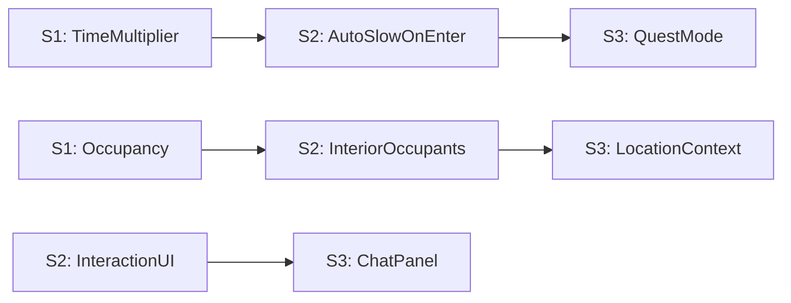

# The "Immersive Kingdom" Initiative — 3-Sprint Roadmap

## Strategic Context

The game currently plays as a fast-paced indirect-control RTS. This initiative adds a "Micro" layer: players can slow the world down, enter buildings, see who's inside, and talk to heroes via LLM. The right 1/3 panel becomes a "living window" into the kingdom's interior life.

**Design Pillars (unchanged):** Indirect control, readable incentives, emergent behavior. This initiative *extends* them — the player still can't order heroes around, but can now *visit* them and converse.

---

## Sprint 1: "Chronos" — Time Controls + Occupancy Foundation

**Goal:** Players can control simulation speed (5 tiers) and every building properly tracks its occupants.

**Version target:** v1.4.0

### 1A. Time Multiplier System (Agent 03 — TechDirector)

**Current state:** `SIM_TICK_HZ` decouples sim from render, but speed is compile-time only. The engine loop in [engine.py](game/engine.py) (lines 536-549) computes `dt` from either fixed tick or wall-clock. No `time_multiplier` exists.

**Changes:**

- Add `time_multiplier: float` to [game/sim/timebase.py](game/sim/timebase.py) (currently 40 lines) with getter/setter and clamping
- Modify [engine.py](game/engine.py) main loop (~line 1230) to apply `dt *= time_multiplier` before passing to `update()`
- Define 5 speed tiers in [config.py](config.py):
  - `PAUSE` = 0.0, `SUPER_SLOW` = 0.1, `SLOW` = 0.25, `NORMAL` = 0.5, `FAST` = 1.0 (current speed becomes `FAST`)
  - Default speed on game start: `NORMAL` (0.5x) — the game currently runs at what will become "Fast"
- Ensure all systems that use `dt` (pathfinding, combat cooldowns, economy ticks, spawner timers, bounty timeouts) work correctly at all multipliers — no teleporting, no broken cooldowns
- Camera/UI input must remain responsive at all speeds (camera uses wall-clock `dt`, not sim `dt`)

**Risk:** Systems that mix wall-clock and sim-clock could behave oddly at extreme slow speeds. Agent 04 (Determinism) should review.

### 1B. Speed Control UI (Agent 08 — UX/UI)

**Current state:** No speed controls exist. The bottom-right of the screen is empty.

**Changes:**

- Add a `SpeedControlBar` widget to [game/ui/](game/ui/) — 5 clickable buttons with visual indicators:
  - `||` (Pause), `>` (Super Slow), `>>` (Slow), `>>>` (Normal), `>>>>` (Fast)
- Position: bottom-right corner, above any existing UI
- Hotkeys: `1-5` or `Numpad 1-5` mapped to speed tiers (wire in [game/input_handler.py](game/input_handler.py))
- Active speed tier visually highlighted
- Current speed displayed as text label (e.g., "Normal" / "Paused")

### 1C. Universal Building Occupancy (Agent 05 — Gameplay)

**Current state:** Only `Inn` has explicit occupant tracking ([game/entities/buildings/economic.py](game/entities/buildings/economic.py) line 140: `heroes_resting`). Other buildings rely on scanning all heroes. The base `Building` class ([game/entities/buildings/base.py](game/entities/buildings/base.py)) has no occupancy tracking.

**Changes:**

- Add `occupants: list[Hero]` to `Building` base class with `on_hero_enter()` / `on_hero_exit()` hooks
- Migrate Inn's `heroes_resting` to use the base class `occupants` list
- Ensure all building types properly register/deregister heroes via the hooks
- Add `max_occupants` per building type in [config.py](config.py) (Inn=6, Guild=4, Marketplace=3, etc.)
- Emit events on occupancy change via EventBus (for UI and future interior rendering)
- Building panel ([game/ui/building_renderers/](game/ui/building_renderers/)) should show occupant list for ALL building types, not just Inn

### 1D. QA + Determinism (Agent 11 + Agent 04)

- New QA scenario: `speed_scaling` profile — run headless at each speed tier, verify no assertion failures
- Determinism guard: verify `time_multiplier` doesn't introduce wall-clock leaks into sim boundary
- Add speed-control unit tests (time multiplier applied correctly, clamped, persists across frames)

### Sprint 1 Agent Assignments

| Agent | Role    | Deliverable                                           |
| ----- | ------- | ----------------------------------------------------- |
| 03    | Primary | Time multiplier in timebase + engine loop integration |
| 08    | Primary | SpeedControlBar widget + hotkeys                      |
| 05    | Primary | Universal building occupancy on base class            |
| 04    | Consult | Determinism review of time multiplier                 |
| 11    | Primary | speed_scaling QA scenario                             |
| 10    | Consult | Perf check at extreme speed tiers                     |

---

## Sprint 2: "Living Interiors" — Enter Building + Interior Rendering

**Goal:** Clicking "Enter Building" transitions the right panel into a dynamic interior scene showing actual occupants.

**Version target:** v1.4.1

### 2A. Interior View Manager (Agent 03 — TechDirector)

**Current state:** The right panel ([game/ui/hud.py](game/ui/hud.py) lines 449-470) switches between `HeroPanel` and building summary. No "interior mode" exists.

**Changes:**

- Create `game/ui/interior_view_panel.py` — a new `InteriorViewPanel` component
- Implement a `MicroViewManager` that owns the right panel state machine:
  - `MENU` mode (current behavior — hero/building info)
  - `INTERIOR` mode (building interior view)
  - `QUEST` mode (future — remote exploration, Sprint 3)
- Transition trigger: "Enter Building" button in building panel
- Exit trigger: "Exit" button or ESC within interior, or clicking elsewhere on the map
- The manager should pause or auto-slow the game to `SLOW` (0.25x) when entering interior mode (configurable)

### 2B. Interior Scene Rendering (Agent 09 — ArtDirector)

**Current state:** No interior art exists. All building rendering is exterior only.

**Changes:**

- Define an "Interior Sprite Pipeline" per building type:
  - Each building type gets a background layer (static or 2-3 frame loop) sized to the right panel
  - NPC sprites (bartender, shopkeeper, blacksmith) are overlaid at fixed anchor points
  - Hero occupants are rendered using existing hero sprite assets at table/chair anchor points
- Start with 3 building types: **Inn**, **Marketplace**, **Warrior Guild**
  - Inn: counter, stools, candle flicker, bartender wiping counter
  - Marketplace: shelves, merchant, item displays
  - Warrior Guild: training dummies, weapon racks, sparring area
- Art must be layered sprites (background + interactable objects + occupant slots), NOT pre-rendered GIFs
- Interior backgrounds: ~400x600px at 2x pixel scale (fits right panel)
- Interactable elements need defined click regions (hitboxes)

### 2C. Interior Interaction System (Agent 08 — UX/UI)

**Changes:**

- Interior panel renders: background layer, NPC sprites, hero occupant sprites
- Clickable regions on interior elements:
  - Click NPC -> context menu (e.g., "Buy a Drink" on bartender, "Browse Wares" on merchant)
  - Click Hero -> context menu with "Speak with Hero" (wired in Sprint 3)
- Visual feedback: hover highlight on interactable elements
- Interior state reflects real-time sim: if a hero exits the building (called to combat), they disappear from the interior view
- If the building is attacked, visual shake/warning overlay

### 2D. "Enter Building" Action (Agent 05 — Gameplay)

**Changes:**

- Add "Enter Building" button to all building panel renderers
- Button only enabled when player has the building selected and it is built (not under construction)
- Entering a building does NOT affect simulation — it is purely a camera/UI state change
- Player can "enter" any owned building regardless of occupancy

### Sprint 2 Agent Assignments

| Agent | Role    | Deliverable                                                            |
| ----- | ------- | ---------------------------------------------------------------------- |
| 03    | Primary | MicroViewManager + InteriorViewPanel architecture                      |
| 09    | Primary | Interior backgrounds + NPC sprites for Inn, Marketplace, Warrior Guild |
| 08    | Primary | Interior interaction UI (click regions, context menus, hover states)   |
| 05    | Primary | "Enter Building" action + building panel integration                   |
| 11    | Primary | Interior view QA scenario (enter/exit, occupant sync)                  |
| 14    | Consult | Interior ambient audio (crackling fire, tavern murmur)                 |

---

## Sprint 3: "Persona & Presence" — LLM Chat + Remote Exploration

**Goal:** Players can chat with heroes inside buildings via LLM, and the panel supports remote quest views.

**Version target:** v1.4.2

### 3A. LLM Location Context (Agent 06 — AIBehavior)

**Current state:** [ai/context_builder.py](ai/context_builder.py) builds rich context but includes zero building/location info. Hero `is_inside_building` and `inside_building` are not passed to the LLM.

**Changes:**

- Extend `build_hero_context()` to include:
  - `current_location`: building name/type or "outdoors"
  - `building_occupants`: list of other heroes in the same building
  - `building_context`: type-specific flavor (Inn -> "resting at the bar", Guild -> "training")
  - `player_is_present`: boolean — true when the player has "entered" the building (changes tone to conversational)
- When `player_is_present` is true, the LLM system prompt shifts from "decide your next action" to "the Sovereign is speaking with you directly — respond in character"

### 3B. Chat Interface (Agent 08 — UX/UI)

**Changes:**

- Add a `ChatPanel` component that overlays within the interior view panel
- Triggered by clicking "Speak with Hero" on a hero in the interior
- Parchment/scroll-styled chat window with:
  - Hero portrait + name at top
  - Scrollable message history
  - Text input field at bottom
  - "End Conversation" button
- Messages sent to the LLM via existing provider infrastructure
- Hero responses stream in (if provider supports streaming) or appear after a brief "thinking" delay
- Chat history persists for the duration of the building visit (cleared on exit)

### 3C. Conversational LLM Mode (Agent 06 — AIBehavior)

**Changes:**

- New LLM prompt mode: `CONVERSATION` (vs existing `DECISION`)
  - `DECISION` mode: hero evaluates options, returns an action (existing behavior)
  - `CONVERSATION` mode: hero responds to player dialogue in character
- Conversation prompt includes:
  - Hero personality, class, level, recent adventures (last 3-5 decisions)
  - Current location context
  - Conversation history (last N messages)
  - System instruction: "You are {hero_name}, a {class} of level {level}. Speak in character. You are loyal to the Sovereign but have your own personality. Keep responses to 2-3 sentences."
- Rate limiting: max 1 LLM call per 2 seconds during conversation (reuse `LLM_DECISION_COOLDOWN`)

### 3D. Remote Exploration Panel — Foundation (Agent 03 + Agent 07)

**Changes:**

- Extend `MicroViewManager` with `QUEST` mode
- When a hero is sent on a remote quest (future content), the panel shows:
  - Travelogue-style scene (background + hero sprite + narrative text)
  - "Away Team" status on the main map (hero portrait grayed out, "Questing" label)
- Sprint 3 delivers the **architecture only** — the quest content (dungeons, faraway lands) is a future sprint
- Agent 07 (Content) specs 2-3 quest archetypes for the system to support

### 3E. "Living Interior" Polish (Agent 09 + Agent 14)

- Interior ambient audio: Inn gets tavern murmur + fire crackle, Guild gets sparring SFX
- Building-under-attack feedback: screen shake in interior, warning banner, heroes react
- Additional interior backgrounds: Blacksmith, Temple (if time permits)

### Sprint 3 Agent Assignments

| Agent | Role    | Deliverable                                         |
| ----- | ------- | --------------------------------------------------- |
| 06    | Primary | Location context in LLM prompts + CONVERSATION mode |
| 08    | Primary | ChatPanel UI + conversation UX                      |
| 03    | Primary | QUEST mode in MicroViewManager (architecture)       |
| 07    | Primary | Quest archetype specs for remote exploration        |
| 09    | Primary | Additional interior art + polish                    |
| 14    | Primary | Interior ambient audio                              |
| 11    | Primary | Chat integration QA + full regression               |

---

## Cross-Sprint Risks

| Risk                                                                  | Mitigation                                                                                                 |
| --------------------------------------------------------------------- | ---------------------------------------------------------------------------------------------------------- |
| Speed scaling breaks combat/economy timing                            | Agent 04 determinism review in Sprint 1; QA scenario at all tiers                                          |
| Interior art production bottleneck                                    | Start with 3 buildings; use layered sprites, not full scenes                                               |
| LLM latency makes chat feel sluggish                                  | Stream responses; show "thinking" animation; rate-limit gracefully                                         |
| "Macro/Micro disconnect" — player forgets about map while in interior | Interior auto-exits or flashes warning when building is attacked; auto-slow (not pause) keeps world moving |
| Scope creep on remote exploration                                     | Sprint 3 delivers architecture only; content is a future sprint                                            |

## Dependencies Between Sprints

Each sprint produces a shippable build. Sprint 1 alone makes the game feel more relaxed and exploratory. Sprint 2 adds the visual "wow" of entering buildings. Sprint 3 delivers the killer feature — talking to your heroes.