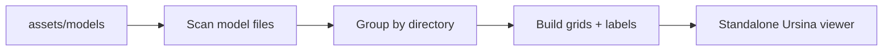

# Kenney Model Viewer

Build a repo-native Ursina model browser that runs independently from the game, scans `assets/models` for `.glb`, `.gltf`, and `.obj` files, and groups them by their parent folders to cleanly display Kenney.nl assets in a navigable grid. The viewer should reuse the repo’s lightweight CLI style (`argparse` + `main()` like [tools/validate_assets.py](tools/validate_assets.py) and [tools/build_gallery.py](tools/build_gallery.py)) but avoid `GameEngine` entirely. Contains clean lighting suited for the Kenney art style.



## Scope
- Script: `tools/model_viewer_kenney.py`
- Launch independently with `python tools/model_viewer_kenney.py` from repo root.
- Use a simple Ursina scene with a ground grid, EditorCamera controls (Right-Drag orbit, Middle-Drag pan, Scroll zoom), properly tuned soft lighting (Ambient + Sun), and readable labels.
- Uniquely filter for ONLY `.glb` and `.gltf` files to prevent duplicate packs from Kenney's redundant formats (`.obj`, `.fbx`, `.dae`), which natively prevents missing-texture silhouettes.
- Group files naturally by their primary folder categorization and lay them out in bounding boxes.
- Fit each model to a consistent preview scale.
- Add a short run hint in [README.md](README.md) next to the existing `tools/` commands.

## WK32 Additions: Focused Prefab Review And Auto Capture

The viewer now also supports focused prefab review for material/polish work:

```powershell
python tools/model_viewer_kenney.py --focus-prefab inn_v2 --debug-materials --auto-exit-sec 3 --screenshot-subdir wk32_inn_texture/tool_viewer --screenshot-stem after_inn_pieces
```

Behavior:

- `--focus-prefab <prefab_id>` loads the unique model pieces referenced by `assets/prefabs/buildings/<prefab_id>.json`.
- If a piece has `texture_override`, the viewer applies the same override logic used by the game and assembler.
- `--debug-materials` still prints per-geom texture/factor/vertex classification.
- `--auto-exit-sec`, `--screenshot-subdir`, and `--screenshot-stem` save a deterministic screenshot through `tools/ursina_capture.py` and quit.

This focused mode is required for texture override work because a full pack grid makes it hard to inspect one prefab's material state. The Inn v2 pass used it to confirm that roof, wood, and stone overrides were visible and that old Fantasy Town atlas colors were no longer bleeding through.

## Implementation Notes
- Do not import `GameEngine`; this should be a sandbox viewer, not the live simulation.
- Borrow the feel of the existing Ursina controls from [game/graphics/ursina_app.py](game/graphics/ursina_app.py) only where helpful, but keep the viewer self-contained.
- Draw each group as a bordered rectangle on the floor, with the group name centered below the border and each model name directly under its model.
- Keep the design clean, with simple directional and ambient light to highlight the default Kenney look.
- When applying prefab texture overrides, use `game/graphics/prefab_texture_overrides.py` rather than duplicating shader/texture logic in the viewer. Viewer, assembler, and runtime must stay visually equivalent.
- In auto-capture mode, prefer a fixed camera pose instead of `EditorCamera` state so screenshots are not blank or pointed away from the grid.

## Validation
- Tool starts from repo root without touching the game loop.
- Models render with their proper low-poly shading.
- WASD and zoom can traverse beyond a single screenful of models.
- No regression to `python tools/qa_smoke.py --quick`.
- `python tools/model_viewer_kenney.py --focus-prefab inn_v2 --debug-materials --auto-exit-sec 3 --screenshot-subdir wk32_inn_texture/tool_viewer --screenshot-stem smoke_prefab_focus` produces a PNG that shows the prefab pieces and applies any `texture_override` fields.

## Related Texture Override Standard

For the full procedure on replacing weak Kenney material reads with generated/acquired textures, read [prefab_texture_override_standard.md](./prefab_texture_override_standard.md). The model viewer is the first inspection gate in that workflow, before assembler and in-game screenshots.

todos:
- id: viewer-cli
  content: Add the standalone Ursina viewer entrypoint and filesystem scan/grouping logic.
- id: viewer-layout
  content: Build the grid, border, and text labeling system with camera controls.
- id: viewer-docs
  content: Add a short README launch note and manual verification checklist.