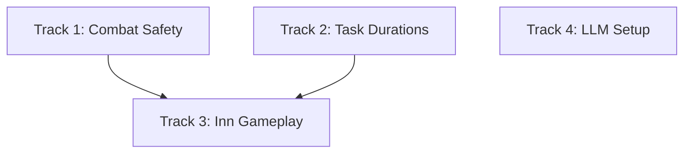

# WK11: Building Interiors Groundwork + LLM Setup

## Context

This is the first feature sprint after three refactoring sprints (WK8-10). The codebase is now modular and tested. This sprint lays groundwork for future "enter and interact with buildings" gameplay by fixing current issues and adding missing behavior.

**Current problems:**

- Heroes in `SHOPPING` state inside buildings can still be targeted and attacked by enemies (only `RESTING` state is excluded from targeting in [game/entities/enemy.py](game/entities/enemy.py) line 125)
- Shopping takes 0.5 seconds — heroes pop in and out instantly, with no sense of actually being inside
- The Inn building ([game/entities/buildings/economic.py](game/entities/buildings/economic.py)) exists but has zero gameplay behavior — heroes never visit it
- LLM provider is hardcoded to `gpt-3.5-turbo` in [ai/providers/openai_provider.py](ai/providers/openai_provider.py) with no way to configure the model

## Sprint Structure: Four Tracks




### Track 1: Heroes Inside Buildings Are Untargetable

**Owner**: Agent 05 (Gameplay)
**Consult**: Agent 03 (combat system)

**Two bugs**:

1. **Direct targeting gap**: In [game/entities/enemy.py](game/entities/enemy.py) `find_target()` (line 125), enemies skip heroes where `hero.state.name == "RESTING"` but NOT heroes where `is_inside_building == True`. So a hero buying potions (state = `SHOPPING`, `is_inside_building = True`) can be directly targeted and attacked.
2. **Resting heroes are attacked directly**: Despite the `state.name != "RESTING"` check at line 125, monsters still walk to the building and attack the resting hero. The `find_target()` exclusion is not sufficient — the enemy's `update()` method or attack logic has a secondary path (proximity check, re-targeting, or direct damage) that bypasses the targeting filter and hits the hero at the building center position.

**The fix** (comprehensive, three parts):

```python
# Fix 1: In enemy.py find_target() hero loop (line 125), change:
if hero.is_alive and hero.state.name != "RESTING":
# To:
if hero.is_alive and not hero.is_inside_building:

# Fix 2: Remove the "prefer buildings with resting heroes" priority (lines 148-154).
# Enemies should not preferentially target buildings because a hero is inside.

# Fix 3 (CRITICAL): Audit enemy.py update() and all attack/damage code paths
# to find where damage is actually dealt to heroes. Add an is_inside_building
# guard so no damage can be applied to a hero who is inside a building.
# The targeting fix alone is not enough — there is a secondary path allowing
# enemies to hit resting heroes that must be found and gated.
```

Fix 1 covers all inside-building states (resting, shopping, drinking, any future states). Fix 2 removes the building-priority incentive. Fix 3 is the most important — Agent 05 must trace the full attack path in `enemy.update()` to find where damage reaches heroes and block it when `is_inside_building` is true.

**Also check**: Any other place in the codebase that targets heroes and might need the same fix. Search for `state.name != "RESTING"` or `state.name == "RESTING"` patterns throughout enemy.py and combat.py.

### Track 2: Realistic Building Task Durations

**Owner**: Agent 05 (hero-side timing) + Agent 06 (AI-side duration table)
**Consult**: Agent 03 (determinism)

**Current state**: `enter_building_briefly()` in [game/entities/hero.py](game/entities/hero.py) takes `duration_sec` defaulting to 0.6 seconds. Shopping logic in [ai/behaviors/shopping.py](ai/behaviors/shopping.py) calls `do_shopping()` immediately on entry — the timer is purely visual.

**Changes needed**:

#### Step 1: Task duration table (Agent 06, in `ai/behaviors/shopping.py` or new `ai/behaviors/task_durations.py`)

Define per-task duration ranges (in seconds) using the sim RNG for determinism:


| Task                   | Min (s)               | Max (s) | Rationale                    |
| ---------------------- | --------------------- | ------- | ---------------------------- |
| Buy health potion      | 8                     | 12      | Quick purchase, stash in bag |
| Buy weapon             | 12                    | 18      | Try a few, pick one          |
| Buy armor              | 16                    | 22      | Fitting and adjusting        |
| Research (marketplace) | 10                    | 15      | Browse the catalog           |
| Rest at guild          | (HP-based, unchanged) |         | Already works                |
| Rest at inn            | 10                    | 20      | Sit down, recover            |
| Get a drink at inn     | 8                     | 15      | Social/flavor activity       |


Duration is rolled from `get_rng("ai_basic")` using `rng.randint(min_s, max_s)` at the moment the hero enters the building.

#### Step 2: Defer `do_shopping()` until timer expires (Agent 06)

Currently `do_shopping()` runs immediately on building entry. Change the flow:

1. Hero reaches building -> calls `hero.enter_building_briefly(building, duration_sec=rolled_duration)`
2. Hero stays inside for the full duration (existing `inside_timer` handles this)
3. When `inside_timer` expires and hero pops out, THEN `do_shopping()` runs (purchase happens on exit)
4. This means gold deduction and item receipt happen when the hero leaves, not when they enter

This creates a natural feel: hero walks in, spends time, walks out with items.

#### Step 3: Update hero.py timing (Agent 05)

- `enter_building_briefly()` already supports variable `duration_sec` — no structural change needed
- Ensure `pop_out_of_building()` triggers a callback or sets a flag that the AI can check to finalize the purchase
- Add `pending_task: str | None` and `pending_task_building: Building | None` fields to Hero so the AI knows what to finalize on exit

### Track 3: Inn Gameplay

**Owner**: Agent 06 (AI routing) + Agent 05 (Inn entity behavior)
**Consult**: Agent 08 (UI panel)

**Current state**: Inn exists in [game/entities/buildings/economic.py](game/entities/buildings/economic.py) with `rest_recovery_rate = 0.02` and `heroes_resting = []` but neither is used. Heroes never visit Inns.

#### Step 1: Inn rest behavior (Agent 05)

- Allow heroes to rest at Inns, not just their home guild
- Inn healing uses `rest_recovery_rate` (0.02 = 1 HP per second, vs guild rate of 1 HP per 2 seconds)
- Hero enters Inn via `enter_building_briefly()` with rest duration from the task table (10-20 seconds)
- Healing happens while inside (at Inn rate), not after exiting
- `Inn.heroes_resting` list tracks who's inside

#### Step 2: AI routes heroes to Inns for rest (Agent 06)

In `ai/behaviors/shopping.py` or a new inn-related section, add logic:

- When `should_go_home_to_rest()` is true AND an Inn is closer than the home guild, hero goes to the Inn instead
- Hero enters Inn, heals at the faster rate, exits when timer expires or fully healed
- This is an alternative to going home, not a replacement — heroes still go to their guild if no Inn exists

#### Step 3: "Get a drink" behavior (Agent 06)

Add a new occasional behavior in `ai/behaviors/shopping.py` or `ai/behaviors/journey.py`:

- Triggers randomly when: hero is IDLE, full health, has 10+ gold to spare, an Inn exists on the map
- Probability: ~10-15% chance per idle decision cycle (tunable)
- Hero walks to Inn, enters for 8-15 seconds ("having a drink"), pays a small gold cost (5-10 gold)
- This is flavor behavior — it makes the world feel alive
- Use `get_rng("ai_basic")` for the random chance check (deterministic)

#### Step 4: Inn UI (Agent 08)

- Update the Inn panel renderer ([game/ui/building_renderers/economic_panel.py](game/ui/building_renderers/economic_panel.py)) to show:
  - Heroes currently inside (resting or drinking)
  - Recovery rate info
  - Gold earned from drinks

### Track 4: LLM API Setup (GPT-5 Nano)

**Owner**: Agent 03 (config + provider)
**Consult**: Agent 06 (AI integration)

#### Step 1: Make model configurable

- Add `OPENAI_MODEL` to [config.py](config.py) `LLMConfig` dataclass: `openai_model: str` loaded from `os.getenv("OPENAI_MODEL", "gpt-5-nano")`
- Add backward-compat alias: `OPENAI_MODEL = LLM.openai_model`
- Update [ai/providers/openai_provider.py](ai/providers/openai_provider.py) to read model from config instead of hardcoding `gpt-3.5-turbo`

#### Step 2: Create .env file

```
LLM_PROVIDER=openai
OPENAI_API_KEY=sk-your-key-here
OPENAI_MODEL=gpt-5-nano
```

- Add `.env` to `.gitignore` if not already there
- Create `.env.example` with placeholder values for documentation

#### Step 3: Fix default provider mismatch

- Currently `config.py` defaults to `"openai"` but `main.py` CLI defaults to `"mock"`
- Keep CLI default as `"mock"` (safe default) but document that `--provider openai` uses the .env key
- Ensure `python main.py --provider openai` works out of the box with the .env file

## Agent Assignment Summary


| Agent             | Role        | Track                                                                           | Priority |
| ----------------- | ----------- | ------------------------------------------------------------------------------- | -------- |
| 05 (Gameplay)     | Implementer | Track 1 (combat safety) + Track 2 (hero timing) + Track 3 (Inn entity)          | P0       |
| 06 (AI Behavior)  | Implementer | Track 2 (duration table + deferred shopping) + Track 3 (Inn AI + "get a drink") | P0       |
| 03 (TechDirector) | Implementer | Track 4 (LLM config + provider update)                                          | P0       |
| 08 (UX/UI)        | Implementer | Track 3 (Inn panel UI)                                                          | P1       |
| 04 (Determinism)  | Reviewer    | Verify duration rolls use seeded RNG                                            | P1       |
| 11 (QA)           | Verifier    | Full gates + manual smoke + Inn/combat verification                             | P0       |


**Silent**: Agents 02, 07, 09, 10, 12, 13, 14

## Integration Order

1. **Track 1** (combat safety) and **Track 4** (LLM setup) — independent, can land first
2. **Track 2** (task durations) — foundation for Track 3
3. **Track 3** (Inn gameplay) — depends on Track 2 duration system
4. **Verification** — after all tracks

## Success Criteria

- Heroes inside ANY building (shopping, resting, drinking) cannot be targeted by enemies
- Shopping durations match the task table (8-22 seconds depending on task, randomized)
- Purchases happen on building exit, not entry
- Heroes rest at Inns when closer than home guild; Inn heals faster (1 HP/s vs 1 HP/2s)
- Heroes occasionally "get a drink" at the Inn when idle + full health + gold available
- `python main.py --provider openai` connects to GPT-5 Nano with .env API key
- `python tools/qa_smoke.py --quick` PASS
- `pytest tests/` PASS
- Manual: heroes visibly spend 8-22 seconds in buildings; enemies ignore heroes inside buildings

