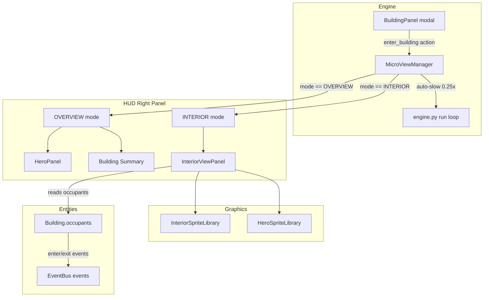
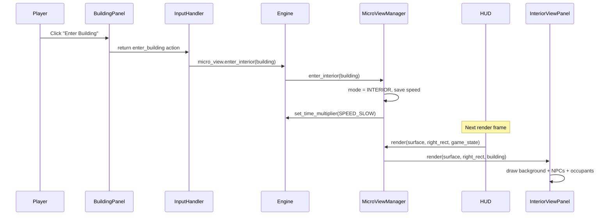

# wk13: Sprint 2 "Living Interiors" -- Enter Building + Interior Rendering

**Parent roadmap:** [immersive_kingdom_initiative](immersive_kingdom_initiative_1292aeb9.plan.md)
**Depends on:** Sprint 1 "Chronos" (v1.3.5, shipped)
**Version target:** v1.4.0
**Goal:** Clicking "Enter Building" transitions the right panel into a visual interior scene with occupants, NPCs, and clickable regions.

---

## 2A. MicroViewManager + Interior Panel Architecture (Agent 03 -- TechDirector)

### Current State

- [game/ui/hud.py](game/ui/hud.py) lines 466-490: right panel switches directly between `_hero_panel.render()`, `_render_building_summary()`, and placeholder text. No state machine.
- [game/engine.py](game/engine.py) line 173: `BuildingPanel` is a separate modal at top-left (300x400px). Right panel is managed entirely inside HUD.
- Right panel rect (line 179): `320-420px` wide, fills between top bar (48px) and bottom bar (80px).
- No interior view state exists anywhere in the codebase.

### Changes

**New file: `game/ui/micro_view_manager.py`** -- Right-panel state machine

- `ViewMode` enum: `OVERVIEW`, `INTERIOR` (future: `QUEST` in Sprint 3)
- `MicroViewManager` class:
  - `mode: ViewMode = OVERVIEW`
  - `interior_building: Building | None = None`
  - `_previous_speed: float | None = None` (for auto-slow restore)
  - `enter_interior(building)`: set mode to INTERIOR, store building, auto-slow to `SPEED_SLOW` (0.25x), save previous speed
  - `exit_interior()`: restore previous speed, set mode to OVERVIEW, clear building
  - `render(surface, right_rect, game_state, interior_panel)`: delegate to current mode
  - `handle_click(mouse_pos, right_rect) -> str | None`: forward clicks to interior panel when in INTERIOR mode

**File: `game/ui/hud.py`** -- Delegate right panel to MicroViewManager

- In `__init__`: create `self._micro_view = MicroViewManager()`
- Replace lines 466-490 (the direct hero/building/empty switching) with `self._micro_view.render(surface, right, game_state, self._hero_panel)`
- In OVERVIEW mode: existing behavior (hero panel / building summary / empty)
- In INTERIOR mode: render the `InteriorViewPanel` (created by Agent 08)
- Forward right-panel clicks to `_micro_view.handle_click()` in `handle_click()`

**File: `game/engine.py`** -- Handle interior actions

- Add `self.micro_view` reference (accessible from input_handler)
- Handle `"enter_building"` action from BuildingPanel: call `micro_view.enter_interior(building)`
- Handle `"exit_interior"` action: call `micro_view.exit_interior()`
- Pass `micro_view` state into `get_game_state()` so HUD can read current mode

**File: `game/input_handler.py`** -- Interior exit triggers

- ESC while in INTERIOR mode: call `engine.micro_view.exit_interior()` (before opening pause menu)
- Left-click on the world map while in INTERIOR mode: exit interior first, then handle normal selection
- These are early-exit checks added before existing handler logic

### Key constraint

- Interior mode is purely a UI/camera state change -- it does NOT affect simulation. Heroes continue their AI loop, combat continues, economy ticks. The player is just "looking inside" the building.
- Auto-slow uses `set_time_multiplier(SPEED_SLOW)` on enter, restores on exit. If player manually changes speed while inside, that overrides the auto-slow.

### Acceptance criteria

- `MicroViewManager` correctly transitions between OVERVIEW and INTERIOR
- ESC, map click, and "Exit" button all return to OVERVIEW
- Auto-slow to 0.25x on enter, restore on exit
- No crash when building is destroyed while in INTERIOR mode (graceful exit)
- Existing right panel behavior unchanged when not in interior

---

## 2B. Interior Scene Rendering (Agent 09 -- ArtDirector)

### Current State

- No interior art or sprites exist.
- [game/graphics/hero_sprites.py](game/graphics/hero_sprites.py) lines 203-212: `inside` action generates a 6-frame bubble icon (white circle + gold dot). This is used as an overlay when heroes are inside buildings on the main map -- it is NOT suitable for interior view rendering.
- Existing hero idle/walk sprites at 32x32 can be reused at 2x scale (64x64) for interior occupant rendering.
- [game/graphics/building_sprites.py](game/graphics/building_sprites.py): procedural building exterior generation. Same pattern can be extended for interiors.

### Changes

**New file: `game/graphics/interior_sprites.py`** -- Interior background + furniture + NPC generation

Each interior type defines:

- **Background**: a filled surface sized to fit the right panel (~380x600px), with floor, walls, and ceiling using the building's color palette
- **Furniture anchors**: named positions where furniture elements are drawn (counter, shelves, tables, chairs, etc.)
- **NPC anchor**: position + sprite for the building's NPC (bartender, merchant, blacksmith)
- **Hero slots**: up to `max_occupants` positions where hero sprites are rendered (at tables, standing at counter, etc.)

Start with 3 building types (matching initiative plan):

**Inn interior:**

- Wood-plank floor, stone wall background, warm palette (browns, amber)
- Furniture: bar counter (top), 2-3 tables with stools (middle), fireplace glow (bottom-left)
- NPC: bartender behind counter (procedural, 32x32, apron accent)
- Hero slots: at stools (2), at tables (4) -- matches `max_occupants=6`

**Marketplace interior:**

- Stone floor, shelving walls, cool palette (grays, greens)
- Furniture: display shelves (sides), central counter, potion bottles on shelves
- NPC: merchant behind counter (procedural, 32x32, coin-bag accent)
- Hero slots: browsing shelves (2), at counter (1) -- matches `max_occupants=3`

**Warrior Guild interior:**

- Dirt/wood floor, weapon racks on walls, blue-steel palette
- Furniture: training dummies (2), weapon rack (right wall), sparring ring outline (center)
- NPC: guildmaster near weapon rack (procedural, 32x32, blue cloak)
- Hero slots: at dummies (2), sparring ring (2) -- matches `max_occupants=4`

**Fallback interior (all other enterable buildings):**

- Generic stone-floor room with a table and 2-4 hero slots
- No NPC sprite
- Used for ranger/rogue/wizard guilds, temples, blacksmith until dedicated art is added

**Interface:**

```python
class InteriorSpriteLibrary:
    def get_background(building_type: str, width: int, height: int) -> pygame.Surface
    def get_npc_sprite(building_type: str) -> pygame.Surface | None
    def get_furniture_layout(building_type: str) -> list[FurnitureAnchor]
    def get_hero_slots(building_type: str) -> list[HeroSlot]
```

**All surfaces cached** -- generated once per (building_type, panel_size) pair. Deterministic (seeded from building type string via `zlib.crc32`).

**Hero occupant rendering:** Use existing `HeroSpriteLibrary` idle frames at 2x scale (64x64), tinted by class color. Rendered at the hero slot positions defined per interior type.

### Acceptance criteria

- Inn, Marketplace, Warrior Guild have distinct readable interiors
- All other enterable buildings use the fallback interior
- No per-frame surface allocations (all cached)
- Deterministic rendering (no `random.random()` or `time.time()`)
- NPCs visually readable at panel size

---

## 2C. Interior Interaction UI (Agent 08 -- UX/UI)

### Current State

- [game/ui/widgets.py](game/ui/widgets.py): `Button`, `Panel`, `NineSlice`, `TextLabel`, `Tooltip` all available
- [game/ui/theme.py](game/ui/theme.py): consistent colors, fonts, spacing
- No interior panel component exists

### Changes

**New file: `game/ui/interior_view_panel.py`** -- Interior panel UI component

Renders inside the right panel rect when MicroViewManager is in INTERIOR mode:

- **Layer 1 -- Background**: calls `InteriorSpriteLibrary.get_background()` for the building type
- **Layer 2 -- Furniture**: renders furniture elements at anchor positions (static, from sprite library)
- **Layer 3 -- NPC**: renders NPC sprite at designated anchor (static or 2-frame idle loop)
- **Layer 4 -- Hero occupants**: renders hero idle sprites at slot positions, updated in real-time from `building.occupants`
- **Layer 5 -- UI overlay**: building name header, "Exit" button (top-right), hero name labels on hover

**Clickable regions:**

- Hover over a hero occupant: highlight border + name tooltip
- Click hero: show context tooltip with "Speak with Hero" (grayed out, labeled "Coming Soon" -- wired in Sprint 3)
- Click NPC: show context tooltip with building-specific action (e.g., "Buy a Drink" for Inn bartender) -- grayed out stub for now

**"Exit" button:**

- Top-right of interior panel, uses existing `Button` widget with 9-slice texture
- Returns `"exit_interior"` action to engine via MicroViewManager click handler

**Real-time sync:**

- Each frame, read `building.occupants` to update which hero slots are filled
- If building is destroyed (`building.hp <= 0`): auto-exit interior with a HUD message ("Building destroyed!")
- If a hero enters/exits during interior view: sprite appears/disappears at next render

**File: `game/ui/hud.py`** -- Wire InteriorViewPanel into MicroViewManager render path

- Create `self._interior_panel = InteriorViewPanel(theme)` in HUD init
- Pass to `_micro_view.render()` when in INTERIOR mode
- Forward click events through

### Acceptance criteria

- Interior panel fills right panel rect with layered rendering
- Hero occupants appear/disappear in real-time as they enter/exit
- "Exit" button works and returns to OVERVIEW mode
- Hover highlights on heroes and NPCs
- Click stubs for "Speak with Hero" and NPC actions (grayed out)
- No visual regression on existing right panel in OVERVIEW mode
- Renders correctly at 1920x1080 and 1280x720

---

## 2D. "Enter Building" Action (Agent 05 -- Gameplay)

### Current State

- [game/ui/building_panel.py](game/ui/building_panel.py): modal panel at top-left showing building details. Has demolish, research, upgrade buttons already. No "Enter Building" button.
- [game/ui/building_renderers/**init**.py](game/ui/building_renderers/__init__.py) line 14: `render_occupants()` helper renders "Heroes inside: N/max" for enterable buildings.
- [config.py](config.py) line 331: `BUILDING_MAX_OCCUPANTS` dict defines which buildings are enterable (max > 0).

### Changes

**File: `game/ui/building_panel.py`** -- Add "Enter Building" button

- Add `self.enter_building_button_rect: pygame.Rect | None = None` and hover state
- In the panel render method, after the existing buttons (demolish, research, etc.):
  - If `building.max_occupants > 0` and building is fully constructed (`not building.under_construction`):
    - Render an "Enter Building" button (green/accent color, uses 9-slice button texture)
    - Position: below demolish button, or at bottom of panel
- In `handle_click()`: if enter_building_button_rect is clicked, return `{"type": "enter_building", "building": building}`

**File: `game/input_handler.py`** -- Handle the enter_building action

- In the BuildingPanel click handler section (~line 261-280): add branch for `"enter_building"` action
- Call `engine.micro_view.enter_interior(action["building"])`
- Optionally close the BuildingPanel modal (less clutter while in interior)

**No simulation changes needed.** Entering a building is purely a UI state transition. The hero occupancy system (Sprint 1) already tracks who is inside.

### Acceptance criteria

- "Enter Building" button visible on all buildings with `max_occupants > 0`
- Button disabled/hidden for under-construction buildings and castle
- Clicking transitions right panel to interior view
- BuildingPanel modal closes on enter (reduces clutter)
- Button not present for defensive buildings (guardhouse, ballista, wizard tower)

---

## 2E. QA + Determinism + Perf (Agent 11 + Agent 04 + Agent 10)

### Agent 11 (QA) -- Primary

**New headless scenario: `interior_view`**

- Add to [tools/qa_smoke.py](tools/qa_smoke.py): profile that verifies interior enter/exit doesn't crash headless mode
- Since interior is UI-only, headless won't render it, but verify:
  - `enter_interior()` / `exit_interior()` don't raise exceptions in headless
  - Building destruction during interior mode triggers graceful exit
  - Occupancy assertions still pass (Sprint 1 assertions)

**Regression:**

- All existing profiles must PASS (base, intent_bounty, hero_stuck_repro, no-enemies, mock-LLM, speed_scaling)
- Manual smoke: enter each of the 3 featured interiors, verify occupants appear/disappear, exit via all 3 methods (button, ESC, map click)

### Agent 04 (Determinism) -- Consult

- Review: `InteriorSpriteLibrary` uses `zlib.crc32` for seeding, no wall-clock
- Review: `MicroViewManager` state is UI-only, not in sim boundary
- `python tools/determinism_guard.py` must PASS

### Agent 10 (Performance) -- Consult

- Verify interior backgrounds are cached (generated once, not per-frame)
- Verify hero occupant rendering doesn't create new surfaces per frame (reuse sprite library cache)
- `python tools/perf_benchmark.py` baseline unchanged

---

## Architecture Overview




---

## Data Flow: Enter Building




---

## Agent Assignments Summary

- **Agent 03** (Primary): 2A -- MicroViewManager, engine integration, input handler interior exits
- **Agent 09** (Primary): 2B -- InteriorSpriteLibrary (Inn, Marketplace, Warrior Guild + fallback)
- **Agent 08** (Primary): 2C -- InteriorViewPanel widget, HUD wiring, click regions, hover states
- **Agent 05** (Primary): 2D -- "Enter Building" button in BuildingPanel
- **Agent 04** (Consult): 2E -- determinism review of interior sprites and MicroViewManager
- **Agent 11** (Primary): 2E -- interior_view QA scenario, regression
- **Agent 10** (Consult): 2E -- perf review of interior rendering

## Integration Order

1. **Agent 03 first** -- MicroViewManager must exist before anyone can wire into it
2. **Agent 09 in parallel with 03** -- interior sprites are independent of UI wiring
3. **Agent 05 after 03** -- "Enter Building" button needs MicroViewManager API
4. **Agent 08 after 03 + 09** -- InteriorViewPanel needs both the state machine and the sprite library
5. **Agent 11 after all** -- QA scenarios need all features landed
6. **Agent 04 + 10 consult** -- review after all code lands

## Universal Activation Prompt (for Jaimie to send)

```
You are being activated for the wk13 "Living Interiors" sprint (Sprint 2 of the Immersive Kingdom Initiative).

Read your assignment in the sprint plan:
.cursor/plans/wk13_living_interiors_sprint_[hash].plan.md

Your section is labeled by agent number (2A=Agent 03, 2B=Agent 09, 2C=Agent 08, 2D=Agent 05, 2E=Agents 11/04/10).

After completing your work:
1. Update your agent log
2. Run: python tools/qa_smoke.py --quick (must PASS)
3. Report status back

Send to: Agents 03, 09, 05, 08, 11 (primary). Agents 04, 10 (consult only).
```

