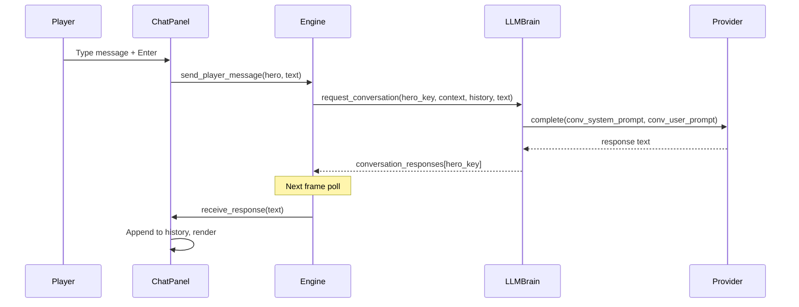
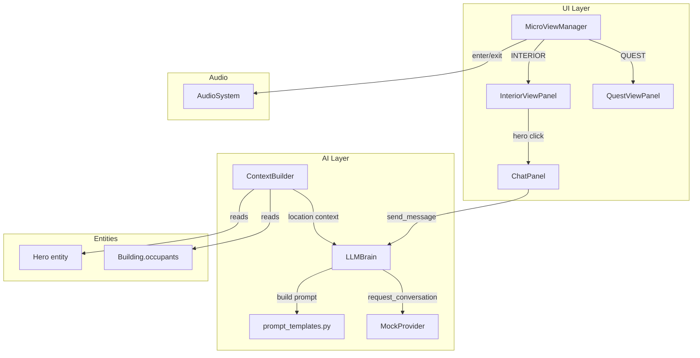

# wk14: Sprint 3 "Persona and Presence" -- LLM Chat + Remote Exploration Foundation

**Parent roadmap:** [immersive_kingdom_initiative](immersive_kingdom_initiative_1292aeb9.plan.md)
**Depends on:** Sprint 2 "Living Interiors" (v1.3.6, shipped)
**Version target:** v1.4.0
**Goal:** Players can chat with heroes inside buildings via LLM, the quest panel architecture exists for future content, and interiors are polished with audio and additional buildings.

---

## 3A. LLM Location Context (Agent 06 -- AIBehavior)

### Current State

- [ai/context_builder.py](ai/context_builder.py): `ContextBuilder.build_hero_context()` (line 70) builds rich context for LLM decisions -- hero stats, inventory, personality, enemies, bounties, shop items.
- Zero building/location information is passed. Hero fields `is_inside_building` and `inside_building` exist on the entity (hero.py line 127-128) but are never read by the context builder.
- [ai/prompt_templates.py](ai/prompt_templates.py): `SYSTEM_PROMPT` (line 13) and `DECISION_PROMPT` (line 52) are decision-only; no location awareness or conversational mode.

### Changes

**File: `ai/context_builder.py`** -- Add location context to `build_hero_context()`

After the existing hero stats block, add:

- `current_location`: `building.building_type.replace("_", " ").title()` if `hero.is_inside_building` and `hero.inside_building`, else `"outdoors"`
- `building_occupants`: list of other hero names inside the same building (from `hero.inside_building.occupants`, excluding self)
- `building_context`: type-specific flavor string -- map from building type:
  - `inn` -> "resting at the bar"
  - `marketplace` -> "browsing wares"
  - `warrior_guild` -> "training in the guild"
  - `blacksmith` -> "watching the smith work"
  - default -> "inside a building"
- `player_is_present`: boolean, read from `game_state.get("micro_view_building") is hero.inside_building` (True when the player has "entered" the same building)

**File: `ai/context_builder.py`** -- Update `build_summary()` to include location

- After the hero stats line, add: `"Location: {location} ({building_context}). Fellow occupants: {names}."` (only when inside a building)

### Acceptance criteria

- `build_hero_context()` includes `current_location`, `building_occupants`, `building_context`, `player_is_present` fields
- `build_summary()` reflects location in the human-readable context string
- No changes to simulation logic; context builder is read-only
- `qa_smoke --quick` PASS

---

## 3B. Chat Interface (Agent 08 -- UX/UI)

### Current State

- [game/ui/interior_view_panel.py](game/ui/interior_view_panel.py) line 219: "Speak with Hero" is a stub that returns None on hero click.
- Available widgets: `Button`, `Panel`, `NineSlice`, `TextLabel`, `Tooltip`, `Slider` in [game/ui/widgets.py](game/ui/widgets.py).
- Theme fonts: `font_title` (28px), `font_body` (20px), `font_small` (16px) in [game/ui/theme.py](game/ui/theme.py).

### Changes

**New file: `game/ui/chat_panel.py`** -- ChatPanel component

Overlays within the interior view panel (right panel rect) when player clicks a hero:

- **Header**: hero portrait (class-colored circle, matching BuildingPanel pattern), hero name, class, level
- **Message area**: scrollable parchment-styled container showing conversation history
  - Player messages aligned right (gold/accent color)
  - Hero messages aligned left (white)
  - "Thinking..." indicator with animated dots while waiting for LLM response
- **Text input**: single-line input field at bottom (pygame text input handling)
  - Enter key sends message
  - Typing state tracked; text input field has cursor blink
- **"End Conversation" button**: below input, returns `"end_conversation"` action
- **ESC within chat**: ends conversation (before exiting interior)

**State management:**

- `conversation_history: list[dict]` -- `[{"role": "player"|"hero", "text": str}, ...]`
- `hero_target: Hero | None` -- the hero being talked to
- `waiting_for_response: bool` -- True while LLM call is in flight
- `_scroll_offset: int` -- for scrollable message area
- History cleared when conversation ends or interior is exited

**Interface:**

```python
class ChatPanel:
    def start_conversation(self, hero) -> None
    def end_conversation(self) -> None
    def send_message(self, text: str) -> None
    def receive_response(self, text: str) -> None
    def render(self, surface, right_rect, game_state) -> None
    def handle_click(self, mouse_pos, right_rect) -> str | None
    def handle_keydown(self, event) -> str | None
    def is_active(self) -> bool
```

**File: `game/ui/interior_view_panel.py`** -- Wire hero click to ChatPanel

- Replace the hero click stub (line 219) with: return `{"type": "start_conversation", "hero": hero}` when hero is clicked
- When `ChatPanel.is_active()`, render chat overlay on top of interior scene (dim the interior slightly)

**File: `game/ui/hud.py`** -- Create ChatPanel in HUD init, pass to interior panel

**File: `game/input_handler.py`** -- Forward keyboard events to ChatPanel when active

- When chat is active, text input keys go to ChatPanel, not to game hotkeys
- Enter sends message, ESC ends conversation
- This requires a `chat_panel.handle_keydown(event)` call before other key handlers

### Acceptance criteria

- Clicking a hero in interior opens chat overlay
- Player can type messages and press Enter to send
- "Thinking..." shows while waiting for LLM response
- Hero responses appear left-aligned after LLM returns
- Message area scrolls when history exceeds visible area
- "End Conversation" button and ESC both close chat
- Chat history clears on close
- No crash in `--no-llm` or `--provider mock` modes (mock provider generates a canned conversational response)
- Renders correctly at 1920x1080 and 1280x720

---

## 3C. Conversational LLM Mode (Agent 06 -- AIBehavior)

### Current State

- [ai/llm_brain.py](ai/llm_brain.py): `LLMBrain._process_request()` (line 102) always uses `SYSTEM_PROMPT` (decision mode) and `build_decision_prompt()`.
- Provider interface: `complete(system_prompt, user_prompt, timeout) -> str` in [ai/providers/base.py](ai/providers/base.py).
- [ai/providers/mock_provider.py](ai/providers/mock_provider.py): `MockProvider.complete()` parses decision prompts only.
- `LLM_DECISION_COOLDOWN = 2000ms` in [config.py](config.py) line 423.

### Changes

**File: `ai/prompt_templates.py`** -- Add conversation prompt templates

```python
CONVERSATION_SYSTEM_PROMPT = """You are {hero_name}, a level {level} {hero_class} in a fantasy kingdom.
Personality: {personality}.

The Sovereign (the player who rules this kingdom) is speaking with you directly.
Respond in character. You are loyal to the Sovereign but have your own personality.
Keep responses to 2-3 sentences. Be colorful and in-world.

Current location: {location}. {building_context}
{occupants_note}
"""

CONVERSATION_USER_PROMPT = """Recent adventures:
{recent_decisions}

Conversation so far:
{conversation_history}

The Sovereign says: "{player_message}"

Respond in character as {hero_name}:"""
```

Add `build_conversation_prompt(hero_context, conversation_history, player_message) -> tuple[str, str]` that returns `(system_prompt, user_prompt)`.

**File: `ai/llm_brain.py`** -- Add conversation request path

- Add `request_conversation(hero_key, hero_context, conversation_history, player_message)` method
  - Queues a request with a `mode="conversation"` flag
- In `_worker()` loop: check mode, dispatch to `_process_conversation()` for conversation requests
- `_process_conversation()`: builds conversation prompt, calls `provider.complete()`, returns raw text (not parsed as JSON)
- Conversation responses stored in a separate dict: `self.conversation_responses` (keyed by hero_key)
- `get_conversation_response(hero_key) -> str | None` to retrieve

**File: `ai/providers/mock_provider.py`** -- Add mock conversation responses

- Detect conversation mode from prompt content (no "JSON" in system prompt, or presence of "Sovereign says")
- Return a canned in-character response based on hero class and personality:
  - Warrior: combat-focused flavor text
  - Ranger: nature/exploration flavor
  - Rogue: money/opportunity flavor
  - Wizard: knowledge/magic flavor
- Use deterministic RNG to vary responses

**File: `config.py`** -- Add conversation constants

- `CONVERSATION_COOLDOWN_MS = 2000` -- rate limit per conversation message
- `CONVERSATION_HISTORY_LIMIT = 20` -- max messages kept in history
- `CONVERSATION_TIMEOUT = 8.0` -- slightly longer timeout for conversational responses

### Conversation data flow




### Engine integration

**File: `game/engine.py`** -- Wire conversation into game loop

- Add `send_player_message(hero, text)` method:
  - Build hero context via `ContextBuilder.build_hero_context(hero, game_state)`
  - Call `llm_brain.request_conversation(hero.name, context, chat_panel.conversation_history, text)`
  - Set `chat_panel.waiting_for_response = True`
- In `update()`: poll `llm_brain.get_conversation_response(hero.name)` when chat is active
  - When response arrives: `chat_panel.receive_response(response_text)`

### Acceptance criteria

- `--provider mock`: conversations work with deterministic mock responses
- `--provider openai` (or other real provider): conversations use real LLM
- `--no-llm`: chat shows "LLM not available" message and disables input
- Rate limiting: no more than 1 conversation LLM call per 2 seconds
- Conversation history limited to 20 messages (older messages trimmed)
- Hero personality influences response tone

---

## 3D. Remote Exploration Panel -- Architecture Only (Agent 03 + Agent 07)

### Current State

- [game/ui/micro_view_manager.py](game/ui/micro_view_manager.py) line 24: `# QUEST = "quest"` commented out.
- No quest data structures, no quest panel, no "Away Team" concept.

### Changes -- Agent 03 (Architecture)

**File: `game/ui/micro_view_manager.py`** -- Add QUEST mode

- Uncomment `QUEST = "quest"` in `ViewMode` enum
- Add `enter_quest(hero, quest_data)` method:
  - Set mode to QUEST, store hero and quest_data
  - Auto-slow to `SPEED_SLOW` (same pattern as interior)
- Add `exit_quest()` method: restore speed, return to OVERVIEW
- In `render()`: when mode is QUEST, delegate to a `QuestViewPanel` (or placeholder)

**New file: `game/ui/quest_view_panel.py`** -- Quest panel placeholder

- Renders within right panel rect when in QUEST mode
- Shows: hero portrait + name, "Questing..." label, placeholder travelogue text area, "Recall Hero" button
- This is **architecture only** -- no real quest content. Just the shell that future content plugs into.

**File: `game/events.py`** -- Add quest events

- `QUEST_STARTED = "quest_started"`
- `QUEST_COMPLETED = "quest_completed"`
- `QUEST_HERO_RETURNED = "quest_hero_returned"`

### Changes -- Agent 07 (Content Specs)

**New file: `docs/quest_archetypes.md`** -- Quest archetype specs

Agent 07 writes 2-3 quest archetype descriptions that the system should support:

- **Dungeon Crawl**: hero enters a lair, travelogue-style progress, returns with loot
- **Diplomatic Mission**: hero travels to a distant settlement, text-based encounter, reputation reward
- **Bounty Hunt (Remote)**: hero pursues a target beyond the map edge, returns with gold

Each archetype specifies: trigger, duration, narrative beats (3-5 text events), reward types, failure conditions. This is a **design document only** -- no code implementation.

### Acceptance criteria

- `ViewMode.QUEST` exists and works in MicroViewManager
- QuestViewPanel renders a placeholder when `enter_quest()` is called
- "Recall Hero" button exits quest mode
- Quest events defined in EventBus
- `docs/quest_archetypes.md` has 2-3 archetype specs
- No quest content is implemented -- just the panel shell and data contracts

---

## 3E. Interior Polish (Agent 09 + Agent 14)

### Agent 09 (ArtDirector) -- Additional Interior Backgrounds

- Add **Blacksmith interior**: forge, anvil, weapon display, orange/heat palette. NPC: blacksmith with hammer accent. 2 hero slots.
- Add **Temple interior**: altar, pews, stained glass glow, holy palette. No NPC (temples are self-service). 4 hero slots.
- Both follow existing `InteriorSpriteLibrary` pattern in [game/graphics/interior_sprites.py](game/graphics/interior_sprites.py): cached, deterministic via `zlib.crc32`.

### Agent 14 (SoundDirector) -- Interior Ambient Audio

**Current state:** [game/audio/audio_system.py](game/audio/audio_system.py) `AudioSystem.on_event()` handles combat/building events. No interior-specific audio exists. Audio assets are in `assets/audio/` but the sfx/ambient dirs appear empty (only third-party README files present).

**Changes:**

- When the player enters interior mode (subscribe to EventBus or check state), AudioSystem starts an interior ambient loop:
  - Inn: tavern murmur + fire crackle (layered)
  - Warrior Guild: metallic clangs + crowd murmur
  - Marketplace: crowd chatter + coin sounds
  - Default: quiet room tone
- When interior is exited, restore the normal outdoor ambient
- All audio must be CC0 licensed; add attribution to `assets/ATTRIBUTION.md`
- Interior audio is **non-authoritative** -- if audio files don't exist, fail silently (existing AudioSystem pattern)

**Building-under-attack feedback:**

- When `building.is_under_attack` is True while player is in interior mode:
  - Play a "rumble" SFX
  - Interior panel shows a red warning banner: "Building under attack!"
  - Banner rendering added to `InteriorViewPanel.render()` (coordinate with Agent 08)

### Acceptance criteria

- Blacksmith and Temple have distinct interiors matching existing quality
- Interior ambient audio plays/stops on enter/exit (no crash if audio files missing)
- Building-under-attack warning visible in interior mode
- All audio assets CC0 with attribution
- `qa_smoke --quick` PASS, `validate_assets --report` PASS

---

## 3F. QA + Determinism (Agent 11 + Agent 04)

### Agent 11 (QA) -- Primary

**New headless scenario: `conversation`**

- Add to `tools/qa_smoke.py`: profile that runs with `--provider mock` and verifies:
  - Conversation request/response cycle completes without crash
  - Chat panel open/close doesn't corrupt game state
  - Interior exit while conversation is active closes cleanly

**New headless scenario: `quest_panel`**

- Verify `MicroViewManager.enter_quest()` / `exit_quest()` don't crash headless
- Verify QUEST mode transitions clean up properly

**Regression:**

- All existing profiles must PASS (base, intent_bounty, hero_stuck_repro, no-enemies, mock-LLM, speed_scaling, interior_view)

### Agent 04 (Determinism) -- Consult

- Review: conversation prompts don't leak wall-clock time into context
- Review: mock conversation responses use seeded RNG
- Review: quest panel state is UI-only (not in sim boundary)
- `python tools/determinism_guard.py` must PASS

---

## Architecture Overview




---

## Agent Assignments Summary

- **Agent 06** (Primary): 3A + 3C -- location context in ContextBuilder, conversation prompt templates, LLMBrain conversation mode, mock conversation responses
- **Agent 08** (Primary): 3B -- ChatPanel widget, interior hero click wiring, input handling, HUD integration
- **Agent 03** (Primary): 3D -- QUEST mode in MicroViewManager, QuestViewPanel placeholder, quest events
- **Agent 07** (Primary): 3D -- Quest archetype specs document (design only, no code)
- **Agent 09** (Primary): 3E -- Blacksmith and Temple interior sprites
- **Agent 14** (Primary): 3E -- Interior ambient audio, building-under-attack warning SFX
- **Agent 11** (Primary): 3F -- conversation and quest_panel QA scenarios
- **Agent 04** (Consult): 3F -- determinism review

## Integration Order

1. **Agent 06 (3A) first** -- location context must land before conversation prompts reference it
2. **Agent 06 (3C) + Agent 03 (3D) + Agent 09 (3E) in parallel** -- conversation mode, quest architecture, and interior art are independent
3. **Agent 07 in parallel** -- design document, no code dependencies
4. **Agent 08 (3B) after Agent 06 (3C)** -- ChatPanel needs LLMBrain conversation API
5. **Agent 14 after Agent 09** -- audio needs interior context, can reference new buildings
6. **Agent 11 after all code lands** -- QA scenarios need complete features
7. **Agent 04 consult after all code lands** -- determinism review

## Universal Activation Prompt (for Jaimie to send)

```
You are being activated for the wk14 "Persona and Presence" sprint (Sprint 3 of the Immersive Kingdom Initiative).

Read your assignment in the sprint plan:
.cursor/plans/wk14_persona_presence_sprint_[hash].plan.md

Your section is labeled by agent number:
- 3A + 3C = Agent 06
- 3B = Agent 08
- 3D = Agent 03 (architecture) + Agent 07 (content specs)
- 3E = Agent 09 (art) + Agent 14 (audio)
- 3F = Agent 11 (QA) + Agent 04 (determinism consult)

After completing your work:
1. Update your agent log
2. Run: python tools/qa_smoke.py --quick (must PASS)
3. Report status back
```

