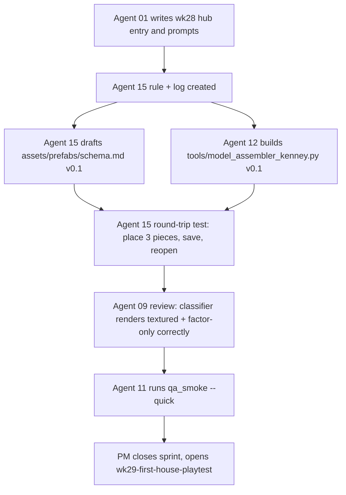

# WK28 Sprint — Assembler Spike: Agent 15 + Kenney Kit Assembler Tool

Pre-v1.5 series. The v1.5.0 label is **reserved** until 3D models are actually rendering in-game and the game is playable in that state. This sprint produces no player-visible change.

Sprint label: `wk28-assembler-spike`
Plan file (this doc): `.cursor/plans/wk28_assembler_spike.plan.md`

## 1. Objective

Create a new studio role (**Agent 15 — ModelAssembler / KitbashLead**) and deliver a minimum-viable desktop tool that lets a human kitbash Kenney `.glb` kit pieces into saved building "prefab" JSONs, ready for later consumption by the in-game renderer.

This sprint is a **spike**: prove the pipeline, nothing more. One follow-up sprint (`wk29-first-house-playtest`) will use this tool to build one house and playtest it in game.

## 2. Non-goals

- No edits to [game/graphics/ursina_renderer.py](game/graphics/ursina_renderer.py) or any code under `game/`.
- No changes to [config.py](config.py) footprints.
- No rewrite of [.cursor/plans/wk27_sprint_2_1_buildings.plan.md](.cursor/plans/wk27_sprint_2_1_buildings.plan.md) (it stays parked; we revisit after `wk29`).
- No change to [.cursor/plans/master_plan_3d_graphics_v1_5.md](.cursor/plans/master_plan_3d_graphics_v1_5.md) (we revisit after `wk29`).
- No baking a prefab into a single `.glb`. Deferred.
- No animated / rigged assets. Deferred to Phase 3 territory.
- No CHANGELOG edits.

## 3. Agent roster for this sprint

| Agent | Role in sprint | Status |
|---|---|---|
| 01 PM | Coordinates, writes prompts, tracks. | active |
| 12 Tools | Builds the assembler tool. | active |
| 15 ModelAssembler (NEW) | Drafts prefab schema; acceptance-tests the tool. | active |
| 09 Art | Review-only: confirms pieces render correctly (textured + factor-only) via the tool. | consult |
| 11 QA | Confirms `python tools/qa_smoke.py --quick` still PASS after changes. | consult |
| 02, 03, 04, 05, 06, 07, 08, 10, 13, 14 | Silent this sprint. | silent |

## 4. Deliverables

### 4.1 New agent onboarding rule

**File:** `.cursor/rules/agent-15-modelassembler-onboarding.mdc`
Follows the pattern of existing agent onboarding rules (see e.g. [.cursor/rules/agent-09-artdirector-onboarding.mdc](.cursor/rules/agent-09-artdirector-onboarding.mdc)).

Minimum sections:
- Who you are (Agent 15, ModelAssembler / KitbashLead).
- Mission (one sentence).
- Ownership table — owns: `assets/prefabs/buildings/*.json`, `assets/prefabs/schema.md`, `docs/art/building_kitbash_conventions.md`; does NOT own: tool code (Agent 12), renderer code (Agent 03), style contracts (Agent 09), `config.py` footprints (Agent 05).
- Quickstart (read PM hub assignment, own log, `kenney_gltf_ursina_integration_guide.md`, `kenney_assets_models_mapping.plan.md`).
- Must-follow rules (reference pieces by repo path; never duplicate source `.glb` into `assets/prefabs/`; attribution block per prefab; visual review by human before landing).

### 4.2 New agent log

**File:** `.cursor/plans/agent_logs/agent_15_ModelAssembler_KitbashLead.json`
Initialize with an empty sprints object + first sprint entry for `wk28-assembler-spike` containing the assignment.

### 4.3 Prefab schema doc (Agent 15)

**File:** `assets/prefabs/schema.md`

Draft v0.1 prefab schema:

```json
{
  "prefab_id": "peasant_house_small_v1",
  "building_type": "house",
  "footprint_tiles": [1, 1],
  "ground_anchor_y": 0.0,
  "rotation_steps": 90,
  "attribution": ["kenney_retro-fantasy-kit"],
  "pieces": [
    {
      "model": "Models/GLB format/wall-paint-door.glb",
      "pos":  [0.0, 0.0, 0.0],
      "rot":  [0, 0, 0],
      "scale": [1.0, 1.0, 1.0]
    }
  ],
  "notes": "human-readable design notes"
}
```

Rules:
- `model` paths are **relative to `assets/models/`** (so `Models/GLB format/wall-paint-door.glb` resolves under [assets/models/Models/GLB format/](assets/models/Models/GLB format/)).
- `pos` / `rot` / `scale` are per-piece local transforms from the prefab origin (`[0,0,0]` = building anchor = center of footprint at ground).
- `footprint_tiles` must later match the sim building's tile footprint in [config.py](config.py); Agent 15 verifies in `wk29`.
- `attribution` lists every Kenney pack whose pieces are referenced; consumed at release time for credits.

### 4.4 Assembler tool v0.1 (Agent 12)

**File:** `tools/model_assembler_kenney.py`

Builds on patterns in [tools/model_viewer_kenney.py](tools/model_viewer_kenney.py). Reuses the piece scan and the `_apply_gltf_color_and_shading` two-path classifier from [.cursor/plans/kenney_gltf_ursina_integration_guide.md](.cursor/plans/kenney_gltf_ursina_integration_guide.md) §5 (textured vs factor-only).

**In-scope features:**
- CLI: `python tools/model_assembler_kenney.py --new` or `--open <prefab_id>`.
- Ursina scene with flat 10x10 ground grid and visible origin marker (shows 1-unit cells).
- Left side-panel piece picker: scrollable list of `.glb` pieces from `assets/models/Models/GLB format/` (and `assets/models/Models/GLTF format/` for Nature Kit factor-only pieces). Click to select.
- Click empty ground -> spawn selected piece at snapped grid cell at `y = ground_anchor_y`.
- Selected-piece controls:
  - `WASD` nudge on XZ in 1.0-unit steps.
  - `Q` / `E` rotate 90 degrees around Y.
  - `[` / `]` move in Y by 0.25 units.
  - `Delete` removes.
- Shader classifier applied on every placed piece so textured + factor-only pieces both look right from frame 1.
- Toolbar: `New`, `Open prefab...`, `Save prefab...`, `Set building_type`, `Set footprint_tiles`.
- Prefabs saved to `assets/prefabs/buildings/<prefab_id>.json`.
- Round-trip correctness: saving then reopening reproduces the same visual result.

**Out of scope for v0.1 (deferred; not acceptance blockers):**
- Baking prefab to single `.glb`.
- Multi-selection / copy-paste.
- Sub-unit snap override.
- Undo stack beyond last delete.
- Thumbnail cache.

### 4.5 Directory bootstrap

Empty directories created this sprint (by adding the first file inside each):
- `assets/prefabs/` (holds `schema.md`).
- `assets/prefabs/buildings/` (empty this sprint; populated in `wk29`).

## 5. Sequence of work



## 6. Definition of Done

- `python tools/model_assembler_kenney.py --new` launches an Ursina window without errors.
- A human can place at least 3 Kenney pieces, rotate them, delete one, and save a prefab JSON to `assets/prefabs/buildings/<prefab_id>.json`.
- Reopening the saved prefab via `--open <prefab_id>` reproduces the saved layout pixel-close (not pixel-perfect — human visual check).
- The tool applies the two-path shader classifier (textured pieces render unlit with textures; Nature Kit factor-only pieces render with the custom `factor_lit_shader` from the integration guide, not pitch black, not flat white).
- `python tools/qa_smoke.py --quick` PASS (should be unaffected — no `game/` changes).
- `.cursor/rules/agent-15-modelassembler-onboarding.mdc` exists and matches the pattern of other agent onboarding rules.
- `.cursor/plans/agent_logs/agent_15_ModelAssembler_KitbashLead.json` exists with an initial sprint entry.
- `assets/prefabs/schema.md` exists and documents the v0.1 schema.

## 7. Follow-on sprint (preview only; not executed in wk28)

`wk29-first-house-playtest`:
1. Agent 15 + Jaimie kitbash `assets/prefabs/buildings/peasant_house_small_v1.json` (<= 8 pieces, 1x1 footprint).
2. Agent 03 adds a gated prefab loader to [game/graphics/ursina_renderer.py](game/graphics/ursina_renderer.py), active **only when `KINGDOM_URSINA_PREFAB_TEST=1`** and only for building type `house`. No default path change.
3. Jaimie playtests `python main.py --renderer ursina` with the env var set.
4. Decision gate: pipeline validated -> rewrite `wk27_sprint_2_1_buildings.plan.md` and update master plan; otherwise iterate.

## 8. Open items (flagged for Jaimie before agent activation)

1. **CHANGELOG action** — The top entry of [CHANGELOG.md](CHANGELOG.md) reads `Prototype v1.5.0 - Phase 1: 3D Environment Transition`. Per the new versioning rule, v1.5.0 is reserved. Options:
   - (a) leave it, treat as a pre-1.5 note until real 1.5 ships;
   - (b) relabel that entry in a small follow-up (e.g. `Prototype v1.4.10 — pre-1.5 environment prep`).
   Decision needed by end of `wk28` at the latest. Not blocking this sprint.
2. **Assembler must-have features not listed** — Confirm nothing missing from §4.4 in-scope list (copy/paste? thumbnail preview?). Adding features here is cheaper than retrofitting after `wk29`.
3. **Artifact paths** — Plan uses `assets/prefabs/buildings/` and `tools/model_assembler_kenney.py`. Confirm or name alternatives before Agent 12 starts.

## 9. Related docs

- [.cursor/plans/kenney_gltf_ursina_integration_guide.md](.cursor/plans/kenney_gltf_ursina_integration_guide.md) - shader classifier, pitfalls.
- [.cursor/plans/kenney_assets_models_mapping.plan.md](.cursor/plans/kenney_assets_models_mapping.plan.md) - where each Kenney pack lives on disk.
- [.cursor/plans/master_plan_3d_graphics_v1_5.md](.cursor/plans/master_plan_3d_graphics_v1_5.md) - v1.5 roadmap (to be amended after wk29).
- [tools/model_viewer_kenney.py](tools/model_viewer_kenney.py) - reference implementation the assembler extends.
- [.cursor/plans/wk27_sprint_2_1_buildings.plan.md](.cursor/plans/wk27_sprint_2_1_buildings.plan.md) - parked sprint; revisit after wk29.
