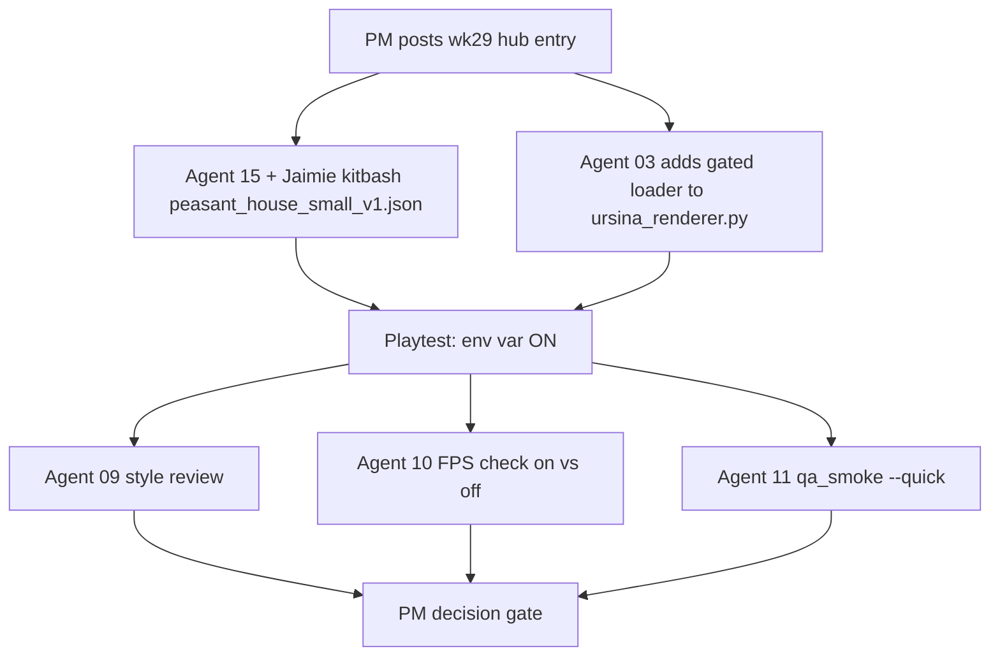

# WK29 Sprint — First House Playtest

Pre-v1.5 series. End-to-end validation of the prefab pipeline delivered in `wk28-assembler-spike`: kitbash one real house, add a **gated** prefab loader to the Ursina renderer, playtest in-game, decide whether the pipeline is ready for the wider building library.

Sprint label: `wk29-first-house-playtest`
Plan file: `.cursor/plans/wk29_first_house_playtest.plan.md`
Depends on: `wk28-assembler-spike` (closed).

## 1. Objective

Prove the whole assembler -> prefab -> in-game loader pipeline works for exactly **one** building. After this sprint we either:

- Scale the pipeline up (rewrite `wk27-sprint-2-1-3d-buildings`, amend `master_plan_3d_graphics_v1_5.md`, start mass-assembling buildings), OR
- Course-correct based on what breaks.

The sprint is deliberately small: one prefab, one loader function, one playtest.

## 2. Non-goals

- Do NOT replace billboard / existing rendering for any building type other than `house`, and only when the feature flag is set.
- Do NOT mass-assemble more buildings. One house only this sprint.
- Do NOT touch [config.py](config.py) building footprints. If the assembled house does not fit a 1x1 footprint, shrink the prefab.
- Do NOT bake prefabs to a single `.glb`. Deferred.
- Do NOT edit [.cursor/plans/wk27_sprint_2_1_buildings.plan.md](.cursor/plans/wk27_sprint_2_1_buildings.plan.md) or [.cursor/plans/master_plan_3d_graphics_v1_5.md](.cursor/plans/master_plan_3d_graphics_v1_5.md). We revisit those after this sprint.
- Do NOT touch the CHANGELOG. v1.5.0 is still reserved; wk29 is pre-1.5.

## 3. Agent roster for this sprint

| Agent | Role in sprint | Status |
|---|---|---|
| 01 PM | Coordinates, writes prompts, tracks, closes sprint after playtest. | active |
| 15 ModelAssembler | Kitbashes `peasant_house_small_v1.json` in [tools/model_assembler_kenney.py](tools/model_assembler_kenney.py) with Jaimie at the keyboard. | active |
| 03 TechnicalDirector | Adds gated prefab loader to [game/graphics/ursina_renderer.py](game/graphics/ursina_renderer.py). | active |
| 09 ArtDirector | Style review on the assembled house: readable silhouette, palette cohesion with prior 3D environment work. | consult |
| 10 PerformanceStability | Quick FPS check with env var on vs off. | consult |
| 11 QA | Post-merge `qa_smoke --quick`. | consult |
| 02, 04, 05, 06, 07, 08, 12, 13, 14 | Silent. | silent |

## 4. Deliverables

### 4.1 The house prefab (Agent 15 + Jaimie)

**File:** `assets/prefabs/buildings/peasant_house_small_v1.json`

Built using `python tools/model_assembler_kenney.py --new --prefab-id peasant_house_small_v1`.

Constraints:
- `building_type`: `"house"`
- `footprint_tiles`: `[1, 1]`
- `ground_anchor_y`: `0.0`
- `pieces`: target **<= 8**. Keep silhouette readable.
- `attribution`: every Kenney pack referenced (Retro Fantasy Kit likely; possibly Nature Kit for accents).
- Mix of textured (Retro Fantasy walls / roofs) and factor-only (Nature Kit accent) pieces is welcome because §4.2 loader must handle both; but not required if one pack covers it cleanly.

Visual bar: readable as a "small peasant house" at a distance. No floating pieces. No severe clipping.

### 4.2 Gated prefab loader in Ursina renderer (Agent 03)

**File:** [game/graphics/ursina_renderer.py](game/graphics/ursina_renderer.py)

Add a helper:

```python
def _load_prefab_instance(prefab_path: Path, world_pos: Vec3) -> Entity:
    # Read JSON, instantiate each piece as a child Entity of a container,
    # apply the two-path shader classifier per piece.
    ...
```

Then in `_sync_buildings` (or equivalent):

- If env var `KINGDOM_URSINA_PREFAB_TEST=1` **and** building type is `house` **and** prefab file exists:
  - Load `assets/prefabs/buildings/peasant_house_small_v1.json` at the building's world position.
  - Skip the default billboard / primitive path for that one building.
- Otherwise: existing rendering path unchanged.

Shader contract (from [.cursor/plans/kenney_gltf_ursina_integration_guide.md](.cursor/plans/kenney_gltf_ursina_integration_guide.md) section 5):

- Textured geoms: leave on Ursina's default unlit shader.
- Factor-only geoms: apply custom `factor_lit_shader` via the classifier.

Implementation note: the two-path classifier already lives in [tools/model_viewer_kenney.py](tools/model_viewer_kenney.py) as `_apply_gltf_color_and_shading`. Agent 03 may either (a) import it from `tools` at runtime, or (b) move it into a shared module under `game/graphics/`. Either is acceptable for the spike; pick the lower-risk option and note the choice in the agent log.

Rules:
- **No default path change.** With the env var unset, the game renders exactly as before.
- **Only the `house` type is affected.** Other building types continue to use the default path.
- **Must not break determinism.** The loader is render-only; it must not read wall-clock time or unseeded RNG. See [.cursor/rules/04-qa-gates.mdc](.cursor/rules/04-qa-gates.mdc) Gate 3.

### 4.3 Playtest evidence (Jaimie)

Run from repo root:

```
set KINGDOM_URSINA_PREFAB_TEST=1
python main.py --renderer ursina
```

(PowerShell: `$env:KINGDOM_URSINA_PREFAB_TEST='1'; python main.py --renderer ursina`)

Then compare to the same command **without** the env var to confirm the default path is unchanged.

### 4.4 FPS sanity (Agent 10)

Single-digit-minute check: launch with env var on, skim the Ursina frame timer. Compare to env var off. Report ms/frame delta and any obvious hitches in agent_10 log.

No formal benchmark required this sprint; we only want to catch a large regression (e.g., > 30% FPS drop from loading one prefab) that would force Agent 12 to add a baker before wk30.

## 5. Sequence of work



## 6. Playtest acceptance checklist (manual; Jaimie + agent notes)

- [ ] House renders at the correct grid cell when a `house` building exists.
- [ ] With env var OFF, the renderer looks identical to the prior build (no regression).
- [ ] Scale is readable: house is neither smaller than a hero nor a screen-filling monolith.
- [ ] Textured pieces (e.g. Retro Fantasy walls) render with textures. Not flat white.
- [ ] Factor-only pieces (if used) render with visible 3D shading. Not pitch black.
- [ ] No pieces are floating, buried, or clipping through the ground in a game-breaking way.
- [ ] FPS with env var ON is within acceptable range of env var OFF (Agent 10 judgement call).
- [ ] `python tools/qa_smoke.py --quick` PASS.

## 7. Decision gate (PM, after playtest)

| Outcome | Next action |
|---|---|
| All checklist items green, FPS fine | Proceed: PM drafts master-plan amendment + rescopes [wk27_sprint_2_1_buildings.plan.md](.cursor/plans/wk27_sprint_2_1_buildings.plan.md) around prefabs. Open backlog sprint for remaining buildings. |
| Visual OK, FPS bad | Add Agent 12 subtask: "bake prefab JSON -> single `.glb`" before making more buildings. |
| Visual wrong | Diagnose before more buildings: shader classifier, ground anchor, piece scale, schema? Course-correct in a targeted `wk29_rN_hotfix` round. |

## 8. Definition of Done

- [ ] `assets/prefabs/buildings/peasant_house_small_v1.json` exists, opens cleanly via `python tools/model_assembler_kenney.py --open peasant_house_small_v1`.
- [ ] [game/graphics/ursina_renderer.py](game/graphics/ursina_renderer.py) contains `_load_prefab_instance` (or equivalent) wired behind `KINGDOM_URSINA_PREFAB_TEST=1` for building type `house` only.
- [ ] With env var UNSET, the default rendering path is unchanged (regression check).
- [ ] Human playtest: §6 checklist satisfied.
- [ ] `python tools/qa_smoke.py --quick` PASS.
- [ ] Agents 15, 03, 09, 10, 11 have updated their logs with evidence.
- [ ] PM decision recorded in hub under `wk29_r2_close`.

## 9. Open items (pre-sprint, low priority)

1. **Classifier location** — does the two-path classifier move from `tools/` into a shared `game/graphics/` module? Agent 03 decides this sprint; if they move it, Agent 12 updates [tools/model_viewer_kenney.py](tools/model_viewer_kenney.py) and [tools/model_assembler_kenney.py](tools/model_assembler_kenney.py) to import from the new home in a follow-up. Not blocking wk29.
2. **Building spawn source** — the game places buildings via the existing sim / engine path; Agent 03 confirms the prefab loader is called per `house` building instance, not once globally. Flag if ambiguous.

## 10. Related docs

- [.cursor/plans/wk28_assembler_spike_41c2daeb.plan.md](.cursor/plans/wk28_assembler_spike_41c2daeb.plan.md) - previous sprint; delivered the tool + schema.
- [.cursor/plans/kenney_gltf_ursina_integration_guide.md](.cursor/plans/kenney_gltf_ursina_integration_guide.md) - shader classifier, pitfalls.
- [.cursor/plans/kenney_assets_models_mapping.plan.md](.cursor/plans/kenney_assets_models_mapping.plan.md) - Kenney pack folder map.
- [assets/prefabs/schema.md](assets/prefabs/schema.md) - prefab JSON contract (v0.1).
- [.cursor/plans/master_plan_3d_graphics_v1_5.md](.cursor/plans/master_plan_3d_graphics_v1_5.md) - 3D roadmap (amended AFTER wk29).
- [.cursor/plans/wk27_sprint_2_1_buildings.plan.md](.cursor/plans/wk27_sprint_2_1_buildings.plan.md) - parked sprint; rescoped AFTER wk29.
