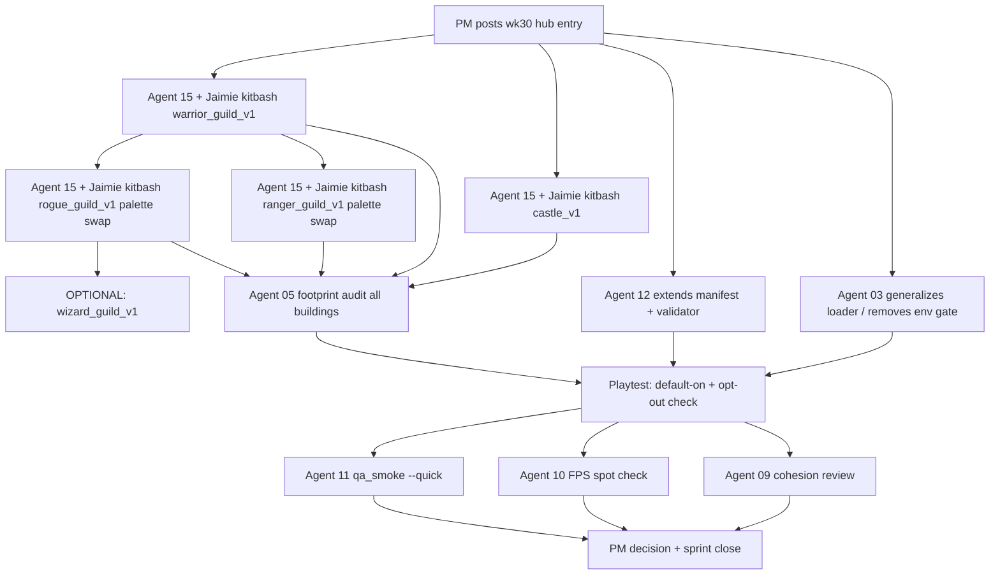

# WK30 Sprint — Buildings Pipeline Scale-Up (Phase 2.1 Rescoped)

Pre-v1.5 series. **Replaces the deprecated `wk27_sprint_2_1_buildings.plan.md`.** Builds directly on `wk28-assembler-spike` (tool + schema) and `wk29-first-house-playtest` (first prefab + gated loader).

Sprint label: `wk30-buildings-pipeline`
Plan file: `.cursor/plans/wk30_buildings_pipeline.plan.md`
Depends on:
- `wk28-assembler-spike` (closed) — `tools/model_assembler_kenney.py`, `assets/prefabs/schema.md`.
- `wk29-first-house-playtest` (closed) — `assets/prefabs/buildings/peasant_house_small_v1.json`, `_load_prefab_instance` + `_use_wk29_prefab_house` in `game/graphics/ursina_renderer.py`.

## 1. Objective

Promote the WK29 gated house loader into a **generalized, default-on prefab renderer** for the first real set of buildings. After WK30, "3D buildings" should no longer be one building hidden behind an env var — it should be a default path covering at least **Castle + House + Warrior / Ranger / Rogue Hero Guilds** (the "military district"), with validation + footprint reconciliation wired in.

In plain terms: stop proving the pipeline works, start filling the world with it. Economy buildings (Inn / Farm / Food Stand / Gnome Hovel) are held for WK31 to keep this sprint's scope and decision gate clean.

## 2. Non-goals

- Do **not** edit `config.py` footprints. If a prefab does not fit its building's existing `footprint_tiles`, shrink the prefab.
- Do **not** animate any units. Phase 3 territory, not this sprint.
- Do **not** bake prefabs to single `.glb` (no prefab baker). Only flagged as a follow-up if Agent 10 sees >30% FPS regression after WK30 lands (current WK29 signal: baker **not** needed).
- Do **not** edit the CHANGELOG. v1.5.0 is still reserved until a playable 3D build ships.
- Do **not** mass-assemble every building in the game. Scope is explicit in §4.

## 3. Agent roster for this sprint

| Agent | Role in sprint | Status | Intelligence |
|---|---|---|---|
| 01 PM | Coordinates, writes prompts, tracks, closes sprint. | active | — |
| 15 ModelAssembler | Kitbashes Castle + Warrior / Ranger / Rogue guild prefabs with Jaimie (Wizard Guild = optional stretch). | active | **high** |
| 03 TechnicalDirector | Generalizes `ursina_renderer.py` prefab loader (multi-type, default-on with opt-out). | active | **high** |
| 12 ToolsDevEx | Extends `tools/assets_manifest.json` + `tools/validate_assets.py` to recognize `assets/prefabs/buildings/*.json`. | active | **medium** |
| 05 GameplaySystems | Audits `footprint_tiles` in each new prefab against `config.py`. Read-only audit; files mismatches back to Agent 15. | consult | **low** |
| 09 ArtDirector | 5-minute silhouette + palette cohesion review on the assembled buildings in-game. | consult | **low** |
| 10 PerformanceStability | Ursina FPS spot check with all three prefabs in view vs prior build. | consult | **low** |
| 11 QA | Post-merge `python tools/qa_smoke.py --quick`. | consult | **low** |
| 02, 04, 06, 07, 08, 13, 14 | Silent. | silent | — |

## 4. Deliverables

### 4.1 Prefabs (Agent 15 + Jaimie)

Four new prefabs (plus optional fifth), authored via `python tools/model_assembler_kenney.py --new --prefab-id <id>`:

1. **`assets/prefabs/buildings/castle_v1.json`** — `building_type: "castle"`, `footprint_tiles` must match `config.py` castle footprint exactly (Agent 15 confirms with Agent 05 before saving). Piece budget: **<= 20**. Readable silhouette — this is the visual anchor of the kingdom. Ground anchor `y = 0.0`.
2. **`assets/prefabs/buildings/warrior_guild_v1.json`** — `building_type: "warrior_guild"`, `footprint_tiles` matches config. Piece budget: **<= 12**. Silhouette should read distinctly from the peasant house so "guild" is legible at a glance. **This is the reference kit for the other guilds** — Agent 15 should assemble it first so Ranger/Rogue can reuse its piece family with palette/accent swaps.
3. **`assets/prefabs/buildings/ranger_guild_v1.json`** — `building_type: "ranger_guild"`, `footprint_tiles` matches config. Piece budget: **<= 12**. Silhouette: "hunter's lodge" feel. Green / wooden accent pieces; may include a Nature Kit prop (rock or small tree) if it helps readability. Reuse the Warrior Guild body silhouette, change the top/roof/banner cues.
4. **`assets/prefabs/buildings/rogue_guild_v1.json`** — `building_type: "rogue_guild"`, `footprint_tiles` matches config. Piece budget: **<= 12**. Silhouette: lower-profile / shadowed feel. Steel / gray palette; off-center doorway or asymmetry welcomed so Rogue reads visually different from Warrior/Ranger at a distance.
5. **(Optional stretch) `assets/prefabs/buildings/wizard_guild_v1.json`** — `building_type: "wizard_guild"`, `footprint_tiles` matches config. Piece budget: **<= 14** (tower motif tends to eat pieces). Purple accent, taller silhouette. Only attempt if Agent 15 + Jaimie still have energy after the core four; do not block the sprint on this.

Also: **revisit the existing `peasant_house_small_v1.json`** if needed to tighten silhouette (Agent 15 discretion; not required).

All prefabs shipped this sprint must include a complete `attribution` array listing every Kenney pack referenced. Cross-check against `assets/ATTRIBUTION.md`; add a pack entry there if any new pack is used.

**Kitbash order (recommended):** Castle → Warrior Guild → Ranger Guild → Rogue Guild → (optional) Wizard Guild → (optional) house silhouette cleanup. Kit-family reuse is the cost-saving trick for the guild set.

### 4.2 Generalized prefab loader (Agent 03)

**File:** `game/graphics/ursina_renderer.py`

Refactor the WK29 gated house path into a **default-on** prefab loader covering multiple building types:

- New helper (or extended) — given a `building_type` string, resolve an expected prefab path (e.g. `assets/prefabs/buildings/<building_type>_v1.json`, or a lookup table maintained in one place in the module). If the prefab file exists, instantiate via `_load_prefab_instance(...)`. Otherwise fall through to the existing legacy path.
- **Remove the `KINGDOM_URSINA_PREFAB_TEST=1` gate as a hard prerequisite**. Prefabs should load by default when present.
- **Keep a safety opt-out:** `KINGDOM_URSINA_PREFAB_TEST=0` (explicit zero) should force the legacy render path, so Jaimie can A/B compare or back out if a regression ships. Any other value or unset = default-on.
- Continue to cache prefab root entities per sim building id (as WK29 does).
- Reuse `tools.model_viewer_kenney._apply_gltf_color_and_shading` per piece at instantiation (same classifier as WK29). If Agent 03 moves this classifier to a shared module under `game/graphics/`, they must update BOTH `tools/model_viewer_kenney.py` AND `tools/model_assembler_kenney.py` imports in the same PR so the tools keep working.
- No wall-clock time. No unseeded RNG. `tools/determinism_guard.py` must remain PASS.
- Document the `building_type → prefab path` resolution strategy in the Agent 03 log.

### 4.3 Manifest + validator support for prefabs (Agent 12)

**Files:** `tools/assets_manifest.json`, `tools/validate_assets.py`

- Add a new top-level section `prefabs.buildings` listing expected prefab JSON files. **Required** entries this sprint: `peasant_house_small_v1`, `castle_v1`, `warrior_guild_v1`, `ranger_guild_v1`, `rogue_guild_v1`. **Optional** entry: `wizard_guild_v1` (present-but-missing emits WARN, not ERROR).
- Validator checks per entry:
  - File exists under `assets/prefabs/buildings/<prefab_id>.json`.
  - JSON parses cleanly.
  - Required top-level keys present (`prefab_id`, `building_type`, `footprint_tiles`, `ground_anchor_y`, `pieces`, `attribution`).
  - Every `model` path in `pieces[]` resolves under `assets/models/`.
  - `attribution` is a non-empty array.
- Emit warnings (not errors) for a missing optional prefab so the validator does not block progress during kitbash sessions.
- `--report` exit code stays at 0 on warnings and non-zero only on hard errors (missing required files / malformed JSON).

### 4.4 Footprint reconciliation audit (Agent 05)

Read-only audit. For each prefab shipped this sprint (house, castle, warrior_guild, ranger_guild, rogue_guild, + wizard_guild if the stretch lands), confirm `footprint_tiles` in the JSON equals the matching building's footprint in `config.py`. File a short bullet per building in the Agent 05 log (format: `building_type | config.py footprint | prefab footprint | OK / mismatch`).

If a mismatch exists, Agent 05 files it back to Agent 15 in the hub for a prefab shrink. **Agent 05 does not edit `config.py` this sprint.**

### 4.5 Human playtest (Jaimie)

From repo root, PowerShell:

```
python main.py --renderer ursina
```

Expected: House + Castle + Warrior / Ranger / Rogue guilds (and Wizard Guild if the stretch landed) all render as true 3D kitbashed prefabs (no env var needed). Regression check:

```
$env:KINGDOM_URSINA_PREFAB_TEST='0'; python main.py --renderer ursina
```

With the opt-out flag, rendering should fall back to the pre-prefab path for all buildings. No crashes either way.

## 5. Sequence of work



## 6. Playtest acceptance checklist (manual; Jaimie + agent notes)

- [ ] With env var unset: House, Castle, and Warrior / Ranger / Rogue guilds all render as 3D prefabs. (Wizard Guild too, if the stretch landed.)
- [ ] With `KINGDOM_URSINA_PREFAB_TEST=0`: every prefab-backed building falls back to the legacy render path; no crash.
- [ ] Textured Kenney pieces render with textures (not flat white).
- [ ] Factor-only Kenney pieces (if any) render with visible 3D shading (not pitch black).
- [ ] Castle silhouette is legibly "a castle" from the default camera zoom.
- [ ] Warrior / Ranger / Rogue guild silhouettes are each visually distinct from the peasant house AND from each other at default zoom.
- [ ] No pieces float, bury, or clip through the ground in a game-breaking way.
- [ ] Units do not clip through prefab geometry on walk paths past the buildings.
- [ ] FPS with WK30 prefabs present is within ~30% of the WK29 baseline (Agent 10 judgement). If >30% worse, trigger decision-gate row 2 (perf hedge).
- [ ] `python tools/qa_smoke.py --quick` PASS.
- [ ] `python tools/validate_assets.py --report` exit 0 (warnings acceptable).

## 7. Decision gate (PM, after playtest)

| Outcome | Next action |
|---|---|
| All checklist items green, FPS fine | Open WK31 combined plan (see `.cursor/plans/wk31_kingdom_perf_and_economy.plan.md`): Part A perf/scale first, then Part B — Inn + Farm + Food Stand + Gnome Hovel as prefabs. |
| Visual OK, FPS drops >30% | Open WK31 as perf hedge instead: Agent 12 adds a prefab baker (`tools/bake_prefab.py` → `assets/models/buildings/<id>_baked.glb`); Agent 03 adds a "baked-first, JSON-second" resolution path. Economy buildings slide to WK32. |
| Visual wrong (classifier, scale, footprint) | Targeted `wk30_rN_hotfix` round; no new building types until green. |

## 8. Definition of Done

- [ ] `assets/prefabs/buildings/castle_v1.json` exists; reopens cleanly via `python tools/model_assembler_kenney.py --open castle_v1`.
- [ ] `assets/prefabs/buildings/warrior_guild_v1.json` exists; reopens cleanly via `--open warrior_guild_v1`.
- [ ] `assets/prefabs/buildings/ranger_guild_v1.json` exists; reopens cleanly via `--open ranger_guild_v1`.
- [ ] `assets/prefabs/buildings/rogue_guild_v1.json` exists; reopens cleanly via `--open rogue_guild_v1`.
- [ ] (Optional) `assets/prefabs/buildings/wizard_guild_v1.json` if the stretch landed; reopens cleanly via `--open wizard_guild_v1`.
- [ ] `game/graphics/ursina_renderer.py` loads prefabs by default for any building type with a present `assets/prefabs/buildings/<type>_v1.json`; supports `KINGDOM_URSINA_PREFAB_TEST=0` explicit opt-out.
- [ ] `tools/assets_manifest.json` and `tools/validate_assets.py` understand `prefabs.buildings`; `--report` runs clean (exit 0).
- [ ] Agent 05 footprint audit filed in their log. No `config.py` edits.
- [ ] §6 checklist satisfied (human playtest).
- [ ] `python tools/qa_smoke.py --quick` PASS.
- [ ] Agents 15, 03, 12, 05, 09, 10, 11 have updated their logs with evidence (file changes, commands run, exit codes).
- [ ] PM decision recorded in hub under `wk30_r2_close`.

## 9. Gates (exact commands, from repo root)

```
python tools/qa_smoke.py --quick
python tools/validate_assets.py --report
python main.py --renderer ursina
$env:KINGDOM_URSINA_PREFAB_TEST='0'; python main.py --renderer ursina
```

(On non-Windows shells, substitute `KINGDOM_URSINA_PREFAB_TEST=0 python main.py --renderer ursina`.)

## 10. `pm_send_list_minimal` (for hub reference)

- **Send to:** 15 (high), 03 (high), 12 (medium), 05 (low, consult), 09 (low, consult), 10 (low, consult), 11 (low, consult).
- **Do NOT send:** 02, 04, 06, 07, 08, 13, 14.
- **Rationale:** Implementers are 15 (four prefabs — Castle + Warrior/Ranger/Rogue guilds, Wizard as optional stretch; HIGH because Castle is the visual anchor and the guild set establishes the reusable kit family), 03 (loader generalization — HIGH, cross-module refactor), 12 (manifest/validator — MEDIUM, follows existing validator pattern). Consults are 05 (footprint audit — LOW, read-only audit across 5+ buildings), 09 (silhouette cohesion — LOW, fixed-recipe review), 10 (FPS — LOW, vs. WK29 baseline), 11 (post-merge gate — LOW, gate runner). All others silent this sprint.

## 11. Related docs

- [.cursor/plans/master_plan_3d_graphics_v1_5.md](./master_plan_3d_graphics_v1_5.md) — amended with "Pipeline pivot (as of 2026-04-16)" in §4 Phase 2.
- [.cursor/plans/wk27_sprint_2_1_buildings.plan.md](./wk27_sprint_2_1_buildings.plan.md) — **DEPRECATED** header; kept for history only.
- [.cursor/plans/wk28_assembler_spike_41c2daeb.plan.md](./wk28_assembler_spike_41c2daeb.plan.md) — tool + schema (closed).
- [.cursor/plans/wk29_first_house_playtest.plan.md](./wk29_first_house_playtest.plan.md) — first prefab + gated loader (closed).
- [.cursor/plans/wk31_kingdom_perf_and_economy.plan.md](./wk31_kingdom_perf_and_economy.plan.md) — WK31 combined: Part A FPS + pack scale; Part B economy buildings (Inn, Farm, Food Stand, Gnome Hovel).
- [.cursor/plans/kenney_gltf_ursina_integration_guide.md](./kenney_gltf_ursina_integration_guide.md) — two-path shader classifier.
- [.cursor/plans/kenney_assets_models_mapping.plan.md](./kenney_assets_models_mapping.plan.md) — Kenney pack folder map.
- [assets/prefabs/schema.md](../../assets/prefabs/schema.md) — prefab JSON contract (v0.1).
