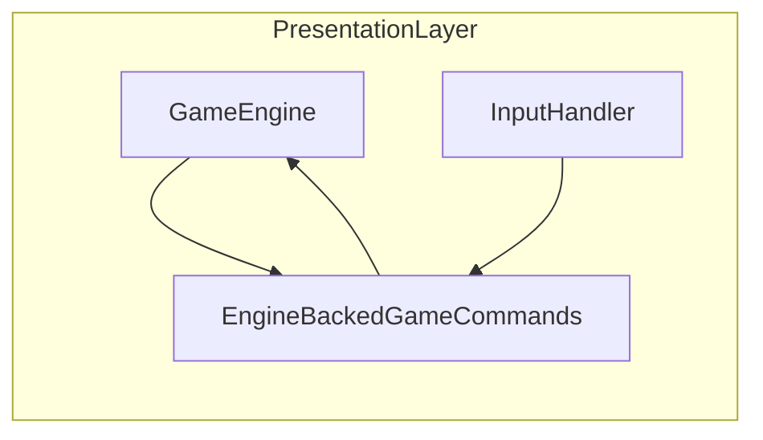

# WK38 — Stage 3: InputHandler + `GameCommands` protocol

## Source of truth

- Stage 3 scope, DoD, Option A (Protocol), and implementation notes (actions **and** state queries **and** UI delegation): [`.cursor/plans/master_plan_architecture_refactor.md`](.cursor/plans/master_plan_architecture_refactor.md) (section **Stage 3: Input Handler Decoupling**, ~L794–858).
- Stage assignment table (Agent 03 primary HIGH, Agent 08 consult LOW, QA LOW): same file ~L960–968.
- Prior sprint shape to mirror (multi-round, gates per round): [`.cursor/plans/wk37_stage2_simengine_split_1bc48a29.plan.md`](.cursor/plans/wk37_stage2_simengine_split_1bc48a29.plan.md).

## Current code reality (informs effort)

- [`game/input_handler.py`](game/input_handler.py): **~630 lines**, **`InputHandler(engine)`** in [`game/engine.py`](game/engine.py) (~L184). Grep shows on the order of **~160+** `engine.` access sites (actions, panels, `economy`, `world`, **private** engine fields like `_skip_event_processing_frames`, `_cleanup_destroyed_buildings`, borderless-drag state, etc.).
- Ursina path references InputHandler only in comments ([`game/graphics/ursina_app.py`](game/graphics/ursina_app.py)); construction is centralized in `GameEngine` — low risk of a second construction site.

## Definition of Done (sprint exit)

Must match master plan Stage 3:

- `InputHandler.__init__` **does not** take `GameEngine`; it takes a **`GameCommands`** (Protocol-typed) dependency.
- All former `self.engine` / `engine` usage in `input_handler.py` goes through **`self.commands`** (or equivalent) — **no** `from game.engine import GameEngine` except **`TYPE_CHECKING`** if still needed for annotations.
- **Gates:** `python -m pytest tests/` PASS; `python tools/qa_smoke.py --quick` PASS; `python tools/validate_assets.py --report` exit 0 (warnings acceptable per recent baseline).
- **Manual:** hotkeys, mouse, panels in **`python main.py --renderer pygame --no-llm`** (2D) and **`python main.py --no-llm`** (default Ursina) (and spot-check `--provider mock` if any input path touches LLM UI). Use explicit PowerShell commands in PM hub / Jaimie instructions per studio rules.

## Architecture (locked: Option A)

- **New module:** e.g. [`game/game_commands.py`](game/game_commands.py) — defines **`GameCommands` Protocol** (methods for **commands**, **state queries**, and **narrow UI bridges** where input currently reaches into `hud`, `pause_menu`, `building_panel`, etc.).
- **Concrete type:** e.g. `EngineBackedGameCommands` in the same file or [`game/engine.py`](game/engine.py) — holds a reference to the live `GameEngine` / presentation shell and **delegates** one-to-one to today’s behavior. This keeps WK38 focused on **decoupling and typing**, not redesigning sim/UI ownership (that stays Stage 2 follow-ups / future work).
- **Private engine hooks** used from input (e.g. `_cleanup_destroyed_buildings`, `_skip_event_processing_frames`, borderless drag fields): expose as **explicit protocol methods** with short docstrings so `InputHandler` does not reach for `getattr(engine, "_foo")` on arbitrary privates.

## Recommended rounds (WK38-R1 … R3)

Split so each round is mergeable with gates (same philosophy as WK37: **no single mega-unreviewable diff**).

| Round | Goal | Primary output |
|-------|------|----------------|
| **WK38-R1** | **Inventory + Protocol skeleton** | Document every distinct capability `input_handler.py` needs (group: sim queries, presentation mutations, panel routing). Add `game/game_commands.py` with `GameCommands` Protocol covering that surface (stub `...` bodies not used yet). Add **`EngineBackedGameCommands`** implementing the protocol by delegating to `GameEngine` for **a first vertical slice** (e.g. `process_events` + quit/display only) and wire **`InputHandler(commands)`** for that slice only **or** wire constructor + alias `self.commands` while migrating one function — choose **one** minimal first slice that still runs the game. |
| **WK38-R2** | **Mechanical migration** | Replace remaining `engine` locals with `commands` across **`handle_keydown`**, **`handle_mousedown`**, **`handle_mousemove`**, helpers (`_clear_hero_selection`, `select_building_for_placement`, etc.). Extend Protocol + facade for any missed surfaces. **No behavior change** intended. |
| **WK38-R3** | **Hardening + consult + docs** | Remove dead `GameEngine` imports from `input_handler.py`. Add **1–3 focused tests**: e.g. mock `GameCommands` to assert `InputHandler` calls the right command on a synthetic key event (keeps regression signal without full pygame integration). Optional: extend [`docs/refactor/engine_access_inventory.md`](docs/refactor/engine_access_inventory.md) with an **InputHandler / GameCommands** subsection listing protocol methods (living doc for Stage 4+). **Agent 08** consult: confirm no UX regressions on panel focus order / ESC / build catalog flows (short checklist). |

If R2 balloons, **split R2** into keydown vs mouse (two sub-rounds) before cutting scope.

## Ownership and activation (PM execution after plan approval)

- **Implementer:** Agent 03 (Technical Director) — **HIGH** intelligence.
- **QA:** Agent 11 — **LOW**: post-merge `qa_smoke --quick` each round; note any new flaky input tests.
- **Consult:** Agent 08 (UX/UI) — **LOW**: end of R2 or R3, checklist-only (no code unless boundary agreement with Agent 03).
- **Silent this sprint:** Gameplay (05), AI (06), Art (09), Tools (12) unless a gate failure assigns work.

## PM hub + plan artifact (post-approval bookkeeping)

- Add sprint key **`wk38-refactor-stage3-gamecommands`** to [`.cursor/plans/agent_logs/agent_01_ExecutiveProducer_PM.json`](.cursor/plans/agent_logs/agent_01_ExecutiveProducer_PM.json) with `sprint_meta.plan_ref` pointing to a new file **`.cursor/plans/wk38_stage3_input_gamecommands.plan.md`** (mirror WK37: rounds, `pm_agent_prompts`, `pm_send_list_minimal` with intelligence tags, universal prompt).
- **Stage 5 / rules update:** Do **not** require `.cursor/rules/02-project-layout.mdc` in WK38 unless trivial; master plan lists that under **Stage 5** (5-B). Mention in sprint notes as follow-up.

## Risks and mitigations

| Risk | Mitigation |
|------|------------|
| Missed `engine.` access or `getattr` paths | R1 inventory doc + grep checklist; CI: `rg "self\\.engine|engine = self\\.engine" game/input_handler.py` must be empty before close. |
| Protocol becomes a second god-object API | Group methods by domain in `game_commands.py` with section comments; only methods **called from** `input_handler.py` in WK38. |
| Demolish / interior flows use private sim cleanup | Explicit `GameCommands.cleanup_destroyed_buildings(...)` (or named equivalent) delegating to current engine private — preserves behavior. |
| Ursina-specific input quirks | Manual Ursina pass every round that touches zoom / pause / HUD. |

## Out of scope for WK38 (explicit)

- **Stage 4** (`PygameRenderer` extraction) — separate sprint.
- Moving panel classes out of `engine` — only if Agent 03 + 08 agree a tiny facade method is cleaner than a giant protocol; default is **delegate to existing engine attributes**.
