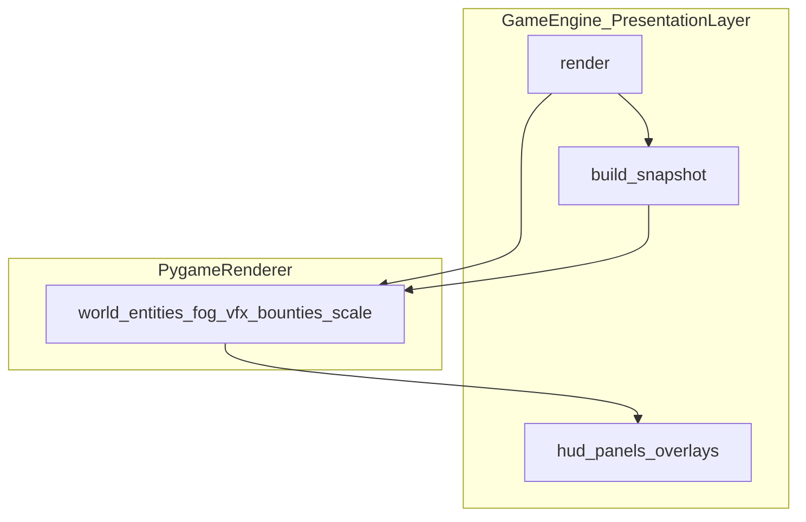

# WK39 — Stage 4: `PygameRenderer` extraction

## Authority

- **Stage 4 scope, DoD, split list:** [.cursor/plans/master_plan_architecture_refactor.md](.cursor/plans/master_plan_architecture_refactor.md) (section **Stage 4: Render Method Extraction**, ~L861–892).
- **Owner:** Agent **03** (Technical Director), **MEDIUM** intelligence per master table (~L968).
- **Gates:** `python -m pytest tests/`, `python tools/qa_smoke.py --quick`, `python tools/validate_assets.py --report`; manual pygame + Ursina parity (Ursina path should be **unchanged** in behavior — no regression in HUD composite).

## Current state (from code)

[`GameEngine.render`](game/engine.py) (~L1438–1652) today:

- **World path** (`skip_pygame_world` false): fill / `view_surface` sizing, **`world.render`**, entity loops (buildings, enemies+fog, heroes, guards, peasants, tax_collector), **`building_menu.render`** and **`building_list_panel.render`** on `view_surface`, VFX, fog, bounty metrics + **`render_bounties`**, scale-to-window blit.
- **Ursina skip path** (`skip_pygame_world` true): transparent fill; still runs **`bounty_system.update_ui_metrics`** for HUD/minimap.
- **Stays on engine after extraction (per master plan):** HUD, micro-view minimap hook, debug/dev tools, **building_panel**, **build_catalog_panel**, **pause_menu**, perf overlay, pause overlay, **`pygame.display.update`**.

**Boundary decision (plan this explicitly in WK39-R1):** Master plan lists **building_panel** / **build_catalog** under “Stays” but does **not** mention **`building_menu`** or **`building_list_panel`**. Both are drawn in **world camera space** on `view_surface`. **Recommendation:** include them inside **`PygameRenderer`** so one class owns the full **world composition** up to the blit to `self.screen`, matching “world/entity rendering” intent. If Agent 03 prefers a thinner first slice, **R1** can omit list/menu and **R2** pulls them in — document in agent log.

**Side effect:** `bounty_system.update_ui_metrics(...)` during render is not pure draw; keep the **same call order** relative to bounty draw as today (either first line inside `PygameRenderer` world pass or engine calls once before `pygame_renderer.render_world(...)`).

## Target architecture

- **New:** [`game/graphics/pygame_renderer.py`](game/graphics/pygame_renderer.py) — class e.g. `PygameRenderer` with `__init__(self, ...)` holding **stable references** the world pass needs that are **not** on `SimStateSnapshot` today: at minimum **`renderer_registry`**, **`building_menu`**, **`building_list_panel`**, **`vfx_system`**, **`bounty_system`** (or a small **`PygameWorldRenderContext`** / `@dataclass` to avoid a long parameter list). **Entity iteration** should prefer **`snapshot.buildings` / `snapshot.heroes`** / etc. from [`SimStateSnapshot`](game/sim/snapshot.py) for parity with Ursina; use `snapshot.world`, `snapshot.tax_collector` where applicable.
- **`GameEngine.render`:** build `snapshot = self.build_snapshot()` once per frame (already cheap contract from Stage 1–2); call `self._pygame_renderer.render_world(self.screen, snapshot, ...)` or split into “prepare view_surface / blit” helpers as needed; then run existing HUD/panel/overlay block unchanged.

## Rounds (WK39)

| Round | Goal |
|--------|------|
| **WK39-R1** | Add `PygameRenderer` + wire from `render()`: move the **block from skip/ view_surface setup through blit to screen** (lines ~L1442–L1556) into a dedicated method. Preserve **branch structure** for `skip_pygame_world` and zoomed `view_surface`. **No** behavior change intended. |
| **WK39-R2** | **Snapshot-first:** iterate entities from `snapshot` tuples where possible; tighten context object; optional **dedupe** with [`_render_hero_minimap`](game/engine.py) (~L1654+) by having minimap call a shared `PygameRenderer` subpath or a private helper on the new class (reduces drift). |
| **WK39-R3** | **Hardening:** extend or add tests (e.g. headless `GameEngine(headless=True).render()` smoke, or assert `PygameRenderer` module import + snapshot passed); run full gates; **Jaimie** manual: `python main.py --no-llm` and `python main.py --renderer ursina --no-llm` for visual parity. Agent **11** (LOW): post-merge `qa_smoke --quick` each round. |

If **R1** diff is too large, split **R1** into “scaffold + empty delegate” then “move world loop” in two agent commits within the same round.

## Out of scope for WK39

- **Stage 5** (root script cleanup, `02-project-layout.mdc` overhaul, CHANGELOG bump).
- Changing **UrsinaRenderer** contract beyond any shared type hints/docs.
- Moving **HUD** or **building_panel** into `PygameRenderer` (explicitly forbidden by master plan).

## PM / docs deliverables (when executing after plan approval)

- New plan file: **`.cursor/plans/wk39_stage4_pygame_renderer.plan.md`** (mirror WK38: DoD, gates, manual commands, risks).
- PM hub sprint key **`wk39-refactor-stage4-pygame-renderer`** in [`.cursor/plans/agent_logs/agent_01_ExecutiveProducer_PM.json`](.cursor/plans/agent_logs/agent_01_ExecutiveProducer_PM.json): rounds, `pm_agent_prompts`, `pm_jaimie_send_order` (typically **03 → 11** per round; no parallel implementers).
- Optional one-line update to [`.cursor/plans/master_plan_architecture_refactor.md`](.cursor/plans/master_plan_architecture_refactor.md) global checklist Stage 4 when sprint closes (not required in R1).

## Risks

| Risk | Mitigation |
|------|------------|
| Subtle draw order / fog / bounty regression | Preserve line order from current `render()`; screenshot compare optional (Agent 09 consult only if needed). |
| `update_ui_metrics` ordering | Keep identical to pre-refactor call site. |
| Headless / `skip_pygame_world` | Unit-test both branches or run observe_sync headless profile. |
| Snapshot vs live list mismatch | Prefer snapshot; if one code path still needs live menu state, document exception in `engine_access_inventory.md`. |
