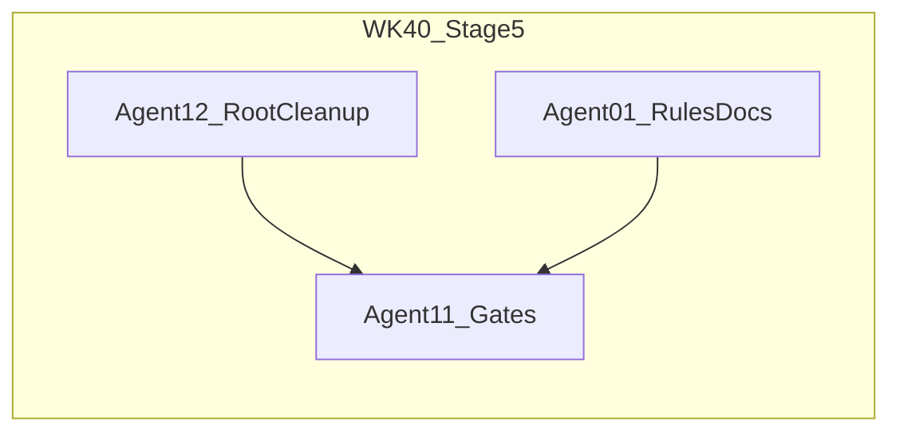

# WK40 — Stage 5: Cleanup, consolidation, refactor closure

## Authority and scope

- **Source of truth:** [`.cursor/plans/master_plan_architecture_refactor.md`](.cursor/plans/master_plan_architecture_refactor.md) — section **Stage 5: Cleanup, Consolidation, and Definition of Done** (approx. L896–939).
- **Sprint name (hub):** `wk40-refactor-stage5-cleanup` (or equivalent; align with `wk39-refactor-stage4-*` pattern).
- **Out of scope:** New gameplay, renderer behavior changes, or SimEngine/GameCommands refactors unless a gate reveals a real regression (then file a ticket; default owner Agent 03).

## Preconditions (treat as verification, not new build work)

Stages 0–4 are **closed** per PM hub. Before closing the *refactor* narrative, the sprint should **tick the master plan “Global Definition of Done”** (L925–939): confirm `SimEngine` + `PresentationLayer` decomposition, `GameCommands` usage, `PygameRenderer` extraction, gates, tests, and docs. Several items are likely already true (e.g. multiple tests in [`tests/test_engine.py`](tests/test_engine.py), [`tests/test_renderer_snapshot_contract.py`](tests/test_renderer_snapshot_contract.py) exists). Gaps, if any, are **escalation to Agent 03**, not scope creep in WK40.

## Workstream A — Root script consolidation (Task 5-A)

**Owner: Agent 12 (Tools) — low intelligence** (per master plan L961–968).

Target inventory (align to repo; counts may differ slightly from the master plan table):

| Area | Action |
|------|--------|
| `scratch_debug_glb*.py` in repo root (currently 6 files) | Confirm unused; **delete** or move to a single documented `tools/debug/` if one script must remain for GLB spot-checks. |
| Root `pm_*.py` (e.g. `pm_wk17_restore.py`, `pm_wk22_*.py`, `pm_check_logs.py`, `pm_wk22_setup.py`) | **Do not** touch scripts under [`.cursor/plans/agent_logs/`](.cursor/plans/agent_logs/). Only root-level `pm_*.py`: **archive** to e.g. `tools/archive/pm_historical/` (create folder if needed) or delete if clearly obsolete. |
| Root `extract_*.py` | Same: archive to `tools/archive/` or delete. |
| [`test_llm.py`](test_llm.py) (root) | **Move** to `tests/` with pytest naming/fixtures as needed, or **delete** if duplicate of existing coverage. |
| [`get_agent_responses.py`](get_agent_responses.py) | Archive or delete. |

**Process:** Grep for imports or docs referencing these files; update or remove references. Ensure no `README` / internal doc still points to deleted paths.

## Workstream B — Agent onboarding rules (Task 5-B)

**Owner: Agent 01 (PM) — low intelligence** (rules are in your lane: [`.cursor/rules/`](.cursor/rules/) and plans).

Update [`.cursor/rules/02-project-layout.mdc`](.cursor/rules/02-project-layout.mdc) so it matches post-refactor reality:

- Replace the single “`game/engine.py` = God object” story with: **`SimEngine`** (sim tick + world state), **`PresentationLayer`** (pygame display, UI orchestration, delegation to `PygameRenderer` for world pass where implemented), and entry wiring from [`main.py`](main.py) / [`game/graphics/ursina_app.py`](game/graphics/ursina_app.py) as appropriate.
- Document **`SimStateSnapshot`**, **`build_snapshot()`**, and the split between world renderers: [`game/graphics/pygame_renderer.py`](game/graphics/pygame_renderer.py) vs [`game/graphics/ursina_renderer.py`](game/graphics/ursina_renderer.py).
- Add pointers to deep docs: e.g. [`docs/refactor/engine_access_inventory.md`](docs/refactor/engine_access_inventory.md), [`master_plan_architecture_refactor.md`](.cursor/plans/master_plan_architecture_refactor.md) (Stage summary only; keep 02-project-layout short).
- **How to run the game:** default is Ursina (`python main.py`); document `--renderer pygame` for the 2D path.

Optionally one-line note in [`.cursor/plans/01-studio-onboarding.mdc`](.cursor/plans/01-studio-onboarding.mdc) or studio onboarding only if a single “see 02-project-layout” cross-link removes duplication (minimal edit).

## Workstream C — Final integration gates (Task 5-C)

**Owner: Agent 11 (QA) — low intelligence**; **Jaimie — manual** for time-boxed play.

Automated (must PASS):

1. `python tools/determinism_guard.py`
2. `python -m pytest tests/`
3. `python tools/qa_smoke.py --quick`
4. `python tools/validate_assets.py --report` — **0 errors** (warn baseline acceptable if unchanged)

**Manual (PowerShell, repo root) —** durations from master plan L919–921:

```powershell
python main.py --no-llm
```

```powershell
python main.py --renderer pygame --no-llm
```

```powershell
python main.py --provider mock
```

Time boxes: 10 / 10 / 5 minutes respectively; document PASS/FAIL in Agent 11 log and PM hub.

## Workstream D — Release notes (optional, human-gated)

**Owner: Agent 13 (Marketing/Ops) — low intelligence, only if Jaimie wants a version line.**

- If Jaimie approves a version bump: update [`CHANGELOG.md`](CHANGELOG.md) with a short “Refactor complete / repo hygiene” style entry. **No version number without Jaimie’s call.**

## Recommended rounds (suggested; PM can map to `wk40_r1` / `r2` / `r3`)

| Round | Focus | Agents |
|-------|--------|--------|
| **R1** | Archive/delete root scripts; fix references; `validate_assets` + `pytest` smoke | 12, then 11 |
| **R2** | Update `02-project-layout.mdc` (+ optional one-line cross-links); PM hub entry | 01 (rules), 01 (hub sprint block) |
| **R3** | Full gate stack; manual smokes; checklist pass on Global DoD; optional Agent 13 CHANGELOG | 11, Jaimie, 13 optional |

**Send order (minimal parallelization):** 12 before heavy 11 on R1; 11 gates after 01 rules if you want a single “final” gate pass after all edits (simplest: **R1 12 then 11; R2 01; R3 11 + Jaimie**).

**Intelligence tags for Jaimie’s model picker:** 12 — low; 01 — low; 11 — low; 13 — low (optional).

## Artifacts to create in repo (for Agent 01 / you after approval)

- New sprint plan file (mirror WK39): e.g. [`.cursor/plans/wk40_stage5_cleanup_dod.plan.md`](.cursor/plans/wk40_stage5_cleanup_dod.plan.md) with Authority block pointing to `master_plan_architecture_refactor.md` L896+.
- PM hub: new sprint `wk40-refactor-stage5-cleanup` with `pm_universal_prompt`, `pm_agent_prompts`, `pm_next_actions_by_agent`, `pm_send_list_minimal`, and `do_not_send` as appropriate (02–10 silent unless escalated; 14–15 silent).

## Sprint exit criteria (WK40-specific)

- [ ] No scratch/PM/utility one-offs left in project **root** per Task 5-A (or an explicitly documented exception in `tools/archive/README` or similar).
- [ ] `02-project-layout.mdc` describes the refactor architecture, not the pre–Stage-2 layout only.
- [ ] All four automated gates above PASS; three manual smokes complete with notes.
- [ ] Global Definition of Done from master plan L925–939 reviewed; any **unchecked** item has an owner or follow-up ticket (not silent debt).

## Risks

- **Over-deletion:** A script may still be used informally. Mitigation: grep + optional ask Jaimie “do you run X?” before delete.
- **Test move:** Moving `test_llm.py` may need pytest markers or env; keep changes minimal.

## Post-sprint hygiene

- `python tools/roll_agent_logs.py --keep 7 --dry-run` then `--write-index` if at sprint boundary (per studio rules).
- Optional git save-state: Jaimie explicitly requests commit/push.


