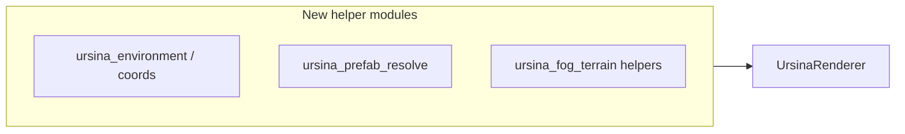

# WK41 — Mechanical module split (readability / signal-to-noise)

## Goals and non-goals

- **Goals:** Smaller, named units; clearer ownership; less noisy context for agents; merge-friendly diffs. Same runtime behavior (pixel-identical is ideal; “indistinguishable in normal play” is the practical bar).
- **Non-goals:** New features, balance, sim logic changes, snapshot schema changes, or “while we’re here” cleanups outside moved code. **Do not** mix this sprint with gameplay tickets.

## Authority and ownership

- **Implementer:** Agent **03** (Technical Director) — owns [`game/engine.py`](game/engine.py), [`game/graphics/ursina_renderer.py`](game/graphics/ursina_renderer.py), and new helper modules under `game/` / `game/graphics/`.
- **QA:** Agent **11** — run full gate stack after each mergeable chunk (same pattern as WK38–WK39).
- **Optional consult:** Agent **10** — short Ursina FPS smoke after large Ursina moves (not required every round).
- **PM / docs:** Agent **01** — sprint bookkeeping in [`.cursor/plans/agent_logs/agent_01_ExecutiveProducer_PM.json`](.cursor/plans/agent_logs/agent_01_ExecutiveProducer_PM.json); optional one-line pointer in [`.cursor/rules/02-project-layout.mdc`](.cursor/rules/02-project-layout.mdc) once module layout is stable (coordinate with 03 so filenames stay accurate).

## Gate stack (every mergeable round)

Minimum bar matches recent refactor sprints:

1. `python tools/determinism_guard.py` (quick sanity; sim dirs unchanged in pure splits — should stay green).
2. `python -m pytest tests/`
3. `python tools/qa_smoke.py --quick`
4. `python tools/validate_assets.py --report` (errors=0; warns baseline OK)

**Manual (end of sprint or after Engine + Ursina touch):** Jaimie spot-check from repo root (PowerShell), ~5–10 min each:

- `python main.py --renderer ursina --no-llm`
- `python main.py --renderer pygame --no-llm`

Optional: `python main.py --renderer ursina --provider mock` if AI/UI paths were near moved code.

## Dependency rule (avoid circular imports)



New modules must **not** import `UrsinaRenderer`. Extract **leaf** helpers first (pure functions and types), then methods that only call those + Ursina APIs. Follow the existing pattern of small satellites: [`ursina_pick.py`](game/graphics/ursina_pick.py), [`ursina_texture_bridge.py`](game/graphics/ursina_texture_bridge.py), [`prefab_texture_overrides.py`](game/graphics/prefab_texture_overrides.py).

**Import stability:** Keep `from game.graphics.ursina_renderer import UrsinaRenderer` working for [`ursina_app.py`](game/graphics/ursina_app.py) and tests. If you introduce a subpackage (e.g. `game/graphics/ursina/`), either re-export from `ursina_renderer.py` or update **all** call sites in one mechanical commit.

---

## Track A — `ursina_renderer.py` split (priority: high line-count win)

**Current shape (verified):** ~700 lines of module-level helpers (coords, environment scatter, prefab resolution, `_load_prefab_instance`, animation helpers, `_visibility_signature`), then [`UrsinaRenderer`](game/graphics/ursina_renderer.py) from ~L820 with fog/terrain/grid/building/billboard helpers and a **large** [`update(snapshot)`](game/graphics/ursina_renderer.py) driving buildings/heroes/enemies/workers/projectiles.

### A1 — Leaf helpers out (low risk)

Move clusters **without** changing signatures into new modules under `game/graphics/`, for example (names are illustrative; 03 picks final boundaries):

| Module (candidate) | Content |
|-------------------|--------|
| `ursina_coords.py` or `ursina_space.py` | `sim_px_to_world_xz`, `px_to_world`, coordinate helpers |
| `ursina_environment.py` | Grass/scatter/tree lists, dedupe, Kenney scatter shading, env model path |
| `ursina_prefabs.py` | `_resolve_prefab_path`, construction staging, `_load_prefab_instance`, plot candidates |
| `ursina_units_anim.py` | Clip/frame helpers tied to sprites (`_frame_index_for_clip`, `_hero_base_clip`, …) |

Leave `UrsinaRenderer` in place; switch it to import helpers. **Round gate.**

### A2 — Class behavior grouped by subsystem (medium risk)

Move **methods** (not necessarily shrinking `update` yet) into:

- **Terrain + fog + visibility-gated props:** `_ensure_fog_overlay`, `_sync_visibility_gated_terrain`, `_build_3d_terrain`, grid overlay — either a `UrsinaTerrainFog` collaborator owned by `UrsinaRenderer`, or a mixin module imported once.
- **Entity/material sync:** billboard + prefab + 3D building `_get_or_create_*` / `_sync_*` helpers.

Preserve **all** `self._entities`, `_unit_anim_state`, and lighting fields on `UrsinaRenderer` unless you introduce an explicit `@dataclass` holder owned by the renderer (still mechanical).

### A3 — Thin `update()` (optional within sprint if time)

Extract **loops** inside `update()` into private functions or a small `UrsinaSnapshotFrame` helper class:

- `def _sync_buildings(self, snapshot, world, active_ids): ...`
- `def _sync_heroes(...): ...`
- …keeping `active_ids` / cleanup logic centralized so entity lifecycle stays obviously correct.

**Stop condition:** Target **no single file much above ~900–1200 lines** as a soft cap for this track (exact numbers are guidelines; boring splits matter more than hitting a number).

---

## Track B — `GameEngine` facades by subsystem (priority: orchestration clarity)

[`game/engine.py`](game/engine.py) is effectively one **`GameEngine`** class (~1.8k lines) with natural clusters from grep:

| Cluster | Examples (line refs approximate) |
|---------|----------------------------------|
| Sim property bridge | `world`, `heroes`, systems, fog revision — ~L270–460 |
| Input / selection / commands | `handle_*`, `try_select_*`, `place_building`, `place_bounty`, `try_hire_hero` — ~L476–710 |
| Tick / systems | `_prepare_sim_and_camera`, `_update_world_systems`, combat/bounty/neutral — ~L853–1275 |
| Display / camera | `apply_display_settings`, `screen_to_world`, `clamp_camera`, `update_camera`, screenshot — ~L1286–1430 |
| Render + minimap + perf | `render`, `_render_hero_minimap`, `render_perf_overlay` — ~L1478–1760 |
| Loop entry | `tick_simulation`, `render_pygame`, `run` — ~L1763+ |

### B1 — Collaborator objects (recommended pattern)

Introduce small **collaborator** classes in new files under e.g. `game/engine_facades/` or `game/presentation/` (name TBD by 03), constructed in `GameEngine.__init__`:

- `EngineCameraDisplay` — camera, zoom, display apply, screenshot
- `EngineRenderCoordinator` — `render`, pygame delegation to `PygameRenderer`, minimap, perf overlay (holds refs to HUD/panels as today)
- `EngineSimulationTick` (optional second sprint chunk) — `_prepare_sim_and_camera` through `_finalize_update` if B1 is already large

**Public API compatibility:** Tests use `from game.engine import GameEngine` and call methods on the instance ([`tests/test_engine.py`](tests/test_engine.py), [`tests/test_renderer_snapshot_contract.py`](tests/test_renderer_snapshot_contract.py)). Keep **methods on `GameEngine`** as thin one-liners delegating to collaborators so monkeypatches and external callers keep working:

```python
def update_camera(self, dt: float) -> None:
    return self._camera_display.update_camera(dt)
```

Avoid breaking `GameEngine`’s attribute surface used elsewhere (e.g. `self.hud`, `self.sim`) — collaborators should receive `engine` or explicit callbacks, not duplicate state.

### B2 — What not to do

- Do **not** split `SimEngine` ([`game/sim_engine.py`](game/sim_engine.py)) in this sprint.
- Do **not** change [`InputHandler`](game/input_handler.py) / [`GameCommands`](game/game_commands.py) contracts.

---

## Suggested round sequencing (single sprint)

| Round | Focus | Risk |
|-------|--------|------|
| **R1** | Track A1: Ursina leaf modules + import wiring | Low |
| **R2** | Track A2: Ursina class methods / collaborators + gates | Medium |
| **R3** | Track B1: Engine display/camera + render coordinator extraction | Medium–high |
| **R4** | Optional: A3 thin `update()` loops **or** B tick facade — pick one if schedule slips; harden docs / `engine_access_inventory.md` subsection | Medium |

If calendar is tight: **ship R1–R2 (Ursina) first**, close sprint with green gates; schedule **Engine facades** as WK42 with the same template.

---

## Documentation updates (light touch)

- [`docs/refactor/engine_access_inventory.md`](docs/refactor/engine_access_inventory.md): add 3–6 bullets listing new modules and “who owns what” after splits.
- PM hub: new sprint entry mirroring WK38–WK40 structure (`pm_agent_prompts`, `pm_send_list_minimal`, intelligence tags: **03 high**, **11 low**).

---

## Definition of Done (sprint)

- Line count materially reduced in [`ursina_renderer.py`](game/graphics/ursina_renderer.py) and [`game/engine.py`](game/engine.py) **or** a documented stopping point with rationale (e.g. “A3 deferred”).
- No intentional behavior change; automated gates above all PASS; Jaimie manual spot-checks completed for Ursina + pygame.
- No new circular imports; `rg`/IDE navigation shows clear subsystem filenames.
