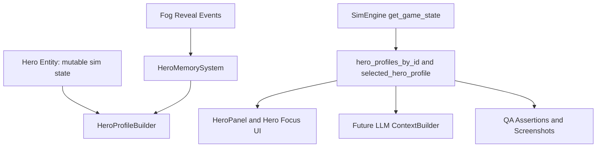

# WK49 Hero Profile Foundation Sprint

## Product Intent

Kingdom Sim needs heroes to feel like real people players can follow, remember, and care about. The immediate sprint goal is to build the shared data scaffolding for that experience: a universal **Hero Profile** read model that UI, future LLM prompts, QA tools, and hero logic can all read without scraping ad hoc fields from `Hero`.

This sprint should be ambitious in architecture but conservative in shipped behavior. We are not building the full emotional/narrative/quest AI system yet. We are building the stable foundation those systems will depend on.

Key player-facing outcome for this sprint:
- Selecting a hero shows a richer profile: identity, level/XP, vitals, economy, equipment, personality, current location, intent, career stats, known places, and recent memories.
- The data shown in the panel comes from the same profile snapshot that future LLM context will use.

Key technical outcome:
- `game/entities/hero.py` remains the mutable hero entity, not the database/UI schema.
- New profile contracts under `game/sim/` become the stable, JSON-friendly read model.
- Per-hero memory starts as deterministic, bounded, sim-time event history.

## Critical Pushback And Scope Boundary

Do **not** implement full emotional simulation, procedural life stories, elaborate quests, or LLM-driven use of memory in this sprint. Those are real roadmap goals, but doing them before the profile contract exists will create coupling and rework.

This sprint should implement:
- Stable hero identity.
- Profile snapshot contract.
- Career stats and deterministic memory primitives.
- First discovery log for known places / revealed objects.
- Profile UI that proves the contract is useful.
- Tests and screenshots.

This sprint should reserve fields/hooks for future:
- Emotional state.
- Life path / purpose / origin story.
- Personal story chapters.
- Relationships and reputation.
- Quest history and personal goals.
- LLM-readable long-term memory.

## Current Inventory To Respect

Relevant existing files:
- [`game/entities/hero.py`](game/entities/hero.py): live mutable hero state, stats, inventory, state machine, intent/decision fields, ranger `_revealed_tiles`.
- [`game/sim/contracts.py`](game/sim/contracts.py): existing lightweight contracts `HeroDecisionRecord`, `HeroIntentSnapshot`.
- [`game/sim_engine.py`](game/sim_engine.py): exposes `heroes`, `selected_hero`, world/fog, and UI state through `get_game_state()` and `build_snapshot()`.
- [`game/ui/hero_panel.py`](game/ui/hero_panel.py): current selected hero left-panel renderer.
- [`game/ui/hud.py`](game/ui/hud.py): left/right panel layout, minimap, selected hero rendering.
- [`game/ui/micro_view_manager.py`](game/ui/micro_view_manager.py): right-panel modes including `HERO_FOCUS`.
- [`ai/context_builder.py`](ai/context_builder.py): current LLM context builder; already asks for `hero_id` but `Hero` does not define one.
- [`tools/capture_screenshots.py`](tools/capture_screenshots.py) and [`tools/screenshot_scenarios.py`](tools/screenshot_scenarios.py): screenshot verification path, including `ui_panels` scenario.

Known issues / gaps:
- `Hero` has no real `hero_id`; duplicate names are already observed in QA.
- `ContextBuilder` has `getattr(hero, "hero_id", None)` but currently receives `None`.
- Several systems still use `hero.name` for behavior/economy/bounty identity. Do not migrate all of those in this sprint unless directly required for profile correctness.
- `_revealed_tiles` is a set, not a chronological memory log, and currently only rangers get tile XP tracking in the fog update.
- There are no skills/spells modeled yet.
- `HERO_FOCUS` right panel currently starts/renders chat; its top-half profile/minimap usage is incomplete.

## Target Architecture



Design rule:
- `Hero` owns the truth for live mutable gameplay state.
- `HeroProfileSnapshot` owns the read shape for UI and future LLM context.
- `HeroMemorySystem` owns chronological profile memory.
- UI and AI should read profile snapshots instead of reconstructing profiles independently.

## Data Model Design

Create a new profile contract module:
- [`game/sim/hero_profile.py`](game/sim/hero_profile.py)

Suggested contract shape. Agents may refine names, but should keep it JSON-friendly and deterministic:

```python
from __future__ import annotations

from dataclasses import asdict, dataclass, field
from typing import Any


@dataclass(frozen=True, slots=True)
class HeroIdentitySnapshot:
    hero_id: str
    name: str
    hero_class: str
    personality: str
    level: int


@dataclass(frozen=True, slots=True)
class HeroProgressionSnapshot:
    xp: int
    xp_to_level: int
    xp_percent: float


@dataclass(frozen=True, slots=True)
class HeroVitalsSnapshot:
    hp: int
    max_hp: int
    health_percent: float
    attack: int
    defense: int
    speed: float


@dataclass(frozen=True, slots=True)
class HeroInventorySnapshot:
    gold: int
    taxed_gold: int
    potions: int
    max_potions: int
    weapon_name: str
    weapon_attack: int
    armor_name: str
    armor_defense: int


@dataclass(frozen=True, slots=True)
class KnownPlaceSnapshot:
    place_id: str
    place_type: str
    display_name: str
    tile: tuple[int, int]
    world_pos: tuple[float, float]
    first_seen_ms: int
    last_seen_ms: int
    visits: int = 0
    last_visited_ms: int | None = None
    is_destroyed: bool = False


@dataclass(frozen=True, slots=True)
class HeroMemoryEntry:
    entry_id: int
    hero_id: str
    event_type: str
    sim_time_ms: int
    summary: str
    subject_type: str = ""
    subject_id: str = ""
    subject_name: str = ""
    tile: tuple[int, int] | None = None
    world_pos: tuple[float, float] | None = None
    tags: tuple[str, ...] = ()
    importance: int = 1


@dataclass(frozen=True, slots=True)
class HeroCareerSnapshot:
    tiles_revealed: int = 0
    places_discovered: int = 0
    enemies_defeated: int = 0
    bounties_claimed: int = 0
    gold_earned: int = 0
    purchases_made: int = 0


@dataclass(frozen=True, slots=True)
class HeroNarrativeSeedSnapshot:
    emotional_state: str = "steady"
    life_stage: str = "adventurer"
    personal_goal: str = "make a name in the kingdom"
    origin_hint: str = ""


@dataclass(frozen=True, slots=True)
class HeroProfileSnapshot:
    identity: HeroIdentitySnapshot
    progression: HeroProgressionSnapshot
    vitals: HeroVitalsSnapshot
    inventory: HeroInventorySnapshot
    career: HeroCareerSnapshot
    narrative: HeroNarrativeSeedSnapshot
    current_state: str
    current_intent: str
    current_location: str
    current_target: str
    last_decision: dict[str, Any] | None = None
    known_places: tuple[KnownPlaceSnapshot, ...] = ()
    recent_memory: tuple[HeroMemoryEntry, ...] = ()

    def to_dict(self) -> dict[str, Any]:
        return asdict(self)
```

Important implementation rules:
- No raw `Hero`, `Building`, `Enemy`, or `World` objects inside profile snapshots.
- Use sim time from `game.sim.timebase.now_ms()`, not wall-clock time.
- Use deterministic IDs / counters, not `id(obj)` or Python `hash()`.
- Keep memory bounded. Suggested defaults: `recent_memory` max 30 entries per hero, known places max 100 per hero for now.
- Use tuples in snapshots so render/AI consumers cannot mutate them accidentally.

## What To Store Versus Derive

Store on or near the hero:
- `hero_id`.
- Career counters.
- Memory entries.
- Known places.
- Narrative seed values that must stay stable over a hero’s lifetime.

Derive during snapshot build:
- HP percentage.
- Attack/defense including buffs/gear/level.
- Current location.
- Current intent.
- Current target display text.
- XP percentage.
- Recent memory slices.

This avoids profile data drifting away from live sim state.

## Future Roadmap Design Notes

The scaffolding should anticipate future systems without implementing them now.

Future emotional state:
- Keep `HeroNarrativeSeedSnapshot.emotional_state` defaulted to `steady` now.
- Later emotional states can be derived from recent memory and current situation: `confident`, `afraid`, `wounded_pride`, `homesick`, `vengeful`, `loyal`, `greedy`, `inspired`.
- Do not let emotion alter combat/economy in this sprint.

Future deterministic life story:
- Reserve `origin_hint`, `life_stage`, `personal_goal`.
- Future sprint can generate deterministic story seeds from `hero_id`, class, and sim seed.
- Avoid generated prose in sim hot paths. Store compact tags and render prose in UI/LLM adapters later.

Future quests:
- Memory entries should be reusable for quest beats: `accepted_quest`, `spotted_lair`, `visited_inn`, `rescued_peasant`, `defeated_enemy`, `claimed_bounty`.
- Known places should be the source for “I know where an inn is” logic later.

Future relationships:
- Do not add relationship graphs now.
- Leave memory entries structured enough that later systems can infer repeated co-travel, shared fights, rescues, etc.

## Sprint Deliverables

Core deliverables:
- New `HeroProfileSnapshot` contract in `game/sim/hero_profile.py`.
- Stable `hero_id` for every hero.
- Per-hero profile memory/known-place primitives.
- Profile builder exposed through `SimEngine.get_game_state()` as `hero_profiles_by_id` and `selected_hero_profile`.
- Expanded hero UI that consumes `selected_hero_profile`.
- Screenshot evidence for the new profile panel.
- Tests for JSON-friendly shape, stable identity, memory bounds, and known-place discovery.

Deferred:
- Full LLM behavior changes.
- Skills/spells gameplay systems.
- Full hero biography generator.
- Emotional state affecting choices.
- Complete migration of all name-keyed systems to `hero_id`.
- Save/load persistence.

## Orchestrator Wave Order

Wave PM — roadmap and hub preparation, solo:
- Agent 01: create a long-term Hero Profile roadmap plan under `.cursor/plans/` and update the PM hub/send list before worker execution. This should happen before implementation waves so future agents have the strategic map and sprint boundaries in writing.

Wave 0 — design guardrails, parallel:
- Agent 02: player-facing acceptance checklist.
- Agent 04: determinism risk review for profile/memory design.
- Agent 07: future narrative/event taxonomy consult.

Wave 1 — profile contracts:
- Agent 03: `game/sim/hero_profile.py` contracts and profile builder skeleton.

Wave 2 — sim-owned hero state and memory:
- Agent 05: `hero_id`, career stats, memory storage/system, known-place event recording.

Wave 3 — integration:
- Agent 03: wire profile snapshots into `SimEngine.get_game_state()`, selected hero profile, fog reveal hooks, and snapshot-safe access.

Wave 4 — UI:
- Agent 08: update `HeroPanel` / hero focus UI to render `HeroProfileSnapshot`.

Wave 5 — AI readiness consult, QA, perf, parallel after UI:
- Agent 06: LLM readiness review only; no behavior changes.
- Agent 10: lightweight performance check for memory/profile overhead.
- Agent 11: automated gates, profile assertions, screenshot verification.

Do not send by default:
- Agent 09 unless profile portraits/icons are explicitly added.
- Agent 12 unless screenshot tooling needs changes.
- Agent 13 unless release notes/version are requested.
- Agent 14/15 no work this sprint.

## Agent 01 Prompt — Executive Producer PM Roadmap

Intelligence: high.

Task:
Create a separate long-term Hero Profile roadmap plan under `.cursor/plans/` before implementation agents start.

Files you may edit:
- `.cursor/plans/**`
- `.cursor/plans/agent_logs/agent_01_ExecutiveProducer_PM.json`

Files you must not edit:
- `game/**`
- `ai/**`
- `tools/**`
- `assets/**`
- `tests/**`
- `config.py`
- `main.py`

Purpose:
This sprint plan is the execution plan for the first vertical slice. Agent 01 must also create a higher-level roadmap that explains how Hero Profile grows over multiple future sprints into a deep Majesty-style hero identity, memory, relationship, quest, emotional-state, and LLM-context platform.

Roadmap plan requirements:
- Save as `.cursor/plans/wk49_hero_profile_roadmap_6f3a1b2c.plan.md` or similar.
- Separate near-term, mid-term, and long-term work.
- Explain which parts are data scaffolding, which are UI, which are gameplay systems, and which are LLM adapters.
- Include explicit future sprint candidates: profile foundation, LLM context adapter, hero pin/watchlist UX, skills/spells, deterministic life story, emotional state, relationship memory, quest history, and broader `hero_id` migration.
- Push back against implementing emotional simulation, full quests, or LLM behavior in WK49 unless Jaimie explicitly expands scope.
- Update the PM hub so worker agents can find both this sprint plan and the roadmap plan.

Recommended roadmap structure:
```markdown
# WK49 Hero Profile Roadmap

## North Star
Heroes become inspectable, memorable people with stable identities, visible life progress, player attachment hooks, and LLM-readable context.

## Phase 1: Foundation
Stable IDs, profile snapshots, memory primitives, known places, HeroPanel MVP.

## Phase 2: LLM Context
Profile-to-LLM adapter, prompt limits, known-place reasoning, memory summaries.

## Phase 3: Attachment UX
Pinned heroes, watch cards, minimap tracking, alerts, favorite hero affordances.

## Phase 4: Gameplay Depth
Skills, spells, equipment depth, personal quests, class paths.

## Phase 5: Inner Life
Emotions, relationships, deterministic origin/life story, purpose, reputation.
```

Verification:
```powershell
python -m json.tool .cursor/plans/agent_logs/agent_01_ExecutiveProducer_PM.json
```

Report back:
- Roadmap plan path.
- PM hub sprint/round path updated.
- Send list with intelligence tags.

## Agent 02 Prompt — GameDirector Product Owner

Intelligence: medium.

Task:
Define player-facing acceptance criteria for the Hero Profile MVP.

Files you may edit:
- `docs/sprint/wk49_hero_profile_acceptance.md` or equivalent sprint docs only.

Context:
The sprint is not just a UI polish pass. It is the first vertical slice of a system that should make heroes feel like people and eventually feed LLM context. The player should be able to click a hero and understand who they are, how they are doing, and what they have recently experienced.

Acceptance criteria should cover:
- Clicking a hero opens a richer profile without crashes.
- The profile shows name, class, level, XP/progress, HP, ATK/DEF, gold, taxed gold, potions, weapon, armor, personality, location, intent, career stats, known places, and recent memory.
- Recent memory should include at least one deterministic event in a normal run, such as discovering or seeing a known place.
- The UI must remain readable at 1920x1080.
- The old basic info must not regress.
- No LLM behavior changes are required this sprint.

Verification:
- Review screenshot output from Agent 11.
- Manual command for Jaimie later:
```powershell
python main.py --no-llm
```

Report back:
- Acceptance checklist path.
- Any design objections or cuts.

## Agent 04 Prompt — NetworkingDeterminism Lead

Intelligence: medium.

Task:
Review the proposed Hero Profile and memory system for determinism risks before implementation.

Files you may edit:
- Prefer docs/log only unless a minimal guardrail is necessary.
- Do not implement profile code unless PM escalates.

Specific risks to check:
- No `time.time()` / wall-clock in profile or memory.
- No Python `id()` or `hash()` as stable profile IDs.
- No unordered `set`/`dict` iteration leaking into profile snapshot order.
- Memory entries must have deterministic order and bounded length.
- Known places should sort deterministically, e.g. by first_seen_ms then place_id.

Verification:
```powershell
python tools/determinism_guard.py
```

Report back:
- Determinism risks.
- Exact guidance to Agents 03/05 if any.

## Agent 07 Prompt — ContentScenario Director

Intelligence: medium.

Task:
Define the future-facing event taxonomy for hero memory without implementing gameplay systems.

Files you may edit:
- `docs/scenarios.md` or a new doc such as `docs/hero_profile_memory_events.md`.

Purpose:
Agent 05 will implement only a small subset this sprint, but we want event names that can grow into quests, personal stories, and LLM memory later.

Recommended event families:
- Discovery: `discovered_place`, `saw_enemy`, `revealed_area`, `spotted_lair`.
- Travel: `visited_building`, `entered_building`, `left_building`.
- Combat: `entered_combat`, `defeated_enemy`, `fled_combat`, `rescued_ally`.
- Economy: `earned_gold`, `paid_tax`, `bought_item`, `claimed_bounty`.
- Social/future: `met_hero`, `fought_alongside`, `received_order`, `defied_order`.
- Narrative/future: `personal_goal_progress`, `memorable_moment`.

Acceptance:
- Produce a compact taxonomy with required fields for each event: event_type, subject_type, subject_id, summary, tags, importance.
- Mark which events are MVP for WK49. Recommended MVP: `discovered_place`, `visited_building`, `bought_item` if easy, `defeated_enemy` if easy.

Verification:
- Documentation review only.

## Agent 03 Prompt — Wave 1 Contracts

Intelligence: high.

Task:
Create the profile contract layer and builder skeleton.

Files you may edit:
- `game/sim/hero_profile.py` new.
- `tests/test_hero_profile_contract.py` new.
- Minimal import wiring only if necessary.

Files you must not edit in Wave 1:
- `game/entities/hero.py`.
- `game/ui/**`.
- `ai/**`.

Implementation details:
- Add frozen/slots dataclasses for identity, progression, vitals, inventory, known places, memory entries, career, narrative seed, and full profile snapshot.
- Add `to_dict()` on `HeroProfileSnapshot`.
- Add helper functions that convert raw values safely:
  - `safe_percent(current, maximum)`.
  - `format_target_label(hero)` if it can be done without importing UI.
  - `sort_known_places(places)` and `sort_memory_entries(entries)` if useful.
- The module must not import pygame, ursina, UI, or LLM modules.
- Keep all fields JSON-friendly: strings, ints, floats, bools, tuples of primitives, dicts only where unavoidable.

Example shape:
```python
@dataclass(frozen=True, slots=True)
class HeroProfileSnapshot:
    identity: HeroIdentitySnapshot
    progression: HeroProgressionSnapshot
    vitals: HeroVitalsSnapshot
    inventory: HeroInventorySnapshot
    career: HeroCareerSnapshot
    narrative: HeroNarrativeSeedSnapshot
    current_state: str
    current_intent: str
    current_location: str
    current_target: str
    last_decision: dict[str, Any] | None = None
    known_places: tuple[KnownPlaceSnapshot, ...] = ()
    recent_memory: tuple[HeroMemoryEntry, ...] = ()
```

Tests:
- Instantiate a fake profile snapshot.
- Assert `to_dict()` returns serializable nested primitives.
- Assert tuple ordering is preserved.
- Assert missing optional fields do not crash.

Commands:
```powershell
python -m pytest tests/test_hero_profile_contract.py
python tools/qa_smoke.py --quick
```

Report back:
- Files touched.
- Contract fields created.
- Any fields deferred.
- Commands + exit codes.

## Agent 05 Prompt — Hero Identity, Career, Memory

Intelligence: high.

Task:
Add stable hero identity and persistent hero-profile state on the simulation side.

Files you may edit:
- `game/entities/hero.py`.
- `game/systems/hero_memory.py` new if needed.
- `tests/test_hero_identity.py` new.
- `tests/test_hero_memory.py` new.

Files you must not edit unless coordinated with Agent 03:
- `game/sim_engine.py`.
- `game/sim/snapshot.py`.
- `game/ui/**`.
- `ai/**`.

Implementation expectations:
- Every hero needs a stable `hero_id` string.
- Prefer adding an optional `hero_id: str | None = None` parameter to `Hero.__init__` and assigning one deterministically when the engine creates heroes.
- If direct `Hero()` test construction still needs a fallback, use a simple deterministic module/class counter only as a fallback and document it. Do not use `id(self)` as profile identity.
- Add small career counters either directly on `Hero` or in a profile state object attached to the hero. Keep it simple and deterministic.

Suggested fields:
```python
self.hero_id = str(hero_id) if hero_id is not None else _next_fallback_hero_id()
self.profile_memory: list[HeroMemoryEntry] = []
self.known_places: dict[str, KnownPlaceSnapshot] = {}
self.profile_career = {
    "tiles_revealed": 0,
    "places_discovered": 0,
    "enemies_defeated": 0,
    "bounties_claimed": 0,
    "gold_earned": 0,
    "purchases_made": 0,
}
```

If importing dataclasses from `game.sim.hero_profile.py` into `hero.py` creates cycles, use lightweight primitive storage on `Hero` and let Agent 03 convert to snapshots later.

Memory rules:
- `profile_memory` must be bounded, suggested max 30 recent entries.
- Memory entry order is chronological by sim time then entry id.
- Known places must update existing entries if seen again; do not spam duplicates every tick.
- MVP known-place key should be stable: building id if available, else `building_type:tile_x:tile_y`.

MVP event recording methods to add:
- `record_profile_memory(entry)` or equivalent.
- `remember_known_place(...)` or equivalent.
- `increment_career_stat(name, amount=1)` or explicit methods.

Important:
- Do not implement emotional behavior, quest behavior, or LLM actions.
- Do not migrate every name-keyed gameplay system in this sprint. If you see name-key bugs, document them as follow-ups unless they block this sprint.

Tests:
- Two heroes with duplicate names still have distinct `hero_id`.
- Memory cap works.
- Known-place dedupe works.
- Career counters increment deterministically.

Commands:
```powershell
python -m pytest tests/test_hero_identity.py tests/test_hero_memory.py
python tools/qa_smoke.py --quick
```

Report back:
- Files touched.
- `hero_id` strategy.
- Memory cap behavior.
- Commands + exit codes.
- Follow-up list for name-keyed systems not migrated.

## Agent 03 Prompt — Wave 3 Sim Integration

Intelligence: high.

Task:
Wire Hero Profile snapshots into the engine and expose them to UI without changing UI yet.

Dependencies:
- Agent 03 Wave 1 contracts complete.
- Agent 05 identity/memory fields complete.

Files you may edit:
- `game/sim_engine.py`.
- `game/sim/snapshot.py` only if needed.
- `game/sim/hero_profile.py`.
- Tests under `tests/`.

Implementation expectations:
- Add a builder function such as `build_hero_profile_snapshot(hero, game_state_or_sim, now_ms=None)` in `game/sim/hero_profile.py`.
- In `SimEngine.get_game_state()`, add:
  - `hero_profiles_by_id`: mapping `hero_id -> HeroProfileSnapshot` or `dict` if UI needs easier access.
  - `selected_hero_profile`: profile for `selected_hero`, or `None`.
- Prefer not to add profiles to `SimStateSnapshot` unless a renderer needs it. HUD currently uses `get_game_state()`, so start there.
- Convert live object references into labels/IDs in the profile.
- Use `hero.get_intent_snapshot()` for current intent/last decision if available.
- Current location should be derived as:
  - `Inside: <Building Type>` if `hero.is_inside_building`.
  - Else `Outdoors`.
- Current target should be a compact string, not raw object.

Discovery integration:
- In fog reveal/update logic, add a hook to remember nearby revealed buildings/places for heroes whose vision revealed them.
- Start with known buildings/lairs/shops, not every tile.
- Avoid per-tick spam. Only record first discovery or meaningful re-seen update.
- Keep ranger tile XP behavior intact.

Suggested known-place logic:
- When `newly_revealed` exists, for each hero revealer, scan buildings whose tile is within that hero vision radius and whose tile is newly visible or was just discovered by that hero.
- Call Agent 05’s `remember_known_place` method.
- Use sim time.
- Use deterministic ordering: sort buildings by building_type then tile.

Tests:
- `get_game_state()` includes `selected_hero_profile` after selecting a hero.
- Profile includes `hero_id`, name, class, XP, inventory, known places, recent memory.
- Discovery hook records one known place and does not duplicate it every update.

Commands:
```powershell
python -m pytest tests/test_hero_profile_contract.py tests/test_hero_memory.py
python tools/qa_smoke.py --quick
```

Report back:
- Files touched.
- Exact game_state keys added.
- Discovery logic summary.
- Commands + exit codes.

## Agent 08 Prompt — Hero Profile UI

Intelligence: high.

Task:
Update the hero UI to consume the new profile snapshot and display the first robust Hero Profile MVP.

Dependencies:
- Agent 03 Wave 3 exposes `selected_hero_profile` in `game_state`.

Files you may edit:
- `game/ui/hero_panel.py`.
- `game/ui/hud.py`.
- `game/ui/micro_view_manager.py` if needed.
- UI tests if existing patterns support them.

Files you must not edit:
- `game/entities/**`.
- `game/sim_engine.py` unless PM explicitly coordinates with Agent 03.
- `ai/**`.

UI design goal:
- Keep the left panel compact and readable.
- Use `selected_hero_profile` as the primary data source.
- Fall back to raw hero fields only as a compatibility bridge if profile is missing during tests.

Recommended left panel sections:
- Header: name, class, level.
- Progression: XP `current / next` and a tiny XP bar if space allows.
- Vitals: HP bar, ATK, DEF.
- Economy: spendable gold, taxed gold.
- Gear: weapon, armor, potions.
- Persona: personality, location.
- Intent: current intent, state, last decision.
- Career: discovered places, enemies defeated, bounties claimed.
- Recent memory: last 2 short memory lines, truncated.

Right panel / HERO_FOCUS recommendation:
- Do not remove chat behavior in this sprint unless it is broken.
- Fill the top half of HERO_FOCUS with an expanded profile/memory summary if possible, while chat remains in bottom half.
- If layout risk is high, keep right panel unchanged and ship the richer left panel first.

Layout constraints:
- Current left width is about 224px; do not use long prose without truncation.
- Use existing `TextLabel`, `HPBar`, panel colors, and divider style.
- Avoid introducing scroll unless absolutely necessary.
- Prioritize readability at 1920x1080.

Suggested rendering helper:
```python
def _profile_get(profile, section: str, field: str, default=""):
    obj = getattr(profile, section, None)
    if obj is None:
        return default
    return getattr(obj, field, default)
```

Verification:
- Run a screenshot capture that selects a hero and shows the profile:
```powershell
python tools/capture_screenshots.py --scenario ui_panels --seed 3 --out docs/screenshots/wk49_hero_profile --size 1920x1080 --ticks 480
```
- Open/read the generated `ui_panels_hero.png` and confirm the new sections are visible and not overlapping.
- Run:
```powershell
python tools/qa_smoke.py --quick
```

Report back:
- Files touched.
- Screenshot path(s).
- What profile sections are visible.
- Any sections deferred for lack of space.
- Commands + exit codes.

## Agent 06 Prompt — LLM Readiness Review Only

Intelligence: medium.

Task:
Review the new Hero Profile snapshot for future LLM use. Do **not** change LLM behavior this sprint.

Files you may edit:
- Prefer docs/log only.
- If PM approves code, only `ai/context_builder.py` tests or non-behavior helper comments.

Review questions:
- Does `HeroProfileSnapshot.to_dict()` contain enough structure for future LLM prompts?
- Are known places and recent memory represented without raw objects?
- What exact subset should future LLM prompts receive to avoid token bloat?
- What should be summarized vs kept verbatim?

Suggested output doc:
- `docs/ai/hero_profile_llm_readiness.md`.

Recommended future LLM adapter shape:
```python
def profile_to_llm_context(profile, *, known_place_limit=8, memory_limit=12) -> dict:
    return {
        "hero": profile.identity,
        "stats": profile.vitals,
        "inventory": profile.inventory,
        "location": profile.current_location,
        "intent": profile.current_intent,
        "known_places": profile.known_places[:known_place_limit],
        "recent_memory": profile.recent_memory[:memory_limit],
    }
```

Verification:
```powershell
python tools/qa_smoke.py --quick
```

Report back:
- LLM-readiness doc path.
- Recommended limits for known places and memory entries.
- Any missing fields that should be added before the future LLM update.

## Agent 10 Prompt — Performance Consult

Intelligence: low.

Task:
Check that profile/memory snapshots do not create obvious performance regressions.

Files you may edit:
- Prefer log only.
- Do not edit game code unless PM escalates.

Commands:
```powershell
python tools/perf_benchmark.py
python tools/qa_smoke.py --quick
```

If `tools/perf_benchmark.py` is unavailable or fails for pre-existing reasons, record that clearly and run `qa_smoke`.

What to watch:
- Profile snapshot building should not do expensive object scans per hero every frame beyond small bounded lists.
- Known-place sorting should be bounded and deterministic.
- Memory entries should be capped.

Report back:
- Benchmark result.
- Any hotspots or recommendations.

## Agent 11 Prompt — QA And Screenshot Verification

Intelligence: medium.

Task:
Verify the integrated Hero Profile sprint with automated gates and screenshot evidence.

Dependencies:
- Agent 08 UI complete.

Files you may edit:
- QA test files if adding assertions.
- `QA_TEST_PLAN.md` if documenting new coverage.
- Avoid game code unless PM escalates.

Required automated commands:
```powershell
python -m pytest tests/
python tools/qa_smoke.py --quick
python tools/validate_assets.py --report
```

Required screenshot command:
```powershell
python tools/capture_screenshots.py --scenario ui_panels --seed 3 --out docs/screenshots/wk49_hero_profile --size 1920x1080 --ticks 480
```

Screenshot checks:
- `ui_panels_hero.png` exists.
- Hero profile is visible after selection.
- Name/class/level still visible.
- XP/progression visible.
- Gold/potions/equipment visible.
- Intent/location/last decision visible or gracefully omitted if no data yet.
- Known places or recent memory section visible without overlap.

Recommended QA assertions to add if straightforward:
- Headless game state includes `selected_hero_profile` when a hero is selected.
- Profile `to_dict()` returns `hero_id`, identity, progression, inventory, career, known places, recent memory.
- Duplicate hero names do not duplicate `hero_id`.

Report back:
- Commands + exit codes.
- Screenshot paths inspected.
- Any UI overlap or missing expected fields.
- Whether manual Jaimie playtest is useful.

## Manual Test For Jaimie

Run from repo root after Agents report green:
```powershell
python main.py --no-llm
```

Duration:
- 5 minutes.

Steps:
- Start the game and wait for heroes to move.
- Click several heroes, especially if duplicate names appear.
- Look at the left profile panel.
- If the right hero-focus panel appears, check whether the profile/chat area is readable.
- Let at least one hero explore or move near buildings.
- Click the same hero again and check whether recent memory / known places updates.

Verify:
- The game does not crash when selecting heroes.
- Each selected hero shows richer profile information than before.
- XP/level/gold/equipment/intent/location are readable.
- Recent memory or known places appears after exploration, or the UI clearly shows an empty state.
- Duplicate hero names do not make the UI obviously mix up heroes.

If it fails:
- Copy/paste the last ~30 terminal lines.
- Screenshot the profile panel.
- Tell PM which hero you clicked and what looked wrong.

Optional second renderer check:
```powershell
python main.py --renderer pygame --no-llm
```

## Definition Of Done

The sprint is done when:
- All active agents updated their logs.
- `HeroProfileSnapshot` exists and is tested.
- Every hero has a non-empty `hero_id`.
- `SimEngine.get_game_state()` exposes profile data for the selected hero.
- Hero UI renders the new profile without crashing or overlapping in screenshot verification.
- Memory/known-place storage is deterministic, bounded, and does not spam duplicates.
- `python tools/qa_smoke.py --quick` passes.
- `python tools/validate_assets.py --report` has 0 errors.
- Jaimie manual smoke is either passed or any failure is ticketed.

## PM Send List With Intelligence Recommendations

Send in this order:
- Wave PM solo: Agent 01 (high).
- Wave 0 parallel: Agent 02 (medium), Agent 04 (medium), Agent 07 (medium).
- Wave 1: Agent 03 (high).
- Wave 2: Agent 05 (high).
- Wave 3: Agent 03 again (high).
- Wave 4: Agent 08 (high).
- Wave 5 parallel: Agent 06 (medium), Agent 10 (low), Agent 11 (medium).

Do not send by default:
- Agent 09, unless portraits/icons become part of scope.
- Agent 12, unless screenshot tooling needs changes.
- Agent 13, unless Jaimie requests release notes.
- Agent 14, Agent 15.

## Universal Prompt For Workers

Use this when kicking off after the PM hub is updated:

```text
You are activated for sprint wk49_hero_profile_foundation.

Read your assignment in the PM hub:
.cursor/plans/agent_logs/agent_01_ExecutiveProducer_PM.json
→ sprints["wk49_hero_profile_foundation"].rounds["<current_round>"]
→ pm_agent_prompts[YOUR_AGENT_NUMBER]

Read the sprint plan:
.cursor/plans/wk49_hero_profile_foundation_274e344b.plan.md

Agent 01 must first create/read the long-term Hero Profile roadmap plan under `.cursor/plans/` and record it in the PM hub. Worker agents should use that roadmap for future-direction context, but must keep implementation scoped to their specific prompt.

Core rule: this sprint builds Hero Profile scaffolding and UI. Do not implement full LLM behavior changes, emotional gameplay, quests, or skills/spells unless your specific prompt says so.

After completing your work:
1. Update your own agent log.
2. Run the commands listed in your prompt, including `python tools/qa_smoke.py --quick` when you changed code.
3. Validate your agent log JSON with `python -m json.tool .cursor/plans/agent_logs/agent_NN_YourRole.json`.
4. Report files touched, commands + exit codes, evidence, blockers, and follow-ups.
```

## Risks

Main risks:
- The sprint could balloon into a full narrative/LLM rewrite. Keep those as roadmap hooks.
- Stable `hero_id` migration could touch too many systems. Use it for profile/memory now; broader gameplay identity migration can be a follow-up.
- HeroPanel width is tight. If the left panel gets crowded, use compact sections and put expanded details in HERO_FOCUS right panel later.
- Discovery memory can become expensive if it scans every building for every hero every frame. Only do work on `newly_revealed`, bound lists, and sort deterministically.
- Duplicate hero names are existing behavior; this sprint should stop profile confusion but may not fix all name-keyed gameplay systems.

## Follow-Up Sprint Candidates

After this foundation lands, good next sprints are:
- LLM Profile Context Adapter: move `ContextBuilder` to consume `HeroProfileSnapshot.to_dict()` with memory limits.
- Hero Pin / Watchlist UX: pin favorite heroes, side card, minimap tracking, alert when hurt.
- Skills and Spells: actual gameplay systems for class abilities.
- Hero Life Story: deterministic origin/purpose/chapters generated from seed and memory milestones.
- Emotional State: derived mood from recent memory, injuries, success/failure, loyalty, fear, greed.
- Identity Migration: convert bounties/economy/combat/AI zones from `hero.name` to `hero_id` safely.