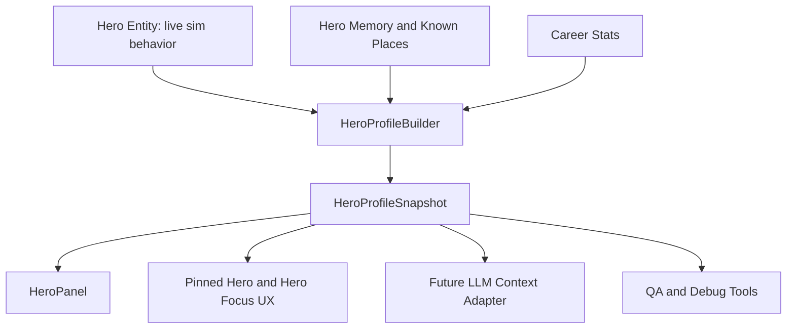

# WK49 Hero Profile Roadmap

## North Star

Heroes should become the soul of Kingdom Sim: inspectable, memorable people with stable identities, visible life progress, a growing memory of the world, and enough structured context for future LLMs to make believable decisions.

The design target is not just “a bigger stat panel.” It is a shared Hero Profile platform that serves four audiences:

- Players, who want to follow favorite heroes and become attached to them.
- UI, which needs one clean profile snapshot instead of scraping fields from `Hero`.
- Simulation systems, which need stable identity and deterministic memory primitives.
- Future LLM prompts, which need compact, structured, bounded context.

## Architectural Rule

`game/entities/hero.py` should remain the live mutable hero entity. It should not become the UI database, narrative database, LLM prompt schema, and memory system all at once.

The roadmap should move toward this shape:



Core principle:
- Store only stable long-lived facts and memory.
- Derive volatile state each frame or on demand.
- Keep snapshots read-only and JSON-friendly.
- Keep future prose generation out of sim hot paths.

## Phase 1: Foundation (WK49)

Goal:
Create the first safe vertical slice. A selected hero has a stable identity, a profile snapshot, a small deterministic memory, known-place scaffolding, and an expanded HeroPanel that proves the contract works.

In scope:
- Stable `hero_id` for every hero.
- `HeroProfileSnapshot` contracts under `game/sim/`.
- Bounded per-hero memory entries.
- Known-place records for discovered buildings/lairs/shops.
- Career counters for early attachment hooks.
- `selected_hero_profile` and `hero_profiles_by_id` in `SimEngine.get_game_state()`.
- HeroPanel reads the profile snapshot where available.
- Screenshot and QA evidence.

Out of scope:
- Full LLM behavior changes.
- Emotional simulation affecting decisions.
- Skills/spells gameplay.
- Full quest framework.
- Save/load persistence.
- Complete migration of every system from `hero.name` to `hero_id`.

Success means the player can click a hero and see a richer character sheet, while engineers have a durable data contract for later work.

## Phase 2: LLM Context Adapter

Goal:
Move LLM context away from ad hoc `ContextBuilder` field gathering and toward the profile snapshot.

Recommended work:
- Add `profile_to_llm_context(profile, limits=...)`.
- Limit known places and memory entries to avoid prompt bloat.
- Add prompt tests that assert key profile sections appear in decision/conversation prompts.
- Preserve current behavior decisions unless explicitly retuned.
- Teach LLM prompts about known places: inns, marketplaces, lairs, guilds, castle, nearby enemies.

Key design choice:
The LLM should receive structured context, not full raw memory. Long memory should be summarized or filtered by relevance:
- current situation first
- known places near current goal
- last 8-12 memory entries
- high-importance memories
- class-relevant memories

Deferred from this phase:
- LLM choosing complex personal quests.
- LLM rewriting personality or emotional state.
- LLM modifying simulation memory directly.

## Phase 3: Attachment UX

Goal:
Let players follow heroes like characters, not units.

Candidate features:
- Pin/favorite a hero.
- Pinned hero watch card in side menu.
- Minimap tracking for pinned hero.
- Alerts when pinned hero is low health, levels up, finds a lair, enters an inn, or claims a bounty.
- Hero focus right panel that shows profile, small map, recent memories, and chat without crowding the left panel.
- Optional memorial card for dead heroes.

Architecture:
- Store pin/favorite as UI/player state keyed by `hero_id`.
- Do not make “pinned” affect sim behavior.
- Use `HeroProfileSnapshot` for rendering watch cards.

## Phase 4: Gameplay Depth

Goal:
Make the profile reflect deeper hero systems.

Candidate systems:
- Skills and spells by class.
- Equipment expansion: trinkets, consumables, upgrades, trophies.
- Class paths or specializations.
- Training milestones.
- Personal quest hooks.
- Inns/taverns as meaningful places for rest, rumors, morale, and social events.

Design guidance:
- Add gameplay systems first as deterministic sim state.
- Then expose them in `HeroProfileSnapshot`.
- Then render them in UI and optionally pass them to LLM.

Avoid:
- UI-only skills that do not exist in sim.
- LLM-only abilities that bypass deterministic systems.

## Phase 5: Inner Life

Goal:
Heroes develop a deterministic personal arc that is readable to the player and useful to future LLMs.

Candidate fields:
- `emotional_state`: steady, afraid, confident, angry, inspired, grieving, greedy, loyal.
- `life_stage`: recruit, adventurer, veteran, legend.
- `personal_goal`: get rich, protect the kingdom, prove courage, master magic, avenge a defeat.
- `origin_hint`: generated from seed, class, and personality.
- `story_chapters`: compact milestones derived from major memories.

Important constraint:
Emotion should start as derived/display state, not as a new behavior driver. Only after it is visible and testable should it influence decisions.

Example future derivation:
- Low HP + fled combat recently -> afraid.
- Claimed several bounties recently -> confident.
- Ally died nearby -> grieving.
- Repeated shopping/wealth gain -> greedy.
- Defended castle successfully -> loyal/inspired.

## Phase 6: Relationships And Reputation

Goal:
Heroes remember each other and the kingdom remembers them.

Candidate systems:
- Hero-to-hero relationship edges.
- Repeated co-combat forms camaraderie.
- Rescue or abandonment events affect trust.
- Reputation by role: monster slayer, coward, explorer, defender, rich miser, tavern regular.
- Building familiarity: favorite inn, trusted marketplace, home guild.

Implementation guidance:
- Start with derived badges from memory.
- Avoid a full relationship graph until memory and profile are stable.
- Keep all relationship keys based on `hero_id`.

## Phase 7: Quest And Story Layer

Goal:
Use Hero Profile data to support richer quests and emergent stories.

Candidate systems:
- Personal quest seeds from profile: “prove myself,” “find a rare item,” “avenge a defeat.”
- World quest hooks from known places: “I know where the crypt is.”
- Rumors discovered at inns.
- Bounty memory: heroes remember who paid, what they fought, where they nearly died.
- Player-facing travelogue generated from memory entries.

Design constraint:
Quest systems should consume profile/memory. They should not own hero identity or duplicate known-place records.

## Identity Migration Track

Stable `hero_id` is foundational. WK49 should create it, but the full migration can be incremental.

Eventually migrate:
- AI zone tracking from `hero.name` to `hero_id`.
- Bounty assignment/claim records.
- Economy purchase records.
- Combat attribution.
- Conversation queues.
- Renderer/debug labels where stable identity matters.

Do not force all of this into WK49. Track it as follow-up unless profile correctness requires it.

## Testing Strategy Across Roadmap

Every phase should keep these gates:

```powershell
python tools/qa_smoke.py --quick
python tools/validate_assets.py --report
```

Profile-specific tests should cover:
- Duplicate hero names get distinct IDs.
- Profile snapshots are JSON-friendly.
- Memory is bounded.
- Known places dedupe.
- Snapshot ordering is deterministic.
- UI screenshots show profile sections without overlap.

Screenshot command for Hero Profile UI:

```powershell
python tools/capture_screenshots.py --scenario ui_panels --seed 3 --out docs/screenshots/wk49_hero_profile --size 1920x1080 --ticks 480
```

## Recommended Sprint Sequence

1. WK49 Hero Profile Foundation: identity, profile snapshot, known places, memory MVP, HeroPanel.
2. LLM Profile Context Adapter: profile-driven prompts with bounded known places and memory.
3. Hero Pin and Watchlist UX: favorite heroes, minimap watch, alert cards.
4. Skills and Spells Profile Expansion: real gameplay systems exposed through profile.
5. Deterministic Life Story: origin, personal goal, story chapters from memory milestones.
6. Emotional State Display: derived mood shown in profile and travelogue.
7. Emotional/Personality Behavior Hooks: carefully let emotion/personality bias AI/LLM decisions.
8. Relationship and Quest Memory: hero-to-hero memory, reputation, personal quests.

## WK49 PM Boundary

For the current sprint, Agent 01 should enforce this boundary:

- Build the data platform and the first readable UI slice.
- Defer LLM behavior changes.
- Defer full emotional simulation.
- Defer skills/spells.
- Defer broad `hero_id` migration except where profile correctness requires it.

This keeps the sprint shippable while aiming the architecture at the much larger hero-simulation vision.
