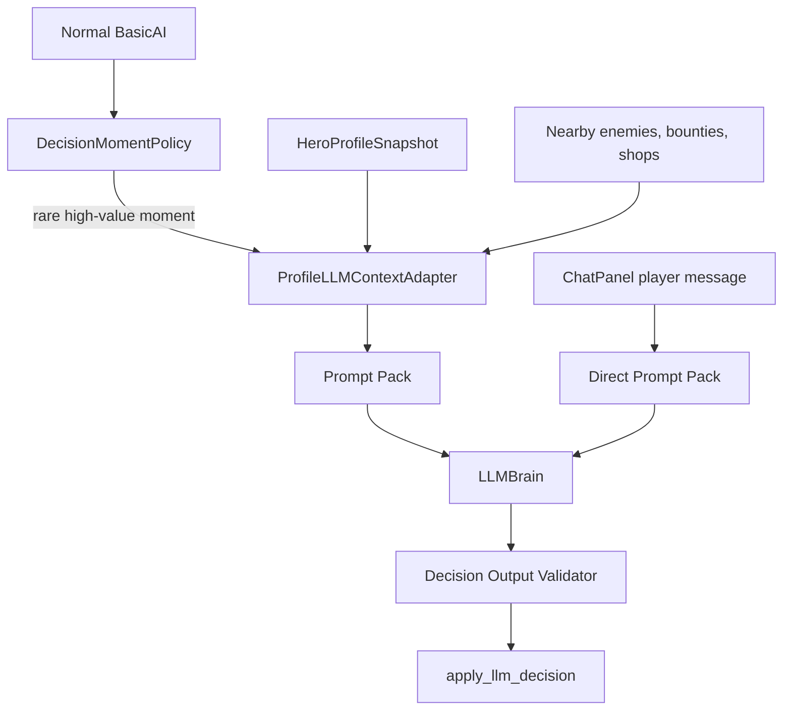
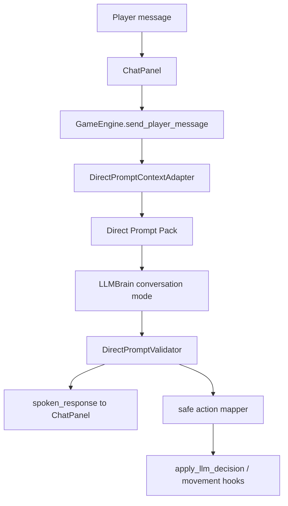

# WK50 Hero LLM Context And Direct Prompts

## Sprint Goal

Build the next layer on top of WK49 Hero Profile: heroes should consult the LLM only at meaningful decision moments, and player chat should become a structured “direct prompt” system where heroes can interpret plain-English requests, respond in character, and optionally execute safe supported actions.

This is one sprint with two sequential phases:

- **Phase 2A — Autonomous Decision Moments:** rare, event-gated LLM calls using HeroProfileSnapshot-derived context.
- **Phase 2B — Direct Prompt Commands:** player-to-hero chat with a distinct prompt pack and safe command execution.

The sprint intentionally does **not** make the LLM run constantly. Normal AI still handles ordinary movement, combat pursuit, shopping routines, bounty heuristics, and fallback decisions.

## Product Thesis

The game’s differentiator is not direct control. It is **natural-language indirect control**:

- The player can speak to a hero in plain English.
- The hero understands supported requests when possible.
- The hero usually obeys safe and feasible requests.
- The hero can refuse or redirect when survival, ignorance, or game rules justify it.
- The final physical action is still validated by deterministic game code.

That preserves the Majesty-like fantasy: heroes are autonomous people, not puppets.

## Current Code To Respect

Relevant current files:

- [`ai/behaviors/llm_bridge.py`](ai/behaviors/llm_bridge.py): current `should_consult_llm`, `request_llm_decision`, `_resolve_move_target`, and `apply_llm_decision`.
- [`ai/context_builder.py`](ai/context_builder.py): current tactical LLM context builder, still mostly live-hero based.
- [`ai/prompt_templates.py`](ai/prompt_templates.py): current generic decision and conversation prompts.
- [`ai/llm_brain.py`](ai/llm_brain.py): request queue, decision processing, conversation processing.
- [`game/engine.py`](game/engine.py): `send_player_message`, `_poll_conversation_response`, and chat response physical action application.
- [`game/ui/chat_panel.py`](game/ui/chat_panel.py): player message input and conversation history.
- [`game/sim/hero_profile.py`](game/sim/hero_profile.py): WK49 `HeroProfileSnapshot`, known places, memory, and profile builder.
- [`game/systems/hero_memory.py`](game/systems/hero_memory.py): memory caps and stable known-place IDs.
- [`tools/observe_sync.py`](tools/observe_sync.py) and [`tools/qa_smoke.py`](tools/qa_smoke.py): current mock LLM/conversation smoke coverage.

Current trigger behavior:
- `should_consult_llm()` calls LLM when low-health fighting or near marketplace with gold, gated by `LLM_DECISION_COOLDOWN` and `pending_llm_decision`.

Current chat behavior:
- Player text goes through `ChatPanel` → `GameEngine.send_player_message()` → `LLMBrain.request_conversation()`.
- Conversation responses may include a `tool_action`; `_poll_conversation_response()` routes that through `apply_llm_decision(..., source="chat")`.

Known gap:
- Conversation mode is currently chat-first, not a reliable command interpreter with strict allowed intents, target validation, and refusal policy.

## Non-Negotiable Scope Boundaries

In scope:
- Rare LLM decision moments.
- Profile-to-LLM context adapter.
- Prompt packs with strong guardrails.
- Direct prompt mode for safe core commands.
- Validation of LLM output before physical actions.
- Tests proving prompts and command handling behave as expected.

Out of scope for MVP:
- Attack lair / attack enemy direct commands. These are explicitly deferred because they carry higher risk and need richer target/risk validation.
- Emotional-state behavior changes.
- Full personal quests.
- Full relationship system.
- LLM-generated new game rules, items, spells, buildings, or quests.
- LLM modifying memory directly.
- Running LLM every tick or on routine AI loops.

Pushback:
- “Go attack the lair east” is an excellent target feature, but not in this MVP. Phase 2B should build the command interpreter and safe execution path first. Attack commands become the next slice once target resolution and safety/refusal are proven.

## Architecture



Design rule:
- `DecisionMomentPolicy` decides **when** to ask.
- `ProfileLLMContextAdapter` decides **what context** to include.
- `PromptPack` decides **how** to ask.
- `OutputValidator` decides **whether** the LLM answer is allowed.
- `LLMBridge` applies only validated physical actions.

## Phase 2A — Autonomous Decision Moments

### Goal

Replace the current ad hoc `should_consult_llm()` logic with a named decision-moment policy that asks the LLM only when a hero faces a meaningful decision.

### MVP Decision Moments

Implement these first:

1. `LOW_HEALTH_COMBAT`
   - Trigger: hero is fighting and HP is below a threshold, likely 50% for “consider,” 25% for “critical.”
   - Allowed actions: `fight`, `retreat`, `use_potion`.
   - Context focus: current enemies, potions, health, nearby allies, known safety.

2. `POST_COMBAT_INJURED`
   - Trigger: hero recently left combat and lost at least 25% HP or is below 50% HP with <=1 potion.
   - Allowed actions: `retreat`, `move_to`, `buy_item`, `use_potion`, `explore`.
   - Context focus: known castle/inn/marketplace, potions, gold, recent fight memory.

3. `RESTED_AND_READY`
   - Trigger: hero is resting/home/inside safety and reaches 95%+ HP, before resuming normal activity.
   - Allowed actions: `leave_building`, `explore`, `move_to`, `buy_item` if appropriate.
   - Context focus: open bounties, known places, current supplies, personality, recent memory.

4. `SHOPPING_OPPORTUNITY` (optional only if low-risk after first three)
   - Trigger: near known marketplace/blacksmith with enough gold and an actual purchase need.
   - Allowed actions: `buy_item`, `leave_building`, `move_to`, `explore`.

### DecisionMoment Contract

Suggested module:
- `ai/decision_moments.py`

Suggested code shape:

```python
from __future__ import annotations

from dataclasses import dataclass
from enum import Enum


class DecisionMomentType(str, Enum):
    LOW_HEALTH_COMBAT = "low_health_combat"
    POST_COMBAT_INJURED = "post_combat_injured"
    RESTED_AND_READY = "rested_and_ready"
    SHOPPING_OPPORTUNITY = "shopping_opportunity"


@dataclass(frozen=True, slots=True)
class DecisionMoment:
    moment_type: DecisionMomentType
    urgency: int
    reason: str
    allowed_actions: tuple[str, ...]
    context_focus: tuple[str, ...]
    cooldown_ms: int
```

Important:
- This module should not import pygame/ursina/UI.
- Use sim time only.
- It may inspect hero/game_state but should not mutate hero state.

### Context Adapter

Suggested module:
- `ai/profile_context_adapter.py`

Purpose:
Build bounded LLM context from `HeroProfileSnapshot` plus tactical state.

Suggested function:

```python
def build_llm_context_for_moment(hero, game_state: dict, moment: DecisionMoment) -> dict:
    profile = get_profile_for_hero(hero, game_state)
    return {
        "moment": {...},
        "hero_profile": compact_profile(profile),
        "current_situation": compact_situation(hero, game_state),
        "known_places": filter_known_places(profile, moment),
        "recent_memory": filter_recent_memory(profile, moment),
        "allowed_actions": list(moment.allowed_actions),
    }
```

Context limits:
- Known places: max 8.
- Recent memory: max 8-12.
- Nearby enemies: max 5.
- Nearby allies: max 5.
- Bounties: max 5.

Prioritize:
- Current danger/situation.
- Relevant known places.
- Recent high-importance memories.
- Class/personality.
- Supplies: HP, potions, gold.

Do not include:
- Raw objects.
- Full world/building lists.
- Full memory history.
- UI-only panel state.

### Autonomous Prompt Pack

Suggested module:
- Either extend `ai/prompt_templates.py` carefully or create `ai/prompt_packs.py`.

Recommended: create `ai/prompt_packs.py` to avoid making `prompt_templates.py` more crowded.

Autonomous system prompt should be stricter than current generic prompt:

```text
You are an autonomous hero in Kingdom Sim, an indirect-control fantasy kingdom simulation.
You are not directly controlled by the player. You make decisions based on your identity, personality, current situation, known places, and survival needs.

You must obey game reality:
- Use only actions in allowed_actions.
- Do not invent buildings, enemies, items, spells, coordinates, memories, or quests.
- Use known places when choosing destinations.
- Personality may bias your risk tolerance but must not override obvious survival.
- If uncertain, choose the safest valid action.

Return strict JSON only.
```

Decision output shape:

```json
{
  "action": "retreat",
  "target": "castle",
  "reasoning": "I am wounded and have no potions.",
  "confidence": 0.84,
  "memory_used": ["mem_12"],
  "personality_influence": "cautious but still loyal"
}
```

Validator requirements:
- `action` must be allowed for the `DecisionMoment`.
- `target` must resolve if action needs a target.
- Invalid output falls back to deterministic `get_fallback_decision()`.

## Phase 2B — Direct Prompt Commands

### Goal

Upgrade hero chat from “conversation with optional tool_action” into a distinct direct prompt system.

The player can say plain-English things like:
- “Go home and heal.”
- “Go to the inn.”
- “Buy some potions.”
- “Explore east.”
- “How are you doing?”

The hero should respond in character and, when the command is supported and safe, execute an allowed physical action.

### MVP Command Scope

Selected scope: **Safe core commands only**.

Supported intents:

- `status_report`
- `return_home`
- `seek_healing`
- `go_to_known_place`
- `buy_potions`
- `explore_direction`
- `rest_until_healed`
- `no_action_chat_only`

Deferred intents:
- `attack_known_lair`
- `attack_nearest_enemy`
- `accept_bounty_by_description`
- `escort/follow/protect`
- complex personal quest requests

Reason for deferral:
- Attack commands need stronger target resolution, risk scoring, and refusal thresholds. Build the interpreter and safe action pipeline first.

### Direct Prompt System Prompt

This should not reuse the autonomous decision prompt. It needs a “Sovereign Interaction” frame:

```text
You are {hero_name}, a hero in Kingdom Sim.
The Sovereign may speak to you in plain English.
You are not mind-controlled, but you usually try to honor clear requests if they are safe, possible, and within your abilities.

You may only choose supported command intents.
Do not invent places, enemies, items, spells, coordinates, memories, or quests.
Use only known places and visible/current context.
If a request is unsafe, impossible, unknown, or outside supported commands, refuse or redirect in character and choose the safest useful alternative.

Return strict JSON only.
```

### Direct Prompt Output Schema

Recommended output:

```json
{
  "spoken_response": "Aye, Sovereign. I will return to the castle and recover.",
  "interpreted_intent": "return_home",
  "tool_action": "move_to",
  "target_kind": "known_place",
  "target_id": "castle:home",
  "target_description": "Castle",
  "obey_defy": "Obey",
  "refusal_reason": "",
  "safety_assessment": "safe",
  "confidence": 0.9
}
```

Refusal example:

```json
{
  "spoken_response": "My lord, I am too wounded to wander farther. I will seek healing first.",
  "interpreted_intent": "seek_healing",
  "tool_action": "retreat",
  "target_kind": "known_place",
  "target_id": "castle:home",
  "target_description": "Castle",
  "obey_defy": "Defy",
  "refusal_reason": "critical_health",
  "safety_assessment": "unsafe_requested_action",
  "confidence": 0.86
}
```

### Direct Prompt Validation

Add a validator before applying any physical action.

Rules:
- `interpreted_intent` must be in supported intents.
- `tool_action` must map to a known physical action: `move_to`, `retreat`, `buy_item`, `use_potion`, `explore`, `leave_building`, or `null`.
- `target_id` must resolve for `go_to_known_place`, `return_home`, `seek_healing`, and `buy_potions` if a place is required.
- Unknown target should become a refusal/redirect, not invented movement.
- Critical HP should override risky movement and redirect to healing/safety.
- Unsupported text should return `no_action_chat_only` with an in-character response.

### Direct Prompt Physical Action Mapping

Safe core command mapping:

- `return_home` -> `move_to` or `retreat` toward castle/home.
- `seek_healing` -> `use_potion` if potion and low HP, else `retreat`/`move_to` known safety.
- `go_to_known_place` -> `move_to` only if known place resolves.
- `buy_potions` -> `move_to` known marketplace if not there; `buy_item` if near shop and can afford.
- `explore_direction` -> deterministic target position in requested direction, bounded by map/fog/navigation rules.
- `status_report` -> no physical action.
- `rest_until_healed` -> stay/rest/return home depending current location.
- `no_action_chat_only` -> no physical action.

Do not let the LLM directly set coordinates. It may select a known target or direction; deterministic code resolves the actual destination.

## Data Flow



## Agent Wave Plan

### Wave 0 — Design Guardrails

Parallel:
- Agent 02: player acceptance and game-feel rules.
- Agent 04: determinism/MP-readiness review.
- Agent 05: safety threshold consult for HP/potions/resting, no implementation unless needed.

### Wave 1 — Phase 2A Contracts

Sequential:
- Agent 06: decision moment contracts, profile context adapter, autonomous prompt pack, output validator skeleton.

### Wave 2 — Phase 2A Integration

Sequential:
- Agent 06: replace/extend `should_consult_llm()` with decision-moment policy and context adapter.
- Agent 03: only if engine/profile game_state access needs architecture support. Prefer Agent 06 alone if no engine changes are required.

### Wave 3 — Phase 2A QA

Parallel:
- Agent 11: tests for decision moments, prompt content, mock LLM path.
- Agent 10: optional perf/cost consult for LLM frequency/cooldowns.

### Human Gate A

Jaimie/manual sanity check optional before direct prompts:

```powershell
python main.py --provider mock
```

Check heroes still behave normally and LLM calls do not spam.

### Wave 4 — Phase 2B Direct Prompt Contracts

Sequential:
- Agent 06: direct prompt schema, prompt pack, command intent validator, mock provider support.

### Wave 5 — Phase 2B Engine/UI Integration

Sequential or parallel if file ownership is clean:
- Agent 03: physical action target resolution and engine/chat bridge support if needed.
- Agent 08: chat UI feedback for command accepted/refused/pending, if needed.

### Wave 6 — Phase 2B QA

Sequential:
- Agent 11: direct prompt tests, mock conversation scenario, qa_smoke, screenshot/manual instructions.

## Agent Prompts

### Agent 02 — GameDirector Product Owner

Intelligence: medium.

Task:
Define player-facing acceptance criteria for Phase 2A and 2B.

Focus:
- LLM use should feel rare and meaningful.
- Direct prompt commands should preserve indirect control.
- Heroes should usually obey safe supported requests but refuse unsafe/impossible ones in character.
- MVP direct commands are safe core commands only; attack lair/enemy commands are future.

Files you may edit:
- Docs/acceptance files only.

Acceptance examples:
- A wounded hero may refuse an unsafe request and seek healing.
- “Go home” should produce a response and physical movement toward known safety when possible.
- “Buy potions” should work only if affordable/possible or explain why not.
- Unsupported requests should not invent systems.

Verification:
- Review Agent 11’s mock prompt tests and manual smoke notes.

### Agent 04 — NetworkingDeterminism Lead

Intelligence: medium.

Task:
Review decision moments and direct prompt command execution for determinism/MP-readiness.

Key concerns:
- LLM call timing must be gated by sim time, not wall-clock.
- Decision moment ordering must be deterministic.
- Direct prompt physical effects must be validated by deterministic game code.
- LLM output is advisory and non-authoritative until validated.
- Avoid storing unbounded prompt/response history in sim state.

Run:

```powershell
python tools/determinism_guard.py
```

Report exact risks and guidance.

### Agent 05 — Gameplay Safety Consult

Intelligence: medium.

Task:
Define safety thresholds and action rules for direct prompt refusal/redirect.

Suggested policy:
- HP <= 25%: refuse risky travel/combat; prefer potion or safety.
- HP <= 50% and <=1 potion: prefer healing/rest before exploration.
- No known target: refuse/redirect to scout or status report.
- No gold/no shop: cannot buy potions; explain.

Files:
- Prefer docs/log only.
- Do not implement unless PM escalates.

### Agent 06 — Phase 2A LLM Architecture

Intelligence: high.

Task:
Implement decision moments, profile-to-LLM context adapter, autonomous prompt pack, and validation for autonomous decision outputs.

Files you may edit:
- `ai/decision_moments.py`
- `ai/profile_context_adapter.py`
- `ai/prompt_packs.py` or `ai/prompt_templates.py`
- `ai/behaviors/llm_bridge.py`
- `ai/llm_brain.py` only if needed
- Tests under `tests/`

Implementation requirements:
- Add `DecisionMomentType` and `DecisionMoment`.
- Add a pure function that determines the current moment or `None`.
- Replace broad `should_consult_llm()` logic with decision moment gating.
- Build LLM context from `HeroProfileSnapshot` when available, falling back safely to current `ContextBuilder` data.
- Add per-moment allowed actions.
- Validate returned actions against allowed actions.
- Preserve fallback behavior when no LLM or invalid output.

Do not:
- Add attack direct commands.
- Make LLM calls every tick.
- Let LLM invent targets.

Tests:
- Moment triggers only when expected.
- Cooldown/pending request still suppresses calls.
- Low-health combat includes only fight/retreat/use_potion.
- Post-combat injured context includes known places and recent memory if available.
- Invalid LLM action falls back.

Commands:

```powershell
python -m pytest tests/
python tools/qa_smoke.py --quick
```

### Agent 06 — Phase 2B Direct Prompt System

Intelligence: high.

Task:
Create direct prompt command interpreter for player-to-hero chat.

Files you may edit:
- `ai/prompt_packs.py` or `ai/prompt_templates.py`
- `ai/direct_prompt.py` if creating a focused module
- `ai/llm_brain.py`
- `ai/behaviors/llm_bridge.py`
- `ai/providers/mock_provider.py`
- Tests under `tests/`

Required command intents:
- `status_report`
- `return_home`
- `seek_healing`
- `go_to_known_place`
- `buy_potions`
- `explore_direction`
- `rest_until_healed`
- `no_action_chat_only`

Required schema:
- `spoken_response`
- `interpreted_intent`
- `tool_action`
- `target_kind`
- `target_id`
- `target_description`
- `obey_defy`
- `refusal_reason`
- `safety_assessment`
- `confidence`

Validation:
- Reject unsupported intent.
- Reject invented target IDs.
- Critical HP redirects to healing/safety.
- Unknown direct command becomes chat-only response.

Mock provider:
- Add deterministic mock responses for common player prompts:
  - “go home”
  - “heal up”
  - “buy potions”
  - “go to the inn”
  - “explore east”
  - “how are you doing?”
  - “attack the lair” should be refused/deferred in MVP.

Commands:

```powershell
python -m pytest tests/
python tools/qa_smoke.py --quick
```

### Agent 03 — Engine/Action Bridge

Intelligence: high.

Task:
Support safe physical execution of validated direct prompt commands if Agent 06 needs engine-side help.

Files you may edit:
- `game/engine.py`
- `game/game_commands.py`
- `game/sim_engine.py` only if needed
- Tests under `tests/`

Likely needs:
- Route direct prompt response schema from conversation polling into a validated action mapper.
- Resolve known-place `target_id` to a destination.
- Resolve `explore_direction` into deterministic bounded destination.
- Keep chat response display separate from physical action.

Do not:
- Let LLM set raw coordinates directly.
- Add attack lair/enemy commands in MVP.

Commands:

```powershell
python -m pytest tests/
python tools/qa_smoke.py --quick
```

### Agent 08 — Chat UX Support

Intelligence: medium.

Task:
Improve chat panel feedback only if needed for clarity.

Files you may edit:
- `game/ui/chat_panel.py`
- `game/ui/hud.py`
- `game/ui/micro_view_manager.py`
- UI tests if useful

Possible UI changes:
- Show when a hero accepted a command.
- Show when a hero refused or redirected.
- Keep physical action feedback readable and not spammy.

Do not:
- Change LLM prompts.
- Implement command logic.

Screenshot/manual check:

```powershell
python tools/capture_screenshots.py --scenario ui_panels --seed 3 --out docs/screenshots/wk50_llm_direct_prompt --size 1920x1080 --ticks 480
```

### Agent 10 — Perf/Cost Consult

Intelligence: low.

Task:
Verify LLM call frequency stays controlled.

Check:
- Decision moments do not spam requests.
- Cooldowns still work.
- No large profile/memory prompt dumps every tick.

Run if available:

```powershell
python tools/perf_benchmark.py
python tools/qa_smoke.py --quick
```

### Agent 11 — QA Lead

Intelligence: high.

Task:
Build/verify regression coverage for Phase 2A and 2B.

Required tests:
- Decision moment trigger tests.
- Prompt content tests asserting identity, purpose, current situation, allowed actions, known places, and strict JSON instructions.
- Direct prompt tests for safe core commands.
- Mock LLM conversation scenario.
- Invalid/unsupported direct prompts do not cause physical invalid actions.

Required commands:

```powershell
python -m pytest tests/
python tools/qa_smoke.py --quick
python tools/validate_assets.py --report
```

Manual smoke for Jaimie after green:

```powershell
python main.py --provider mock
```

Duration:
- 5-10 minutes.

Steps:
- Open a hero chat.
- Ask “how are you doing?” and verify status response only.
- Ask “go home” and verify response plus movement toward home/safety when feasible.
- Ask “buy potions” and verify buy/move/refusal depending situation.
- Ask “explore east” and verify a safe movement/explore response.
- Ask “attack the lair” and verify MVP refuses or says it cannot do that yet, not hallucinating an attack.
- Try a badly wounded hero and verify unsafe requests redirect toward healing.

## Orchestrator Send List

Recommended order:

- Wave 0 parallel: Agent 02 (medium), Agent 04 (medium), Agent 05 (medium consult).
- Wave 1: Agent 06 (high) — Phase 2A contracts/context/prompt pack.
- Wave 2: Agent 06 (high), then Agent 03 (high only if engine help is needed) — Phase 2A integration.
- Wave 3 parallel: Agent 11 (high), Agent 10 (low) — Phase 2A QA/perf.
- Human Gate A: optional mock-provider sanity check.
- Wave 4: Agent 06 (high) — Phase 2B direct prompt contracts/schema/mock provider.
- Wave 5: Agent 03 (high) and Agent 08 (medium) if needed for engine/chat UX.
- Wave 6: Agent 11 (high) — final verification.

Do not send by default:
- Agent 07 unless PM wants quest taxonomy expanded now.
- Agent 09 unless UI/icon polish is requested.
- Agent 12 unless QA needs new tooling support.
- Agent 13 unless release notes are requested.
- Agent 14/15.

## Definition Of Done

Phase 2A done when:
- LLM calls are gated by named `DecisionMoment` types.
- Existing cooldown/pending request behavior still works.
- Profile context is used or safely available for autonomous prompts.
- Mock LLM path passes.
- Invalid LLM decisions fall back safely.

Phase 2B done when:
- Direct prompt command interpreter exists.
- Safe core commands can produce validated physical actions or clear refusals.
- Unsupported/unsafe requests do not hallucinate actions.
- Player chat still works as conversation.
- Tests and QA smoke pass.

Sprint done when:
- `python -m pytest tests/` passes.
- `python tools/qa_smoke.py --quick` passes.
- `python tools/validate_assets.py --report` has 0 errors.
- Jaimie manual mock-provider smoke passes or issues are ticketed.

## Future Follow-Ups

After this sprint:
- Add `attack_known_lair` once target/risk validation is strong.
- Add `attack_nearest_enemy` and bounty-specific natural-language requests.
- Add direct prompt memory: heroes remember major instructions and refusals.
- Add emotional/personality bias to direct prompt refusal style.
- Add richer player-facing command feedback in the Hero Profile panel.
- Eventually support true Majesty-like natural-language bounties/incentives without direct control.