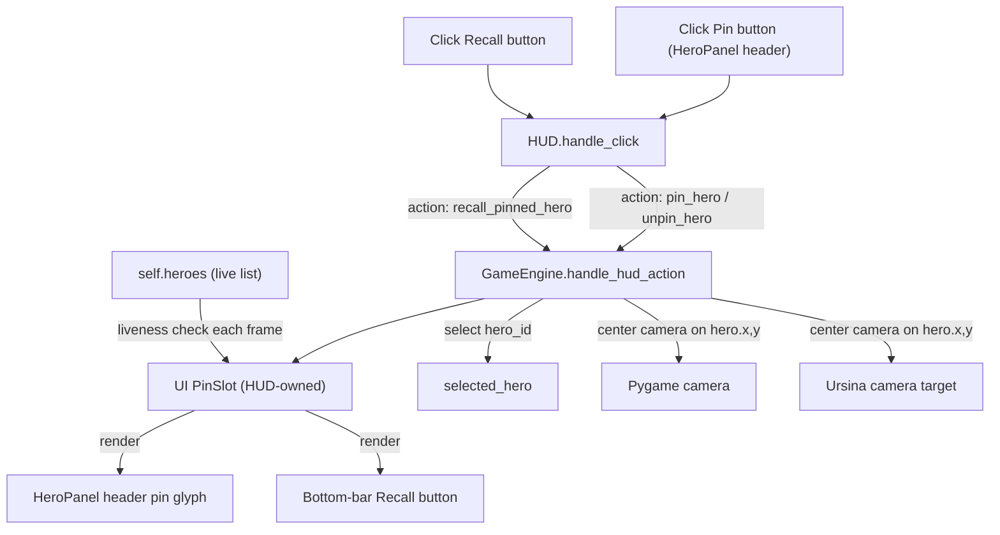
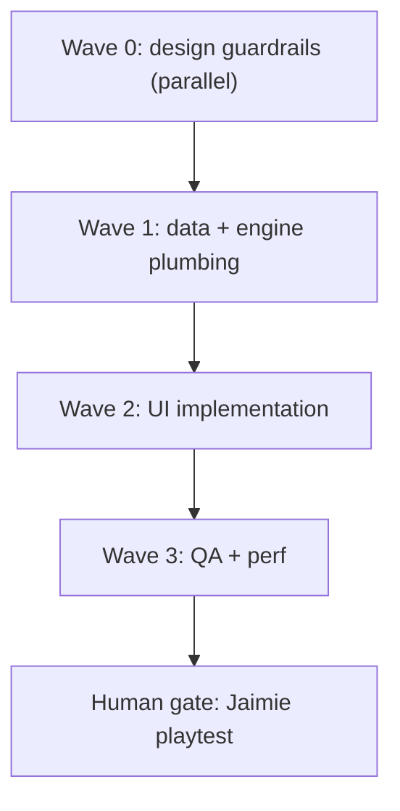

# WK51 Phase 3 — Attachment UX (Pin + Recall MVP)

> Sprint plan, written by Agent 01 (PM). Implementing agents: 02, 03, 04, 08, 10, 11. Scope is intentionally small. Reasoning is embedded inline so worker agents do not have to re-derive it.

## North Star

Players should be able to **pick a favorite hero**, click away to manage the kingdom, and **come back to that hero with one button** without hunting through the world. That's it. WK51 is the minimal hook for player attachment, not a full Phase 3 build-out.

## Locked Scope

### In scope (this sprint)

1. A **Pin toggle button** at the top of the left `HeroPanel` (visible whenever a hero is selected). Click it to pin/unpin the currently selected hero.
2. A **single pin slot** (the most recently pinned hero replaces any prior pin).
3. A **Recall button** on the bottom HUD (left side, between minimap and command bar). When a hero is pinned, this button is visible and shows the hero's name. Clicking it: (a) selects the pinned hero (reopens the left HeroPanel), and (b) pans the camera so that hero is centered on screen — both Pygame and Ursina renderers.
4. **Fallen handling**: if the pinned hero dies, the recall button shows disabled with `"{Name} (fallen)"` for ~10 seconds (sim time), then auto-clears the pin slot and hides the button.
5. **Determinism guarantee**: pinning, unpinning, and recall must not mutate any sim state. They are pure UI/player state.

### Out of scope (defer)

- Watch card / mini side card showing pinned hero stats while a different hero is selected.
- Minimap tracking marker for the pinned hero.
- Toast/alerts on low-HP, level-up, finds-lair, enters-inn, claims-bounty.
- Dedicated Hero Focus right panel (already exists in WK49 form; not extending it this sprint).
- Memorial card / death obituary screen.
- Multi-pin / cycling through several pins.
- Persistence across game session restarts (single-session UI state only).
- New art assets — pin button is **procedural** (Pygame draw calls); Agent 09 may polish later.
- Any change to LLM behavior or AI behavior. (Pin must NOT bias AI.)

### Renderer reality (read this before claiming "Ursina only" means Pygame is untouched)

The `HUD` class in [`game/ui/hud.py`](game/ui/hud.py) is **shared by both renderers**. Ursina draws it as a virtual-screen overlay (see `HUD.virtual_pointer_in_hud_chrome`). Therefore all UI changes for WK51 land in **`game/ui/hud.py`** and **`game/ui/hero_panel.py`**, and they ship in Ursina (default) and Pygame simultaneously. There is no separate Ursina-native HUD to author.

The only renderer-specific surface is **camera centering** (the world-coord camera is different between `GameEngine` for Pygame and `UrsinaApp` for Ursina). Agent 03 owns reconciling that.

## Architecture



Key invariant: `PinSlot` reads from the live `heroes` list and from `game_state["hero_profiles_by_id"]` to render label text and detect death; it never writes to either.

## Data Contract

A new tiny module: [`game/ui/pin_slot.py`](game/ui/pin_slot.py) (Agent 03 owns scaffolding; Agent 08 wires UI).

```python
# game/ui/pin_slot.py
from dataclasses import dataclass
from typing import Optional

PIN_FALLEN_DISPLAY_MS = 10_000  # show "(fallen)" for 10 sim-seconds before auto-clearing


@dataclass
class PinSlot:
    """UI-only pinned-hero slot. NEVER touched by sim code."""
    hero_id: Optional[str] = None
    pinned_at_ms: int = 0
    fallen_since_ms: Optional[int] = None  # set when pinned hero stops appearing alive

    def pin(self, hero_id: str, now_ms: int) -> None:
        self.hero_id = str(hero_id)
        self.pinned_at_ms = int(now_ms)
        self.fallen_since_ms = None

    def unpin(self) -> None:
        self.hero_id = None
        self.pinned_at_ms = 0
        self.fallen_since_ms = None

    def update_liveness(self, hero_alive: bool, now_ms: int) -> None:
        """Call once per frame. Marks fallen if pinned hero is no longer alive,
        and auto-clears the slot after PIN_FALLEN_DISPLAY_MS."""
        if self.hero_id is None:
            return
        if not hero_alive and self.fallen_since_ms is None:
            self.fallen_since_ms = int(now_ms)
        if self.fallen_since_ms is not None:
            if int(now_ms) - int(self.fallen_since_ms) >= PIN_FALLEN_DISPLAY_MS:
                self.unpin()

    def is_fallen(self) -> bool:
        return self.fallen_since_ms is not None
```

`HUD` owns one instance (`self._pin_slot = PinSlot()`).

## Existing surfaces to integrate with (concrete file pointers)

- [`game/ui/hud.py`](game/ui/hud.py) — owns layout (`_layout_rects_for_screen`), rendering (`render`), click routing (`handle_click`), and already exposes `selected_hero` from `game_state`. The bottom bar's `command` rect width is computed as `cmd_w = max(0, speed_rect.left - cmd_x - gutter)`. We will narrow it to make room for the recall button.
- [`game/ui/hero_panel.py`](game/ui/hero_panel.py) — `HeroPanel._render_standard_hero` draws the header rect at `panel_y + pad - 4`. The close X is drawn separately by HUD via `_render_left_close_button` at `(left_rect.right - size - 6, ...)`. Pin button uses the **same pattern**: HUD draws the pin toggle at `(left_rect.right - size*2 - 12, left_rect.y + 6)` so the close X sits to its right.
- [`game/sim_engine.py`](game/sim_engine.py) — `get_game_state()` already exposes `hero_profiles_by_id`; this is the safe lookup table for the recall label and liveness.
- [`game/engine.py`](game/engine.py) — already routes HUD actions in `handle_click`. Add two new tokens: `pin_hero`, `unpin_hero`, `recall_pinned_hero`.
- Camera: Pygame side already has camera state on `GameEngine` (look near `update_camera`/`_camera_dt`). Ursina side: `game/graphics/ursina_app.py` and `game/graphics/ursina_renderer.py`. Agent 03 must locate the existing world→camera mapping and add a one-line "center camera on (x, y)" helper. Both renderers must respond to the same `recall_pinned_hero` action via `GameCommands` if needed.
- `Hero.hero_id` — exists from WK49 and is the only stable key. **Never key off `hero.name`** (duplicate names exist; see `[observe] Duplicate hero names detected: {'Cedric': 2, 'Nova': 3, 'Brock': 2}` in current smoke runs).

## Wave Plan



- **Wave 0 (parallel)**: Agent 02 acceptance criteria + Agent 04 determinism review. No code changes.
- **Wave 1 (sequential)**: Agent 03 lands `PinSlot`, the engine action handlers, and a unified `center_camera_on_world_pos(x, y)` helper that works in both renderers. Adds tests for engine routing.
- **Wave 2 (sequential, after Wave 1)**: Agent 08 wires the pin button on the HeroPanel, the recall button on the bottom HUD, and the fallen-state countdown rendering.
- **Wave 3 (parallel)**: Agent 11 final QA + screenshots, Agent 10 perf sanity (low intelligence consult).
- **Human gate**: Jaimie playtest with `python main.py --provider mock`.

## Definition of Done (sprint-level)

- Selecting a hero shows a Pin toggle in the left HeroPanel header. Clicking it pins/unpins.
- A Recall button appears on the bottom HUD when a hero is pinned, showing the pinned hero's name.
- Clicking Recall reselects the pinned hero and the camera pans/centers on them in **both** renderers.
- If the pinned hero dies, the Recall button shows `{Name} (fallen)` disabled for ~10 sim-seconds, then disappears.
- `python -m pytest tests/` PASS, `python tools/qa_smoke.py --quick` PASS, `python tools/validate_assets.py --report` errors=0.
- `python tools/determinism_guard.py` PASS — pin/unpin/recall must not appear in sim code.
- Screenshot evidence captured under `docs/screenshots/wk51_attachment_ux/` showing: hero selected with pin button, pinned state, recall button on bottom bar, fallen state.
- Agent 11 manual smoke instructions delivered to Jaimie.

## Open questions / explicit non-decisions

- **Camera pan duration**: The plan defaults to **instant snap**. Smooth easing is out of scope (would require introducing a tween system on both renderers). Agent 03 may add a 1-frame snap helper; if a tween is trivial in either renderer, OK to add as a pure presentation effect.
- **Pin button art**: Procedural for MVP (gold-bordered circle with a "P" glyph). Agent 09 may replace with a real icon in a future polish slice.
- **Persistence**: Pin slot is in-memory only and resets on new game / restart. Persistence (save/load integration) is deferred until WK49 roadmap Phase 1 follow-up adds save/load anyway.
- **Tooltip**: A small tooltip on hover for the pin button would be nice ("Pin hero — bring back via bottom bar"). Optional, Agent 08 to include only if cheap.

## Send List

| Wave | Agents | Intelligence | Notes |
|------|--------|--------------|-------|
| 0    | 02, 04 | medium, low  | Parallel. Doc/log only. |
| 1    | 03     | high         | Engine + data scaffolding. |
| 2    | 08     | high         | UI multi-touch-point work. |
| 3    | 11, 10 | high, low    | Parallel QA + perf. |

Do not send: 05, 06, 07, 09 (defer), 12, 13, 14, 15.

## Files Likely Touched

- New: `game/ui/pin_slot.py`, `tests/test_wk51_pin_slot.py`, `tests/test_wk51_recall_routing.py`.
- Edited: `game/ui/hud.py`, `game/ui/hero_panel.py`, `game/engine.py`, `game/graphics/ursina_app.py` (camera helper), `game/sim_engine.py` only if a state-lookup hook is genuinely needed (likely not).
- Test/screenshot: `docs/screenshots/wk51_attachment_ux/`.

---

# Agent Prompts (full text — these are what Agent 01 will paste)

> Reasoning has been pre-baked. Do not re-derive scope. Read the parent plan markdown if you need broader context, but your prompt below is sufficient to do the work.

## Agent 02 — GameDirector / Product Owner (Wave 0, MEDIUM)

You are activated for sprint `wk51_attachment_ux_phase3`, round `wk51_r1_design_guardrails`. Your task is **acceptance criteria only — no code edits**.

Read [`.cursor/plans/wk51_attachment_ux_phase3.plan.md`](.cursor/plans/wk51_attachment_ux_phase3.plan.md) (full plan), and [`.cursor/plans/wk49_hero_profile_roadmap_6f3a1b2c.plan.md`](.cursor/plans/wk49_hero_profile_roadmap_6f3a1b2c.plan.md) Phase 3 section, then write a **player-facing 5–7 point acceptance checklist** under `docs/sprint/wk51_attachment_ux_acceptance.md`. The checklist must be verifiable in **5 minutes of manual play with `python main.py --provider mock`**.

Required acceptance points (you may rephrase but must cover all of these):

1. With a hero selected, a Pin button is visible in the top-right of the left hero panel and reads as either pinned or not pinned at a glance.
2. Clicking Pin while a hero is selected does not change anything in the world (no AI/movement/economy effect).
3. After pinning a hero and clicking somewhere else (closing the panel), a Recall button appears on the bottom HUD with that hero's name.
4. Clicking Recall reopens that hero's left panel AND moves the camera to center on them in less than one second, in both 3D (Ursina) and 2D (Pygame) renderers.
5. If a different hero is pinned afterwards, the Recall button updates to the new hero (single slot replaces).
6. If the pinned hero dies, Recall shows their name with "(fallen)" greyed out for about 10 seconds, then disappears.
7. Pinning never makes the AI prefer a hero, never changes combat outcomes, never alters bounty selection. Two seeded mock-provider runs with and without pinning must produce identical hero behavior.

You may NOT edit any code under `game/`, `ai/`, `tools/`, `tests/`, `assets/`, `config.py`, `main.py`, or `requirements.txt`. You may only edit `docs/` and your own log.

**Self-verify** (mandatory before claiming done):

```powershell
Test-Path docs/sprint/wk51_attachment_ux_acceptance.md
python -m json.tool .cursor/plans/agent_logs/agent_02_GameDirector_ProductOwner.json
```

Update your log at `sprints["wk51_attachment_ux_phase3"].rounds["wk51_r1_design_guardrails"]` with required orchestrator fields (`sprint_id`, `round_id`, `status`, `what_i_changed`, `commands_run`, `evidence`, `blockers`, `follow_ups`). Then run your SDK completion receipt.

## Agent 04 — Networking / Determinism Lead (Wave 0, LOW)

You are activated for sprint `wk51_attachment_ux_phase3`, round `wk51_r1_design_guardrails`. Your task is a **determinism review** of the planned changes — log only, no code edits.

The plan introduces a **UI-only** `PinSlot` (in `game/ui/pin_slot.py`) and three engine action tokens (`pin_hero`, `unpin_hero`, `recall_pinned_hero`). Pin state must NOT influence simulation. The recall action mutates `selected_hero` (already non-deterministic player input) and centers the camera (presentation-only).

Confirm in your log entry:

1. **No new wall-clock time.** `PinSlot.update_liveness(now_ms)` and `pinned_at_ms` must use `game.sim.timebase.now_ms()`, not `time.time()` or `pygame.time.get_ticks()`. Verify by reading the planned snippet in the parent plan.
2. **No new RNG.** `PinSlot` uses no random sources.
3. **Sim boundary stays clean.** `PinSlot` lives in `game/ui/`, which is **outside** the determinism boundary (`game/entities/**`, `game/systems/**`, `ai/**`, `game/sim/**`).
4. **Action handler is read-only on sim state.** `recall_pinned_hero` reads `self.heroes` to find the hero by `hero_id`, sets `self.selected_hero`, and sets camera state. Setting `selected_hero` is already a player-input mutation outside sim invariants.
5. **MP-readiness note**: in a future multiplayer setting, pin slot is per-client UI state. It must not be serialized into the lockstep state stream.

Run:

```powershell
python tools/determinism_guard.py
```

…and confirm it currently PASSES (baseline). Then state in your log: "Approved with no required code changes; the proposed `PinSlot` design is determinism-clean as long as it lives under `game/ui/` and uses `sim_now_ms()` exclusively."

You may NOT edit any code. Update your log with required orchestrator fields, validate JSON with `python -m json.tool`, then run your SDK completion receipt.

## Agent 03 — Technical Director / Architecture (Wave 1, HIGH)

You are activated for sprint `wk51_attachment_ux_phase3`, round `wk51_r2_data_engine_plumbing`. You implement the data contract and engine plumbing. **You do NOT touch UI rendering** — Agent 08 owns that in Wave 2.

### What you build

#### 3.1 New file: [`game/ui/pin_slot.py`](game/ui/pin_slot.py)

Use exactly the contents from the parent plan's "Data Contract" section. Important details:

- Place it under `game/ui/` (NOT under `game/sim/`). This file is presentation/UI state, NOT simulation.
- Time argument is always **passed in** (caller provides `now_ms`); the module itself does not import `sim_now_ms` to keep it pure-data and trivially unit-testable.
- Liveness check: `PinSlot.update_liveness(hero_alive: bool, now_ms: int)`. The caller (HUD) determines `hero_alive` by checking whether the pinned `hero_id` still exists in `game_state["hero_profiles_by_id"]`.

#### 3.2 New tests: [`tests/test_wk51_pin_slot.py`](tests/test_wk51_pin_slot.py)

Cover at minimum:

- `test_pin_then_unpin_clears_id`: pin("h1", now_ms=1000), assert hero_id=="h1", unpin(), assert hero_id is None.
- `test_pin_replaces_previous`: pin("h1", 1000), pin("h2", 2000), assert hero_id=="h2" and pinned_at_ms==2000 and fallen_since_ms is None.
- `test_update_liveness_marks_fallen`: pin("h1", 1000), update_liveness(hero_alive=False, now_ms=2000), assert is_fallen() and fallen_since_ms==2000 and hero_id=="h1" (still set).
- `test_update_liveness_auto_clears_after_window`: pin, mark fallen, then update_liveness(hero_alive=False, now_ms=fallen_since_ms+10_000); assert hero_id is None.
- `test_update_liveness_within_window_keeps_pin`: pin, mark fallen, update_liveness(False, now_ms=fallen_since_ms+9_999); assert hero_id is still set.
- `test_update_liveness_resurrected_hero_does_not_reset_fallen`: do NOT clear `fallen_since_ms` if `hero_alive` flips back to True after death (heroes do not resurrect in this game). The slot just times out and clears. (Document this as the chosen behavior.)
- `test_pin_slot_imports_no_pygame_no_ursina`: importing `game.ui.pin_slot` must not import `pygame` or `ursina`. Implement by checking `sys.modules` after a fresh import.

#### 3.3 Engine action routing — edit [`game/engine.py`](game/engine.py)

Look for the existing pattern that handles HUD action strings (e.g. `close_selection`, `quit`). Search for `def handle_click` or where actions like `close_selection` are consumed. You will add three new tokens: `pin_hero`, `unpin_hero`, `recall_pinned_hero`.

The HUD owns the `PinSlot`. Engine merely routes the click and reads the slot when handling `recall_pinned_hero`. Suggested additions (sketch — match the surrounding code style):

```python
# In GameEngine, near where other HUD actions are dispatched:
def _handle_pin_action(self, action: str) -> None:
    sel = getattr(self, "selected_hero", None)
    pin_slot = self.hud._pin_slot
    now_ms = int(sim_now_ms())
    if action == "pin_hero":
        if sel is None:
            return
        hid = str(getattr(sel, "hero_id", "") or "").strip()
        if not hid:
            return
        pin_slot.pin(hid, now_ms)
    elif action == "unpin_hero":
        pin_slot.unpin()
    elif action == "recall_pinned_hero":
        if pin_slot.is_fallen() or pin_slot.hero_id is None:
            return
        target = self._find_hero_by_id(pin_slot.hero_id)
        if target is None:
            return
        self.selected_hero = target
        self.center_camera_on_world_pos(float(target.x), float(target.y))
```

And add the lookup helper:

```python
def _find_hero_by_id(self, hero_id: str) -> object | None:
    for h in self.heroes:
        if str(getattr(h, "hero_id", "")) == str(hero_id):
            return h
    return None
```

#### 3.4 Camera centering helper

Add one method to `GameEngine`:

```python
def center_camera_on_world_pos(self, world_x: float, world_y: float) -> None:
    """Snap camera to world (x, y). Both renderers must implement (Pygame: directly;
    Ursina: forwarded via UrsinaApp)."""
    # Pygame path: existing GameEngine camera state already tracks a center/offset.
    # Inspect existing update_camera / camera_x / camera_y fields in this file and set them.
    ...
```

For the **Pygame** path: locate the existing camera fields (likely `self.camera_x`, `self.camera_y` or a `Camera` object). Set them so the world point is centered in the viewport. Account for current zoom.

For the **Ursina** path: edit [`game/graphics/ursina_app.py`](game/graphics/ursina_app.py) to add an analogous `center_camera_on_world_pos(world_x, world_y)` that updates the Ursina camera's `position` (or whatever the existing camera-pan state is — search for current pan / WASD camera handling and re-use it). Then in `GameEngine.center_camera_on_world_pos`, dispatch to the right path based on the active renderer (the existing engine already knows which renderer is active because it owns `ursina_app` reference or analogous).

If the dispatching shape is awkward, add a thin protocol method on `GameCommands` (the `EngineBackedGameCommands` shim already exists per `.cursor/rules/02-project-layout.mdc`) and call through that. Do whatever is cleanest given the existing structure — but the **end-to-end behavior** must be: `engine.center_camera_on_world_pos(x, y)` results in both renderers' next frame drawing with that point at screen center.

#### 3.5 New tests: [`tests/test_wk51_recall_routing.py`](tests/test_wk51_recall_routing.py)

- `test_pin_hero_action_records_selected_id`: build a fake engine with two heroes (with hero_ids), set `selected_hero = heroes[0]`, dispatch `pin_hero`, assert `engine.hud._pin_slot.hero_id == heroes[0].hero_id`.
- `test_recall_finds_hero_and_sets_selected`: pin heroes[0], select heroes[1], dispatch `recall_pinned_hero`, assert `engine.selected_hero is heroes[0]`.
- `test_recall_calls_center_camera`: monkey-patch `engine.center_camera_on_world_pos` to record calls, recall, assert called with (heroes[0].x, heroes[0].y).
- `test_recall_does_nothing_when_pin_empty`: empty slot, dispatch recall, assert `selected_hero` unchanged.
- `test_recall_does_nothing_when_fallen`: pin "ghost_id" (not in heroes), call `pin_slot.update_liveness(hero_alive=False, now_ms=...)`, dispatch recall, assert no selection change.
- `test_pin_unpin_pin_replaces`: pin h0, pin h1, assert slot.hero_id == h1.hero_id.

These tests can use lightweight fakes — no need to spin a full `GameEngine`. Build a minimal mock with `.heroes`, `.selected_hero`, `.hud._pin_slot`, and the new helper methods extracted into a free function or a tiny dispatcher class if that's cleaner.

### Determinism guardrails for you

- **Do not** import `time` or `pygame.time` in `pin_slot.py` or in any new test file's helper code that simulates sim_now_ms — pass int milliseconds explicitly.
- The new engine method `_handle_pin_action` lives in `GameEngine` (presentation layer), so wall-clock IS allowed there in principle, but **prefer `sim_now_ms()`** to keep behavior testable from headless harnesses.

### Verify

```powershell
python -m pytest tests/test_wk51_pin_slot.py tests/test_wk51_recall_routing.py -v
if ($LASTEXITCODE -ne 0) { exit 1 }
python tools/determinism_guard.py
if ($LASTEXITCODE -ne 0) { exit 1 }
python tools/qa_smoke.py --quick
if ($LASTEXITCODE -ne 0) { exit 1 }
```

All three must PASS. Also confirm no new pygame/ursina imports were added to `game/ui/pin_slot.py`:

```powershell
Select-String -Path game/ui/pin_slot.py -Pattern "pygame|ursina"
```

…must produce no output.

Update your log at `sprints["wk51_attachment_ux_phase3"].rounds["wk51_r2_data_engine_plumbing"]` with required orchestrator fields, validate JSON, then run your SDK completion receipt.

## Agent 08 — UX/UI Director (Wave 2, HIGH)

You are activated for sprint `wk51_attachment_ux_phase3`, round `wk51_r3_ui_pin_recall`. **Depends on Agent 03's Wave 1 already being merged.** You implement the visible UI: the pin button on the HeroPanel header and the recall button on the bottom HUD, plus the fallen-state countdown rendering.

### Files you may edit

- [`game/ui/hud.py`](game/ui/hud.py)
- [`game/ui/hero_panel.py`](game/ui/hero_panel.py)
- New tests under `tests/` (UI-level)

### What you build

#### 8.1 Pin button on the HeroPanel header

Add a small toggle button to the **top-right** of the left panel header. Design constraints:

- Size: 20×20 px.
- Position: `(left_rect.right - size - 12, left_rect.y + 6, size, size)`. **The close X is already at `left_rect.right - size - 6`**, so the pin button must sit immediately to its left, NOT overlap. After your change, the order from left to right along the top edge should be: `[panel content title]` ... `[Pin] [X]`.
- Visual:
  - **Pinned** state: filled gold circle (color: `COLOR_GOLD = (220, 180, 50)`), border in `_frame_outer`, with white "P" glyph centered (small font).
  - **Unpinned** state: hollow circle with `_frame_inner` border, dim grey "P" glyph (color `(150, 150, 160)`).
- Click region: must be hit-testable in `HUD.handle_click`. Store the rect in `self.pin_button_rect` after rendering, just like `left_close_rect` is stored.

Implementation pattern: follow `_render_left_close_button` exactly. Add a sibling method `_render_pin_button(self, surface, left_rect, game_state)` in `HUD` that:

1. Reads `self._pin_slot.hero_id`.
2. Reads currently selected `hero_id`.
3. If `pin_slot.hero_id == selected.hero_id`, draw "pinned" style; else draw "unpinned" style.
4. Stores `self.pin_button_rect = pygame.Rect(...)`.

In `HUD.render`, call `self._render_pin_button(surface, left, game_state)` only when a hero is selected (right after `_render_left_close_button(surface, left)`).

In `HUD.handle_click`, before falling through to the existing `left_close_rect` check, add:

```python
if getattr(self, "pin_button_rect", None) is not None and self.pin_button_rect.collidepoint((x, y)):
    sel = game_state.get("selected_hero")
    sel_id = str(getattr(sel, "hero_id", "") or "")
    if not sel_id:
        return None
    if self._pin_slot.hero_id == sel_id:
        return "unpin_hero"
    return "pin_hero"
```

Important: the click test for `pin_button_rect` must come **before** the `left_close_rect` test because they are adjacent and a misclick must not bubble to the wrong action.

#### 8.2 Recall button on the bottom HUD

Resize the bottom-bar layout so the recall button fits between the minimap and the command bar.

In `HUD._layout_rects_for_screen`, change the bottom-row geometry:

```python
# Current:
# minimap_size = max(64, bottom_h - 2 * margin)
# minimap = pygame.Rect(margin, bottom.y + margin, minimap_size, minimap_size)
# cmd_x = minimap.right + gutter
# cmd_w = max(0, speed_rect.left - cmd_x - gutter)
# command = pygame.Rect(cmd_x, bottom.y + margin, cmd_w, minimap_size)

# After:
RECALL_BTN_W = 180
RECALL_BTN_H = minimap_size  # match minimap height for vertical alignment
recall = pygame.Rect(minimap.right + gutter, minimap.y, RECALL_BTN_W, RECALL_BTN_H)
cmd_x = recall.right + gutter
cmd_w = max(0, speed_rect.left - cmd_x - gutter)
command = pygame.Rect(cmd_x, bottom.y + margin, cmd_w, minimap_size)
return top, bottom, left, right, minimap, command, speed_rect, recall
```

Update `_layout_rects_for_screen` to return 8 rects (was 7). All callers must be updated:

- `_compute_layout` (just unpack and return).
- `virtual_pointer_in_hud_chrome` — add `recall` to `regions` so Ursina pointer routing knows to mask it.
- `render` — call `self._render_recall_button(surface, recall, game_state)` after the minimap is drawn, only when `self._pin_slot.hero_id is not None`.
- `handle_click` — hit-test the recall rect early and return `"recall_pinned_hero"` when clicked AND the slot is not fallen. When fallen, click does nothing (visual is already disabled).

The recall button's rendered content:

- **Active (pinned, alive)**: 9-slice button using existing `_button_tex_normal` / `_button_tex_hover` / `_button_tex_pressed`. Label: `"↩ {hero_name}"` where the arrow is a small gold glyph (use `theme.font_small`). Truncate the name with `truncate_panel_line(..., max_chars=14)`.
- **Fallen**: 9-slice button with `_button_tex_pressed` style and 60% alpha overlay. Label: `"{hero_name} (fallen)"`, color `(160, 160, 165)`.

Look up the hero's display name like this (do NOT use raw `Hero.name`, use the profile snapshot):

```python
profiles = game_state.get("hero_profiles_by_id") or {}
prof = profiles.get(self._pin_slot.hero_id)
name = "Hero"
if prof is not None:
    idn = getattr(prof, "identity", None)
    if idn is not None:
        name = str(getattr(idn, "name", "Hero"))
```

Liveness update happens once per render frame, **before** drawing the button:

```python
hero_alive = self._pin_slot.hero_id in (game_state.get("hero_profiles_by_id") or {})
self._pin_slot.update_liveness(hero_alive=hero_alive, now_ms=int(sim_now_ms()))
```

If `self._pin_slot.hero_id is None` after that update, do not render the recall button at all.

#### 8.3 Tooltip on hover (optional, only if cheap)

If your existing tooltip system already supports a one-line hover tooltip, add tooltips: pin → `"Pin hero (one-tap return)"`; recall → `"Return to {name}"`. If no tooltip system exists, skip it — do not invent one.

#### 8.4 New UI tests: [`tests/test_wk51_ui_pin_recall.py`](tests/test_wk51_ui_pin_recall.py)

You'll need a headless Pygame surface (`pygame.Surface((1920, 1080))`) and a fake `game_state`. Tests:

- `test_pin_button_click_returns_pin_action`: select a hero with `hero_id="h0"`, render HUD, click the stored `pin_button_rect`, assert HUD.handle_click returns `"pin_hero"`.
- `test_unpin_when_already_pinned`: pre-pin h0 in `_pin_slot`, render with selected=h0, click pin button, assert returns `"unpin_hero"`.
- `test_recall_button_invisible_when_no_pin`: `_pin_slot.hero_id is None`, render, click where the recall button would be, assert HUD.handle_click does NOT return `"recall_pinned_hero"`.
- `test_recall_button_returns_action_when_visible`: pin h0, render, click recall rect, assert returns `"recall_pinned_hero"`.
- `test_recall_button_disabled_when_fallen`: pin h0 then mark fallen via `update_liveness(False, now_ms=...)`, render, click recall, assert HUD.handle_click does NOT return `"recall_pinned_hero"` (returns None).
- `test_layout_recall_does_not_overlap_command`: compute layout for 1920x1080, assert `recall.right < command.x` and `command.width > 200`.

Use small mocks for `selected_hero` / profiles. You do NOT need a full `GameEngine`.

### Verify (mandatory before claiming done)

```powershell
python -m pytest tests/test_wk51_ui_pin_recall.py -v
if ($LASTEXITCODE -ne 0) { exit 1 }
python tools/qa_smoke.py --quick
if ($LASTEXITCODE -ne 0) { exit 1 }
```

Also capture screenshots (this is **mandatory** evidence):

```powershell
python tools/capture_screenshots.py --scenario ui_panels --seed 3 --out docs/screenshots/wk51_attachment_ux --size 1920x1080 --ticks 480
```

Then visually open the resulting PNGs and confirm:

- `ui_panels_seed3.png` (or whichever the scenario produces) shows the bottom HUD layout with no overlapping rects (recall area should be empty when no pin exists in the captured scenario).
- If the screenshot scenario does not naturally pin a hero, that's fine — pin/recall visual evidence will come from Jaimie's manual smoke. You only need to confirm the bottom-bar layout did not regress.

If `ui_panels` does not currently show a hero selected, ALSO capture a manual screenshot via the screenshot tool with a scenario that selects a hero (check `tools/screenshot_scenarios.py` for a scenario that includes hero selection; if none exists, document this gap in your log under follow-ups but do not invent a new scenario).

Update your log at `sprints["wk51_attachment_ux_phase3"].rounds["wk51_r3_ui_pin_recall"]` with required orchestrator fields, including the exact screenshot file paths in `evidence`. Validate JSON, then run your SDK completion receipt.

## Agent 10 — Performance / Stability Lead (Wave 3, LOW — consult only)

You are activated for sprint `wk51_attachment_ux_phase3`, round `wk51_r4_qa_perf` (LOW intelligence — consult only, no code edits).

The new UI work adds two HUD elements (pin button, recall button) and a per-frame `_pin_slot.update_liveness()` call. Verify there is no per-frame allocation regression.

Run:

```powershell
python tools/qa_smoke.py --quick
python tools/perf_benchmark.py
```

Confirm:

1. Sim ms/tick is unchanged from baseline (within ±5%).
2. The `update_liveness` call is O(1) — it only checks `hero_id in dict` (which is O(1)) and a couple of integer comparisons. Confirm by reading `game/ui/pin_slot.py`.
3. The recall button text surface is **cached or rebuilt only on slot change**, not every frame. Read Agent 08's `_render_recall_button` and confirm; if you see `theme.font_small.render(...)` called every frame with the same text, file a follow-up bug ticket (do NOT fix yourself; that's Agent 08's domain).

Report PASS / FAIL and any allocation hotspot you noticed in your log. Do not edit code.

Update your log with required orchestrator fields, validate JSON, then run your SDK completion receipt.

## Agent 11 — QA / Test Engineering Lead (Wave 3, HIGH)

You are activated for sprint `wk51_attachment_ux_phase3`, round `wk51_r4_qa_perf`. You verify everything together end-to-end.

### Required commands (all must PASS)

```powershell
python -m pytest tests/ -v
if ($LASTEXITCODE -ne 0) { exit 1 }
python tools/qa_smoke.py --quick
if ($LASTEXITCODE -ne 0) { exit 1 }
python tools/validate_assets.py --report
if ($LASTEXITCODE -ne 0) { exit 1 }
python tools/determinism_guard.py
if ($LASTEXITCODE -ne 0) { exit 1 }
```

If any of the new test files (`test_wk51_pin_slot.py`, `test_wk51_recall_routing.py`, `test_wk51_ui_pin_recall.py`) are missing, file a blocker bug naming the missing file and the owning agent (03 for the first two, 08 for the third) and stop.

### Targeted new test you author yourself: [`tests/test_wk51_pin_determinism.py`](tests/test_wk51_pin_determinism.py)

This test proves pin/recall has zero sim impact.

```python
"""WK51: prove pinning a hero does not change sim outcomes."""
import os
os.environ.setdefault("SDL_VIDEODRIVER", "dummy")
from game.sim_engine import SimEngine
# (or whatever the right way is to spin up two seeded headless sims; mirror tools/observe_sync.py)


def test_two_runs_match_with_and_without_pin():
    snap_baseline = run_seeded_sim(seed=3, ticks=480, pin_first_hero=False)
    snap_pinned = run_seeded_sim(seed=3, ticks=480, pin_first_hero=True)
    # Heroes' final positions, HP, gold, intent must all match exactly.
    assert _heroes_state(snap_baseline) == _heroes_state(snap_pinned)
```

The `run_seeded_sim` helper should:

1. Build a SimEngine with `seed=3`.
2. Optionally pin the first hero by setting `engine.hud._pin_slot.pin(heroes[0].hero_id, now_ms=0)` and triggering one `recall_pinned_hero` action mid-run.
3. Run N ticks.
4. Return a deterministic dict of `{hero_id: (round(x,2), round(y,2), hp, gold, intent_slug)}`.

If your existing test harness already has a "two seeded runs" pattern (search `tests/test_engine.py` and `tests/test_hero_profile_integration.py`), reuse it; do not invent new infrastructure.

### Screenshot evidence

```powershell
python tools/capture_screenshots.py --scenario ui_panels --seed 3 --out docs/screenshots/wk51_attachment_ux --size 1920x1080 --ticks 480
```

Confirm the output directory contains PNGs and that the bottom HUD rendered without overlap. Note in your log: "Pin/recall visual evidence requires manual smoke — automated scenario does not pin a hero. Logged as follow-up if Agent 12 wants to add a `pinned_hero` scenario in WK52."

### Manual smoke instructions for Jaimie (deliver in your log under `pm_human_retest_request`)

```text
Run (from repo root):
python main.py --provider mock

Duration: 5–10 minutes.

Steps:
1) Wait for heroes to spawn and be visible.
2) Click on a hero. The left HeroPanel opens.
3) Verify a small "P" toggle button is visible in the top-right of that panel, next to the X close button.
4) Click the Pin button. The "P" should change visual state (filled gold = pinned).
5) Close the panel by clicking the X (or click empty terrain).
6) Verify a Recall button appeared on the bottom bar, just to the right of the minimap, showing the pinned hero's name with a return-arrow glyph.
7) Pan the camera away from that hero (WASD), then click the Recall button. Verify:
   - The hero's left panel reopens.
   - The camera snaps to center on that hero (in 3D Ursina default and in 2D when launched with --renderer pygame).
8) Click a different hero and pin them. Verify the bottom-bar Recall button updates to the new hero's name (single-slot replacement).
9) Let a pinned hero die in combat (lure them into a wave or attack a strong lair). Verify the Recall button greys out and shows "(fallen)" for ~10 seconds, then disappears.
10) Open chat with a pinned hero (Tab or chat panel). Verify chat still works — pinning must not interfere with chat or LLM commands (this is part of WK50's contract).

Verify (pass criteria):
- Pin button is reachable and toggles visual state.
- Recall button appears only when something is pinned.
- Recall both reselects AND pans camera in <1s.
- Single-slot replacement works.
- Fallen state shows for ~10s then auto-clears.
- No crashes, no console errors during these steps.

If it fails:
- Copy/paste the last ~30 lines of terminal output.
- Note which renderer (default = Ursina, or --renderer pygame).
- Tell me which step failed and what you saw vs. expected.

Context to skim (2 minutes):
- .cursor/plans/wk51_attachment_ux_phase3.plan.md (Definition of Done section)
- docs/sprint/wk51_attachment_ux_acceptance.md (Agent 02's checklist)
```

Update your log with required orchestrator fields. Include the manual smoke instructions verbatim under `pm_human_retest_request` (PM will mirror them in the hub). Validate JSON, then run your SDK completion receipt.

## Future Follow-Ups (logged for WK52+ slicing)

- **Phase 3 expansion**: watch card panel showing pinned-hero stats while a different hero is selected.
- **Alerts**: low-HP toast, level-up toast, lair-found toast — leverages the same `PinSlot` + event bus.
- **Minimap tracker**: chevron on minimap pointing to pinned hero.
- **Memorial card**: short obituary modal when a pinned hero dies, in lieu of the silent fallen-state countdown.
- **Multi-pin**: list of 3–5 pins with a small ribbon UI; recall button cycles or each pin gets its own slot.
- **Persistence**: serialize pin slot when save/load lands.
- **Real pin icon**: Agent 09 swaps procedural P-glyph for a pixel-art thumbtack/star.
- **LLM context**: an optional flag that the player has pinned a hero could appear in that hero's autonomous context as a soft "this one matters to the Sovereign" hint, but only after Phase 3 attachment is locked. Out of scope for WK51.