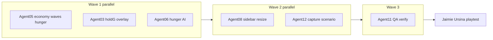

# WK61 R10 — Economy, Pacing, Hunger, Hold-G, Sidebar Resize (v1.5.9)

## PM decision: new round, not new sprint

| Item | Decision |
|------|----------|
| Sprint | Keep **[wk61_playtest_polish](.cursor/plans/wk61_playtest_polish.plan.md)** (`sprint_meta.status`: `in_progress`, `version_target`: Prototype v1.5.9) |
| Round | **wk61_r10_v159_economy_pacing_ux** (R10) — Jaimie’s 2026-05-23 playtest feedback |
| Version bump | **Do not** change [`config.py`](config.py) `prototype_version` until Jaimie explicitly approves after human playtest |
| Log hygiene | Before kickoff, run (PM or Jaimie): `python tools/roll_agent_logs.py --keep 7 --dry-run` then `--write-index` |

**Why not a new sprint?** WK60 (`wk60_v159_gameplay_fun`) is closed; WK61 already owns v1.5.9 polish. R4–R9 addressed hold-G/market tax in automation, but Jaimie still reports hold-G “not working at all” and slow economy—this is the next playtest slice, not a new theme.



---

## Root-cause context (for implementers)

### Hold-G (WK61-R10-BUG-001)

Current Ursina path ([`game/graphics/ursina_renderer.py`](game/graphics/ursina_renderer.py) ~318–346):

- Overlay only when `has_tax and stash > 0 and g_held`.
- Jaimie chose: **show `$0` on all tax-stash buildings while G is held** (dim style for zero).

Likely why it “does nothing” in live play:

1. **Zero stash everywhere** — passive `tax_per_minute` is low (3–4/min on neutrals); marketplace tax depends on hero purchases ([`game/entities/hero.py`](game/entities/hero.py) `buy_item` → `add_tax_gold`).
2. **G key path** — engine polls `input_manager.is_key_pressed("g")` each frame ([`game/engine.py`](game/engine.py) ~1919–1930); renderer also reads `ursina.held_keys`.
3. R7 proved overlays with **seeded** `$42` via [`tests/wk61_r7_capture_patch.py`](tests/wk61_r7_capture_patch.py) — live economy may never reach `stash > 0`.

### Economy / marketplace tax

- R8 fixed deferred shopping tax deposit (`pending_task_building`) — keep that path; accelerate **rates** and **purchase frequency** (hunger helps).
- Tax stash types: [`config.py`](config.py) `TAX_STASH_BUILDING_TYPES` (14 types).

### Wave pacing

[`game/systems/spawner.py`](game/systems/spawner.py) knobs (move to `config.py` as named constants):

| Constant | Current | R10 target (starting proposal) |
|----------|---------|--------------------------------|
| `initial_no_spawn_ms` | 5000 | **1500** |
| `first_wave_interval_ms` | 6000 | **3500** |
| `extra_spawn_delay_ms` | 12000 | **5000** |
| `spawn_interval` base | `GOBLIN_SPAWN_INTERVAL * 3 + extra` | **`* 2 + extra`** |
| Wave-event schedule | `WAVE_EVENT.first_event_minute` 3.0 | **2.0**; `interval_minutes` 2.5 → **1.75** |

Respect [`game/systems/difficulty.py`](game/systems/difficulty.py) multipliers (Easy/Hard still apply).

### Left sidebar layout today

[`game/ui/hud.py`](game/ui/hud.py) `_layout_rects_for_screen`: one **left column** (`LEFT_COL_W = 224`) from top bar down to minimap; **watch card** (if pinned) eats height above minimap; **one** of hero / enemy / peasant OR **building panel** fills the main band. Resizing = **split fractions** among **visible** segments only (main panel, optional watch card, fixed minimap height).

Reference pattern: [`game/ui/dev_tools_panel.py`](game/ui/dev_tools_panel.py) corner drag resize.

---

## Tickets (PM hub — add under R10)

| ID | Title | Owner |
|----|-------|-------|
| WK61-R10-BUG-001 | Hold-G taxable gold overlay not visible in live Ursina play | 03 (+ 05 data) |
| WK61-R10-FEAT-001 | Taxable gold accrues too slowly (all building types) | 05 |
| WK61-R10-FEAT-002 | Waves arrive too late / too far apart | 05 |
| WK61-R10-FEAT-003 | Hero hunger: 10g meal at food stand every ~3 min | 05 + 06 |
| WK61-R10-FEAT-004 | Draggable resize for open left-sidebar menus | 08 |

**Human preference (locked):** Hold G → show **`$N` including `$0`** on every `TAX_STASH_BUILDING_TYPES` building; release G → hide all.

---

## Wave 1 — Implementers (parallel)

### Agent 03 — TechnicalDirector (HIGH)

**Goal:** Hold-G works reliably in **live** `python main.py` (Ursina), with **$0 visible** on tax-stash buildings.

**Files MAY edit:** [`game/graphics/ursina_renderer.py`](game/graphics/ursina_renderer.py), [`game/engine.py`](game/engine.py), [`game/ursina_input_manager.py`](game/ursina_input_manager.py), `tests/test_wk61_r10_*.py`

**Do NOT edit:** `game/entities/*`, `config.py` economy tuning (05 owns).

**Implementation steps:**

1. In `_sync_building_worldspace_ui`, change gold branch from `stash > 0` to:
   - `has_tax and g_held` → show `f"${stash}"` even when `stash == 0`.
   - Color: full gold `(1.0, 0.8, 0.2)` if `stash > 0`, dim grey `(0.55, 0.55, 0.55)` if `stash == 0`.
2. Ensure **every frame** G-release hides labels (`enabled = False`) — already pattern at ~345–346; add test that toggling `set_tax_gold_overlay_held` updates without rebuilding entity.
3. Confirm gold `Text` parent is the **visible prefab root** from `get_or_create_prefab_building_entity` (not a disabled child). If label is behind roof, bump `overlay_y` via existing `_building_gold_overlay_y` (+0.15 for prefabs).
4. Optional debug (off by default): `$env:KINGDOM_DEBUG_TAX_OVERLAY = "1"` prints once/sec: `g_held`, count of buildings with `has_tax`, sum stash.
5. Add `tests/test_wk61_r10_hold_g_shows_zero.py`:
   - `Marketplace` with `stored_tax_gold=0`, `set_tax_gold_overlay_held(True)` → snapshot shows `has_tax` and amount 0; renderer logic enables label with `$0` (unit-test the condition, or mock Text creation).

**Verify (Agent 03):**

```powershell
python -m pytest tests/test_wk61_r10_hold_g_shows_zero.py tests/test_wk61_r6_ursina_tax_gold_overlay.py tests/test_wk61_r7_tax_overlay_none_guard.py -x -q
python tools/qa_smoke.py --quick
```

**Manual (required in log):**

```powershell
python main.py --no-llm
```

1. Run 2–3 minutes so marketplace may have tax from potions.
2. Hold **G** — every guild/marketplace/blacksmith/neutral tax building shows **`$0` or higher**; release G — all hidden.
3. Note 2–3 building types and dollar amounts in agent log.

---

### Agent 05 — GameplaySystemsDesigner (HIGH)

**Goal:** Faster taxable gold, harder waves, hunger **sim contract** for Agent 06.

**Files MAY edit:** [`config.py`](config.py), [`game/entities/hero.py`](game/entities/hero.py), [`game/entities/neutral_buildings.py`](game/entities/neutral_buildings.py), [`game/systems/spawner.py`](game/systems/spawner.py), [`game/systems/wave_events.py`](game/systems/wave_events.py), [`game/sim/snapshot.py`](game/sim/snapshot.py) (if hero hunger must appear in HUD), `tests/test_wk61_r10_*.py`

**1) Economy acceleration (FEAT-001)** — add to `config.py`:

```python
# WK61-R10: economy pacing
NEUTRAL_TAX_PER_MINUTE = {"house": 9.0, "farm": 12.0, "food_stand": 10.0}  # ~3x old 3/4/3.5
ECONOMY_TAX_RATE_MULT = 1.4  # optional: apply to shop-sale tax only, not global TAX_RATE if risky
```

- Wire neutrals in [`game/entities/neutral_buildings.py`](game/entities/neutral_buildings.py) constructors to read config map.
- **Do not** break R8 marketplace path: after potion buy, `stored_tax_gold` increases by `int(price * TAX_RATE)` (consider `ECONOMY_TAX_RATE_MULT` only on shop sales).
- Add headless test `tests/test_wk61_r10_economy_tax_accrual.py`:
  - Run `FoodStand` `update(60.0)` → `stored_tax_gold >= 9` (with new 10/min rate).
  - Marketplace potion purchase (reuse pattern from [`tests/test_wk61_r8_marketplace_potion_tax.py`](tests/test_wk61_r8_marketplace_potion_tax.py)) → stash > 0.

**2) Wave pacing (FEAT-002)** — move spawner timings to `config.py` (e.g. `SPAWNER_INITIAL_NO_SPAWN_MS`, etc.) and apply R10 targets above; run determinism-safe (no wall clock).

- Add `tests/test_wk61_r10_wave_timing.py`: headless spawner with `dt` steps — assert first enemy spawn tick ≤ `initial_no_spawn_ms + first_wave_interval_ms + small epsilon`.

**3) Hunger (FEAT-003)** — sim-only API for Agent 06:

Add to `config.py`:

```python
HUNGER_INTERVAL_MS = 180_000   # 3 minutes sim time between meals
FOOD_MEAL_COST_GOLD = 10
FOOD_MEAL_HUNGER_RESET = True
```

On `Hero` ([`game/entities/hero.py`](game/entities/hero.py)):

- Fields: `next_meal_due_ms: int` (init `sim_now_ms() + HUNGER_INTERVAL_MS`), `hunger_urgent: bool` property when `sim_now_ms() >= next_meal_due_ms`.
- Method `buy_meal_at_food_stand(food_stand) -> bool`:
  - Requires `inside_building` or within ~1 tile of food_stand (match existing shop range pattern).
  - If `gold >= FOOD_MEAL_COST_GOLD`: deduct 10g, `food_stand.add_tax_gold(int(10 * TAX_RATE))`, set `next_meal_due_ms = sim_now_ms() + HUNGER_INTERVAL_MS`, emit event `hero_ate` (for audio/UI later).
  - Deterministic; no RNG.

Expose in snapshot if hero panel needs it: `hunger_seconds_until_meal` (optional, Agent 08 can read in follow-up).

**Verify (Agent 05):**

```powershell
python tools/determinism_guard.py
python -m pytest tests/test_wk61_r10_economy_tax_accrual.py tests/test_wk61_r10_wave_timing.py tests/test_wk61_r8_marketplace_potion_tax.py -x -q
python tools/qa_smoke.py --quick
```

---

### Agent 06 — AIBehaviorDirector (MEDIUM)

**Goal:** Hungry heroes seek food stands and buy meals (circle gold into economy).

**Files MAY edit:** [`ai/basic_ai.py`](ai/basic_ai.py), `ai/behaviors/*.py`, `tests/test_wk61_r10_hunger_ai.py`

**Depends on:** Agent 05’s `hunger_urgent`, `buy_meal_at_food_stand`, `FOOD_MEAL_COST_GOLD`.

**Policy (deterministic, no LLM required):**

1. If `hero.hunger_urgent` and `hero.gold >= FOOD_MEAL_COST_GOLD`:
   - Find nearest constructed `food_stand` with `is_constructed` and `hp > 0` (sorted by distance, tie-break by building id).
   - Set intent/task: go to stand → enter / buy meal (call `buy_meal_at_food_stand` when in range).
2. Priority: **above** discretionary explore, **below** critical combat/healing (&lt;25% HP).
3. If no food_stand exists, do not stall — fall through to normal AI (log once in debug).

**Verify:**

```powershell
python -m pytest tests/test_wk61_r10_hunger_ai.py -x -q
python tools/qa_smoke.py --quick
```

Headless test sketch: place hero + food_stand, set `next_meal_due_ms` in past, run N sim ticks via `observe_sync` or direct hero+AI update — assert `stored_tax_gold` on stand increased and hero gold decreased by 10.

---

## Wave 2 — UX + tooling (parallel, after Wave 1)

### Agent 08 — UX_UI_Director (HIGH)

**Goal:** Resizable left-sidebar stacks; confirm marketplace/blacksmith panels show rising taxable gold.

**Files MAY edit:** [`game/ui/hud.py`](game/ui/hud.py), [`game/ui/building_panel.py`](game/ui/building_panel.py), [`game/engine.py`](game/engine.py), [`game/input_handler.py`](game/input_handler.py), [`tools/screenshot_scenarios.py`](tools/screenshot_scenarios.py), `tests/test_wk61_r10_sidebar_layout.py`

**FEAT-004 — Resizable sidebar:**

1. Add session state on `HUD`, e.g. `_left_split_fracs: dict[str, float]` keys: `"main"`, `"watch"` (only keys for **open** panels).
2. In `_layout_rects_for_screen`, allocate vertical space between `top_h` and `minimap.y`:
   - Fixed: minimap (`RADAR_MINIMAP_H`).
   - If pinned watch card: height = `frac_watch * available`.
   - Main band (hero/enemy/building): `frac_main * available`.
   - Enforce mins: `HERO_LEFT_MIN_H`, `WATCH_CARD_HEADER_H`, etc. from existing constants.
3. **Drag handles:** 4px tall hit zones on **bottom edge** of main panel and **top/bottom** of watch card (when visible). On `MOUSEBUTTONDOWN` in handle → drag; on move, redistribute fractions among **open** panels only (minimap unchanged).
4. Wire through Ursina: extend existing HUD pointer routing in [`game/engine.py`](game/engine.py) / `input_handler` (same path as menu scroll fix — virtual coords).
5. Persist splits for session only (reset on quit).

**Economic panel check:** Select marketplace after headless/long run — taxable gold line uses [`game/ui/building_renderers/economic_panel.py`](game/ui/building_renderers/economic_panel.py) `_render_taxable_gold` — not grey stale zero when `stored_tax_gold > 0`.

**Verify (mandatory Phase 4b):**

```powershell
python tools/capture_screenshots.py --scenario ui_panels --seed 3 --out docs/screenshots/wk61_r10_sidebar --size 1920x1080 --ticks 480
python tools/capture_screenshots.py --scenario ui_build_catalog --seed 3 --out docs/screenshots/wk61_r10_sidebar --size 1920x1080 --ticks 480
python tools/qa_smoke.py --quick
python -m pytest tests/test_wk61_r10_sidebar_layout.py -x -q
```

**Inspect PNGs** before done: visible drag handle or clearly different main vs watch heights after resize (document which file proves it).

---

### Agent 12 — ToolsDevEx (MEDIUM, optional but recommended)

**Goal:** Deterministic capture for hold-G + economy.

**Files:** [`tools/run_ursina_capture_once.py`](tools/run_ursina_capture_once.py), [`tools/screenshot_scenarios.py`](tools/screenshot_scenarios.py), new `tools/wk61_r10_capture_patch.py` (clone R7 patch: seed tax + force G).

Add scenario `wk61_hold_g_tax_overlay` in `screenshot_scenarios.py`: start with WK60 starting buildings, run ~90s ticks, force G held, output to `docs/screenshots/wk61_r10_hold_g/`.

**Verify:**

```powershell
python tools/run_ursina_capture_once.py --scenario wk61_hold_g_tax_overlay --ticks 5400 --out docs/screenshots/wk61_r10_hold_g
```

Agent 11 uses these paths for sign-off.

---

## Wave 3 — QA + consult

### Agent 11 — QA (LOW)

- Run full gates; **do not sign off** hold-G without PNG showing **multiple** building `$` labels (including `$0` acceptable per Jaimie).
- Re-run marketplace tax test from R8 + new R10 tests.
- Note known flake: `speed_scaling` 0.25x bounty responder — one retry OK if isolated pass.

```powershell
python tools/qa_smoke.py --quick
python tools/validate_assets.py --report
python -m pytest tests/ -x -q
```

### Agent 02 — GameDirector (LOW, consult)

5-point acceptance checklist for Jaimie playtest (10 min, Ursina):

- Hold G → `$` on tax buildings (0+); release → hidden.
- After ~3 min, marketplace/blacksmith taxable gold in panel trends up.
- First enemy wave before ~15s wall clock at 1x speed.
- Heroes occasionally visit food stands; gold leaves hero pocket.
- Drag sidebar divider; adjacent open panels resize.

### Agent 13 — Steam/Ops (LOW, after human pass)

Draft v1.5.9 patch notes from CHANGELOG + R10 bullets (3–7 player-facing lines). **Do not** edit version in code.

---

## Orchestrator send list (for Jaimie)

| Wave | Agents | Intelligence |
|------|--------|--------------|
| 1 | **05**, **03**, **06** (parallel) | 05 HIGH, 03 HIGH, 06 MEDIUM |
| 2 | **08**, **12** (parallel) | 08 HIGH, 12 MEDIUM |
| 3 | **11** | LOW |
| Consult | **02**, **13** after human gate | LOW |

**Do not send:** 04 (unless determinism question), 07, 09, 10, 14, 15 unless blocked.

**Automation block** (PM hub): `mode: auto_until_human_gate`; human gates: manual playtest, version bump, commit, push.

**Universal prompt skeleton:**

```text
You are activated for sprint wk61_playtest_polish, round wk61_r10_v159_economy_pacing_ux.
Read: .cursor/plans/agent_logs/agent_01_ExecutiveProducer_PM.json → sprints["wk61_playtest_polish"].rounds["wk61_r10_v159_economy_pacing_ux"] → pm_agent_prompts[YOUR_NUMBER].
Follow AGENTS.md, 10-orchestrator-logging-contract.mdc, your agent-NN onboarding.
Run gates in your prompt; update your agent log; validate JSON; run orchestrator complete receipt.
Do not bump prototype_version.
```

---

## Jaimie manual playtest (after R10 agents finish)

```powershell
python main.py --no-llm
```

**Duration:** 8–10 minutes at normal speed.

**Steps:**

1. Start game; wait ~20s — first enemies should arrive noticeably sooner than before.
2. Watch heroes buy potions — select **Marketplace** — taxable gold in left panel should climb above $0 within a few purchases.
3. Hold **G** for 5s — see **`$0` or more** above marketplace, guilds, food stands; release G — labels vanish.
4. Wait ~3+ minutes — heroes with gold should visit **food stands**; hold G on a stand to see tax increase after meals.
5. Pin a hero (watch card) + open hero menu — drag the **thin resize bar** between sidebar sections; confirm minimap stays fixed and other open sections shrink/grow.

**Pass if:** all five behaviors match. **Fail:** note which step, screenshot, and reply in PM chat.

---

## Definition of Done (R10)

- [ ] Hold G shows `$N` (including `$0`) on all `TAX_STASH_BUILDING_TYPES` buildings in live Ursina; release hides.
- [ ] Tax accrual measurably faster (tests + playtest: marketplace tax &gt; 0 after hero shopping).
- [ ] First wave sooner; shorter gap between trickle waves (config + test).
- [ ] Hunger: heroes spend 10g at food stands on cadence; food_stand `stored_tax_gold` increases.
- [ ] Left sidebar drag resize works for open panels without breaking minimap/command bar.
- [ ] `python tools/qa_smoke.py --quick` PASS; `python -m pytest tests/ -x -q` PASS.
- [ ] Screenshot evidence under `docs/screenshots/wk61_r10_*`.
- [ ] Jaimie human playtest PASS → then optional version bump to **v1.5.9** + CHANGELOG (Jaimie/Agent 13).

---

## PM hub work (Agent 01 only, on approval)

When executing (not in plan mode), Agent 01 will:

1. Append round `wk61_r10_v159_economy_pacing_ux` to [`agent_01_ExecutiveProducer_PM.json`](.cursor/plans/agent_logs/agent_01_ExecutiveProducer_PM.json) with full `pm_agent_prompts`, tickets, `automation`, `pm_send_list_minimal`.
2. Add R10 section to [`wk61_playtest_polish.plan.md`](.cursor/plans/wk61_playtest_polish.plan.md).
3. Run log rolling if &gt;7 sprints in hub.
