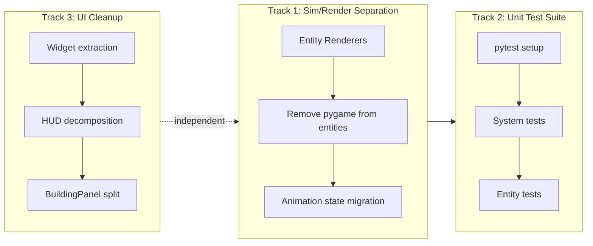

# WK9: Sim/Render Separation + Unit Tests + UI Cleanup Sprint

## Context: Verified WK8 Deliverables

WK8 landed four tracks of structural refactoring (all gates PASS, determinism audit clean):

**Track 1 — Engine decomposition** (Agent 03):

- [game/input_handler.py](game/input_handler.py) (401 lines) — keyboard/mouse event handling
- [game/display_manager.py](game/display_manager.py) (156 lines) — display mode switching
- [game/building_factory.py](game/building_factory.py) (69 lines) — registry-based building creation
- [game/cleanup_manager.py](game/cleanup_manager.py) (113 lines) — building destruction cleanup
- [game/engine.py](game/engine.py) reduced from ~1,900 to **1,242 lines**

**Track 2 — Building decomposition** (Agent 05):

- [game/entities/buildings/](game/entities/buildings/) package with 11 files (~1,378 lines total)
- `BuildingType(str, Enum)` with 38 types in [game/entities/buildings/types.py](game/entities/buildings/types.py)
- `HiringBuilding` mixin in [game/entities/buildings/hiring_mixin.py](game/entities/buildings/hiring_mixin.py)
- Includes `dwellings.py` (GnomeHovel, ElvenBungalow, DwarvenSettlement) not in original plan
- [game/entities/building.py](game/entities/building.py) is now an 8-line backward-compat shim

**Track 3 — Architecture foundations** (Agent 03):

- [game/events.py](game/events.py) (87 lines) — `EventBus` + `GameEventType` enum (11 event types)
- [game/systems/protocol.py](game/systems/protocol.py) (24 lines) — `GameSystem` Protocol + `SystemContext` dataclass
- [game/types.py](game/types.py) (27 lines) — `HeroClass`, `EnemyType`, `BountyType` enums
- `CombatSystem` and `BuffSystem` conform to Protocol (use `update(ctx, dt)`)
- AudioSystem and VFXSystem wired as EventBus subscribers via `on_event()`
- Manual event routing blocks in engine replaced with `event_bus.emit()`

**Track 3C — Config dataclasses** (Agent 12):

- [config.py](config.py) restructured (382 lines) with 11 frozen dataclass groups
- All legacy module-level aliases preserved (WINDOW_WIDTH, FPS, TILE_SIZE, etc.)

**Bug fix** (Agent 09): Building sprite lookup regression fixed after Track 2 split.

**Known remaining large files** (WK9 targets):

- `game/ui/hud.py` — 986 lines
- `game/ui/building_panel.py` — 954 lines
- `game/entities/hero.py` — 853 lines (18% render code)
- `game/entities/enemy.py` — 643 lines (10% render code)
- `ai/basic_ai.py` — **1,580 lines** (now the largest file in the codebase; deferred to WK10)

WK9 addresses the three remaining deferred recommendations: sim/render separation, unit tests, and UI cleanup.

## Sprint Structure: Three Tracks




### Track 1: Sim/Render Separation

**Owner**: Agent 03 (Architecture) + Agent 09 (Art/Graphics)
**Consult**: Agent 04 (Determinism), Agent 10 (Perf)

**Current state** (verified post-WK8): All 8 entity files still import pygame and embed `render()` methods. Graphics modules (`hero_sprites.py`, `enemy_sprites.py`, `building_sprites.py`, `worker_sprites.py`) exist but only provide sprite libraries — entities still own animation state and rendering logic. Approximately 470 lines of render code are mixed into entity classes.


| Entity               | Lines | Render %         | Animation State?                | Graphics Module?        |
| -------------------- | ----- | ---------------- | ------------------------------- | ----------------------- |
| hero.py              | 853   | 18% (~154 lines) | Yes (_anim, _anim_base, facing) | hero_sprites.py         |
| enemy.py             | 643   | 10% (~64 lines)  | Yes (same pattern)              | enemy_sprites.py        |
| buildings/base.py    | 224   | 22% (~50 lines)  | No (static sprites)             | building_sprites.py     |
| peasant.py           | 290   | 24% (~70 lines)  | Yes (same pattern)              | worker_sprites.py       |
| guard.py             | 180   | 17% (~30 lines)  | No (circle + text)              | None                    |
| tax_collector.py     | 235   | 36% (~85 lines)  | Yes                             | worker_sprites.py       |
| lair.py              | 282   | 8% (~22 lines)   | No (inherits Building)          | via building_sprites.py |
| neutral_buildings.py | 105   | 19% (~20 lines)  | No (inherits Building)          | via building_sprites.py |


#### Step 1: Create Entity Renderer classes (new directory: `game/graphics/renderers/`)

One renderer per entity type, each taking entity state + camera offset and handling all drawing:

- `game/graphics/renderers/__init__.py`
- `game/graphics/renderers/hero_renderer.py` — owns HeroSpriteLibrary animation instance, handles sprite frame selection, health bar, name/gold text, bubble rendering
- `game/graphics/renderers/enemy_renderer.py` — owns EnemySpriteLibrary animation, handles sprite frames, health bar
- `game/graphics/renderers/building_renderer.py` — handles all building type rendering including subclass text overlays (lair labels, neutral tax labels, guild/temple labels from building subclass `render()` overrides)
- `game/graphics/renderers/worker_renderer.py` — handles Peasant, TaxCollector, Guard rendering (shared worker sprite system)

Each renderer follows this pattern:

```python
class HeroRenderer:
    def __init__(self, hero_id: str, hero_class: str):
        self._anim = HeroSpriteLibrary.create_player(hero_class)
        self._anim_base = "idle"
        self._facing = 1

    def update_animation(self, entity_state: dict, dt: float) -> None:
        ...  # animation state machine (currently in entity)

    def render(self, surface, entity_state: dict, camera_offset: tuple) -> None:
        ...  # all pygame drawing (currently entity.render())
```

**Agent 09** creates the renderer classes and migrates render logic.
**Agent 03** designs the renderer registration pattern and coordinates the entity-side cleanup.

#### Step 2: Remove render() and pygame imports from entity classes

After renderers exist:

- Delete `render()` methods from all entity classes
- Delete `import pygame` from all entity files
- Delete animation state attributes (`_anim`, `_anim_base`, `_anim_lock_one_shot`, `facing`) from entities
- Add lightweight state accessors if renderers need derived data (e.g., `hero.render_state` property returning a dict/namedtuple)

#### Step 3: Wire renderers into engine render pipeline

- Engine creates a `RendererRegistry` that maps entity IDs to their renderer instances
- When a hero/enemy/building is created, its renderer is also created
- `engine.render()` calls `renderer.render(surface, entity.render_state, camera_offset)` instead of `entity.render(surface, camera_offset)`
- Renderers call `update_animation()` from the engine's update loop (render-side, not sim-side)

**Also in this step**: Remove the unused `import pygame` from `game/systems/spawner.py`. Move `Bounty.render()` and `BountySystem.render()` from [game/systems/bounty.py](game/systems/bounty.py) into a `BountyRenderer` — bounty rendering is currently the only render code inside a system file.

**Expected result**: All entity files are pure Python with no pygame dependency. ~470 lines of render code move to `game/graphics/renderers/`. Entity files shrink by 10-36%.

---

### Track 2: Unit Test Suite

**Owner**: Agent 11 (QA)
**Consult**: Agent 03 (system interfaces), Agent 12 (tooling integration)

**Current state** (verified post-WK8): No `tests/` directory. No pytest in `requirements.txt`. All testing is via headless smoke (`tools/qa_smoke.py`). Most systems are pure logic with no pygame dependency — CombatSystem, EconomySystem, BuffSystem, LairSystem, and EnemySpawner have zero pygame imports and are fully testable today. BountySystem has render methods mixed in (core logic is still testable). Note: CombatSystem and BuffSystem now use the WK8 `GameSystem` Protocol — tests should construct a `SystemContext` and call `system.update(ctx, dt)`.

#### Step 1: Test infrastructure setup

- Add `pytest` to `requirements.txt`
- Create `tests/` directory with `conftest.py`
- Create shared fixtures: `make_hero()`, `make_enemy()`, `make_building()`, `make_economy()`, `make_world()` factory helpers that construct minimal entity instances for testing
- Optional: Add `pytest` run to `tools/qa_smoke.py` so unit tests become part of the gate

#### Step 2: System unit tests (highest value)

Target the pure-logic systems first:

- `tests/test_combat.py` — CombatSystem.process_combat()
  - Hero attacks enemy, damage applied correctly
  - Enemy killed, gold/XP distributed
  - Ranged attack emits ranged_projectile event
  - Castle destroyed event when castle HP reaches 0
  - Hero cannot attack while inside building
  - Lair combat and lair_cleared event
- `tests/test_economy.py` — EconomySystem
  - can_afford_building / buy_building
  - can_afford_hero / hire_hero
  - hero_purchase with tax calculation
  - claim_bounty gold flow
  - Transaction log accuracy
- `tests/test_bounty.py` — BountySystem (logic only, not render)
  - place_bounty creates correct Bounty object
  - check_claims proximity claim works
  - Bounty validity checks (building exists, not already claimed)
  - Attractiveness tier computation
  - summarize_for_hero output format
- `tests/test_buffs.py` — BuffSystem
  - Buff application within range
  - Buff expiration
  - Buff refresh (not stacking)
- `tests/test_spawner.py` — EnemySpawner
  - Wave timing and escalation
  - Enemy count caps
  - Deterministic spawn positions (same seed = same spawns)

#### Step 3: Entity unit tests (after Track 1 sim/render split)

Once entities have no pygame dependency:

- `tests/test_hero.py` — Hero state machine, inventory, shopping logic, stuck detection
- `tests/test_enemy.py` — Enemy targeting, kiting (SkeletonArcher), retargeting on hit
- `tests/test_building.py` — Construction, damage, HP, HiringBuilding mixin methods

**Expected result**: 20-30 focused tests covering core gameplay systems. pytest runs in <5 seconds. Gate integration optional but recommended.

---

### Track 3: UI Widget Extraction + Cleanup

**Owner**: Agent 08 (UX/UI)
**Consult**: Agent 09 (art/theme)

**Current state** (verified post-WK8): `hud.py` (986 lines) and `building_panel.py` (954 lines) are the two largest files in the UI layer — untouched by WK8. Both contain significant duplicate rendering patterns. Common patterns that should be widgets: button rendering, HP bars, text-with-shadow, section dividers.

#### Step 1: Extract missing widgets into `game/ui/widgets.py`

- `**Button` widget** — Full rendering (not just hit test like current `IconButton`). Text + optional icon, hover/pressed/disabled states, consistent nine-slice or frame styling. Replace manual button rendering in `hud.py` (`_draw_button_frame`, `_render_quit_button`, `_render_right_close_button`), `building_panel.py` (research/upgrade/demolish buttons), and `pause_menu.py`.
- `**HPBar` widget** — `HPBar.render(surface, rect, current_hp, max_hp, color_scheme)`. Currently duplicated in `hud.py` (render_hero_panel), `building_panel.py` (3+ locations), and every entity's `render()` method (moving to renderers in Track 1).
- `**TextLabel` widget** — Text rendering with shadow support and surface caching. Replace `_blit_text_with_shadow()` in `hud.py` and similar manual patterns.

#### Step 2: Decompose HUD (hud.py 987 -> ~400 lines)

Extract from HUD into focused sub-components:

- `game/ui/hero_panel.py` — Extract `render_hero_panel()` (206 lines) + `_compute_hero_intent()` (52 lines) + `_format_last_decision()` (63 lines) = ~320 lines moved out. This is the single biggest win.
- `game/ui/command_bar.py` — Extract `_render_command_bar()` (92 lines). Owns Build/Hire/Bounty buttons.
- `game/ui/top_bar.py` — Extract top bar rendering from `render()` (gold/heroes/enemies/wave stats). ~60 lines.
- HUD becomes a coordinator: layout + delegation to sub-components.

#### Step 3: Decompose BuildingPanel (building_panel.py 955 -> ~250 lines)

Replace the 15+ `render`_* methods with a registry pattern:

- `game/ui/building_renderers/__init__.py` — Registry: `PANEL_RENDERERS = {"marketplace": MarketplacePanelRenderer, ...}`
- `game/ui/building_renderers/guild_panel.py` — Shared renderer for all 4 guilds (hero list + hire info)
- `game/ui/building_renderers/temple_panel.py` — Shared renderer for all 7 temples (same as guilds via HiringBuilding)
- `game/ui/building_renderers/economic_panel.py` — Marketplace, Blacksmith, Inn, TradingPost (research buttons)
- `game/ui/building_renderers/defensive_panel.py` — Guardhouse, BallistaTower, WizardTower
- `game/ui/building_renderers/special_panel.py` — Fairgrounds, Library, RoyalGardens, Palace
- `game/ui/building_renderers/castle_panel.py` — Castle (build catalog button)
- `building_panel.py` becomes a coordinator: select building -> look up renderer -> delegate

**Expected result**: `hud.py` drops from 987 to ~~400 lines. `building_panel.py` drops from 955 to ~250 lines. 3 new reusable widgets. Building panel renderers are per-domain (~~60-100 lines each).

---

### Quick Wins (no dedicated track needed)

- **System Protocol adoption**: Agent 03 extends `GameSystem` Protocol conformance to BountySystem, LairSystem, NeutralBuildingSystem, EnemySpawner (lightweight, ~30 min each). Currently only CombatSystem and BuffSystem conform.
- **Type hints**: Standing rule — any file touched this sprint gets type hints on modified methods
- **Remove unused pygame imports**: `game/systems/spawner.py` imports pygame but never uses it

### Deferred to WK10

- **AI refactoring**: `ai/basic_ai.py` is now **1,580 lines** — the single largest file in the codebase. It mixes combat decisions, bounty pursuit, journey behavior, navigation, and stuck recovery. Should be split into focused behavior modules (CombatAI, BountyPursuitAI, JourneyAI, NavigationAI). Owned by Agent 06.

---

## Agent Assignment Summary


| Agent             | Role                    | Track                                                                | Priority |
| ----------------- | ----------------------- | -------------------------------------------------------------------- | -------- |
| 03 (TechDirector) | Architect + implementer | Track 1 (renderer architecture + entity cleanup) + Protocol adoption | P0       |
| 09 (Art/Graphics) | Implementer             | Track 1 (create renderer classes, migrate render code)               | P0       |
| 11 (QA)           | Implementer             | Track 2 (pytest suite for systems + entities)                        | P0       |
| 08 (UX/UI)        | Implementer             | Track 3 (widget extraction + HUD/BuildingPanel decomposition)        | P1       |
| 12 (Tools)        | Consult                 | Track 2 (integrate pytest into gate), tooling verification           | P1       |
| 04 (Determinism)  | Reviewer                | Track 1 review (confirm render code removal doesn't affect sim)      | P1       |
| 10 (Perf)         | Consult                 | Track 1 review (confirm renderer indirection doesn't cost frames)    | P2       |


**Silent**: Agents 02, 05, 06, 07, 13, 14

## Integration Order

1. **Track 1 Steps 1-2**: Create renderers, remove render() from entities (Agent 03 + 09)
2. **Track 1 Step 3**: Wire renderers into engine (Agent 03)
3. **Track 2 Steps 1-2**: Test infra + system tests (Agent 11, can start in parallel with Track 1 since systems are already pure)
4. **Track 2 Step 3**: Entity tests (Agent 11, after Track 1 removes pygame from entities)
5. **Track 3 Steps 1-3**: Widget extraction + UI decomposition (Agent 08, fully independent of other tracks)
6. **Verification**: Agents 04, 11 run full gates + manual smoke after all tracks

## Round Plan

- **R1**: Agent 03 designs renderer architecture + RendererRegistry. Agent 09 creates renderer classes for hero/enemy/building/worker. Agent 11 sets up pytest + writes system tests. Agent 08 extracts Button/HPBar/TextLabel widgets.
- **R2**: Agent 03 removes render() from entities + wires renderers in engine. Agent 09 handles animation state migration. Agent 08 decomposes HUD + BuildingPanel.
- **R3**: Agent 11 adds entity tests (now pygame-free). Full verification wave: gates, manual smoke, determinism audit.

## Success Criteria

- Zero entity files import pygame
- All entity `render()` methods removed; rendering handled by `game/graphics/renderers/`
- pytest suite with 20+ tests covering CombatSystem, EconomySystem, BountySystem, BuffSystem, EnemySpawner
- All tests pass in <5 seconds
- `hud.py` under 500 lines
- `building_panel.py` under 300 lines
- 3+ reusable widgets in `widgets.py` (Button, HPBar, TextLabel)
- All remaining systems conform to GameSystem Protocol
- `python tools/qa_smoke.py --quick` PASS
- `python tools/validate_assets.py --report` 0 errors
- `python tools/determinism_guard.py` PASS
- Manual 10-minute play in `--no-llm` and `--provider mock` shows no behavioral difference

## Risk Mitigation

- **Track 1 renderer perf**: Indirection through RendererRegistry adds one dict lookup per entity per frame — negligible. Agent 10 on standby.
- **Track 1 entity coupling**: Some engine code may call `entity.render()` directly — search for all call sites before removing.
- **Track 2 flaky tests**: System tests use deterministic RNG (seeded) so results are reproducible. Avoid tests that depend on timing.
- **Track 3 UI regression**: Widget extraction is visual-only. Screenshot comparison before/after catches regressions.
- **Cross-track dependency**: Track 2 entity tests depend on Track 1 completing first. System tests (Track 2 Steps 1-2) can start immediately.

