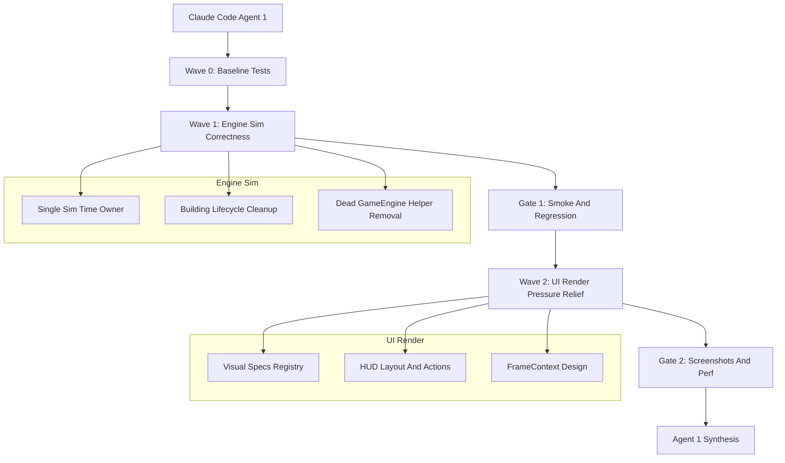

# Architecture Cleanup Sprint Plan

## Sprint Identity

**Sprint ID:** `wk62_architecture_cleanup_baseline`  
**Working title:** Architecture Cleanup Baseline  
**Source roadmap:** `.cursor/plans/GPT 5.5 Codebase Improvements Recommendations.md`  
**Execution model:** Claude Code parent Agent 1 coordinates role-based subagents. Do not use `tools/ai_studio_orchestrator` for this sprint.

## Strategic Decision

Jaimie wants this cleanup to run before active v1.6 feature work resumes. That is reasonable, but the sprint must still be staged. The safe interpretation of "broad cleanup" is not "touch every messy subsystem at once." It is:

- First, prove and fix the correctness risks that could invalidate later work.
- Second, extract small, low-risk UI/render seams that reduce future file collisions.
- Third, stop before AI contracts, content registries, and tooling reorganizations unless the earlier waves are clean.

This sprint intentionally does **not** implement the entire 33-item recommendation roadmap. It implements the first practical slice.

## Goals

- Confirm whether sim time currently advances once or twice per `GameEngine.update()` tick, then fix if needed.
- Consolidate destroyed-building cleanup so rubble/events are produced exactly once.
- Remove or clearly quarantine dead sim-era helper methods left in `game/engine.py` after the `SimEngine` split.
- Add regression tests that protect the engine/sim boundary before larger refactors.
- Introduce low-risk UI/render pressure relief: shared visual specs, initial HUD layout/action extraction, and a one-frame context design or first implementation if small enough.
- Run smoke, asset, visual, and perf checks appropriate to changed areas.

## Non-Goals

- Do not rewrite `GameEngine`, `SimEngine`, `HUD`, or `UrsinaRenderer` wholesale.
- Do not reorganize all tests into folders in this sprint.
- Do not move all `config.py` content to registries yet.
- Do not redesign AI behavior contracts yet.
- Do not refactor orchestrator tooling in this sprint.
- Do not remove compatibility aliases unless grep/tests prove they are unused.

## Architecture Target For This Sprint



## Wave 0 - Baseline And Characterization

**Owner:** Agent 11 QA, with Agent 03 available for code-reading support.  
**Reasoning:** Before cleanup agents move code, the sprint needs tests that prove current behavior and catch regressions. This reduces guesswork for less-capable implementer agents.

### Agent 11 Task

**Task:** Add or identify baseline characterization tests for engine/sim correctness.

**Files you may edit:**

- `tests/test_engine.py`
- `tests/test_renderer_snapshot_contract.py`
- New targeted tests under `tests/` if existing files are too crowded

**Files you must not edit:**

- `game/**`
- `ai/**`
- `config.py`

**Implementation guidance:**

Add tests before production changes. If a test fails because it exposes a real current bug, mark it clearly and coordinate with Agent 03 rather than weakening the assertion.

Required tests:

```python
def test_game_engine_update_advances_sim_time_once():
    engine = GameEngine(headless=True)
    before = int(engine.sim._sim_now_ms)
    engine.update(0.05)
    after = int(engine.sim._sim_now_ms)
    assert after - before == 50
```

Also add tests for:

- Paused/menu state does not advance sim time.
- Destroying one building creates exactly one rubble record.
- Destroying one building emits exactly one destruction event if events are observable.
- Renderer snapshot creation does not require `engine` or `sim` entries in `get_game_state()` for renderer paths, or document current dependency if still present.

**Verification commands:**

```powershell
python -m pytest tests/test_engine.py tests/test_renderer_snapshot_contract.py -x -q
python tools/qa_smoke.py --quick
```

**Report back with:**

- Tests added.
- Which tests pass/fail before production fixes.
- Exact failing assertion if the sim-time or cleanup issue is real.

## Wave 1 - Engine/Sim Correctness Cleanup

**Owner:** Agent 03 TechnicalDirector, with Agent 04 determinism consult and Agent 11 regression support.  
**Reasoning:** These are the highest-value cleanup targets because they affect correctness, determinism, and every later feature.

### Agent 03 Task A - Single Sim Time Owner

**Task:** Make sim time advance in exactly one place.

**Files you may edit:**

- `game/engine.py`
- `game/sim_engine.py`
- `game/sim/timebase.py` only if strictly necessary
- `tests/test_engine.py` only to adjust tests after agreed behavior

**Files you must not edit:**

- `game/ui/**`
- `game/graphics/**`
- `ai/**`
- `config.py`

**Reasoning details:**

The audit found that `GameEngine._prepare_sim_and_camera()` and `SimEngine.update()` may both advance `_sim_now_ms`. The desired ownership is:

- `GameEngine` owns presentation timing: camera responsiveness, UI, render loop.
- `SimEngine` owns authoritative sim time.
- `GameEngine` decides whether the sim should tick, but does not mutate `sim._sim_now_ms`.

**Implementation guidance:**

Preferred shape:

```python
class GameEngine:
    def update(self, dt: float):
        if not self._prepare_presentation_and_should_tick_sim(dt):
            self._flush_event_bus()
            return
        game_state = self.get_game_state()
        self.sim.update(dt, game_state)
        self._update_render_animations(dt)
        self._finalize_update(dt)
```

Inside `GameEngine`, remove deterministic sim-time mutation from the preparation method. Keep camera update behavior intact.

Inside `SimEngine.update()`, keep the authoritative:

```python
if DETERMINISTIC_SIM:
    self._sim_now_ms += int(round(float(dt) * 1000.0))
    set_sim_now_ms(self._sim_now_ms)
else:
    set_sim_now_ms(None)
```

If the current code needs `set_sim_now_ms(None)` before sim update in non-deterministic mode, keep that in `SimEngine`, not `GameEngine`.

**Acceptance:**

- `test_game_engine_update_advances_sim_time_once` passes.
- Pause/menu no-advance test passes.
- `python tools/determinism_guard.py` passes.

### Agent 03 Task B - Consolidate Destroyed-Building Cleanup

**Task:** Ensure destroyed buildings are cleaned up through one authoritative path.

**Files you may edit:**

- `game/sim_engine.py`
- `game/engine.py`
- `game/cleanup_manager.py`
- `game/entities/rubble.py` only if a small data-contract fix is needed
- Relevant tests

**Reasoning details:**

Destroyed-building cleanup is partly duplicated between presentation-era cleanup and sim cleanup. The sim should own authoritative cleanup, rubble creation, and event emission. Presentation can respond to events and clear UI selection, but it should not create gameplay artifacts.

**Implementation guidance:**

Preferred minimal approach for this sprint:

- Keep the existing cleanup implementation that is most complete.
- Move or delegate all other cleanup paths to it.
- Avoid a large new `BuildingLifecycleSystem` if that would expand scope; a new file is acceptable only if it makes the owner obvious and tests stay green.
- Remove double-calls from `GameEngine.update()` if `SimEngine.update()` already performs cleanup.

Good target shape:

```python
class SimEngine:
    def update(self, dt: float, game_state: dict) -> None:
        ...
        self._cleanup_destroyed_buildings()
        ...

class GameEngine:
    def update(self, dt: float):
        ...
        self.sim.update(dt, game_state)
        # No presentation-side gameplay cleanup here.
```

**Acceptance:**

- Destroying one building creates one rubble record.
- It does not create duplicate events/messages.
- Existing rubble rendering tests or smoke tests still pass.

### Agent 03 Task C - Delete Or Quarantine Dead `GameEngine` Sim Helpers

**Task:** Remove old sim-era helper methods from `game/engine.py` only after references are checked.

**Files you may edit:**

- `game/engine.py`
- Tests if they call dead helpers directly

**Reasoning details:**

The old helper methods are dangerous because future agents may patch dead code. But deleting too aggressively can break tools/tests. Treat each method like a mini migration.

Candidate methods to inspect:

- `_update_ai_and_heroes`
- `_apply_entity_separation`
- `_update_world_systems`
- `_update_peasants`
- `_update_enemies`
- `_process_combat`
- `_process_bounties`
- `_update_neutral_systems`
- `_update_buildings`
- `_cleanup_destroyed_buildings`

**Implementation guidance:**

For each method:

- Search for call sites.
- If no call sites exist and equivalent logic lives in `SimEngine`, delete it.
- If tests call it directly, move test coverage to `SimEngine` or mark the method as a tiny delegating wrapper temporarily.
- Do not leave large dead bodies with comments saying they are legacy.

Preferred temporary wrapper shape if deletion is unsafe:

```python
def _update_buildings(self, dt: float):
    """Compatibility wrapper; authoritative implementation lives in SimEngine."""
    return self.sim._update_buildings(dt)
```

But prefer deletion where possible.

**Wave 1 verification:**

```powershell
python -m pytest tests/test_engine.py tests/test_renderer_snapshot_contract.py tests/test_input_handler_gamecommands.py -x -q
python tools/determinism_guard.py
python tools/qa_smoke.py --quick
```

### Agent 04 Consult Task

**Task:** Review Agent 03 changes for determinism risks.

**Focus:**

- No wall-clock time in sim decisions.
- No new unseeded random in sim.
- Sim time is advanced in one deterministic place.
- Cleanup order is stable.

**Verification:**

```powershell
python tools/determinism_guard.py
python tools/qa_smoke.py --quick
```

## Gate 1 - Parent Agent 1 Review

Before Wave 2 starts, Claude Code parent Agent 1 should require:

- Agent 03 report with files touched and tests run.
- Agent 04 determinism note.
- Agent 11 test/gate result.
- `python tools/qa_smoke.py --quick` passing or a clearly documented pre-existing failure.

If Wave 1 fails, do not start UI/render cleanup.

## Wave 2 - UI/Render Pressure Relief Setup

**Owners:** Agent 08 UX/UI, Agent 09 Art/Renderer, Agent 10 Performance, Agent 11 QA.  
**Reasoning:** This wave reduces future file collisions without doing a renderer rewrite.

### Agent 09 Task A - Shared Visual Specs

**Task:** Add a small shared visual spec module for unit rendering constants and begin using it in the lowest-risk paths.

**Files you may edit:**

- `game/graphics/visual_specs.py` new
- `game/graphics/ursina_renderer.py`
- `game/graphics/instanced_unit_renderer.py` only if needed and low-risk
- `game/graphics/ursina_pick.py` only if needed and low-risk
- Relevant renderer tests

**Files you must not edit:**

- `game/entities/**`
- `game/systems/**`
- `game/ui/**` unless coordinated with Agent 08

**Reasoning details:**

The same unit scales, labels, atlas keys, and picking offsets are repeated across rendering and picking files. A shared spec reduces drift without changing architecture.

**Implementation guidance:**

Start with read-only visual constants. Do not move behavior yet.

Example module shape:

```python
from dataclasses import dataclass

@dataclass(frozen=True, slots=True)
class UnitVisualSpec:
    kind: str
    atlas_key: str
    scale_xyz: tuple[float, float, float]
    hp_bar_y: float
    label_y: float
    pick_radius_px: float

DEFAULT_UNIT_SPEC = UnitVisualSpec(
    kind="unit",
    atlas_key="default",
    scale_xyz=(0.45, 0.45, 0.45),
    hp_bar_y=1.0,
    label_y=1.2,
    pick_radius_px=24.0,
)

def unit_visual_spec(kind: str, class_or_type: str = "") -> UnitVisualSpec:
    ...
```

Keep the function deterministic and pure. It should not inspect live engine state.

**Verification:**

```powershell
python -m pytest tests/test_pygame_renderer_wk39.py tests/test_renderer_snapshot_contract.py -x -q
python tools/qa_smoke.py --quick
python tools/capture_screenshots.py --scenario base_overview --seed 3 --out docs/screenshots/wk62_visual_specs_base --size 1920x1080 --ticks 480
```

Agent must inspect the PNG output and report whether unit/building visuals look unchanged.

### Agent 09 Task B - Extract Ursina Unit Overlay Sync If Small

**Task:** If visual specs land cleanly, extract HP/name/gold/rest label sync from `UrsinaRenderer` into a helper module.

**Files you may edit:**

- `game/graphics/ursina_renderer.py`
- New helper such as `game/graphics/ursina_unit_overlays.py` or `game/graphics/ursina/unit_overlays.py`

**Implementation guidance:**

Do not change label behavior. Mechanical extraction only.

Good helper style:

```python
class UrsinaUnitOverlaySync:
    def __init__(self, renderer):
        self._r = renderer

    def sync_health_bar(self, ent, entity, *, terrain_y: float) -> None:
        ...

    def sync_name_label(self, ent, entity, *, text: str, terrain_y: float) -> None:
        ...
```

If passing the whole renderer is unavoidable for the first extraction, that is acceptable temporarily, but do not introduce new renderer-to-sim dependencies.

**Verification:**

```powershell
python tools/run_ursina_capture_once.py --scenario base_overview --ticks 480 --out docs/screenshots/wk62_ursina_overlay_extract --no-llm
python tools/perf_render_benchmark.py --warmup 8 --measure 15
```

Agent must inspect screenshot output and compare stage-profile numbers if available.

### Agent 08 Task - HUD Layout And UI Actions First Slice

**Task:** Extract HUD layout calculations and typed UI actions without changing visible UI behavior.

**Files you may edit:**

- `game/ui/hud.py`
- New `game/ui/layout.py` or `game/ui/hud_layout.py`
- New `game/ui/ui_actions.py`
- `game/input_handler.py` only for minimal action type handling
- UI tests

**Files you must not edit:**

- `game/graphics/**`
- `game/entities/**`
- `game/systems/**`

**Reasoning details:**

`HUD` is too large because layout, rendering, hit testing, and action routing are intertwined. The first safe slice is pure geometry and typed actions. Do not move rendering yet.

**Implementation guidance:**

Extract pure data structures first:

```python
@dataclass(frozen=True, slots=True)
class HUDLayout:
    top_bar: pygame.Rect
    bottom_bar: pygame.Rect
    left_panel: pygame.Rect
    right_panel: pygame.Rect
    minimap: pygame.Rect

class HUDLayoutManager:
    def compute(self, screen_w: int, screen_h: int, game_state: dict) -> HUDLayout:
        ...
```

Typed action example:

```python
@dataclass(frozen=True, slots=True)
class UIAction:
    kind: str
    payload: object | None = None
```

Keep compatibility with existing string/dict actions if needed:

```python
def normalize_ui_action(raw: object) -> UIAction | None:
    if raw is None:
        return None
    if isinstance(raw, UIAction):
        return raw
    if isinstance(raw, str):
        return UIAction(raw)
    if isinstance(raw, dict):
        return UIAction(str(raw.get("action", "")), raw)
    return None
```

Do not redesign the UI. The screenshot should look the same.

**Verification:**

```powershell
python -m pytest tests/test_wk61_r10_sidebar_layout.py tests/test_wk61_r9_hero_chat_readable_layout.py tests/test_wk61_r4_ui_regressions.py tests/test_ui_building_renderers.py -x -q
python tools/qa_smoke.py --quick
python tools/capture_screenshots.py --scenario ui_panels --seed 3 --out docs/screenshots/wk62_hud_layout_ui_panels --size 1920x1080 --ticks 480
python tools/capture_screenshots.py --scenario ui_pause_menu --seed 3 --out docs/screenshots/wk62_hud_layout_pause --size 1920x1080 --ticks 480
python tools/capture_screenshots.py --scenario ui_build_catalog --seed 3 --out docs/screenshots/wk62_hud_layout_catalog --size 1920x1080 --ticks 480
```

Agent must inspect PNGs and report visible differences. If screenshots differ only because of timing/toast text, document it.

### Agent 03 Task D - FrameContext Design Or Minimal Implementation

**Task:** Reduce repeated per-frame state building by designing or implementing a one-frame context.

**Files you may edit:**

- `game/engine.py`
- `game/engine_facades/render_coordinator.py`
- `game/graphics/ursina_app.py`
- New `game/presentation/frame_context.py` if implementing
- Tests

**Reasoning details:**

The performance audit found duplicated `build_snapshot()` and `get_game_state()` work per frame, especially in Ursina. A full conversion may be too large for this sprint. The acceptable outcomes are:

- Preferred: minimal `FrameContext` implementation in the render path.
- Acceptable: a detailed design doc section plus one small code seam that makes future implementation easy.

**Implementation guidance if coding:**

```python
@dataclass(slots=True)
class FrameContext:
    snapshot: SimStateSnapshot
    game_state: dict
```

Start simple. Do not introduce DTO rewrites here. Build once in `GameEngine.render()` or `render_pygame()` and pass through where easy. Avoid changing every UI panel signature in one pass.

**Verification:**

```powershell
python -m pytest tests/test_engine.py tests/test_renderer_snapshot_contract.py -x -q
python tools/qa_smoke.py --quick
python tools/perf_render_benchmark.py --warmup 8 --measure 15
```

### Agent 10 Performance Task

**Task:** Measure before/after performance for Wave 2 changes.

**Commands:**

```powershell
python tools/perf_benchmark.py
python tools/perf_render_benchmark.py --warmup 8 --measure 15
```

If supported by the tool:

```powershell
$env:KINGDOM_URSINA_STAGE_PROFILE = "1"
python tools/perf_render_benchmark.py --warmup 5 --measure 10
$env:KINGDOM_URSINA_STAGE_PROFILE = ""
```

**Report back with:**

- Baseline numbers if available.
- After-change numbers.
- Whether `tick_simulation`, `ursina_renderer`, `pygame_hud_render`, or `hud_texture_upload` got worse.

### Agent 11 QA Task For Wave 2

**Task:** Run final QA, screenshot verification, and note any regressions.

**Commands:**

```powershell
python -m pytest tests/ -x -q
python tools/qa_smoke.py --quick
python tools/validate_assets.py --report
python tools/capture_screenshots.py --scenario ui_panels --seed 3 --out docs/screenshots/wk62_final_ui_panels --size 1920x1080 --ticks 480
python tools/capture_screenshots.py --scenario base_overview --seed 3 --out docs/screenshots/wk62_final_base --size 1920x1080 --ticks 480
```

Agent must inspect PNGs and report:

- UI panels visible and not overlapping.
- Base overview still renders world, units, buildings, fog, and HUD.
- No obvious missing overlays or labels.

## Parent Agent 1 Closeout Instructions

Claude Code parent Agent 1 should synthesize subagent reports and produce:

- Files changed by each role.
- Tests run and exit codes.
- Screenshot output directories and whether images were inspected.
- Any gates that failed and whether failures are pre-existing.
- Whether Wave 2 should be accepted or rolled back/deferred.
- Follow-up tickets for AI contracts, registries, tools/docs, and deeper renderer/HUD splits.

Do not create a git commit unless Jaimie explicitly asks in that chat.

## Sprint Acceptance Criteria

The sprint is successful if:

- Sim time advances exactly once per sim tick.
- Destroyed-building cleanup produces no duplicate rubble/events.
- No large dead sim helper bodies remain in `GameEngine`, or remaining wrappers are tiny and documented.
- `HUD` layout/action logic has at least one clean extracted seam without visual regression.
- `UrsinaRenderer` has at least one clean extracted visual-spec or overlay seam without visual regression.
- `python tools/qa_smoke.py --quick` passes.
- `python tools/validate_assets.py --report` passes.
- Required screenshots are captured and inspected.

## If Things Go Wrong

- If sim-time tests fail and the fix is non-trivial, stop after Wave 1 and do not begin UI/render cleanup.
- If destroyed-building cleanup touches too many systems, prefer a small delegation fix over a new lifecycle system.
- If HUD screenshots differ unexpectedly, revert or narrow the HUD extraction before proceeding.
- If Ursina renderer extraction changes visuals, keep `visual_specs.py` but defer overlay extraction.
- If perf gets worse by more than noise, keep correctness fixes and defer performance-sensitive extraction.

## Follow-Up Sprint Backlog

Defer these to later cleanup sprints:

- AI `HeroTask` and arrival handler migration.
- Building definition registry.
- Audio manifest.
- Prefab index.
- Test directory reorganization.
- `tools/observe_sync.py` split.
- `tools/screenshot_scenarios.py` split.
- Orchestrator CLI refactor.
- Full render DTO conversion.