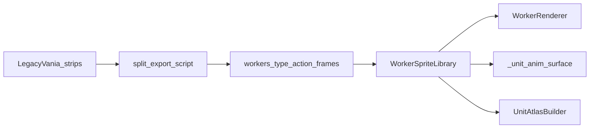

# Legacy Vania peasants and tax collector — integration plan

## How this parallels the Tiny RPG doc

The studio doc [`.cursor/plans/tiny_rpg_soldier_guard_animations_5689d615.plan.md`](.cursor/plans/tiny_rpg_soldier_guard_animations_5689d615.plan.md) established a repeatable chain:

1. **Vendor strips** → **export** (split cells, optional union bbox / letterbox to game frame size, write `frame_000.png`…).
2. **Disk layout** under `assets/sprites/workers/<type>/<action>/` consumed by [`WorkerSpriteLibrary`](game/graphics/worker_sprites.py) via [`load_png_frames`](game/graphics/animation.py).
3. **Pygame** already animates via [`WorkerRenderer`](game/graphics/renderers/worker_renderer.py) state → clip mapping.
4. **Ursina + instancing** must use the same **time-based clip + frame** path as heroes/guards — not [`_worker_idle_surface`](game/graphics/ursina_units_anim.py) / `lookup_uv(..., "idle", 0)` only.

Your Legacy Vania sheets are **fixed-count horizontal strips** (simpler than Tiny RPG merge_index), but they use **opaque black backgrounds** in many packs — the exporter step must key that out or convert to alpha so billboards composite cleanly (Tiny RPG’s [`_split_horizontal_strip`](tools/tiny_rpg_export_frames.py) assumes consistent cell size; content bbox logic is alpha-oriented).

---

## 1. Asset intake and licensing

- Copy the pack into the game repo (it is not under [`assets/sprites/vendor/`](assets/sprites/vendor/) yet): e.g. `assets/sprites/vendor/legacy-vania-npc-v7/spritesheets/` with the four PNGs you listed.
- Add a row to [`assets/ATTRIBUTION.md`](assets/ATTRIBUTION.md) with pack name, license, and link/source per studio rules.
- Run `python tools/validate_assets.py --report` after manifest updates (if your pipeline requires entries in [`tools/assets_manifest.json`](tools/assets_manifest.json)).

---

## 2. Authoring: strip → `frame_NNN.png` (recommended small tool)

Add a focused script (Agent 12 owns `tools/`, but Agent 09 may coordinate or place a one-off under `tools/` per past Tiny RPG pattern), e.g. `tools/legacy_vania_export_worker_frames.py`, that:

- Loads each source strip with pygame.
- Splits on a **known frame count** (6 for walk strips, 4 for yes/no) and **known cell width** = `image_width // n_frames`, height = strip height (288×48 → 48×48 for fisherman; verify believer strips the same way once files are on disk).
- **Background**: treat near-pure-black RGB as transparent (tune threshold so robe blacks and outlines survive — same class of problem as chroma key).
- Optionally applies the same **letterbox to `config.UNIT_SPRITE_PIXELS`** (default **48** per [`config.py`](config.py) `KINGDOM_UNIT_SPRITE_PX`) for consistent scaling with existing `load_png_frames(..., scale_to=...)`.

**Outputs (concrete paths):**

| Worker | Action | Source strip | Notes |
|--------|--------|--------------|--------|
| `tax_collector` | `walk` | `npc-believer-1_walk_strip6.png` | 6 frames |
| `tax_collector` | `collect` | `npc-believer-1_yes_strip4.png` | 4 frames — maps to `CollectorState.COLLECTING` in [`worker_renderer.py`](game/graphics/renderers/worker_renderer.py) |
| `tax_collector` | `return` | same as `walk` | Matches `RETURNING` + `MOVING_TO_GUILD` locomotion |
| `tax_collector` | `idle` | **single frame** from walk (export `idle/frame_000.png` only) | No dedicated idle strip; `WAITING` / `RESTING_AT_CASTLE` |
| `tax_collector` | `hurt` / `dead` | *(omit → procedural)* | [`WorkerSpriteLibrary`](game/graphics/worker_sprites.py) already falls back when folder empty |

Optional polish: map `npc-believer-1_no_strip4.png` to a **non-looping** clip used only if you add a one-shot trigger from sim (out of scope unless Agent 05 adds `_render_anim_trigger`); otherwise skip to avoid unused actions.

| Worker | Action | Source | Notes |
|--------|--------|--------|--------|
| `peasant` | `walk` | `npc-villager1-fisherman_walk.png` | 6 × 48×48 |
| `peasant` | `idle` | walk frame 0 | Single-frame `idle/` |
| `peasant` | `work` | duplicate `walk` frames | Same loop while `WORKING` — acceptable until a dedicated work strip exists |
| `peasant` | `hurt` / `dead` | procedural | Keep existing fallback |

**Builder variant (`peasant_builder`):**

- Duplicate exported `peasant/walk` frames into `assets/sprites/workers/peasant_builder/walk/` (and same for `idle` / `work` as above).
- Run a **deterministic palette pass** in the tool: map straw-hat yellow/tan pixels (sample from image; document hex ranges in script comments) to a **green hat** read, preserving shading by remapping light/mid/dark tiers — same idea as warrior shirt recolor, but on PNG pixels once at export time (avoids per-frame tint hacks in Ursina).

---

## 3. Runtime library (`WorkerSpriteLibrary`)

- Extend [`clips_for`](game/graphics/worker_sprites.py) with a branch for `wt == "peasant_builder"` using the **same** action dict and timings as peasant, but `_assets_dir()` subfolder `peasant_builder`.
- Clear `WorkerSpriteLibrary._cache` if you need hot reload in dev (normally process restart is enough).

No change to sim logic required for the builder key if graphics derives it the same way Ursina already does: `__class__.__name__ == "BuilderPeasant"` ([`ursina_renderer.py`](game/graphics/ursina_renderer.py) ~598–602) — reuse that pattern for **clip lookup** and **atlas class_key** (`"peasant"` vs `"peasant_builder"`) to stay out of `game/entities/` unless you prefer a clean `render_worker_type` property later (Agent 05).

---

## 4. Renderer parity (critical — same gap the Tiny RPG plan fixed for guards)

**Ursina billboards** ([`ursina_renderer.py`](game/graphics/ursina_renderer.py)):

- Add `_peasant_base_clip(peasant)` and `_tax_collector_base_clip(tc)` in [`ursina_units_anim.py`](game/graphics/ursina_units_anim.py), mirroring state names from [`WorkerRenderer.update_animation`](game/graphics/renderers/worker_renderer.py) (`PeasantState`, `CollectorState`).
- Replace `_worker_idle_surface("peasant")` / `"tax_collector"` with `_unit_anim_surface(..., WorkerSpriteLibrary.clips_for(...), _peasant_base_clip / _tax_collector_base_clip, "worker", "<class_key>")` like `_sync_snapshot_guards`.
- For builder peasants, pass `clips_for("peasant_builder")` when the class-name check matches; use **`color.white`** billboard multiply when using authored pixels (same lesson as guards/warriors in the Tiny RPG plan).

**Instancing** ([`instanced_unit_renderer.py`](game/graphics/instanced_unit_renderer.py)):

- Replace hardcoded `lookup_uv("worker", "peasant", "idle", 0)` with `_resolve_unit_anim_clip_frame` + the new base-clip helpers (same pattern as guards ~331–335 in the plan’s narrative).
- Tax collector: resolve clip from `CollectorState`, not always `idle`.

**Atlas** ([`unit_atlas.py`](game/graphics/unit_atlas.py)):

- Add `peasant_builder` to the worker loop alongside `peasant`, `guard`, `tax_collector` so UV keys exist for every packed frame.

---

## 5. Orientation and readability risk

Fisherman and believer strips are **side-view walk cycles**. The sim is **top-down**; procedural peasants were omnidirectional blobs. Expect a **Majesty-style “paper doll on the map”** look — same as heroes using facing or a single profile. Quick visual pass after export: if the profile reads poorly at default zoom, tune `PEASANT_SCALE` in [`ursina_renderer.py`](game/graphics/ursina_renderer.py) / instancing only (render-only).

---

## 6. Verification

- `python tools/qa_smoke.py --quick`
- `python tools/validate_assets.py --report` if assets or manifest change
- Manual (exact commands from repo root):
  - `python main.py --renderer pygame --no-llm` — peasants walk/work, tax collector walk/collect/return
  - `python main.py --renderer ursina --no-llm` — confirm **motion** (not frozen first frame), builder **green hat** reads vs regular fisherman
  - If instancing is on in your branch: `$env:KINGDOM_URSINA_INSTANCING='1'; python main.py --renderer ursina --no-llm` — same checks

---

## 7. Ownership note (studio rules)

- Primary implementation: **Agent 09** — [`game/graphics/worker_sprites.py`](game/graphics/worker_sprites.py), [`game/graphics/ursina_units_anim.py`](game/graphics/ursina_units_anim.py), [`game/graphics/ursina_renderer.py`](game/graphics/ursina_renderer.py), [`game/graphics/instanced_unit_renderer.py`](game/graphics/instanced_unit_renderer.py), [`game/graphics/unit_atlas.py`](game/graphics/unit_atlas.py), new PNGs under `assets/sprites/workers/`.
- **`tools/`** script: prefer **Agent 12** to add/maintain the exporter, or Agent 09 adds minimal script and logs cross-domain touch for 12 review.
- Optional **yes/no one-shot** tied to economy events: **Agent 05** + snapshot if you want `no` strip in gameplay later.
