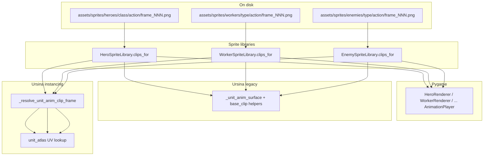

# Master guide: updating unit sprites (2D heroes, workers, enemies)

Studio reference for **adding or replacing pixel-unit art** without rediscovering the Tiny RPG guard fix, Legacy Vania worker pipeline, Ursina(instancing) parity, or scale tuning. Keep this file updated when contracts change.

**Related deep dives**

| Topic | Where |
|--------|--------|
| Tiny RPG strips, CSVs, exporter CLI, runtime map | [`docs/art/tiny_rpg_character_pipeline.md`](../../docs/art/tiny_rpg_character_pipeline.md) |
| Guard investigation + renderer parity rationale | [`.cursor/plans/tiny_rpg_soldier_guard_animations_5689d615.plan.md`](tiny_rpg_soldier_guard_animations_5689d615.plan.md) |
| Legacy Vania peasants / tax collector / builder | [`.cursor/plans/legacy_vania_workers_4acd1e09.plan.md`](legacy_vania_workers_4acd1e09.plan.md) |
| Kenney prefab assembler scale contract (**3D kitbash**, not 2D sprites) | [`.cursor/plans/assembler_scale_hotkeys_177ca989.plan.md`](assembler_scale_hotkeys_177ca989.plan.md) |

---

## 1. Roles and ownership

Follow **`AGENTS.md`**. Short map for **2D unit visuals**:

| Area | Primary owner |
|------|----------------|
| `game/graphics/*` renderers, sprites, VFX, `assets/sprites/**`, `assets/ui/**` | Agent 09 (Art / graphics) |
| `game/sim_engine.py`, snapshot contracts, engine wiring | Agent 03 |
| `game/entities/**`, `game/systems/**`, guard/peasant/collector **sim state** | Agent 05 |
| New **`tools/`** exporters, validators | Agent 12 |
| `tools/qa_smoke.py`, `observe_sync` assertions | Agent 11 |

Cross-domain edits: minimal change + note in agent log + ping owner.

---

## 2. Mental model: one disk layout, three consumers

Kingdom Sim treats **units** as **folders of PNG frames**, loaded into **`AnimationClip`** dictionaries, then consumed by:

1. **Pygame** — `AnimationPlayer` per entity renderer (usually already correct once PNGs exist).
2. **Ursina legacy billboards** — time-based frame pick + texture upload (`_unit_anim_surface`).
3. **Ursina instancing** — same clip/frame resolution + **UV lookup** into `UnitAtlasBuilder` atlas.

**Critical lesson:** If PNGs animate in pygame but look **frozen** in Ursina, the bug is almost never “re-export”; it is **missing parity** in Ursina / instancing (still using **idle frame 0** or hardcoded UVs).



---

## 3. On-disk contracts

### 3.1 Folder layout

| Unit kind | Root | Example |
|-----------|------|---------|
| Heroes | `assets/sprites/heroes/<class>/` | `warrior`, `ranger`, … |
| Workers | `assets/sprites/workers/<worker_type>/` | `peasant`, `peasant_builder`, `guard`, `tax_collector` |
| Enemies | `assets/sprites/enemies/<type>/` | per `enemy_sprites` / exports |

Under each unit: **`<action>/frame_000.png`, `frame_001.png`, …** (zero-padded, sorted). Loading: [`game/graphics/animation.py`](../../game/graphics/animation.py) `load_png_frames` (nearest-neighbor scaling when `scale_to` is set — see [`game/graphics/pixel_scale.py`](../../game/graphics/pixel_scale.py)).

### 3.2 Action names are code contracts

**Do not rename actions** without updating:

- The matching **`clips_for`** action dict in `HeroSpriteLibrary` / `WorkerSpriteLibrary` / `EnemySpriteLibrary`.
- **Pygame** renderer state → clip mapping (e.g. [`worker_renderer.py`](../../game/graphics/renderers/worker_renderer.py)).
- **Ursina** `_hero_base_clip` / `_guard_base_clip` / `_peasant_base_clip` / `_tax_collector_base_clip` / enemy equivalents in [`ursina_units_anim.py`](../../game/graphics/ursina_units_anim.py).
- **`unit_atlas.py`** packing loops for any **new** `(category, class_key)` combination.

### 3.3 Raster size vs world scale

- **`UNIT_SPRITE_PIXELS`** (`config.py`, env `KINGDOM_UNIT_SPRITE_PX`, default **48**) is the **game’s canonical square raster** for loading/scaling frames into clips and atlas packing.
- **Exporter canvas** (Tiny RPG default 48×48 letterbox, Legacy Vania `--frame-size`) should stay aligned with this unless you intentionally retune **both** export and runtime.
- **On-screen world size (Ursina)** for workers is **not** the PNG pixel count alone; it uses billboard scales in `config.py`:
  - `URSINA_WORKER_BILLBOARD_BASE` (env `KINGDOM_URSINA_WORKER_SCALE`)
  - `URSINA_WORKER_BILLBOARD_Y_SCALE_MUL` (env `KINGDOM_URSINA_WORKER_Y_MUL`)
- Heroes/enemies use their own billboard constants in [`ursina_renderer.py`](../../game/graphics/ursina_renderer.py) / [`instanced_unit_renderer.py`](../../game/graphics/instanced_unit_renderer.py). Workers scale with `_US` derived from `UNIT_SPRITE_PIXELS` where documented in code.

**Readability workflow:** After art changes, if silhouettes are wrong **width vs height**, tweak **billboard / Y_MUL** first; only change exporter letterbox if you need **pixel fidelity** or atlas density.

**Dev comparison shot:** `tools/run_worker_scale_ursina_shot.py` sets `KINGDOM_URSINA_WORKER_SCALE_SHOT` (see [`ursina_app.py`](../../game/graphics/ursina_app.py)) for side-by-side tuning without guessing.

---

## 4. Authoring pipelines

### 4.1 Tiny RPG Character Pack (100×100 strips, CSV-driven)

**Tool:** [`tools/tiny_rpg_export_frames.py`](../../tools/tiny_rpg_export_frames.py)

**Inputs:** `assets/sprites/vendor/tiny_rpg_pack_v1_03/` — especially `Map.csv` (human map) and **`Map_actions.csv`** (machine spec + **`merge_index`** for multi-file attacks).

**Behavior (summary):** split strips → union bbox per logical action → letterbox to output canvas (default **48×48**) with **nearest-neighbor** → write `frame_NNN.png`.

**Typical PowerShell (repo root):**

```powershell
python tools/tiny_rpg_export_frames.py --pack assets/sprites/vendor/tiny_rpg_pack_v1_03 --dry-run --only-unit workers/guard
python tools/tiny_rpg_export_frames.py --pack assets/sprites/vendor/tiny_rpg_pack_v1_03 --execute --clean-action --verify --only-unit workers/guard
```

Full CLI and pitfalls (“PNG exists but frozen”) are documented in **`docs/art/tiny_rpg_character_pipeline.md`** and the **[Tiny RPG soldier/guard plan](tiny_rpg_soldier_guard_animations_5689d615.plan.md)**.

### 4.2 Legacy Vania (and similar) horizontal strips

**Tool:** [`tools/legacy_vania_export_worker_frames.py`](../../tools/legacy_vania_export_worker_frames.py)

**Differences from Tiny RPG:**

- Often **opaque black backgrounds** → exporter must **key to alpha** (threshold documented in tool).
- Usually **fixed frame counts** per strip (no `merge_index`; duplicate strips in tooling if one game action needs multiple sources).
- **`peasant_builder`**: duplicate peasant frames + **deterministic green-hat palette remap** at export time (see Legacy Vania plan).

On-screen worker size: exporter comments note billboard **`URSINA_WORKER_BILLBOARD_BASE`** / env overrides — shrinking PNGs aggressively is **not** the primary knob for Ursina readability.

### 4.3 New vendor pack (checklist)

1. Vendor tree under `assets/sprites/vendor/<pack_id>/` + **`assets/ATTRIBUTION.md`** row.
2. Prefer a **small dedicated exporter** under `tools/` (pattern: Tiny RPG / Legacy Vania) — Agent 12 owns tooling.
3. Output **`frame_###.png`** only; match **`WorkerSpriteLibrary`** (or hero/enemy) action keys.
4. **`python tools/validate_assets.py --report`** if manifest / new paths require it.

---

## 5. Runtime libraries (where clips are defined)

| Library | File | Loads from |
|---------|------|------------|
| Heroes | [`hero_sprites.py`](../../game/graphics/hero_sprites.py) | `assets/sprites/heroes/` |
| Workers | [`worker_sprites.py`](../../game/graphics/worker_sprites.py) | `assets/sprites/workers/` |
| Enemies | [`enemy_sprites.py`](../../game/graphics/enemy_sprites.py) | `assets/sprites/enemies/` |

Each defines **per-action** `frame_time_sec`, **loop** vs one-shot, and procedural fallback if folders are empty.

**Adding a new worker type:** new folder + `clips_for` branch + pygame renderer registry entry + Ursina sync + instancing + **`unit_atlas.py`** worker loop — see §7.

---

## 6. Renderer parity (most common integration gap)

### 6.1 Pygame

[`game/graphics/renderers/worker_renderer.py`](../../game/graphics/renderers/worker_renderer.py) (and peers): **`update_animation`** maps **sim state enums** → clip names and advances **`AnimationPlayer`** every frame. This path is the **behavioral reference** for “what clip should play.”

### 6.2 Ursina legacy (`UrsinaRenderer`)

- **`_unit_anim_surface`** ([`ursina_renderer.py`](../../game/graphics/ursina_renderer.py)) uses **wall-clock** timing consistent with clip frame math (see `ursina_units_anim`).
- **Base clip** helpers pick locomotion / loop clips from entity state (`_hero_base_clip`, `_guard_base_clip`, `_peasant_base_clip`, `_tax_collector_base_clip`, enemies similarly).
- **One-shot triggers** (`_render_anim_trigger`, e.g. hurt): parity optional polish; guards historically lacked hurt triggers — see Tiny RPG plan §2.4.

**Anti-pattern:** `_worker_idle_surface(type)` / always uploading **`clips["idle"].frames[0]`** for units that should move.

### 6.3 Ursina instancing (`InstancedUnitRenderer`)

- Must call **`_resolve_unit_anim_clip_frame`** (same inputs as billboard path) then **`lookup_uv(category, class_key, clip_name, frame_idx)`**.
- **Anti-pattern:** `lookup_uv(..., "idle", 0)` while the atlas contains full animations — wastes authored art.

### 6.4 Atlas packing (`unit_atlas.py`)

**`UnitAtlasBuilder`** must include **every** `(category, class_key)` you draw via instancing. If you add **`peasant_builder`** or a new enemy, extend the pack loops or UV keys will miss at runtime.

### 6.5 Tint policy for authored pixels

When using **textured Tiny RPG (or similar) PNGs**, billboards often use **`color.white`** (no extra multiply) so pixels match authoring — see Tiny RPG guard plan (warrior/guard lesson). Procedural fallbacks keep tint colors.

---

## 7. End-to-end checklist: new or replaced unit art

Use this for **heroes**, **workers**, or **enemies** (adjust paths).

- [ ] **Vendor + license** in repo and `assets/ATTRIBUTION.md`.
- [ ] **Export** to correct `assets/sprites/.../<action>/frame_*.png` (nearest-neighbor pipeline).
- [ ] **`clips_for`** actions, timings, loop flags updated if actions changed.
- [ ] **Pygame renderer** state → clip mapping matches sim enums.
- [ ] **`ursina_units_anim`** base clip helper (if new unit category patterns).
- [ ] **`ursina_renderer`** `_sync_snapshot_*` uses **`_unit_anim_surface`**, not idle-only helper.
- [ ] **`instanced_unit_renderer`** uses **`_resolve_unit_anim_clip_frame`** + atlas UV.
- [ ] **`unit_atlas.py`** packs new class keys / categories.
- [ ] **Billboard scales** in `config.py` / env if readability needs tuning (workers vs heroes).
- [ ] **`python tools/qa_smoke.py --quick`** PASS.
- [ ] **`python tools/validate_assets.py --report`** if assets/manifest touched.
- [ ] Manual: `python main.py --renderer pygame --no-llm` and `python main.py --renderer ursina --no-llm`; with instancing: `$env:KINGDOM_URSINA_INSTANCING='1'; python main.py --renderer ursina --no-llm`.

---

## 8. Related: Kenney prefab assembler scale (3D buildings — not 2D units)

When work touches **kitbash JSON** or **`tools/model_assembler_kenney.py`**, scales follow the contract in **[assembler_scale_hotkeys plan](assembler_scale_hotkeys_177ca989.plan.md)**:

- JSON stores **logical** `scale` triples on each piece.
- On spawn, **`entity.scale = logical * pack_extent_multiplier_for_rel(model_rel)`** (`tools/kenney_pack_scale`).
- Do **not** bake the pack multiplier into saved JSON; keep parity with [`ursina_renderer`](../../game/graphics/ursina_renderer.py) prefab loading.

Planned UX there: **`-` / `=`** (with **Shift** for fine steps) nudges **logical** scale uniformly; re-apply `* pf` to the entity after edits. This is **orthogonal** to 2D sprite billboards but shared studio knowledge for “things look wrong size in Ursina.”

---

## 9. Quick troubleshooting

| Symptom | Likely cause |
|---------|----------------|
| Pygame animates, Ursina frozen | Ursina still on **idle frame 0** or missing `_unit_anim_surface` wiring |
| Instancing frozen, legacy Ursina OK | Hardcoded **`lookup_uv(..., idle, 0)`** |
| Atlas crash / wrong UV | **`unit_atlas`** missing pack branch for new `class_key` |
| Blurry pixels | Bilinear scaling somewhere — use **nearest** (`pixel_scale`, exporter) |
| Workers tiny/huge vs heroes | **`URSINA_WORKER_BILLBOARD_*`** / **`KINGDOM_URSINA_WORKER_SCALE`** — not only PNG size |
| Black fringes on billboards | Export alpha / background key (Legacy Vania lesson) |

---

## 10. File index (high signal)

| Purpose | Path |
|---------|------|
| Tiny RPG export | `tools/tiny_rpg_export_frames.py` |
| Legacy Vania export | `tools/legacy_vania_export_worker_frames.py` |
| Frame load / AnimationClip | `game/graphics/animation.py` |
| Nearest-neighbor scale helper | `game/graphics/pixel_scale.py` |
| Worker clips | `game/graphics/worker_sprites.py` |
| Ursina clip/frame logic | `game/graphics/ursina_units_anim.py` |
| Ursina billboard sync | `game/graphics/ursina_renderer.py` |
| Instancing + UVs | `game/graphics/instanced_unit_renderer.py` |
| Atlas pack | `game/graphics/unit_atlas.py` |
| Texture upload bridge | `game/graphics/ursina_texture_bridge.py` |
| Worker pygame rendering | `game/graphics/renderers/worker_renderer.py` |
| Unit raster + worker billboard config | `config.py` (`UNIT_SPRITE_PIXELS`, `URSINA_WORKER_*`) |
| Worker scale dev shot | `tools/run_worker_scale_ursina_shot.py` |

---

*Last consolidated from Tiny RPG guard parity, Legacy Vania workers, Ursina worker scale tuning, and Kenney assembler scale contract notes. Update this guide when adding new exporters or renderer paths.*
