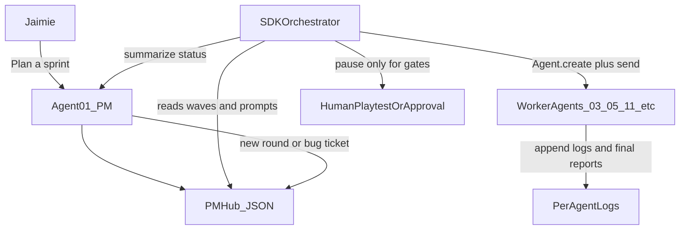

# Cursor SDK Sprint Automation Plan

## Outside Consultant Assessment

The current AI Studio setup is unusually ready for automation. It already has the pieces an orchestrator needs:

- A PM-owned source of truth in [`C:\Users\Jaimie Montague\OneDrive\Documents\Kingdom\.cursor\plans\agent_logs\agent_01_ExecutiveProducer_PM.json`](C:\Users\Jaimie%20Montague\OneDrive\Documents\Kingdom\.cursor\plans\agent_logs\agent_01_ExecutiveProducer_PM.json), including `pm_universal_prompt`, `pm_agent_prompts`, `pm_send_list_minimal`, waves, dependencies, intelligence levels, and closeout evidence.
- Per-agent append-only logs under [`C:\Users\Jaimie Montague\OneDrive\Documents\Kingdom\.cursor\plans\agent_logs`](C:\Users\Jaimie%20Montague\OneDrive\Documents\Kingdom\.cursor\plans\agent_logs), which solves the shared-file collision problem.
- Explicit role and file ownership in [`C:\Users\Jaimie Montague\OneDrive\Documents\Kingdom\AGENTS.md`](C:\Users\Jaimie%20Montague\OneDrive\Documents\Kingdom\AGENTS.md) and [`C:\Users\Jaimie Montague\OneDrive\Documents\Kingdom\.cursor\rules`](C:\Users\Jaimie%20Montague\OneDrive\Documents\Kingdom\.cursor\rules).
- A mature round model documented in [`C:\Users\Jaimie Montague\OneDrive\Documents\Kingdom\.cursor\plans\ai_studio_infrastructure_progress.md`](C:\Users\Jaimie%20Montague\OneDrive\Documents\Kingdom\.cursor\plans\ai_studio_infrastructure_progress.md): R0 kickoff, R1 contracts, R2 confirmation, R3 integration, QA, closeout.

The main gap is that the “router” is currently human-operated. The Cursor SDK can become that router because it supports durable agents, local/cloud runtimes, `agent.send()`, `run.wait()`, streaming events, agent resume, model discovery, cloud agent listing, artifacts, and inline/file-based subagent definitions. Relevant SDK references: [Cursor TypeScript SDK](https://cursor.com/docs/sdk/typescript), [Cursor Cookbook](https://github.com/cursor/cookbook), [SDK quickstart](https://github.com/cursor/cookbook/tree/main/sdk/quickstart), [coding-agent-cli example](https://github.com/cursor/cookbook/tree/main/sdk/coding-agent-cli), and [agent-kanban example](https://github.com/cursor/cookbook/tree/main/sdk/agent-kanban).

## Proposed Architecture

Keep Agent 01 as the “studio brain,” but move the repetitive routing into a TypeScript orchestrator owned by Agent 12.



Key design choice: do not let worker agents freely self-spawn the whole studio at first. Start with a central orchestrator that follows `pm_send_list_minimal.waves` and `then_in_order`. Later, allow controlled agent-to-agent escalation through PM-approved `handoff_request` entries in each agent log.

## Phase 1: Make the PM Hub Machine-Readable

Agent 01 and Agent 12 should define a small automation contract in markdown first, then wire it into PM hub entries.

- Add or document an `automation` block in each sprint/round of the PM hub:
  - `mode`: `manual`, `assist`, or `auto_until_human_gate`.
  - `runnable_agents`: agent IDs to launch.
  - `dependencies`: wave IDs or named completion conditions.
  - `human_gates`: playtest, visual approval, version bump, git commit/push.
  - `success_signals`: accepted exit codes, required log paths, expected fields.
  - `failure_policy`: retry once, route to owner, or stop for PM.
  - `model_policy`: default and required model for all orchestrated agents and subagents.
- Keep the current `pm_send_list_minimal` format, but treat it as the canonical DAG for v1.
- Update [`C:\Users\Jaimie Montague\OneDrive\Documents\Kingdom\.cursor\rules\agent-01-pm-onboarding.mdc`](C:\Users\Jaimie%20Montague\OneDrive\Documents\Kingdom\.cursor\rules\agent-01-pm-onboarding.mdc) so Agent 01 produces automation-ready waves, not just human copy-paste instructions.

## Required Model Policy

All automated studio agents must use **Composer 2** unless Jaimie explicitly approves an exception for a specific run.

- The orchestrator should create every SDK agent with `model: { id: "composer-2" }`.
- Per-run `agent.send(..., { model })` overrides should be blocked unless an allowlisted override is present in the PM hub and marked as human-approved.
- Any inline SDK subagents defined through `agents: { ... }` should use `model: "inherit"` only when the parent is already Composer 2, or explicitly `model: { id: "composer-2" }` if the SDK path supports it.
- Any file-based subagents under `.cursor/agents/*.md` created for this workflow should set `model: inherit` and include prompt text saying they must not request or spawn higher-cost models.
- Agent 01's generated prompts should continue to include intelligence levels for planning purposes, but the automation layer should map those to scope/care/retry policy, not to more expensive model selection by default.
- The run ledger should record the resolved model for each agent/run, and the orchestrator should stop if the SDK reports a non-Composer model without approval.

## Phase 2: Build a Local SDK Orchestrator MVP

Agent 12 should implement a TypeScript CLI, likely under a new tooling folder such as `tools/ai_studio_orchestrator/` or `.cursor/studio-orchestrator/`, because ToolsDevEx owns automation/tooling.

Initial commands:

```powershell
pnpm install
$env:CURSOR_API_KEY = "crsr_..."
pnpm studio run --sprint wk46-stage3-lumberjack-builders --round wk46_r0_kickoff --mode assist
pnpm studio status --sprint wk46-stage3-lumberjack-builders
pnpm studio resume --run-id <id>
```

The MVP should:

- Read `agent_01_ExecutiveProducer_PM.json` and resolve the sprint/round.
- Validate that all selected agents have `pm_agent_prompts[agentId]` and an intelligence recommendation.
- Create one durable Cursor SDK agent per studio agent, named like `Kingdom Agent 05 - wk46_r0`, with `model: { id: "composer-2" }`.
- Send each agent a composed prompt: role identity, universal prompt, its numbered prompt, ownership constraints, and reporting requirements.
- Stream status/tool events to a small run ledger, while treating tool payloads defensively because SDK tool schemas are not stable.
- Wait for runs with `run.wait()` and mark each wave complete only when all required agents finish and their logs contain a matching sprint/round entry.
- Pause before any human-only gate: manual playtest, visual judgment, version bump, commit, or push.

Default runtime should be local first, because this repo is already local, asset-heavy, and Windows/PowerShell-specific. Add cloud mode later for parallel code-heavy sprints once branch/PR behavior is proven.

## Phase 3: Add PM Feedback Loops

Once agent launch and wave waiting works, automate the current “agents prompt Agent 01 back” pattern.

- After each wave, the orchestrator asks Agent 01 to synthesize:
  - Read the completed agent logs for this sprint/round.
  - Update PM hub with decisions, blockers, bug tickets, and the next wave.
  - Decide whether to continue, retry, escalate, or pause for Jaimie.
- Worker agents should not directly modify Agent 01’s PM hub. They write only their own logs. The orchestrator then prompts Agent 01 with a concise summary and pointers to the agent logs.
- Cross-agent communication should be mediated through structured fields such as `handoff_requests`, `blockers`, `questions_back_to_pm`, and `recommended_next_actions`, rather than ad hoc agent-to-agent chat.

## Phase 4: Add Safety Rails Before Full Auto

Before `auto_until_human_gate`, add explicit guardrails:

- File ownership guard: parse intended files from prompts/logs and block obvious ownership violations before launching.
- Dirty tree guard: record `git status` before a wave; never auto-commit or push without Jaimie approval.
- Gate guard: QA agents can run gates automatically, but the orchestrator stops if `qa_smoke --quick` or `validate_assets --report` fails.
- Cost guard: hard Composer 2 model policy, max active agents, max retries, max runtime, and required intelligence levels.
- Human gate guard: always pause for visual asset approval, manual smoke, release/version bump, and commit/push.

## Phase 5: Cloud and Dashboard Layer

After the local MVP is reliable, add optional cloud execution and a simple dashboard.

- Use cloud agents for parallel work that can happen safely on isolated branches.
- Use `Agent.list()`, `Agent.listRuns()`, `listArtifacts()`, and `downloadArtifact()` patterns from the cookbook’s Kanban example to display current sprint status.
- Prefer one branch/PR per sprint or per implementer wave, not unbounded agent-created PRs.
- Keep asset-heavy or manual-visual tasks local unless cloud artifact previews become reliable for your workflow.

## Recommended First Automation Sprint

Use a low-risk sprint to prove the system. Do not start with a multi-agent gameplay sprint.

Best first target:

- “Run current PM hub wave plan in assist mode” for an already-closed or doc-only sprint.
- Launch one Agent 11 QA validation agent from the PM hub.
- Confirm the orchestrator can stream, wait, detect completion, and summarize back to Agent 01.

Second target:

- Automate a normal sequence like `03 -> 11` for a mechanical refactor sprint.

Third target:

- Automate a parallel wave like `15 + 05 + 03 -> 11`, with hard pauses on QA failure and manual playtest.

## What Not To Do Yet

- Do not replace PM hub JSON with an entirely new database. The current log structure is working.
- Do not let every agent freely spawn every other agent until the central orchestration loop is proven.
- Do not auto-commit, auto-push, or auto-version-bump.
- Do not start with cloud-only orchestration. Local mode is easier to debug and better matches the current workflow.
- Do not run all 15 agents by default. Preserve the current active / consult-only / silent discipline.

## Deliverables For Implementation

- A short automation contract doc in `.cursor/plans/` describing the PM hub fields and state machine.
- A TypeScript SDK CLI owned by Agent 12.
- A PM onboarding rule update requiring automation-ready `pm_send_list_minimal` and `human_gates`.
- A sample dry-run against an existing sprint.
- A sample live run that launches Agent 11 only and reports results back to Agent 01.
- A later dashboard only after the CLI proves useful.