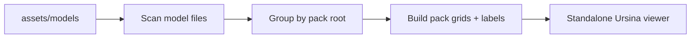

# Standalone Model Viewer

Build a repo-native Ursina model browser that runs independently from the game, scans `assets/models`, and shows every model in a navigable grid with pack boundaries, pack names, and per-model file labels. The viewer should reuse the repo’s lightweight CLI style (`argparse` + `main()` like [tools/validate_assets.py](tools/validate_assets.py) and [tools/build_gallery.py](tools/build_gallery.py)) but avoid `GameEngine` entirely.

## Scope
- New script: `tools/model_viewer.py`
- Launch independently with `python tools/model_viewer.py` from repo root.
- Use a simple Ursina scene with a ground grid, WASD pan, zoom in/out, and readable labels.
- Group by pack root folders and preserve nested subfolder paths in the model names so modular packs stay unambiguous.
- Fit each model to a consistent preview scale so heterogeneous packs remain readable.
- Add a short run hint in [README.md](README.md) next to the existing `tools/` commands.

## Implementation Notes
- Do not import `GameEngine`; this should be a sandbox viewer, not the live simulation.
- Borrow the feel of the existing Ursina controls from [game/graphics/ursina_app.py](game/graphics/ursina_app.py) only where helpful, but keep the viewer self-contained.
- Draw each pack as a bordered rectangle on the floor, with the pack name centered below the border and each model name directly under its model.
- Keep the first pass simple: legibility and fast browsing matter more than perfect in-game lighting/shaders.

## Validation
- Tool starts from repo root without touching the game loop.
- At least one nested pack and one flat pack render with labels visible.
- WASD and zoom can traverse beyond a single screenful of models.
- No regression to `python tools/qa_smoke.py --quick`.

todos:
- id: viewer-cli
  content: Add the standalone Ursina viewer entrypoint and filesystem scan/grouping logic.
- id: viewer-layout
  content: Build the pack grid, border, and text labeling system with camera controls.
- id: viewer-docs
  content: Add a short README launch note and manual verification checklist.