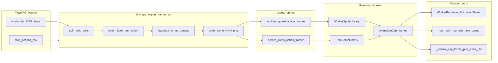

# Tiny RPG Soldier guards — reverse engineering and replication plan

## Executive summary (what went wrong)

- **Authoring for Soldier is already aligned with Warrior**: [`assets/sprites/vendor/tiny_rpg_pack_v1_03/Map_actions.csv`](assets/sprites/vendor/tiny_rpg_pack_v1_03/Map_actions.csv) defines `workers/guard` ↔ Tiny RPG character **Soldier**, with the same multi-strip **attack** pattern as `heroes/warrior` ↔ **Knight** (three `Attack##` PNGs merged by `merge_index`).
- **Runtime clips already exist in code**: [`game/graphics/worker_sprites.py`](game/graphics/worker_sprites.py) defines guard actions `idle`, `walk`, `attack` (looping while attacking), `hurt`, `dead` and loads PNGs from `assets/sprites/workers/guard/<action>/` via [`load_png_frames`](game/graphics/animation.py).
- **Pygame path can animate**: [`game/graphics/renderers/worker_renderer.py`](game/graphics/renderers/worker_renderer.py) maps [`GuardState`](game/entities/guard.py) to clips (`MOVING`→`walk`, `ATTACKING`→`attack`, etc.) and advances [`AnimationPlayer`](game/graphics/animation.py) every frame.
- **Default Ursina path does not animate workers**: [`game/graphics/ursina_units_anim.py`](game/graphics/ursina_units_anim.py) `_worker_idle_surface()` returns **`clips["idle"].frames[0]` only** — a frozen pose. Guards use this in [`UrsinaRenderer._sync_snapshot_guards`](game/graphics/ursina_renderer.py) (~633–635).
- **Instanced Ursina path also freezes workers**: [`game/graphics/instanced_unit_renderer.py`](game/graphics/instanced_unit_renderer.py) hardcodes `lookup_uv("worker", "guard", "idle", 0)` (~385), while heroes/enemies call `_resolve_unit_anim_clip_frame` (~331–335, ~354–359).

So the fix is **not** “re-export Soldier again” unless frames are missing on disk; it is **renderer parity**: make guards follow the same **time-based clip + frame index** path heroes already use.

---

## Part 1 — How Warrior (Knight) animations were made (reverse engineered)

### 1.1 Vendor source layout (Tiny RPG pack)

- Character sprites live under something like `assets/sprites/vendor/tiny_rpg_pack_v1_03/Characters(100x100)/<CharacterName>/<CharacterName>/*.png` (see resolver in [`tools/tiny_rpg_export_frames.py`](tools/tiny_rpg_export_frames.py) `_resolve_inner_character_dir`).
- Each PNG is a **horizontal strip** of fixed cells (default **100×100** per frame). `_split_horizontal_strip()` slices into frames.

### 1.2 Mapping tables (what “Knight → warrior” means)

Two CSVs matter:

| File | Role |
|------|------|
| [`Map.csv`](assets/sprites/vendor/tiny_rpg_pack_v1_03/Map.csv) | Human-readable **which Tiny RPG character** backs each Kingdom unit (e.g. `warrior → Knight`). |
| [`Map_actions.csv`](assets/sprites/vendor/tiny_rpg_pack_v1_03/Map_actions.csv) | Machine export spec: **which strip files** implement each **kingdom_action**, and **merge order** when one logical action spans multiple strips. |

Warrior rows (abbreviated):

```text
heroes,warrior,Knight,attack,Knight-Attack01.png,0
heroes,warrior,Knight,attack,Knight-Attack02.png,1
heroes,warrior,Knight,attack,Knight-Attack03.png,2
```

The exporter **groups** rows by `(kingdom_category, kingdom_unit, tiny_rpg_character, kingdom_action)`, sorts by `merge_index`, concatenates all frames from each strip into **one animated clip** for `attack`.

### 1.3 Export algorithm ([`tools/tiny_rpg_export_frames.py`](tools/tiny_rpg_export_frames.py))

For each group:

1. Load each source PNG strip; split into raw cell surfaces (`100×100`).
2. Build **`all_frames`** by extending lists across merged strips (multi-row `attack`).
3. Compute a **single union bounding box** of non-transparent pixels across **all frames in that action** (“aligned motion”: every frame cropped with the same rect so feet do not slide incorrectly relative to the bbox math).
4. Optional **crop cap** (`--crop-cap-factor`) if wide swings would crush detail when downscaled.
5. For each frame: crop → paste into **`out_w × out_h`** canvas (default **48×48**) centered (letterbox), **nearest-neighbor** only.
6. Write `frame_000.png`, `frame_001.png`, … under:
   - Heroes: `assets/sprites/heroes/<class>/<action>/`
   - Workers: `assets/sprites/workers/<worker_type>/<action>/`

Typical command (PowerShell, repo root):

```powershell
python tools/tiny_rpg_export_frames.py --pack assets/sprites/vendor/tiny_rpg_pack_v1_03 --execute --clean-action --verify --only-unit workers/guard
```

Dry-run first:

```powershell
python tools/tiny_rpg_export_frames.py --pack assets/sprites/vendor/tiny_rpg_pack_v1_03 --dry-run --only-unit workers/guard
```

### 1.4 Runtime loading — heroes ([`game/graphics/hero_sprites.py`](game/graphics/hero_sprites.py))

- `_assets_dir()` → `assets/sprites/heroes`.
- `clips_for(hero_class)` builds a dict of [`AnimationClip`](game/graphics/animation.py) per action with **frame timing** and **loop flags** (e.g. `walk` loops, `hurt` does not).
- `_try_load_asset_frames()` loads PNGs if present; otherwise procedural fallback.

### 1.5 Ursina animation — heroes ([`game/graphics/ursina_renderer.py`](game/graphics/ursina_renderer.py))

Hero billboards call `_unit_anim_surface()` which:

- Reads optional one-shot triggers (`_render_anim_trigger` / `_ursina_anim_trigger`) for clips like `hurt`, `attack`.
- Otherwise plays a **base locomotion clip** from `_hero_base_clip()` in [`game/graphics/ursina_units_anim.py`](game/graphics/ursina_units_anim.py) (`inside` / `walk` / `idle`).
- Uses **wall-clock** `time.time()` timing consistent with `_frame_index_for_clip()` (same math as [`AnimationPlayer`](game/graphics/animation.py), but decoupled from sim dt).

### 1.6 Atlas packing ([`game/graphics/unit_atlas.py`](game/graphics/unit_atlas.py))

`UnitAtlasBuilder` calls `WorkerSpriteLibrary.clips_for("guard")` and packs **every frame of every action** into a 2048² atlas. **The atlas already contains walk/attack frames**; instancing simply never **indexes** them for guards today.

---

## Part 2 — Replicate Warrior-style pipeline for Soldier (guard)

### 2.1 Authoring checklist (Soldier)

Soldier rows already mirror Knight structure in [`Map_actions.csv`](assets/sprites/vendor/tiny_rpg_pack_v1_03/Map_actions.csv) lines 56–62 (`idle`, `walk`, `hurt`, `dead`, merged `attack`).

**Verify on disk after export:**

- `assets/sprites/workers/guard/idle/frame_*.png`
- `assets/sprites/workers/guard/walk/frame_*.png`
- `assets/sprites/workers/guard/attack/frame_*.png` (longest clip — merged strips)
- `assets/sprites/workers/guard/hurt/frame_*.png`
- `assets/sprites/workers/guard/dead/frame_*.png`

**Match Warrior readability expectations:**

- Compare frame counts and silhouette motion to [`assets/sprites/heroes/warrior/`](assets/sprites/heroes/warrior) — not identical counts (Tiny RPG varies per character), but **timing** in [`WorkerSpriteLibrary`](game/graphics/worker_sprites.py) should feel comparable (`walk` ~`0.10s`, `idle` ~`0.14s`, etc.).
- If attack swings clip oddly at 48×48, re-export with tuning flags documented in the exporter header (e.g. `--crop-cap-factor`, `--content-pad`, avoid `--scale-crop-to-fit` unless intentional).

### 2.2 Simulation ↔ animation states ([`game/entities/guard.py`](game/entities/guard.py))

[`GuardRenderer.update_animation`](game/graphics/renderers/worker_renderer.py) mapping is the **source of truth** for “what clip should loop”:

- `DEAD` → `dead` (note: Ursina currently skips dead guards in `_sync_snapshot_guards` because it filters `is_alive`; pygame path returns early when dead — consistent enough).
- `ATTACKING` → `attack` (**loops** in `WorkerSpriteLibrary` — intentional while state persists).
- `MOVING` → `walk`
- else → `idle`

### 2.3 Renderer parity work (this is what actually unlocks motion on Soldier art)

**A. Ursina legacy billboards (`UrsinaRenderer`)**

- Add `_guard_base_clip(guard)` alongside `_hero_base_clip` / `_enemy_base_clip` in [`game/graphics/ursina_units_anim.py`](game/graphics/ursina_units_anim.py), implementing the same state→clip mapping as [`WorkerRenderer`](game/graphics/renderers/worker_renderer.py) (read `GuardState` via `getattr(state, "name", state)`).
- Replace `_worker_idle_surface("guard")` usage in `_sync_snapshot_guards` with the **same pattern as heroes**:
  - `clips_g = WorkerSpriteLibrary.clips_for("guard", size=_unit_raster_px())`
  - `surf, cache_key = self._unit_anim_surface(id(g), g, clips_g, _guard_base_clip, "worker", "guard")`
  - Upload texture via `TerrainTextureBridge.surface_to_texture(...)`.
- **Tint/colors**: warriors use `color.white` for textured knights; guards currently multiply by `COLOR_GUARD`. For faithful Soldier pixels, prefer **`color.white`** when textured PNGs exist (mirror warrior policy), unless design wants a uniform slate tint.

**B. Ursina instancing (`InstancedUnitRenderer`)**

- Import/use `_guard_base_clip` (or a shared worker-base resolver).
- For each living guard, compute `(clip_name, frame_idx) = self._resolve_unit_anim_clip_frame(id(g), g, clips_g, _guard_base_clip)` exactly like heroes.
- `uv = self._atlas_builder.lookup_uv("worker", "guard", clip_name, frame_idx)`.

**C. Optional consistency cleanup**

- Peasants / tax collectors are also frozen to `idle` frame 0 in instancing; only fix if scope expands.

### 2.4 Combat flair (optional follow-ups, not required for “walking/attacking animates”)

[`Guard.take_damage`](game/entities/guard.py) does **not** set `_render_anim_trigger = "hurt"` today. Heroes/enemies use triggers for one-shot clips in `_unit_anim_surface`.

- **Optional gameplay polish (likely Agent 05 territory):** on damage, set `_render_anim_trigger = "hurt"` once (and ensure snapshot/build pipeline preserves it long enough for Ursina to consume — mirror hero/enemy patterns).

---

## Part 3 — Living documentation to add (future Tiny RPG characters)

Create a durable studio doc (suggested path): [`docs/art/tiny_rpg_character_pipeline.md`](docs/art/tiny_rpg_character_pipeline.md) containing:

1. **Pack folder anatomy** (`Characters(100x100)` layout).
2. **`Map.csv` vs `Map_actions.csv`** responsibilities.
3. **`merge_index` rules** for multi-strip actions (attack chains).
4. **Exporter CLI cookbook** (dry-run, execute, `--only-unit`, `--verify`).
5. **Output naming** (`frame_###.png`) and canvas size defaults (**48×48**) rationale.
6. **Runtime ownership map**:
   - Heroes → [`HeroSpriteLibrary`](game/graphics/hero_sprites.py)
   - Enemies → [`EnemySpriteLibrary`](game/graphics/enemy_sprites.py)
   - Workers → [`WorkerSpriteLibrary`](game/graphics/worker_sprites.py)
7. **Renderer contracts**:
   - Pygame: `RendererRegistry` + per-frame `AnimationPlayer`.
   - Ursina: `_unit_anim_surface` / `_resolve_unit_anim_clip_frame` + atlas UV lookup.
8. **Common pitfalls** (mirrors this investigation):
   - “PNG exists but looks frozen” → billboard path still sampling **idle frame 0**.
   - Instancing forgetting to resolve `(clip, frame)` despite atlas packing everything.

---

## Verification matrix (after implementation)

| Path | Command | What to observe |
|------|---------|-----------------|
| Gates | `python tools/qa_smoke.py --quick` | Must remain PASS |
| Assets | `python tools/validate_assets.py --report` | Required if new PNGs land |
| Ursina | `python main.py --renderer ursina --no-llm` | Guards idle-bob, walk while chasing, attack cycles while `ATTACKING` |
| Instancing (if used in your branch) | `$env:KINGDOM_URSINA_INSTANCING='1'; python main.py --renderer ursina --no-llm` | Same motion as legacy billboards |
| Pygame | `python main.py --renderer pygame --no-llm` | Regression check (already animated if PNGs present) |

---

## Architecture diagram (data flow)


