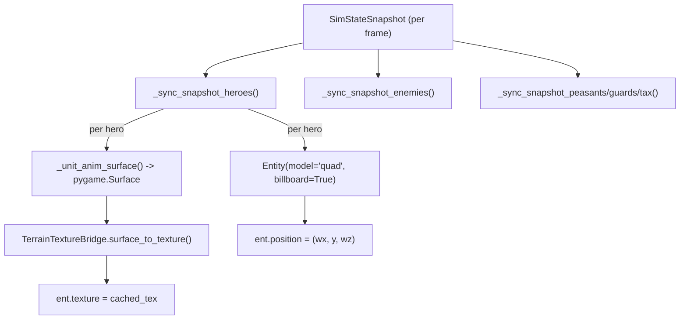
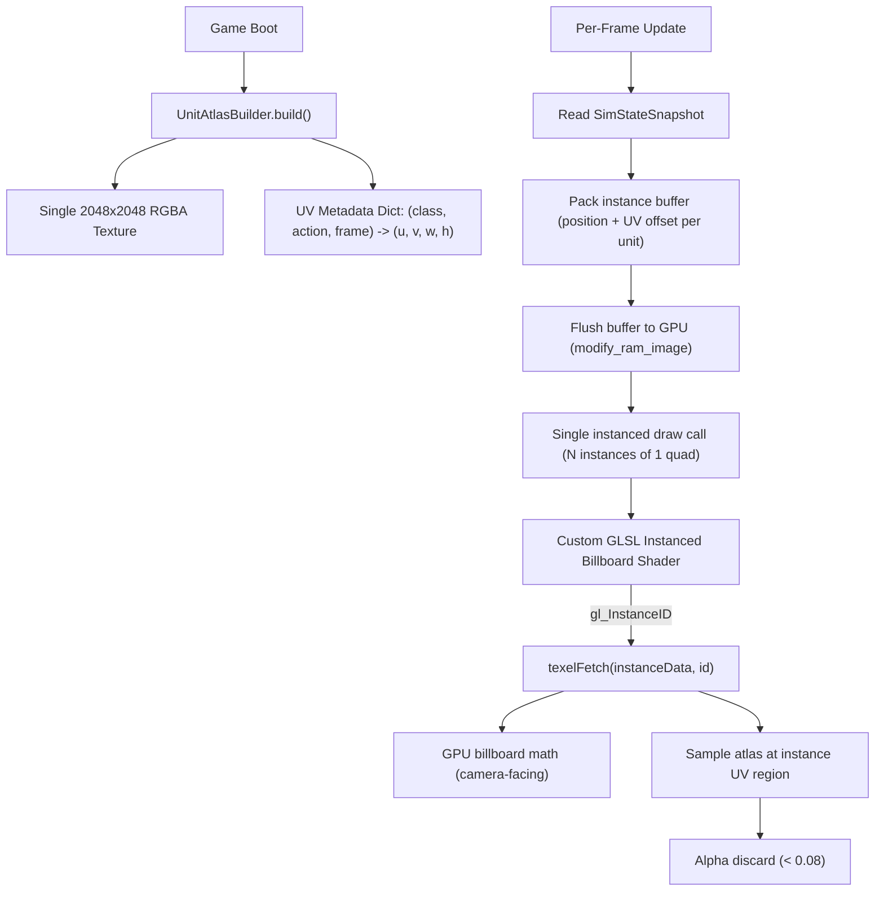

# Master Plan: Unit Instancing Pipeline

## Problem Statement

Currently, each unit (hero, enemy, peasant, guard, tax_collector, projectile) is an **individual Ursina `Entity`** with:
- Its own Panda3D scene graph node
- Per-entity texture assignment (pygame Surface -> PIL -> Ursina Texture)
- Per-entity billboard behavior
- Separate draw calls

At ~50 units this is already causing frame drops. Scaling to 200-500+ units for larger battles is impossible with this approach.

**Target**: 500 units at 60 FPS on mid-range hardware, behind feature gate `KINGDOM_URSINA_INSTANCING=1`.

---

## Current Architecture (what we're replacing)



**Key files**:
- [`game/graphics/ursina_renderer.py`](game/graphics/ursina_renderer.py) - Main renderer, `_sync_snapshot_*` methods (lines 470-700)
- [`game/graphics/ursina_entity_render_collab.py`](game/graphics/ursina_entity_render_collab.py) - Entity creation/sync helpers
- [`game/graphics/ursina_texture_bridge.py`](game/graphics/ursina_texture_bridge.py) - pygame Surface -> Ursina Texture conversion
- [`game/graphics/ursina_units_anim.py`](game/graphics/ursina_units_anim.py) - Frame index calculation
- [`game/graphics/hero_sprites.py`](game/graphics/hero_sprites.py) - Hero sprite library (PNG + procedural)
- [`game/graphics/ursina_sprite_unlit_shader.py`](game/graphics/ursina_sprite_unlit_shader.py) - Current unlit alpha-discard shader

---

## Target Architecture



---

## Sprint 1: `wk47_unit_instancing_core`

### Goal
Replace per-Entity unit rendering with a single instanced draw call. Visual output should be **identical** to current (same sprites, positions, animations). Performance should be dramatically better at high unit counts.

### Feature Gate
- `KINGDOM_URSINA_INSTANCING=1` — new instanced path
- `KINGDOM_URSINA_INSTANCING=0` or unset — legacy Entity-per-unit path (default, for rollback safety)

### Wave 1 (Parallel): Baseline + Atlas

#### Agent 12 — Stress Test Tool (MEDIUM intelligence)

**Task**: Create `tools/perf_stress_test.py` that spawns N units in a headless sim and measures frame timing in the Ursina renderer.

**Deliverable**: A script that:
1. Launches the game in a stress configuration (200, 500, 1000 units)
2. Measures and reports: avg frame time (ms), 1% low FPS, draw call count
3. Saves results to `docs/perf/baseline_unit_instancing.json`

**Implementation guidance**:
- Use the existing headless sim approach but with Ursina renderer active
- Override `MAX_ALIVE_ENEMIES` and spawn extra heroes via the sim engine directly
- Time the `UrsinaRenderer.update()` call specifically (it's where all unit sync happens)
- Run for 300 frames to get stable measurements

**Verification**: `python tools/perf_stress_test.py --units 200 --frames 300` prints results and exits 0.

---

#### Agent 09 — Atlas Generator (HIGH intelligence)

**Task**: Create `game/graphics/unit_atlas.py` that packs ALL unit sprite frames into a single 2048x2048 RGBA atlas at game boot, and produces a UV metadata dictionary.

**Deliverable**: A module with class `UnitAtlasBuilder` that:
1. Collects all frames from `HeroSpriteLibrary`, `EnemySpriteLibrary`, `WorkerSpriteLibrary`
2. Packs them into a 2048x2048 atlas using a simple shelf/row packing algorithm
3. Returns: `(atlas_surface: pygame.Surface, uv_map: dict)`
4. `uv_map` maps `(unit_type, class_key, action, frame_index)` -> `(u_start, v_start, u_width, v_height)` in normalized [0,1] coordinates

**Implementation guidance**:

The atlas should be organized as follows:
- All sprites are 32x32 pixels
- A 2048x2048 atlas holds 64x64 = 4096 frames (far more than we need)
- Use row-based shelf packing: fill left-to-right, top-to-bottom

The `UnitAtlasBuilder` class structure:

```python
"""Unit sprite atlas generator for instanced rendering."""
from __future__ import annotations
import pygame
from typing import Dict, Tuple
from game.graphics.hero_sprites import HeroSpriteLibrary
from game.graphics.enemy_sprites import EnemySpriteLibrary
from game.graphics.worker_sprites import WorkerSpriteLibrary

# UV region: normalized texture coordinates
UVRegion = Tuple[float, float, float, float]  # (u_start, v_start, u_width, v_height)

# Key for looking up a specific frame in the atlas
AtlasKey = Tuple[str, str, str, int]  # (unit_type, class_key, action, frame_index)
# Examples: ("hero", "warrior", "idle", 0), ("enemy", "goblin", "walk", 3)

ATLAS_SIZE = 2048
FRAME_SIZE = 32

class UnitAtlasBuilder:
    _instance: "UnitAtlasBuilder | None" = None
    
    def __init__(self):
        self._atlas_surface: pygame.Surface | None = None
        self._uv_map: Dict[AtlasKey, UVRegion] = {}
    
    @classmethod
    def get(cls) -> "UnitAtlasBuilder":
        if cls._instance is None:
            cls._instance = cls()
            cls._instance._build()
        return cls._instance
    
    @property
    def atlas_surface(self) -> pygame.Surface:
        return self._atlas_surface
    
    def lookup_uv(self, unit_type: str, class_key: str, action: str, frame_idx: int) -> UVRegion:
        key = (unit_type, class_key, action, frame_idx)
        return self._uv_map.get(key, (0.0, 0.0, FRAME_SIZE/ATLAS_SIZE, FRAME_SIZE/ATLAS_SIZE))
    
    def _build(self):
        self._atlas_surface = pygame.Surface((ATLAS_SIZE, ATLAS_SIZE), pygame.SRCALPHA)
        self._atlas_surface.fill((0, 0, 0, 0))
        
        cursor_x, cursor_y = 0, 0
        row_height = FRAME_SIZE
        
        # Pack heroes: 5 classes x 5 actions x ~6-8 frames
        for hero_class in ("warrior", "ranger", "rogue", "wizard", "cleric"):
            clips = HeroSpriteLibrary.clips_for(hero_class, size=FRAME_SIZE)
            for action, clip in clips.items():
                for frame_idx, surface in enumerate(clip.frames):
                    if cursor_x + FRAME_SIZE > ATLAS_SIZE:
                        cursor_x = 0
                        cursor_y += row_height
                    self._atlas_surface.blit(surface, (cursor_x, cursor_y))
                    u = cursor_x / ATLAS_SIZE
                    v = cursor_y / ATLAS_SIZE
                    w = FRAME_SIZE / ATLAS_SIZE
                    h = FRAME_SIZE / ATLAS_SIZE
                    self._uv_map[("hero", hero_class, action, frame_idx)] = (u, v, w, h)
                    cursor_x += FRAME_SIZE
        
        # Pack enemies: goblin, wolf, skeleton, skeleton_archer, spider, bandit
        for enemy_type in ("goblin", "wolf", "skeleton", "skeleton_archer", "spider", "bandit"):
            clips = EnemySpriteLibrary.clips_for(enemy_type, size=FRAME_SIZE)
            for action, clip in clips.items():
                for frame_idx, surface in enumerate(clip.frames):
                    if cursor_x + FRAME_SIZE > ATLAS_SIZE:
                        cursor_x = 0
                        cursor_y += row_height
                    self._atlas_surface.blit(surface, (cursor_x, cursor_y))
                    u = cursor_x / ATLAS_SIZE
                    v = cursor_y / ATLAS_SIZE
                    w = FRAME_SIZE / ATLAS_SIZE
                    h = FRAME_SIZE / ATLAS_SIZE
                    self._uv_map[("enemy", enemy_type, action, frame_idx)] = (u, v, w, h)
                    cursor_x += FRAME_SIZE
        
        # Pack workers: peasant, guard, tax_collector
        for worker_type in ("peasant", "guard", "tax_collector"):
            clips = WorkerSpriteLibrary.clips_for(worker_type, size=FRAME_SIZE)
            for action, clip in clips.items():
                for frame_idx, surface in enumerate(clip.frames):
                    if cursor_x + FRAME_SIZE > ATLAS_SIZE:
                        cursor_x = 0
                        cursor_y += row_height
                    self._atlas_surface.blit(surface, (cursor_x, cursor_y))
                    u = cursor_x / ATLAS_SIZE
                    v = cursor_y / ATLAS_SIZE
                    w = FRAME_SIZE / ATLAS_SIZE
                    h = FRAME_SIZE / ATLAS_SIZE
                    self._uv_map[("worker", worker_type, action, frame_idx)] = (u, v, w, h)
                    cursor_x += FRAME_SIZE
```

**Atlas texture settings** (critical for pixel art):
- Nearest-neighbor filtering (no bilinear)
- No mipmapping
- RGBA format

**Verification**:
1. Write a test that builds the atlas and verifies: atlas is 2048x2048, all expected keys exist in `uv_map`, no UV region overlaps
2. Save the atlas as a debug PNG: `python -c "from game.graphics.unit_atlas import UnitAtlasBuilder; import pygame; pygame.init(); pygame.display.set_mode((1,1)); a = UnitAtlasBuilder.get(); pygame.image.save(a.atlas_surface, 'docs/perf/debug_atlas.png')"`
3. `python tools/qa_smoke.py --quick` must pass

---

### Wave 2a (After Wave 1): Shader + GeomNode Skeleton

#### Agent 03 — Instanced Shader + GPU Skeleton (HIGH intelligence)

**Task (Round 2a)**: Build the custom GLSL instanced billboard shader AND the bare Panda3D GeomNode quad with buffer texture setup. This round produces the GPU-side "skeleton" — a visible instanced quad that can draw N instances at hardcoded positions. It does NOT yet wire into the game snapshot or animation system.

**Acceptance for R2a**:
- `game/graphics/instanced_unit_shader.py` exists with working GLSL
- `game/graphics/instanced_unit_renderer.py` exists with `InstancedUnitRenderer.__init__` that creates the GeomNode + buffer texture
- A simple test: calling `update()` with a fake list of 10 positions draws 10 textured quads on screen
- `python tools/qa_smoke.py --quick` passes

---

### Wave 2b (After Wave 2a): Sync Loop + Integration

#### Agent 03 — Pipeline Integration + Animation (HIGH intelligence)

**Task (Round 2b)**: Wire the instanced renderer to the real `SimStateSnapshot`, implement animation state resolution (clip + frame -> UV offset), and integrate behind `KINGDOM_URSINA_INSTANCING=1` in `UrsinaRenderer.update()`. This round produces the full working pipeline.

**Deliverables**:
1. `game/graphics/instanced_unit_shader.py` — Custom GLSL instanced billboard shader
2. `game/graphics/instanced_unit_renderer.py` — Pipeline class that manages the instanced draw
3. Integration into `UrsinaRenderer.update()` (gated by `KINGDOM_URSINA_INSTANCING`)

**Critical Panda3D APIs** (all available in Panda3D 1.10.16):
- `Geom.set_instance_count(N)` — hardware instancing
- `Texture.setup_buffer_texture(num_texels, T_float, F_rgba32, UH_dynamic)` — buffer texture for per-instance data
- `texture.modify_ram_image()` — zero-copy RAM image write
- `struct.pack_into()` — fast buffer packing
- `NodePath.set_shader_input("name", texture)` — bind buffer to shader

**Implementation guidance — The Shader** (`game/graphics/instanced_unit_shader.py`):

```python
"""Instanced billboard shader for unit rendering (wk47)."""
from ursina.shader import Shader
from ursina.vec2 import Vec2

instanced_unit_shader = Shader(
    name="instanced_unit_shader",
    language=Shader.GLSL,
    vertex="""#version 140
uniform mat4 p3d_ModelViewProjectionMatrix;
uniform mat4 p3d_ModelViewMatrix;

in vec4 p3d_Vertex;
in vec2 p3d_MultiTexCoord0;
out vec2 uvs;

uniform sampler1D instanceData;

void main() {
    // Fetch per-instance data from buffer texture
    // Each instance uses 2 texels: [pos.xyz + scale] [uv_region.xywh]
    int base = gl_InstanceID * 2;
    vec4 posScale = texelFetch(instanceData, base, 0);
    vec4 uvRegion = texelFetch(instanceData, base + 1, 0);
    
    vec3 instancePos = posScale.xyz;
    float scale = posScale.w;
    
    // Billboard math: extract camera right/up from ModelView matrix
    // Since our GeomNode is at origin with identity transform,
    // ModelViewMatrix IS the view matrix
    vec3 camRight = vec3(p3d_ModelViewMatrix[0][0], p3d_ModelViewMatrix[1][0], p3d_ModelViewMatrix[2][0]);
    vec3 camUp = vec3(p3d_ModelViewMatrix[0][1], p3d_ModelViewMatrix[1][1], p3d_ModelViewMatrix[2][1]);
    
    // Offset quad vertices by camera-facing directions
    vec3 worldPos = instancePos 
        + camRight * p3d_Vertex.x * scale 
        + camUp * p3d_Vertex.y * scale;
    
    gl_Position = p3d_ModelViewProjectionMatrix * vec4(worldPos, 1.0);
    
    // Map local UVs [0,1] to atlas sub-region
    uvs = uvRegion.xy + p3d_MultiTexCoord0 * uvRegion.zw;
}
""",
    fragment="""#version 140
uniform sampler2D p3d_Texture0;
in vec2 uvs;
out vec4 fragColor;

void main() {
    vec4 texColor = texture(p3d_Texture0, uvs);
    if (texColor.a < 0.08) {
        discard;
    }
    fragColor = texColor;
}
""",
    default_input={
        "texture_scale": Vec2(1, 1),
        "texture_offset": Vec2(0.0, 0.0),
    },
)
```

**Implementation guidance — The Pipeline** (`game/graphics/instanced_unit_renderer.py`):

```python
"""Hardware-instanced unit renderer using Panda3D buffer textures (wk47)."""
from __future__ import annotations
import struct
import time
from typing import TYPE_CHECKING

from panda3d.core import (
    Geom, GeomNode, GeomTriangles, GeomVertexData, GeomVertexFormat,
    GeomVertexWriter, NodePath, Texture, GeomEnums, TransparencyAttrib,
    InternalName,
)
from ursina import Entity, scene

import config
from game.graphics.instanced_unit_shader import instanced_unit_shader
from game.graphics.unit_atlas import UnitAtlasBuilder, FRAME_SIZE
from game.graphics.ursina_coords import sim_px_to_world_xz
from game.graphics.ursina_texture_bridge import pygame_surface_to_ursina_texture
from game.graphics.ursina_units_anim import _hero_base_clip, _enemy_base_clip, _frame_index_for_clip

if TYPE_CHECKING:
    from game.sim.snapshot import SimStateSnapshot

MAX_INSTANCES = 1024
BYTES_PER_TEXEL = 16  # 4 floats * 4 bytes (RGBA32F)

# Billboard scales (match legacy values from ursina_renderer.py)
HERO_SCALE = 0.62
ENEMY_SCALE = 0.5
PEASANT_SCALE = 0.465
GUARD_SCALE = 0.5


class InstancedUnitRenderer:
    """Renders all units via a single hardware-instanced draw call."""
    
    def __init__(self):
        self._atlas_builder = UnitAtlasBuilder.get()
        self._atlas_tex = None  # Ursina Texture (created on first use)
        self._instance_buffer: Texture | None = None
        self._geom_node_path: NodePath | None = None
        self._unit_anim_state: dict[int, dict] = {}
        self._initialized = False
    
    def _ensure_initialized(self):
        if self._initialized:
            return
        self._initialized = True
        
        # 1. Convert atlas pygame surface to Ursina/Panda3D texture
        atlas_surf = self._atlas_builder.atlas_surface
        self._atlas_tex = pygame_surface_to_ursina_texture(
            atlas_surf, cache_key="unit_instancing_atlas_v1"
        )
        # Critical: nearest-neighbor for pixel art
        self._atlas_tex.setMagfilter(Texture.FT_nearest)
        self._atlas_tex.setMinfilter(Texture.FT_nearest)
        
        # 2. Create buffer texture for per-instance data
        self._instance_buffer = Texture("unit_instance_data")
        self._instance_buffer.setup_buffer_texture(
            MAX_INSTANCES * 2,  # 2 texels per instance
            Texture.T_float,
            Texture.F_rgba32,
            GeomEnums.UH_dynamic,
        )
        
        # 3. Create the instanced quad GeomNode
        self._geom_node_path = self._create_instanced_quad()
        
        # 4. Apply shader and textures
        self._geom_node_path.set_shader(instanced_unit_shader)
        self._geom_node_path.set_shader_input("p3d_Texture0", self._atlas_tex)
        self._geom_node_path.set_shader_input("instanceData", self._instance_buffer)
        self._geom_node_path.set_transparency(TransparencyAttrib.M_alpha)
        self._geom_node_path.set_depth_write(False)
        self._geom_node_path.set_bin("transparent", 1)
    
    def _create_instanced_quad(self) -> NodePath:
        """Create a single unit quad with standard vertex format."""
        fmt = GeomVertexFormat.get_v3t2()
        vdata = GeomVertexData("unit_quad", fmt, Geom.UH_static)
        vdata.set_num_rows(4)
        
        vertex = GeomVertexWriter(vdata, "vertex")
        texcoord = GeomVertexWriter(vdata, "texcoord")
        
        # Unit quad centered at origin, size 1x1
        # Vertices: bottom-left, bottom-right, top-right, top-left
        vertex.add_data3(-0.5, -0.5, 0)
        vertex.add_data3( 0.5, -0.5, 0)
        vertex.add_data3( 0.5,  0.5, 0)
        vertex.add_data3(-0.5,  0.5, 0)
        
        texcoord.add_data2(0, 1)  # Note: V flipped for Panda3D convention
        texcoord.add_data2(1, 1)
        texcoord.add_data2(1, 0)
        texcoord.add_data2(0, 0)
        
        # Two triangles
        tris = GeomTriangles(Geom.UH_static)
        tris.add_vertices(0, 1, 2)
        tris.add_vertices(0, 2, 3)
        
        geom = Geom(vdata)
        geom.add_primitive(tris)
        geom.set_instance_count(0)  # Start with 0 instances
        
        node = GeomNode("instanced_units")
        node.add_geom(geom)
        
        np = NodePath(node)
        np.reparent_to(scene)
        return np
    
    def update(self, snapshot: "SimStateSnapshot") -> set:
        """Sync all units from snapshot into the instance buffer. Returns active obj IDs."""
        self._ensure_initialized()
        
        active_ids = set()
        instance_count = 0
        buf = memoryview(self._instance_buffer.modify_ram_image())
        
        try:
            from game.types import HeroClass
        except Exception:
            HeroClass = None
        from game.graphics.hero_sprites import HeroSpriteLibrary
        from game.graphics.enemy_sprites import EnemySpriteLibrary
        from game.world import Visibility
        
        world = getattr(snapshot, "world", None)
        ts = float(config.TILE_SIZE)
        
        # --- Heroes ---
        for h in getattr(snapshot, "heroes", ()):
            if not getattr(h, "is_alive", True):
                continue
            if instance_count >= MAX_INSTANCES:
                break
            
            hc_key = str(getattr(h, "hero_class", "warrior") or "warrior").lower()
            clips = HeroSpriteLibrary.clips_for(hc_key, size=FRAME_SIZE)
            
            # Resolve animation frame
            clip_name, frame_idx = self._resolve_anim_frame(id(h), h, clips, _hero_base_clip)
            
            # Look up UV region in atlas
            uv = self._atlas_builder.lookup_uv("hero", hc_key, clip_name, frame_idx)
            
            # World position
            wx, wz = sim_px_to_world_xz(h.x, h.y)
            wy = HERO_SCALE * 0.5  # Center of billboard above ground
            
            # Pack into buffer (2 texels per instance)
            offset = instance_count * 2 * BYTES_PER_TEXEL
            struct.pack_into("ffff", buf, offset, wx, wy, wz, HERO_SCALE)
            struct.pack_into("ffff", buf, offset + BYTES_PER_TEXEL, *uv)
            
            instance_count += 1
            active_ids.add(id(h))
        
        # --- Enemies ---
        for e in getattr(snapshot, "enemies", ()):
            if not getattr(e, "is_alive", True):
                continue
            # Visibility check
            if world:
                etx, ety = int(e.x / ts), int(e.y / ts)
                if 0 <= ety < world.height and 0 <= etx < world.width:
                    if world.visibility[ety][etx] != Visibility.VISIBLE:
                        continue
            if instance_count >= MAX_INSTANCES:
                break
            
            et_key = str(getattr(e, "enemy_type", "goblin") or "goblin").lower()
            clips = EnemySpriteLibrary.clips_for(et_key, size=FRAME_SIZE)
            clip_name, frame_idx = self._resolve_anim_frame(id(e), e, clips, _enemy_base_clip)
            uv = self._atlas_builder.lookup_uv("enemy", et_key, clip_name, frame_idx)
            
            wx, wz = sim_px_to_world_xz(e.x, e.y)
            wy = ENEMY_SCALE * 0.5
            
            offset = instance_count * 2 * BYTES_PER_TEXEL
            struct.pack_into("ffff", buf, offset, wx, wy, wz, ENEMY_SCALE)
            struct.pack_into("ffff", buf, offset + BYTES_PER_TEXEL, *uv)
            instance_count += 1
            active_ids.add(id(e))
        
        # --- Workers (peasants, guards, tax_collector) ---
        for p in getattr(snapshot, "peasants", ()):
            if not getattr(p, "is_alive", True) or instance_count >= MAX_INSTANCES:
                continue
            wt = "peasant"
            # Workers use idle frame only for now
            uv = self._atlas_builder.lookup_uv("worker", wt, "idle", 0)
            wx, wz = sim_px_to_world_xz(p.x, p.y)
            wy = PEASANT_SCALE * 0.5
            offset = instance_count * 2 * BYTES_PER_TEXEL
            struct.pack_into("ffff", buf, offset, wx, wy, wz, PEASANT_SCALE)
            struct.pack_into("ffff", buf, offset + BYTES_PER_TEXEL, *uv)
            instance_count += 1
            active_ids.add(id(p))
        
        for g in getattr(snapshot, "guards", ()):
            if not getattr(g, "is_alive", True) or instance_count >= MAX_INSTANCES:
                continue
            uv = self._atlas_builder.lookup_uv("worker", "guard", "idle", 0)
            wx, wz = sim_px_to_world_xz(g.x, g.y)
            wy = GUARD_SCALE * 0.5
            offset = instance_count * 2 * BYTES_PER_TEXEL
            struct.pack_into("ffff", buf, offset, wx, wy, wz, GUARD_SCALE)
            struct.pack_into("ffff", buf, offset + BYTES_PER_TEXEL, *uv)
            instance_count += 1
            active_ids.add(id(g))
        
        # Update instance count on the GPU geom
        geom_node = self._geom_node_path.node()
        geom = geom_node.modify_geom(0)
        geom.set_instance_count(instance_count)
        
        return active_ids
    
    def _resolve_anim_frame(self, obj_id, entity, clips, base_clip_fn) -> tuple[str, int]:
        """Resolve current animation clip and frame index for a unit."""
        # Check for animation trigger (attack, hurt)
        trigger = getattr(entity, "_ursina_anim_trigger", None) or getattr(
            entity, "_render_anim_trigger", None)
        if trigger:
            tname = str(trigger)
            if tname in clips:
                setattr(entity, "_ursina_anim_trigger", None)
                setattr(entity, "_render_anim_trigger", None)
                self._unit_anim_state[obj_id] = {
                    "clip": tname, "t0": time.time(),
                    "base": base_clip_fn(entity), "oneshot": not clips[tname].loop,
                }
        
        base = base_clip_fn(entity)
        st = self._unit_anim_state.get(obj_id)
        if st is None:
            st = {"clip": base, "t0": time.time(), "base": base, "oneshot": False}
            self._unit_anim_state[obj_id] = st
        else:
            st["base"] = base
            if st.get("oneshot"):
                elapsed = time.time() - st["t0"]
                _, finished = _frame_index_for_clip(clips[st["clip"]], elapsed)
                if finished:
                    st["clip"] = base
                    st["t0"] = time.time()
                    st["oneshot"] = False
            if not st.get("oneshot") and st["clip"] != base:
                st["clip"] = base
                st["t0"] = time.time()
        
        clip_obj = clips.get(st["clip"]) or clips.get("idle")
        elapsed = time.time() - st["t0"]
        frame_idx, _ = _frame_index_for_clip(clip_obj, elapsed)
        return st["clip"], frame_idx
    
    def destroy(self):
        if self._geom_node_path:
            self._geom_node_path.remove_node()
```

**Integration into `UrsinaRenderer.update()`** — add at the top of `update()`:

```python
def update(self, snapshot):
    # Feature gate: instanced path replaces individual entity sync for units
    import os
    if os.environ.get("KINGDOM_URSINA_INSTANCING", "0") == "1":
        if not hasattr(self, "_instanced_renderer"):
            from game.graphics.instanced_unit_renderer import InstancedUnitRenderer
            self._instanced_renderer = InstancedUnitRenderer()
        
        # ... terrain/fog/buildings unchanged ...
        active_ids = set()
        self._sync_snapshot_buildings(snapshot, world, active_ids)
        
        # Instanced path handles ALL units
        unit_ids = self._instanced_renderer.update(snapshot)
        active_ids.update(unit_ids)
        
        # Projectiles still use legacy path for now
        self._sync_snapshot_projectiles(snapshot, active_ids)
        self._update_debug_status_text(snapshot)
        self._destroy_removed_entities(active_ids)
        return
    
    # Legacy path (unchanged) ...
```

**Verification**:
1. `$env:KINGDOM_URSINA_INSTANCING="1"; python main.py --no-llm` — game runs, units visible and animated
2. `python tools/qa_smoke.py --quick` — passes (headless mode unaffected)
3. `python tools/perf_stress_test.py --units 500 --frames 300` with instancing on vs off — report improvement

---

### Wave 3 (After Wave 2): Validation

#### Agent 10 — Performance Validation (LOW intelligence, consult)

**Task**: Run `python tools/perf_stress_test.py` with and without `KINGDOM_URSINA_INSTANCING=1`, compare results, document in agent log.

**Verification**: Log must include before/after numbers for 200 and 500 unit counts.

---

#### Agent 11 — QA Gates (LOW intelligence)

**Task**: Run `python tools/qa_smoke.py --quick` and `python tools/validate_assets.py --report`. Confirm no regressions. Report pass/fail.

---

### Human Gate (after Wave 3)

Jaimie playtests with instancing on:
```powershell
$env:KINGDOM_URSINA_INSTANCING = "1"
python main.py --no-llm
```

Check: units render at correct positions, animations play, same visual as legacy path.

---

## Sprint 2 (future): HD-2D Polish + Default-On

Planned for a follow-up sprint (wk48 or wk49). NOT part of wk47.

- Sub-pixel lerping (smooth movement interpolation between sim ticks)
- Blob shadows (secondary instanced draw call for oval shadows)
- Projectile instancing (arrows into the same pipeline)
- UI overlay batching (health bars, name tags — new bottleneck once units are cheap)
- Inside-building compositing (layer ordering for heroes in buildings)
- Remove feature gate, make instancing default
- Deprecate legacy Entity-per-unit code paths for units

---

## Risks and Mitigations

- **Risk**: Buffer texture (`setup_buffer_texture`) might not work identically across all GPU drivers with Panda3D 1.10.16
  - **Mitigation**: Feature gate allows instant rollback; Agent 03 should test with `gl-version 3 3` in PRC config
  
- **Risk**: Billboard math in shader may produce slightly different visual positioning vs Ursina's built-in billboard
  - **Mitigation**: Compare side-by-side at same camera angle; adjust quad vertex positions if offset

- **Risk**: Atlas UV precision at 32x32 on 2048x2048 (each texel = 1/64th of UV space)
  - **Mitigation**: Half-texel inset on UV lookups to prevent bleeding: `u + 0.5/2048, v + 0.5/2048, w - 1.0/2048, h - 1.0/2048`

- **Risk**: `time.time()` usage in animation state (currently in renderer, not sim)
  - **Mitigation**: This is render-only animation timing, not sim logic — determinism guard exempts `game/graphics/`

---

## Key Technical Decisions

- **Buffer Texture over PTA arrays**: PTALVecBase4f has driver-dependent uniform limits (~1024 vec4s). Buffer textures scale to millions of texels.
- **Single atlas over per-type textures**: One texture bind per frame vs N. Atlas fits easily (300-400 frames at 32x32 in a 2048x2048 sheet).
- **CPU animation resolution**: The animation state machine remains in Python (O(N) per frame is fine for N<1024; the win is draw calls, not CPU iteration).
- **Separate from building rendering**: Buildings use 3D meshes/prefabs and don't benefit from 2D instancing. They stay on the existing path.
