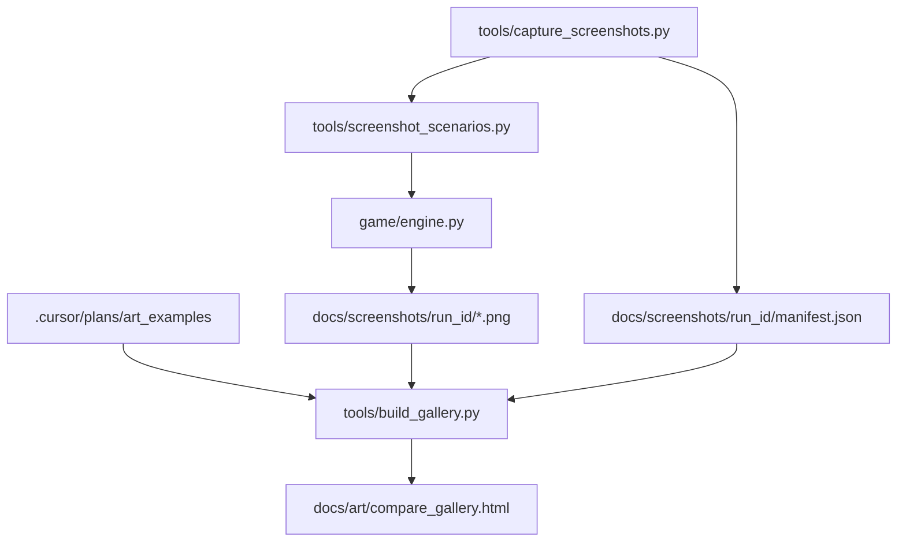

# WK3+ Visual Snapshot System (scripted screenshots + comparison gallery)

## Outcome

A **repeatable, deterministic** way to generate screenshots of our game in known states (specific buildings placed, enemies present, UI panels opened) and a **side-by-side gallery** that lets us compare those outputs against the reference screenshots you provided in `@.cursor/plans/art_examples`.This unlocks faster art/UI iteration because we can *see* what shipped each round (and detect regressions) without relying solely on manual play.

## Key constraints (locked)

- **Scripted scenarios** (not manual hotkeys) as the primary capture method.
- Reference images in `@.cursor/plans/art_examples` may be committed **temporarily** and removed later (prototype-only). We’ll keep them isolated under `.cursor/` or `docs/reference/` so they’re easy to purge.
- Keep capture **deterministic**: seeded sim, no wall-clock dependencies, no LLM.
- Capture must run **headless-capable** (no visible window required) for repeatability.

## System design

### A) Scripted screenshot runner (new tool)

Create a new tool script:

- [`tools/capture_screenshots.py`](tools/capture_screenshots.py)

Responsibilities:

- **Boot a minimal GameEngine instance** in a capture-friendly mode.
- **Apply a named scenario** (place buildings/enemies; optionally open specific UI panels).
- **Advance sim ticks** for stabilization (e.g., 60–300 ticks).
- **Set camera framing** (center on target; fixed zoom).
- **Render one or more frames** and save PNGs using `pygame.image.save`.
- Emit a **manifest JSON** describing every output (scenario, target, camera, seed).

CLI sketch:

- `python tools/capture_screenshots.py --scenario build_catalog --seed 3 --out docs/screenshots/wk3_buildb/ --size 1920x1080 --ticks 240`

Outputs:

- `docs/screenshots/<run_id>/manifest.json`
- `docs/screenshots/<run_id>/*.png`

### B) Scenario catalog (deterministic)

Add a small scenario module:

- [`tools/screenshot_scenarios.py`](tools/screenshot_scenarios.py)

Scenarios (initial set):

- **base_overview**: castle + a few core buildings; full-screen overview.
- **building_catalog**: place each building type once (grid layout), capture:
- full-screen
- per-building close-up (tile-centered crop)
- **enemy_catalog**: spawn each enemy type in a safe pen, capture close-ups.
- **ui_panels**: select a hero/building so the **right info panel** renders; optionally show debug/perf panel once.

Determinism rules:

- Use `SIM_SEED` + explicit `--seed` parameter.
- Force `--no-llm` equivalent behavior.
- Drive time via sim ticks (not wall-clock).

### C) Gallery generator (compare to reference images)

Add:

- [`tools/build_gallery.py`](tools/build_gallery.py)

Responsibilities:

- Scan:
- our generated screenshots folder (manifest-driven)
- reference folder: `@.cursor/plans/art_examples`
- Produce a lightweight, local HTML gallery:
- [`docs/art/compare_gallery.html`](docs/art/compare_gallery.html)
- [`docs/art/compare_gallery.json`](docs/art/compare_gallery.json) (optional)

Gallery features (minimal but useful):

- Two sections:
- **“Our latest run”**: grouped by scenario, with thumbnails → full image.
- **“References”**: show the reference set (Majesty/Settlers/Warcraft/etc) as a scrolling strip.
- A **notes block** per scenario for quick critique (e.g., scale, palette, contrast).

We’ll keep it simple HTML/JS (no framework) so it’s easy to delete later.

### D) QA/automation hook

- Update [`tools/qa_smoke.py`](tools/qa_smoke.py) to optionally run the screenshot tool in a **non-blocking** mode (report-only) OR add a separate command in docs.
- Add a “visual snapshot” step to the checklist:
- [`docs/sprint/wk3_acceptance_checklist.md`](docs/sprint/wk3_acceptance_checklist.md)

We will **not** compare pixels in CI (too flaky). The goal is to generate artifacts deterministically.

## Data flow (high level)

## Files likely involved

- New:
- [`tools/capture_screenshots.py`](tools/capture_screenshots.py)
- [`tools/screenshot_scenarios.py`](tools/screenshot_scenarios.py)
- [`tools/build_gallery.py`](tools/build_gallery.py)
- [`docs/art/compare_gallery.html`](docs/art/compare_gallery.html)
- Likely small additions/flags:
- [`game/engine.py`](game/engine.py) (optional: expose a stable “render_once” or allow hiding UI layers for clean shots)
- [`config.py`](config.py) (optional: add `SCREENSHOT_MODE_DEFAULTS`)
- [`docs/sprint/wk3_acceptance_checklist.md`](docs/sprint/wk3_acceptance_checklist.md)

## Agent delegation (minimal roster)

- **Agent 12 (ToolsDevEx)**: implement `capture_screenshots.py`, scenario module, gallery generator.
- **Agent 11 (QA)**: add checklist steps + verify determinism (same seed → same output filenames/manifest; no crashes; commands documented).
- **Agent 08 (UI)** (only if needed): add a stable way to force-open/close panels for the `ui_panels` scenario, or add a “hide UI layers” toggle for clean world shots.
- **Agent 09 (Art)**: define the “must-capture” shot list (what buildings/enemies/zoom) and what visual questions we’re answering.

## Acceptance criteria

- Running:
- `python tools/capture_screenshots.py --scenario building_catalog --seed 3 --out docs/screenshots/test_run/`

produces:

- A non-empty `manifest.json`
- PNGs for every building/enemy/hero target in the catalog
- Running:
- `python tools/build_gallery.py --shots docs/screenshots/test_run --refs .cursor/plans/art_examples --out docs/art/compare_gallery.html`

produces a browsable HTML page showing both our shots and the reference set.

- Determinism: same scenario+seed produces the same filenames + manifest (byte-identical images is a bonus but not required).
- Zero gameplay regressions: game still runs normally; screenshot mode is tools-only.

## Immediate next step

Once this system exists, we’ll run a “baseline capture” and use the gallery to drive the next art round: