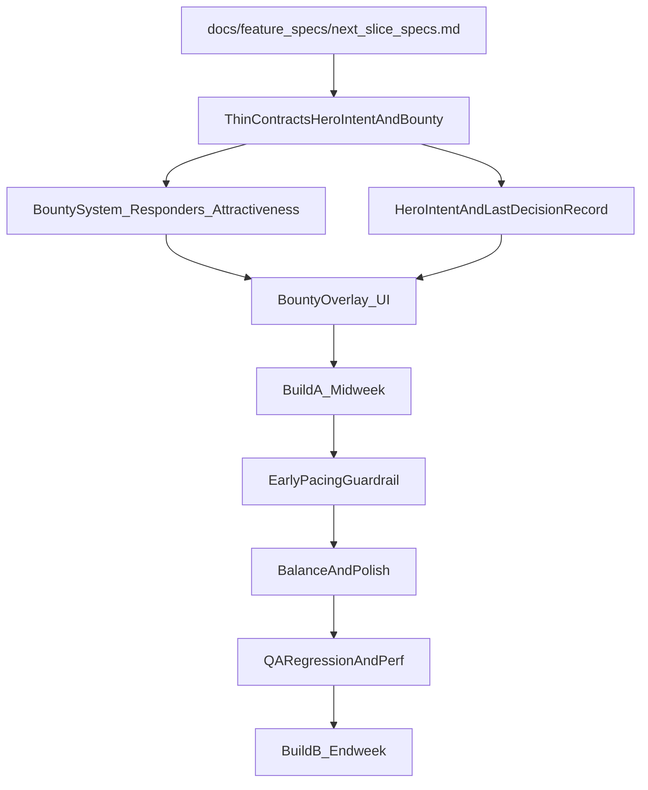

# 1-Week Sprint Plan (Broad Sweep, Low Bug Risk)

## Sprint goal

Ship a **small, stable upgrade across the board** (AI clarity + bounties + early pacing + stability/perf) that strengthens the “Majesty feel” without expanding the bug surface via large new systems.

## Sprint acceptance checklist (1-page)

Use this as the **single source of truth** during Build A/Build B QA:

- [`docs/sprint/wk1_acceptance_checklist.md`](docs/sprint/wk1_acceptance_checklist.md)

## Build cadence (light, frequent)

- **Build A (Midweek)**: UI/clarity + bounty legibility + instrumentation, behind safe fallbacks.
- **Build B (Endweek)**: early pacing guardrail + balance polish + stability/perf pass.

## Definition of done (applies to every merged change)

- **No crashes/softlocks** in `--no-llm` and `--provider mock` paths.
- **Automated smoke passes**: `python tools/qa_smoke.py --quick`.
- **Manual smoke (10 min)**: boot, place building, peasants construct, hire hero, place bounty, observe fight, pause/resume, quit.
- **Determinism guardrail**: no new wall-clock dependencies for sim logic; prefer tick/sim-time.

## Majesty reference (why these items)

- **Indirect control + incentives**: bounties must be legible and causally explainable.
- **Hero autonomy**: heroes feel like individuals; players understand “why.”
- **Pacing**: the kingdom should feel alive in the first minutes (no dead air).
- **Economy loop**: heroes earn/spend; kingdom taxes; player choices shape outcomes.

## Scope boundaries

- **In-scope**: clarity/UX, bounty feedback, hero decision logging, early-session pacing guardrail, small balance tweaks, perf/stability hardening, QA automation improvements.
- **Out-of-scope** (explicit cuts for this week): new major building trees, new combat subsystems, deep scenario framework UI, multiplayer implementation, large refactors.

## Current “north-star” alignment

Use and implement the existing next-slice specs in [`docs/feature_specs/next_slice_specs.md`](docs/feature_specs/next_slice_specs.md) as the backbone, but broaden with small safe upgrades.---

## Workstreams (parallel, low-conflict) + owners (13 directors)

### 1) Product/Vision: guardrails + acceptance (Agent 2: GameDirector_ProductOwner)

- **Deliverable**: a 1-page acceptance checklist for this sprint’s “Majesty feel” changes.
- **Acceptance criteria**:
- Player can answer “why did that hero do that?” from the UI.
- Bounties feel like a **reliable lever** (responders count + attractiveness).
- First 3 minutes includes at least 1 clear decision prompt.
- **Primary doc touchpoints**:
- [`docs/vision_pillars.md`](docs/vision_pillars.md)
- [`docs/early_access_scope.md`](docs/early_access_scope.md)

### 2) Architecture/Code Health: minimal interfaces (Agent 3: TechnicalDirector_Architecture)

- **Deliverable**: thin, stable data contracts for “hero intent/decision snapshot” and “bounty evaluation,” designed for future determinism.
- **Implementation boundaries** (expected files):
- [`game/entities/hero.py`](game/entities/hero.py) (add/standardize `intent` + `last_decision` record)
- [`game/systems/bounty.py`](game/systems/bounty.py) (responder tracking + attractiveness scoring)
- [`game/engine.py`](game/engine.py) (wire update + UI exposure)
- **Guardrails**:
- Keep state in simple dataclasses/struct-like dicts.
- Avoid cross-system imports that create cycles.

### 3) Determinism review (Agent 4: NetworkingDeterminism_Lead)

- **Deliverable**: MP-readiness checklist pass for new logic.
- **Checks**:
- Bounty attractiveness is deterministic (no RNG, no wall-clock).
- Any “time since decision” uses sim-time or tick accumulation.
- **Doc touchpoints**:
- [`docs/networking_determinism.md`](docs/networking_determinism.md)
- [`docs/mp_readiness_checklist.md`](docs/mp_readiness_checklist.md)

### 4) Gameplay tuning (Agent 5: GameplaySystemsDesigner)

- **Deliverable**: small tuning table for bounty costs/rewards and early pacing.
- **P0 tuning targets**:
- Bounty reward bands: low/med/high guidance for early game.
- Lair bounty cost sanity vs lair stash payout.
- Early wave pressure: ensure “alive” but not lethal.
- **Files likely impacted**:
- [`config.py`](config.py) (only if adjustments are necessary)
- [`game/systems/economy.py`](game/systems/economy.py) (if bounty costs/tax loops need polish)

### 5) AI behavior + LLM guardrails (Agent 6: AIBehaviorDirector_LLM)

- **Deliverable**: stable “hero intent taxonomy” + consistent decision logging.
- **P0 implementation**:
- Define intent labels: `idle`, `pursuing_bounty`, `shopping`, `returning_to_safety`, `engaging_enemy`, `defending_building`, `attacking_lair`.
- Ensure decisions store: `action`, `reason`, `timestamp_or_tick`, `inputs_hash_or_summary` (lightweight).
- No new LLM calls for attractiveness; use computed scoring.
- **Files likely impacted**:
- [`ai/basic_ai.py`](ai/basic_ai.py)
- `[ai/llm_brain.py](ai/llm_brain.py)
- [`ai/prompt_templates.py`](ai/prompt_templates.py) (only if decision schema needs to record “reason” consistently)

### 6) Content/scenarios (Agent 7: ContentScenarioDirector)

- **Deliverable**: minimal early pacing content hook without a full scenario system.
- **P0 option (low risk)**:
- Add a deterministic “early nudge” rule: within 3 minutes, create a clear HUD prompt + optionally spawn/place a starter bounty (e.g., nearest lair) if conditions are met.
- **References**:
- [`docs/scenarios.md`](docs/scenarios.md) (use its “starter bounties” idea, but keep implementation tiny)

### 7) UX/UI clarity (Agent 8: UX_UI_Director)

- **Deliverable**: UI copy + layout rules for intent + bounty feedback.
- **P0 UI requirements**:
- Hero panel shows **Current intent** and **Last decision** (action + reason + age).
- Bounty UI shows **Responders: N**.
- Bounty UI shows **Attractiveness: Low/Med/High** (or a small icon).
- **Files likely impacted**:
- [`game/ui/building_panel.py`](game/ui/building_panel.py) (hero panel)
- [`game/ui/hud.py`](game/ui/hud.py) (bounty overlay and/or prompts)

### 8) Art/VFX readability (Agent 9: ArtDirector_Pixel_Animation_VFX)

- **Deliverable**: low-cost readability assets (optional) that don’t block code.
- **P0**:
- Tiny icon set (or placeholder shapes) for bounty types and attractiveness tiers.
- Confirm pixel readability rules for overlays (contrast on fog-of-war).
- **Likely files**:
- Assets under [`assets/sprites/`](assets/sprites/) (optional)
- Guidance docs already exist under `[docs/art/](docs/art/)

### 9) Performance/stability (Agent 10: PerformanceStability_Lead)

- **Deliverable**: a short perf sanity checklist + 1–2 targeted fixes if hotspots emerge.
- **P0 checks**:
- Ensure new UI overlays don’t allocate heavily per frame.
- Ensure bounty scanning doesn’t become O(N_heroes * N_bounties) without caps.
- **Tools**:
- [`game/systems/perf_stats.py`](game/systems/perf_stats.py) if already used
- Headless runner: `python tools/observe_sync.py ...`

### 10) QA/test engineering (Agent 11: QA_TestEngineering_Lead)

- **Deliverable**: add/extend smoke coverage for new features.
- **P0 changes**:
- Extend [`tools/qa_smoke.py`](tools/qa_smoke.py) / [`tools/observe_sync.py`](tools/observe_sync.py) to verify:
    - at least one bounty exists/responders updates,
    - hero intent is non-empty after a short time,
    - no exceptions in mock/no-llm.
- Update [`QA_TEST_PLAN.md`](QA_TEST_PLAN.md) with new regression bullets.

### 11) Tools/devex (Agent 12: ToolsDevEx_Lead)

- **Deliverable**: “make the right thing easy.”
- **P0**:
- Add a single command or flags to spawn a deterministic mini-scenario for testing intent/bounties.
- Improve log output formatting for quick triage.

### 12) Steam release ops/marketing (Agent 13: SteamRelease_Ops_Marketing)

- **Deliverable**: patch-notes draft for Build A and Build B.
- **Template**:
- [`docs/release/patch_notes_template.md`](docs/release/patch_notes_template.md)
- **Checklist reference**:
- [`docs/release/release_checklist.md`](docs/release/release_checklist.md)

### 13) Executive Producer / PM (Agent 1: ExecutiveProducer_PM)

- **Deliverable**: sprint tracking + integration order + ship checklist enforcement.
- **P0 responsibilities**:
- Keep scope tight; prevent midweek build from absorbing endweek items.
- Maintain the risk register (below) and force acceptance-criteria signoff.

---

## Integration order (to minimize conflicts)

- **Build A (Midweek)**: contracts → bounty responders/attractiveness → hero intent/last decision → UI display → QA.
- **Build B (Endweek)**: pacing guardrail → tuning → perf checks → expanded QA → patch notes.

---

## Sprint backlog (1-week) with acceptance criteria

### P0 (must ship)

1) **Hero intent + last decision inspect (FS-1)**

- **Acceptance**:
- Selecting a hero shows intent line.
- Last decision shows action + short reason + age; safe placeholder if none.
- Works in LLM + mock + no-LLM.

2) **Bounty clarity: responders + attractiveness (FS-2)**

- **Acceptance**:
- Each bounty displays responders count (0..N).
- Attractiveness low/med/high computed deterministically.
- No hero present -> still safe.

3) **QA gates updated for new features**

- **Acceptance**:
- `tools/qa_smoke.py --quick` exercises new paths without exceptions.
- Test plan includes new regression bullets.

### P1 (should ship if stable)

4) **Early pacing guardrail (FS-3)**

- **Acceptance**:
- Within 3 minutes: at least one clear prompt/decision is surfaced.
- No difficulty spike: recoverable by reasonable play.

5) **Small UX polish pass**

- **Acceptance**:
- No UI overlap/spam; concise copy.
- Debug panel (if present) shows intent/decision fields.

6) **Small balance pass**

- **Acceptance**:
- Early game feels active but not lethal.
- Bounty costs/rewards feel meaningful.

---

## Risk register (top)

- **Risk: scope creep** → Mitigation: enforce P0 list; P1 only after Build A is stable.
- **Risk: non-deterministic time usage** → Mitigation: determinism review before merge; use sim ticks.
- **Risk: perf regressions from UI overlays** → Mitigation: cache strings/icons; cap per-frame scans.
- **Risk: AI “explanations” drift** → Mitigation: keep reason strings short; store only last decision; avoid heavy context serialization.

---

## Prompts to run with other directors (copy/paste)

Use these to collect fast, actionable answers.

- **Agent 2 (GameDirector_ProductOwner)**: “For this week’s broad sweep, what are the 5 acceptance criteria that best capture ‘Majesty feel’ + modern clarity? Keep it testable in 10 minutes.”
- **Agent 3 (TechnicalDirector_Architecture)**: “Propose minimal data structures/APIs for hero intent + last decision + bounty attractiveness so we avoid cross-system coupling.”
- **Agent 4 (NetworkingDeterminism_Lead)**: “Review planned changes for determinism pitfalls; list required guardrails.”
- **Agent 5 (GameplaySystemsDesigner)**: “Give recommended default values/bands for bounty rewards, lair bounty cost, and early pressure so pacing feels alive but fair.”
- **Agent 6 (AIBehaviorDirector_LLM)**: “Define intent taxonomy + logging rules; ensure mock/no-llm parity; suggest where to compute intent.”
- **Agent 7 (ContentScenarioDirector)**: “Propose a minimal early-game pacing nudge that uses existing systems (bounties/lairs/spawner) and is deterministic.”
- **Agent 8 (UX_UI_Director)**: “Write UI copy and layout for hero intent/last decision and bounty responders/attractiveness; keep it readable and non-spammy.”
- **Agent 9 (ArtDirector_Pixel_Animation_VFX)**: “Suggest ultra-light icons/shapes for bounty type + attractiveness tiers that remain readable over fog-of-war.”
- **Agent 10 (PerformanceStability_Lead)**: “Identify likely hotspots from these changes and propose 1–2 low-effort mitigations.”
- **Agent 11 (QA_TestEngineering_Lead)**: “Update smoke checklist to cover new features; propose 3 regression scenarios to add.”
- **Agent 12 (ToolsDevEx_Lead)**: “Propose one dev flag/command to spawn a deterministic test setup for bounties+intent to speed iteration.”
- **Agent 13 (SteamRelease_Ops_Marketing)**: “Draft patch notes for Build A and Build B using the template; highlight 3 bullets per build plus known issues.”

---

## Handoff checklist (end of sprint)

- **Files changed**: list touched files by category (AI/UI/Systems/Tools/Docs).