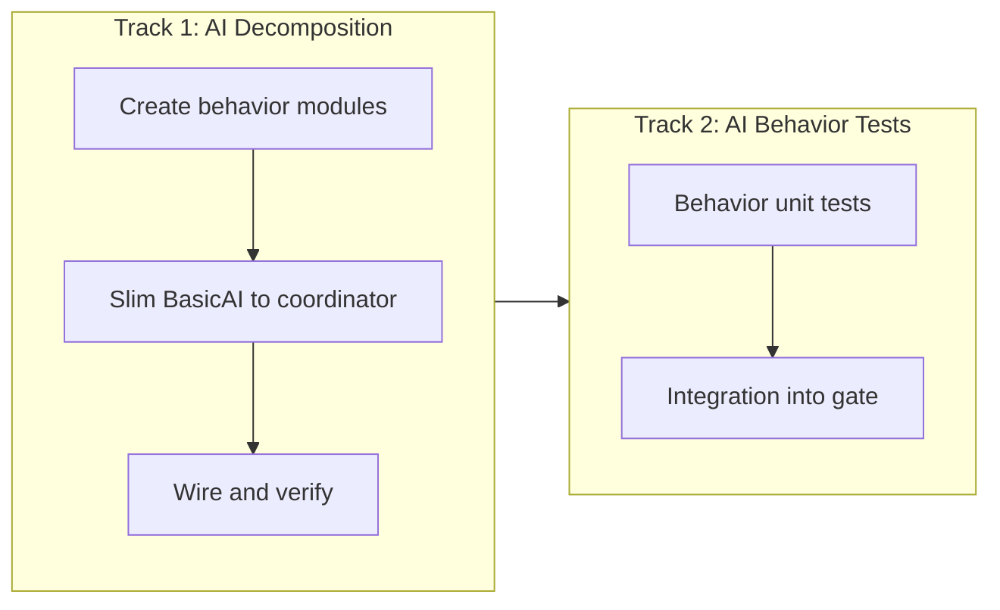

# WK10: AI Behavior Refactor Sprint

## Context

After WK8 and WK9 cleaned up the engine, entities, and UI, [ai/basic_ai.py](ai/basic_ai.py) at **1,580 lines** is now the single largest file in the codebase. It contains one `BasicAI` class with 38 methods handling every hero behavior: combat, bounty pursuit, journey, exploration, shopping, defense, stuck recovery, and LLM integration. This sprint decomposes it into focused modules.

## Sprint Structure: Two Tracks

### Track 1: AI Behavior Module Split

**Owner**: Agent 06 (AIBehaviorDirector)
**Consult**: Agent 03 (architecture), Agent 04 (determinism)

Split the 38 methods in `BasicAI` into 7 focused behavior modules under a new `ai/behaviors/` package. `BasicAI` stays as the coordinator — it runs the state machine and delegates to behavior modules.

#### Step 1: Create `ai/behaviors/` package

Each module receives a reference to the AI controller (for shared state like `hero_zones`) and operates on a hero + `game_state` dict. No module imports another behavior module — all coordination goes through `BasicAI`.

- `**ai/behaviors/__init__.py`** — Package exports
- `**ai/behaviors/bounty_pursuit.py`** (~200 lines)
  - `maybe_take_bounty()` — evaluate and pick a bounty
  - `score_bounty()` — scoring heuristic for bounty attractiveness
  - `start_bounty_pursuit()` — commit hero to pursue a bounty
  - `_resolve_bounty_from_target()` — resolve bounty object from hero target
- `**ai/behaviors/defense.py**` (~180 lines)
  - `defend_castle()` — rush to defend castle under attack
  - `defend_home_building()` — defend the hero's home guild/temple
  - `defend_neutral_building_if_visible()` — defend visible neutral buildings
  - `start_retreat()` — flee to nearest safe building
- `**ai/behaviors/journey.py**` (~150 lines)
  - `_maybe_start_journey()` — check if hero should leave town
  - `_start_journey_explore()` — pick a fog frontier or random destination
  - `_start_journey_attack_lair()` — pick a lair to assault
- `**ai/behaviors/stuck_recovery.py**` (~140 lines)
  - `_update_stuck_and_recover()` — detect stuck heroes and attempt recovery (repath, nudge, reset)
  - `_stuck_target_key()` — generate stable key for tracking stuck state per target
- `**ai/behaviors/exploration.py**` (~120 lines)
  - `explore()` — exploration with ranger black-fog bias
  - `_find_black_fog_frontier_tiles()` — scan for frontier tiles at fog edge
  - `assign_patrol_zone()` — assign patrol zone center to a hero
- `**ai/behaviors/shopping.py**` (~100 lines)
  - `go_shopping()` — decide where to shop and start moving
  - `do_shopping()` — execute purchase at building
  - `find_marketplace_with_potions()` — locate potion source
  - `find_blacksmith_with_upgrades()` — locate upgrade source
- `**ai/behaviors/llm_bridge.py**` (~100 lines)
  - `should_consult_llm()` — check if LLM call is appropriate
  - `request_llm_decision()` — async LLM call
  - `apply_llm_decision()` — map LLM response to hero action

#### Step 2: Slim `BasicAI` to coordinator (~400 lines)

After extracting behaviors, `basic_ai.py` retains:

- `__init__()` — instantiate behavior modules
- `update()` / `update_hero()` — main orchestrator, delegates to state handlers
- `handle_idle()` — dispatches to bounty/journey/exploration/defense/shopping based on hero state (calls behavior modules instead of inline logic)
- `handle_moving()` — movement with bounty/journey/stuck checks (delegates to behavior modules)
- `handle_fighting()` — combat state handler
- `handle_retreating()` — retreat state handler
- `handle_shopping()` — shopping state handler (delegates to `shopping.do_shopping()`)
- `handle_resting()` — rest state handler
- `refresh_intent()`, `set_intent()`, `record_decision()` — intent tracking
- `send_home_to_rest()` — send hero to rest

The state handlers become short dispatch methods (~20-30 lines each) that call behavior module functions instead of containing all the logic inline.

#### Step 3: Verify behavior is identical

- Run `python tools/qa_smoke.py --quick` (all profiles including intent_bounty, hero_stuck_repro)
- Run `pytest tests/` (existing 29+ tests must still pass)
- Manual smoke: 10 min `--no-llm` + 10 min `--provider mock` — hero behavior must be identical

### Track 2: AI Behavior Unit Tests

**Owner**: Agent 11 (QA)
**Consult**: Agent 06 (behavior contracts)

After Track 1 lands, add focused tests for the separated behavior modules:

- `**tests/test_ai_bounty.py`** — bounty scoring returns expected tiers, pursuit commits hero, claim radius works
- `**tests/test_ai_defense.py`** — castle defense triggers when castle under attack, retreat picks nearest safe building
- `**tests/test_ai_shopping.py**` — marketplace/blacksmith finding works, purchase triggers economy call
- `**tests/test_ai_stuck.py**` — stuck detection fires after threshold, recovery attempts increment, max attempts respected
- `**tests/test_ai_exploration.py**` — frontier tile finding works with seeded RNG, ranger bias applied correctly

Target: 15-20 new tests. These are now possible because behaviors are isolated functions that can be called with constructed state.

### Quick Win

- **Type hints sweep**: Agent 06 adds type hints to all new behavior module function signatures
- **Determinism check**: Ensure all behavior modules use `get_rng()` and `sim_now_ms()`, not `random` or `time.time()`

## Agent Assignment Summary

| Agent             | Role                | Track                                                 | Priority |
| ----------------- | ------------------- | ----------------------------------------------------- | -------- |
| 06 (AI Behavior)  | Primary implementer | Track 1: AI decomposition                             | P0       |
| 03 (TechDirector) | Consult             | Track 1: Architecture review, module interface design | P1       |
| 11 (QA)           | Implementer         | Track 2: AI behavior unit tests                       | P0       |
| 04 (Determinism)  | Reviewer            | Verification: determinism audit on behavior modules   | P1       |

**Silent**: Agents 02, 05, 07, 08, 09, 10, 12, 13, 14

## Integration Order

1. **Track 1 Steps 1-2**: Create behavior modules + slim BasicAI (Agent 06)
2. **Track 1 Step 3**: Verify identical behavior (Agent 06 + gates)
3. **Track 2**: AI behavior unit tests (Agent 11, after Track 1 lands)
4. **Verification**: Agent 04 determinism audit + full gates

## Round Plan

- **R1**: Agent 06 creates all 7 behavior modules and slims BasicAI to coordinator. Agent 03 reviews module interfaces.
- **R2**: Agent 11 writes behavior unit tests. Agent 04 runs determinism audit. Full gate verification.

## Success Criteria

- `ai/basic_ai.py` drops from 1,580 to under 450 lines
- 7 behavior modules in `ai/behaviors/`, none over 220 lines
- 15+ new AI behavior unit tests
- All existing tests pass (`pytest tests/`)
- `python tools/qa_smoke.py --quick` PASS (all profiles)
- `python tools/determinism_guard.py` PASS
- Manual 10-minute play in `--no-llm` and `--provider mock` shows identical hero behavior
- No behavior module imports another behavior module (all coordination through BasicAI)

## Risk Mitigation

- **Behavioral regression**: The `intent_bounty` and `hero_stuck_repro` headless profiles specifically test the AI behaviors being refactored — any regression will be caught
- **Shared state access**: Behavior modules receive `self` (the AI controller) for shared state like `hero_zones` and tuning constants — no need for a new shared state object
- **Determinism**: All behavior modules already use `get_rng()` and `sim_now_ms()` — the split preserves these calls exactly
- **Circular imports**: No behavior module imports another — all go through BasicAI coordinator

