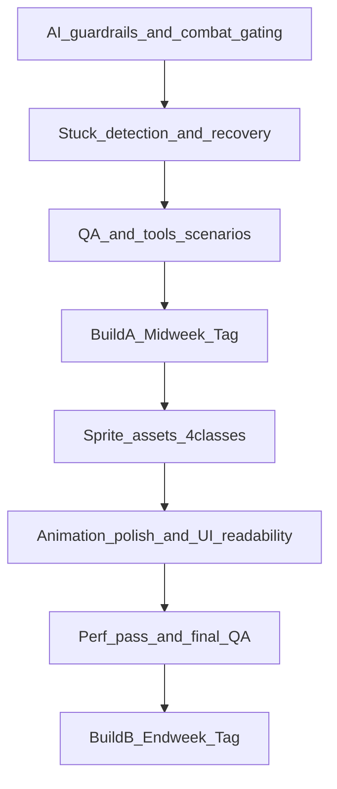

# Week 2 Sprint Plan — Hero AI Polish + Core Hero Sprites

## Sprint goal

Make heroes feel **human and readable**: no “spaz loops,” fewer freezes in the wild, and **no combat while inside buildings**. In parallel, ship a **real sprite pipeline** and land **idle/walk/attack/hurt/inside** animations for **Warrior/Ranger/Rogue/Wizard**.

## Cadence

- **Build A (Midweek)**: AI correctness + anti-jank guardrails + debug visibility + zero new art dependencies.
- **Build B (Endweek)**: sprite set for 4 classes + animation polish + final stability/perf pass.

## R0 (kickoff rule): who participates, and in what order

- **R0 output** (PM-owned): confirm roster (Active vs Consult-only vs Silent), confirm Build A vs Build B split, and publish Round 1 prompts.\n- **Round 1 is the async “meeting stage”**: contracts + acceptance criteria + deterministic repro harness come first.\n- **Round 1 sequencing** (default for this sprint):\n  - Agent 2 → acceptance criteria (“hero feel”)\n  - Agent 3 → contracts/guardrails (inside combat gating + stuck signals + sim-time)\n  - Agent 12 → deterministic repro scenario(s)\n  - Agent 11 → smoke/regression assertions\n  - Agents 6/8/9 → implementation plans referencing the above\n+- **Wait rule**: implementers do not land contract-dependent changes until Agent 3 has posted/locked the contract surface.\n+

## Definition of done (release gate)

- `python tools/qa_smoke.py --quick` passes.
- Manual 10-minute test in `--no-llm` and `--provider mock`:
- heroes do not attack from inside buildings
- heroes recover from common stuck states (no long “frozen in wild”)
- hero motion/attack animations look consistent (no jittering between states)

---

## Problem statements (player-observed)

- **Spaz/looping**: heroes rapidly change targets/goals and stutter.
- **Combat while inside buildings**: visually/logic inconsistent.
- **Freezing**: heroes stop responding (pathing/AI dead-end) especially away from the town.

---

## Workstreams & ownership (agents)

### Agent roster (use only what’s necessary)

**Active agents (required for WK2):**

- **Agent 2 (GameDirector_ProductOwner)**: acceptance criteria for “hero feel” (keeps changes aligned to vision).
- **Agent 3 (TechnicalDirector_Architecture)**: contracts/guardrails for inside-combat gating + stuck detection + determinism timebase.
- **Agent 6 (AIBehaviorDirector_LLM)**: primary implementer for hero AI jank fixes.
- **Agent 8 (UX_UI_Director)**: minimal debug visibility + animation/state readability (no big UI rework).
- **Agent 9 (ArtDirector_Pixel_Animation_VFX)**: primary deliverer for 4-class sprite set.
- **Agent 11 (QA_TestEngineering_Lead)**: regression checks + add deterministic stuck repro to smoke gate.
- **Agent 12 (ToolsDevEx_Lead)**: deterministic repro scenario tooling (headless) and triage outputs.

**Consult-only (use only if a blocker appears):**

- **Agent 10 (PerformanceStability_Lead)**: only if new unstuck logic or sprite integration causes perf regressions.
- **Agent 5 (GameplaySystemsDesigner)**: only if AI changes materially affect economy/combat balance.
- **Agent 13 (SteamRelease_Ops_Marketing)**: only when you’re ready to draft public patch notes (end of sprint).

**Silent (do not engage unless explicitly activated):**

- Agents not listed above should not respond or start work for this sprint unless PM pings them for a specific reason.

### Agent 1 — ExecutiveProducer_PM (you)

- Maintain scope discipline (P0/P1), integration order, and build gating.
- Create bug tickets for any playtest regressions; assign owners; do not implement code.

### Agent 2 — GameDirector_ProductOwner

- Define “Majesty-like hero feel” acceptance criteria (readability, autonomy, responsiveness).
- Approve any behavior changes that affect the game’s core feel (e.g., retreat thresholds).

### Agent 3 — TechnicalDirector_Architecture

- Define/confirm contracts for:
- hero “can_attack” gating (esp. inside buildings)
- stuck detection signals (e.g., `stuck_reason`, `unstuck_attempts`)
- deterministic-safe time sources (sim-time)
- Keep changes localized and multiplayer-friendly.

### Agent 5 — GameplaySystemsDesigner

- Validate that anti-jank changes don’t break incentives:
- heroes still pursue bounties reasonably
- retreat/flee thresholds feel fair
- Provide a small tuning table if needed (cooldowns, retry limits).

### Agent 6 — AIBehaviorDirector_LLM (Hero AI behavior)

**Primary owner for hero “jank” fixes.**

- Eliminate rapid oscillation:
- add minimum commitment windows (e.g., don’t retarget every tick)
- add hysteresis for target selection
- Fix “combat while inside buildings”:
- ensure AI state transitions respect “inside building” as a non-combat state
- prevent attack execution when `is_inside_building=True`
- Add stuck recovery:
- detect “not moving while intending to move” (sim-time based)
- attempt deterministic unstuck strategies (repath, choose adjacent tile, reset target)
- Ensure behavior remains good in `--no-llm` (basic AI path).

### Agent 8 — UX_UI_Director

- Improve legibility/debug:
- hero panel shows current intent + last decision (already) plus **stuck indicator** when triggered
- optional tiny floating “intent” label in debug mode only
- Ensure animation states read as intent (walk vs idle vs attack vs hurt vs inside).

### Agent 9 — ArtDirector_Pixel_Animation_VFX

**Primary owner for the sprite set.**

- Ship sprite frames for:
- `assets/sprites/heroes/warrior/{idle,walk,attack,hurt,inside}/frame_###.png`
- `assets/sprites/heroes/ranger/{idle,walk,attack,hurt,inside}/...`
- `assets/sprites/heroes/rogue/{idle,walk,attack,hurt,inside}/...`
- `assets/sprites/heroes/wizard/{idle,walk,attack,hurt,inside}/...`
- Establish style constraints (silhouette clarity, timing, contrast, hit feedback).
- Ensure filenames sort correctly (`frame_000.png` etc.).

### Agent 10 — PerformanceStability_Lead

- Confirm new animation and debug overlays don’t spike allocations.
- Verify stuck-detection checks are O(N) and not per-hero heavy.

### Agent 11 — QA_TestEngineering_Lead

- Add regression checks for:
- no attacks when inside buildings
- stuck recovery triggers at least once in a stress profile (deterministic)
- no rapid retarget oscillation above a threshold (optional logging assertion)
- Update `QA_TEST_PLAN.md` with new regression bullets.

### Agent 12 — ToolsDevEx_Lead

- Add/extend a deterministic headless scenario to reproduce stuck states:
- e.g. `--scenario hero_stuck_repro`
- Provide a one-command triage run that outputs:
- stuck events counts
- top stuck reasons

### Agent 13 — SteamRelease_Ops_Marketing

- Draft patch notes for Build A and Build B (player-facing, verified).
- Include “no keys required” section and how-to-test snippet.

---

## Round-based delegation (explicit dependencies)

This sprint is run like a real studio: **agents propose → PM locks decisions → agents implement**. No one should “guess” contracts or duplicate work.

### Round 1 (kickoff, async, same day)

Goal: lock **contracts + acceptance criteria + repro harness** before heavy implementation.

**Round 1 sequencing (explicit):** Agent 2 → Agent 3 → Agent 12 → Agent 11 → Agents 6/8/9.

- **Agent 2** posts acceptance criteria for “less jank” and “Majesty-like” feel.
- **Agent 3** posts the minimal contracts/guardrails (inside-combat gating + stuck signals + sim-time).
- **Agent 12** posts a deterministic headless repro scenario plan (how to reliably trigger stuck and measure recovery).
- **Agent 11** posts the QA assertions to add to `qa_smoke --quick` (must be non-flaky, deterministic).
- **Agent 6/8/9** post implementation plans that explicitly reference Agent 2/3/11/12 outputs.

**Wait rule**: Agent 6/8 should not merge behavior/UI work that depends on contracts until Agent 3 has defined the contract surface.

### Round 2 (midweek build execution)

Goal: ship **Build A** (AI polish + guardrails + debug visibility) with smoke gate green.

### Round 3 (wrap-up)

Goal: final blockers only; otherwise silent. Then proceed to Build B work (sprites).

## Integration order (minimize conflicts)

---

## P0 backlog (must ship)

1) **Combat gating: no attacks while inside buildings**

- Accept: hero cannot execute attack animations/damage while `is_inside_building`.
- Test: spawn/have a hero enter building; ensure no attacks occur until outside.

2) **Anti-oscillation (reduce spaz loops)**

- Add a minimal commitment window for targets and bounties.
- Accept: heroes don’t flip targets multiple times per second without a clear reason.

3) **Stuck detection + deterministic recovery**

- Detect “intends to move but position delta ~0 for N seconds (sim-time).”
- Recovery steps: repath, choose adjacent tile, reset goal, fallback to patrol.
- Accept: in a 10-minute session, heroes rarely remain frozen > ~3–5 seconds.

4) **Debug visibility for stuck events**

- Add a lightweight log/HUD message in debug mode only.
- Accept: PM/QA can tell when/why unstuck triggered.

5) **QA updates**

- `qa_smoke --quick` includes at least one scenario that can trigger stuck recovery deterministically.

## P1 backlog (ship if stable)

- Improved “inside” visuals (bubble/icon) tied to inside state.
- Micro-tuning of commitment windows per class.

---

## Art deliverable (Build B)

- All 4 classes ship full set: **idle/walk/attack/hurt/inside**.
- Acceptance:
- Crisp at 32x32, nearest-neighbor scaling
- No missing-folder fallbacks for the 4 classes
- Animation timing feels consistent with combat cadence

---

## Prompts to send agents (copy/paste)

- **Agent 2 (GameDirector_ProductOwner)**: “Round 1 kickoff: define WK2 hero feel acceptance criteria (10-minute test) that proves ‘less jank’ + ‘Majesty-like’. Focus on: no attack inside buildings, reduced oscillation, fewer stuck freezes, readable intent via animations.”
- **Agent 3 (TechnicalDirector_Architecture)**: “Round 1 kickoff: define minimal contracts/guardrails for (a) no-attack-while-inside gating (AI + combat), (b) stuck detection signals and counters, (c) sim-time usage. Provide exact field names and where they should live to avoid coupling.”
- **Agent 6 (AIBehaviorDirector_LLM)**: “Round 1 kickoff: propose the smallest set of AI changes that stops spaz loops + freezing + combat-inside. Explicitly reference Agent 3’s contracts and Agent 2’s acceptance criteria. For Build A, prioritize correctness and determinism; include how you’ll prove it via `qa_smoke --quick` and a deterministic repro scenario.”
- **Agent 8 (UX_UI_Director)**: “Round 1 kickoff: propose minimal debug visibility for stuck/unstuck (debug-only) and ensure animations/readability align with intent. Also ensure controls/help mention any new debug toggles. Keep UI changes lightweight and avoid per-frame allocations.”
- **Agent 9 (ArtDirector_Pixel_Animation_VFX)**: “Round 1 kickoff: confirm sprite pipeline + deliverables for 4 classes (idle/walk/attack/hurt/inside). Provide frame counts, timing, and any blockers. Ensure folder+filename conventions match the engine loader.”
- **Agent 11 (QA_TestEngineering_Lead)**: “Round 1 kickoff: update QA plan + propose non-flaky deterministic regression checks for: no attacks while inside buildings, stuck recovery triggers in a repro profile, and reduced oscillation. Ensure it’s enforceable in `python tools/qa_smoke.py --quick`.”
- **Agent 12 (ToolsDevEx_Lead)**: “Round 1 kickoff: add/extend a deterministic headless scenario to reliably reproduce stuck heroes (e.g. `--scenario hero_stuck_repro`) and output counters: stuck events, reasons, recovery attempts. Must be one-command runnable and used by QA.”

*(Do not prompt Agents 5/10/13 unless a specific blocker arises that needs them.)*

---

## Notes for you (PM)

- Keep Build A purely about **feel/stability**; do not block on art.