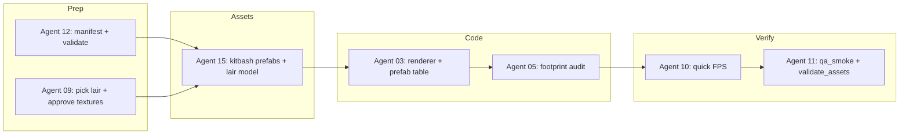

# WK33 Sprint Plan: Terrain polish, graveyard lairs, economy prefabs (Phase 2.2b)

## Alignment with master plan

- **Phase 1 (environment):** Base ground + scatter readability; [master plan §Phase 1](.cursor/plans/master_plan_3d_graphics_v1_5.md) “Static Environments & Asset Pipeline Foundations” — you are **continuing** terrain feel (ground texture, brightness) rather than redoing the pipeline.
- **Phase 2 (buildings):** [master plan §Phase 2](.cursor/plans/master_plan_3d_graphics_v1_5.md) **Sprint 2.2 (Economy Buildings)** — “Marketplace / Inn / Farms” style work; In-repo state: **Inn, farm, food stand, guilds, castle, house** already have prefab JSONs under [assets/prefabs/buildings/](assets/prefabs/buildings/). WK33 completes the **missing economy-facing buildings** you named: at minimum **marketplace** and **blacksmith**, plus any other **Phase 1 “economic”** entries in [config.py `BUILDING_COSTS`](config.py) that are still **billboard-only** in Ursina (see **Scope** below).
- **Rules:** [prefab_texture_override_standard.md](.cursor/plans/prefab_texture_override_standard.md) for Fantasy/Survival/Graveyard/Town pieces; do not edit Kenney source GLBs — use `texture_override` + repo PNGs when needed.

## Technical baseline (so agents do not “guess”)

| Topic | Where it lives | Fact |
|--------|----------------|------|
| Green base plane (solid color today) | [game/graphics/ursina_renderer.py](game/graphics/ursina_renderer.py) `_build_3d_terrain` ~1175–1185 | `Entity(model="quad", color=color.rgb(0.2,0.5,0.2), ...)` full-map quad at `y≈-0.05` |
| Ground texture target file | [assets/models/Models/Textures/floor_ground_grass.png](assets/models/Models/Textures/floor_ground_grass.png) | User-provided tileable grass; use as **albedo** on that quad with repeatable UVs (`texture_scale` / `tiling` so the texture repeats across `w_world`×`d_world` — same math as fog quad: lines ~1169–1164, 963–964) |
| Pack “dark pass” (WK32) | [tools/kenney_pack_scale.py](tools/kenney_pack_scale.py) | `_PACK_COLOR_MULTIPLIER_BY_FOLDER` (e.g. `kenney_nature-kit`: **0.75**), `_ENV_TREE_COLOR_MULTIPLIER_DEFAULT` = **0.65** for some trees — these stack with scatter finalize |
| Explored fog (SEEN) on vertical props | [ursina_renderer.py](game/graphics/ursina_renderer.py) `_sync_terrain_prop_tile_visibility` | `Visibility.SEEN` → `_set_static_prop_fog_tint(ent, 0.5)`; **visible** → `1.0`. Base **ground** quad is **not** in `_visibility_gated_terrain` — only scatter trees/grass/rocks. Fog **overlay** is separate: `_ensure_fog_overlay` uses per-tile buffer; `seen_b = b"\x00\x00\x00\xaa"` (alpha **170** on top of world) |
| Lairs (no prefab yet) | [ursina_renderer.py](game/graphics/ursina_renderer.py) `_resolve_prefab_path` | Lairs **explicitly skip** prefabs; `_environment_model_path("lair")` resolves to [assets/models/environment/lair](assets/models/environment/) + `.glb`/`.gltf`/`.obj` |
| Economy prefab map | [ursina_renderer.py](game/graphics/ursina_renderer.py) `_PREFAB_BUILDING_TYPE_TO_FILE` | Only explicit: `farm`, `food_stand`, `gnome_hovel`, `house`, `inn` — **marketplace** / **blacksmith** use **convention** `marketplace_v1.json` / `blacksmith_v1.json` if files exist |

## Scope (in/out)

**In scope (WK33)**

1. **Brightness / readability (~20% lighter on trees and grass scatter)**  
   - **Intent:** “20% lighter” = roughly multiply final modulated `Entity.color` by **1.2**, clamping channel max to **1.0** (or equivalently move Nature pack 0.75 → **0.90** and env tree 0.65 → **0.78** as a first pass).  
   - **Explored FOW (SEEN) “grass too light”:** This is a **separate** tuning problem: ground uses **fog texture + optional solid tint**; props use **0.5× color**. After the ground uses **floor_ground_grass.png**, re-balance: candidates are (a) adjust `_set_static_prop_fog_tint` for `Visibility.SEEN` (e.g. **0.5 → 0.45** to darken props in SEEN, or **→ 0.55** to lighten — **verify in-game**), (b) adjust `seen_b` alpha, (c) very slight `Entity.color` multiply on the **ground** entity only. Document the chosen numbers in the Agent 03 log.

2. **Replace green ground** with [assets/models/Models/Textures/floor_ground_grass.png](assets/models/Models/Textures/floor_ground_grass.png) on the **large** base quad (not per-tile path/water). Keep path/water logic unchanged.

3. **Lairs: Graveyard pack**  
   - **MVP:** One graveyard kit mesh (Jaimie/Agent 15 pick from reviewed kit screenshots per master plan §2 bullet 6) as the new **`lair` environment model** (replace or re-point `lair` resolution so `_environment_model_path` finds the new file — either keep name `lair.glb` as the exported file or add a small constant e.g. `LAIR_MESH_STEM = "mausoleum_graveyard"` in one place in `ursina_renderer.py` + file under `assets/models/environment/` or documented merged path).  
   - **Lair types** in sim (`goblin_camp`, `wolf_den`, etc.) all share the **same** mesh path today; unless PM expands scope, **one** art read for all lairs is OK.

4. **Economy buildings (second half):** Prefabs + loader coverage for every **player-economy** building that still has **no** `*_v1.json` in [assets/prefabs/buildings/](assets/prefabs/buildings/): at minimum **marketplace**, **blacksmith**; add **trading_post** in the same pass if you want “all Phase 1 econ” from [config.py](config.py) lines 214–217. **Out of this sprint (unless you explicitly extend):** temples Phase 2, elven_bungalow, etc.

**Out of stock / process**

- Do **not** commit `models_compressed/` (Panda cache).
- Jaimie remains the human operator for `model_assembler_kenney.py` with Agent 15; agents get **step lists**, not “figure it out.”

## Suggested work order (minimizes rework)



## Per-agent task packs (complete instructions — paste into `pm_agent_prompts`)

### Agent 12 (Tools) — `low` intelligence

- Add to [tools/assets_manifest.json](tools/assets_manifest.json) (or project manifest you actually use): the grass PNG path `assets/models/Models/Textures/floor_ground_grass.png` and any new `assets/models/environment/*` lair file names Agent 15 commits.  
- Run and fix until clean: `python tools/validate_assets.py --report` (from repo root).  
- If validation does not list PNGs today, follow existing pattern in [tools/validate_assets.py](tools/validate_assets.py) for texture entries.  
- **Log:** [`.cursor/plans/agent_logs/agent_12_ToolsDevEx_Lead.json`](.cursor/plans/agent_logs/agent_12_ToolsDevEx_Lead.json) with exact exit code.

### Agent 09 (Art) — `medium` intelligence (direction, not code)

- Read [master plan Phase 2 kitbash section](.cursor/plans/master_plan_3d_graphics_v1_5.md) and [prefab_texture_override_standard.md](.cursor/plans/prefab_texture_override_standard.md).  
- **Deliverable 1 — Lair:** From Graveyard pack screenshots in repo (`assets/models/Graveyard Kit.PNG` per master list), name **one** model stem (e.g. crypt, mausoleum, large tomb) for Agent 15 to export to `assets/models/environment/<name>.glb` and for Agent 03 to wire as `lair` (must match 2×2–3×3 **footprint** feel — check [config.py `BUILDING_SIZES` lair types](config.py) for max span).  
- **Deliverable 2 — Marketplace / Blacksmith:** Pillar silhouettes: marketplace = open / stall / plaza; blacksmith = forge, chimney, dark mass (short brief for Agent 15).  
- **Deliverable 3 — Ground texture:** Confirm `floor_ground_grass.png` is acceptable as **full-map repeating albedo** (if too dark after WK32, coordinate with 03 for `Entity.color` multiply **after** 20% lift).  
- **Log** with paths reviewed.

### Agent 15 (ModelAssembler) — `high` intelligence

- **Lair (Graveyard):** Use `python tools/model_assembler_kenney.py` per [assets/prefabs/schema.md](assets/prefabs/schema.md) *only if* PM wants a prefab-based lair later; **WK33 MVP** is a **single** exported mesh in `assets/models/environment/` (simpler). If the team chooses a **multi-piece lair**, coordinate with Agent 03 to add lair to prefab resolver (currently lairs are **excluded** — that would be a **scope increase**; default plan: **static mesh** only).  
- **Marketplace:** New prefab `assets/prefabs/buildings/marketplace_v1.json` (or `marketplace_v1.json` matching convention), `footprint_tiles: [2,2]`, `building_type: "marketplace"`, pieces with Graveyard + Fantasy Town + texture overrides as needed.  
- **Blacksmith:** `blacksmith_v1.json`, `footprint_tiles: [2,2]`, `building_type: "blacksmith"`.  
- **Trading_post (if in scope):** `trading_post_v1.json`, [config](config.py) says `(2,2)`.  
- Staging: follow existing **20/50** naming like `inn_v2` if you add construction intermediates; otherwise a minimal single-stage prefab is OK for first ship.  
- **After each prefab:** run viewer from project root: `python tools/model_viewer_kenney.py --focus-prefab marketplace_v1` (and blacksmith) with a short `--auto-exit-sec` for smoke; capture screenshot path in agent log.  
- **Attribution:** Update [assets/ATTRIBUTION.md](assets/ATTRIBUTION.md) for any new packs or textures.

### Agent 03 (Technical Director) — `high` intelligence

1. **Ground texture** in `_build_3d_terrain` ([ursina_renderer.py](game/graphics/ursina_renderer.py)):  
   - Load [assets/models/Models/Textures/floor_ground_grass.png](assets/models/Models/Textures/floor_ground_grass.png) via the same class of path resolution as other assets: `Path(__file__).resolve().parents[2] / "assets" / "models" / "Models" / "Textures" / "floor_ground_grass.png"`.  
   - Create Ursina `Texture` (PIL or `load_texture` — if using PIL, mirror [TerrainTextureBridge](game/graphics/terrain_texture_bridge.py) filtering: **nearest** first for consistency; if shimmer on large quad, try linear only for this layer).  
   - Assign to base `Entity` as `texture=tex`, `color=color.white` (or a slight multiply if art asks). Set `texture_scale` (and `texture_offset` if needed) so the image **tiles** across the same `w_world`/`d_world` as today (document formula in code comment, e.g. `(w_world / desired_meters_per_repeat, d_world / desired_meters_per_repeat)`).  
   - Cache the texture in a **module-level** or `self._ground_texture` to avoid reload every frame.  

2. **~20% lighter** on environment scatter: Prefer **one** config-driven knob in [config.py](config.py), e.g. `URSINA_ENV_SCATTER_COLOR_SCALE = 1.2` (capped 1.0), applied in `_finalize_kenney_scatter_entity` or immediately after, **or** raise `_PACK_COLOR_MULTIPLIER` / `_ENV_TREE_COLOR_MULTIPLIER` in [kenney_pack_scale.py](tools/kenney_pack_scale.py) with comments “WK33 brightness pass.” Do not break prefab piece loading (separate code path).  

3. **SEEN fog balance:** After (1)–(2), tune `_set_static_prop_fog_tint` / `seen_b` / ground `Entity.color` — pick **one** primary lever and document. Acceptance: Jaimie reports explored fog no longer “too light” on grass **relative to** trees.  

4. **Lair mesh:** Point `_environment_model_path` result for `mesh_kind == "lair"` to the new graveyard file Agent 15 placed (or replace `lair.glb` content in place). Adjust `H_LAIR` / scale in `_sync_3d_building_entity` if the mesh is taller.  

5. **Prefabs:** Ensure `_PREFAB_BUILDING_TYPE_TO_FILE` includes `marketplace` → `marketplace_v1.json`, `blacksmith` → `blacksmith_v1.json` (and `trading_post` if done). If filenames differ, use explicit table entries.  

6. **Gates:** `python tools/qa_smoke.py --quick` from repo root **must** PASS.

### Agent 05 (Gameplay) — `low` / consult

- For each new prefab, compare `footprint_tiles` in JSON to [config.py `BUILDING_SIZES`](config.py). If the prefab is visually too large for the footprint, **file handoff to 15** — do not change [config.py](config.py) footprints without PM.  
- Confirm sim placement and collision are unchanged (render-only).  

### Agent 10 (Performance) — `low` consult

- After Agent 03: run `python main.py --renderer ursina --no-llm` for ~2 minutes with camera moved; check FPS vs WK32 baseline. New ground **texture** + prefabs: flag if &gt;30% regression.  

### Agent 11 (QA) — `low`

- After all merges: `python tools/qa_smoke.py --quick` and `python tools/validate_assets.py --report` — both exit **0**; log results in agent_11 log.

### Agent 13 (Steam/Marketing) — `low` (optional)

- If you ship a build to testers: draft **3–5** bullet player-facing notes from this sprint (no version bump unless Jaimie says so).

## WK33 acceptance checklist (Jaimie — 15 minutes)

From repo root (Windows PowerShell examples):

```powershell
Set-Location "c:\Users\Jaimie Montague\OneDrive\Documents\Kingdom"
python main.py --renderer ursina --no-llm
```

- Base ground shows **tiled** `floor_ground_grass.png` (no single stretched blur unless intentional).  
- Trees and grass clumps look **noticeably** brighter than pre-WK32 dark pass; no blown-out white.  
- Explored-but-not-visible tiles: grass/ground and props **read consistently** (no “neon grass” vs dead trees).  
- Build **marketplace** and **blacksmith** in-game: **3D prefab** appears, footprint aligned, no major clipping.  
- **Lair:** new graveyard read, scale sensible vs heroes.

## PM hub note (for Agent 01 when writing `wk33_*` round)

- Store the **full** per-agent prompts from this plan under `pm_agent_prompts` plus `pm_send_list_minimal` in [agent_01_ExecutiveProducer_PM.json](.cursor/plans/agent_logs/agent_01_ExecutiveProducer_PM.json).  
- **Single sprint key:** e.g. `wk33-terrain-lair-economy-prefabs`.  
- **Integration order** exactly as the diagram: 12/09 → 15 → 03/05 → 10/11.
