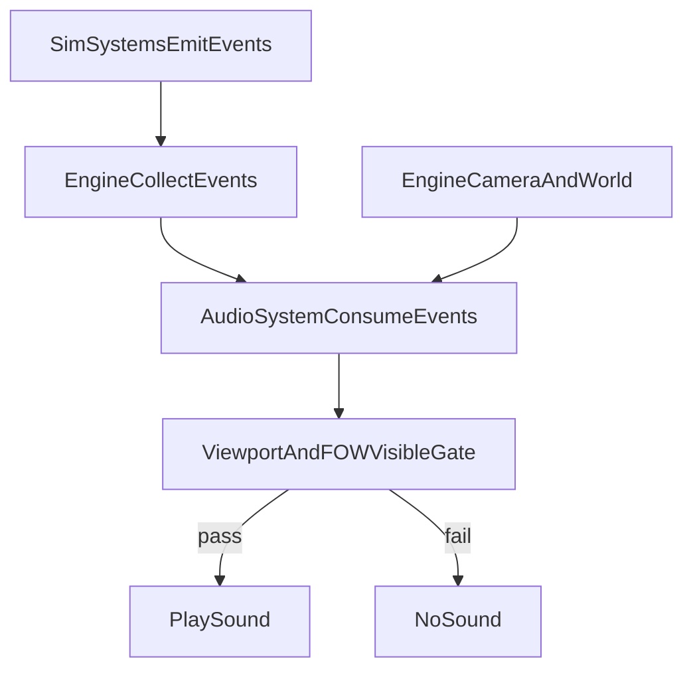

#WK6 Mid-Sprint: Audio Expansion + On-Screen-Only Audibility

## Goals

- **Expand SFX coverage**: map “real-world equivalent” actions (combat, building lifecycle, economy/shop, UI interactions, damage/death, etc.) to sounds.
- **Audibility rule** (locked): **only play SFX if the event is inside the camera viewport AND the tile is `Visibility.VISIBLE`**.
- Keep audio **non-authoritative** (event consumer only) and **determinism-safe**.

## Key design decisions

- **Visibility gating**: AudioSystem checks both:
- **Viewport**: event world position is inside current camera rectangle
- **Fog-of-war**: event’s grid tile is `Visibility.VISIBLE`

## Implementation approach

### 1) Standardize audio-relevant event payloads

- Ensure any event that should produce a sound includes at least one world-space position:
- Prefer `x,y` for point events
- For projectiles: use `from_x,from_y` or `to_x,to_y` (pick a consistent “sound origin” per event)
- Files likely touched:
- [game/systems/combat.py](game/systems/combat.py) (augment `hero_attack`, `enemy_killed`, `lair_cleared`, etc.)
- [game/engine.py](game/engine.py) (building placement/destroyed already emit; ensure they include usable positions)
- [game/systems/economy.py](game/systems/economy.py) (purchases/hire events may need positions or be routed as UI sounds)
- [game/ui/hud.py](game/ui/hud.py) and UI action plumbing (UI sounds generally exempt from world visibility, but we’ll still treat them as UI category)

### 2) Add a visibility-aware `AudioSystem.emit_from_events(...)`

- Extend AudioSystem so it can evaluate visibility:
- Provide `AudioSystem.set_listener_view(viewRect, world)` each frame, or
- Pass `camera_x,camera_y,zoom,window_w,window_h,world` into `emit_from_events`
- Implement a small helper:
- `is_audible_world_event(event) -> bool` that:
    - Extracts world position (e.g., `x,y` or `from_x,from_y`)
    - Checks if within viewport
    - Converts to grid and checks `world.visibility[gy][gx] == Visibility.VISIBLE`
- Files:
- [game/audio/audio_system.py](game/audio/audio_system.py)
- [game/engine.py](game/engine.py) (wire camera/world context into AudioSystem each tick)

### 3) Expand the audio contract (event → sound_key)

- Update mapping + doc to cover more actions, grouped by category:
- **Building**: placed, construction started/finished, damaged, destroyed
- **Combat**: melee hit, ranged release, impact, enemy death, hero death
- **Economy/Shop**: purchase, hire, potion drink
- **Bounty**: placed, claimed
- **UI**: click/confirm/error (UI category not fog-gated; still optionally rate-limited)
- Files:
- [game/audio/EVENT_CONTRACT.md](game/audio/EVENT_CONTRACT.md)
- [game/audio/audio_system.py](game/audio/audio_system.py)

### 4) Assets + attribution + validation updates

- Add/rename audio files under `assets/audio/` to match the expanded contract keys.
- Update:
- [assets/ATTRIBUTION.md](assets/ATTRIBUTION.md)
- [tools/assets_manifest.json](tools/assets_manifest.json)
- [tools/validate_assets.py](tools/validate_assets.py)

### 5) QA + deterministic snapshots

- Add/update screenshot scenarios where useful (visual confirmation that sounds are associated with visible events):
- `bounty_in_black_fog` should remain silent for the bounty sound if bounty tile is not `VISIBLE`.
- `base_overview`/combat scenario to ensure only on-screen impacts produce sounds.
- Ensure existing gate remains green:
- `python tools/qa_smoke.py --quick`
- `python tools/validate_assets.py --report`

## Data flow (high level)

## Agent roster (per studio agent cards)

- **Active**:
- **Agent 03 (TechnicalDirector_Architecture)**: event contract + engine/audio wiring + visibility gating implementation
- **Agent 14 (SoundDirector_Audio)**: expanded sound map, pick/curate/normalize CC0 assets, update attribution
- **Agent 12 (ToolsDevEx_Lead)**: update asset manifest/validator for new sound keys; optional scenario tweaks
- **Agent 11 (QA_TestEngineering_Lead)**: verify gates + manual acceptance checklist focused on visibility audibility rule
- **Consult-only**:
- **Agent 08 (UX_UI_Director)**: UI click/error/confirm sound semantics and any UI affordances

## Universal prompt to send (after you accept this plan)

- **Send to Agents**: 03, 12, 14, 11 (CC 08 if UI semantics needed)
- Prompt will instruct each agent to write under `wk6_audio_mid_rX` round entries, and to follow the locked visibility rule: **viewport + `Visibility.VISIBLE` only**.

## Implementation todos

- **audio-visibility**: implement viewport+FOW audible gating and plumb engine camera/world context